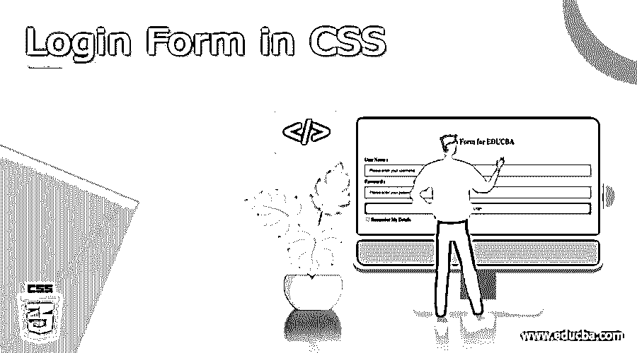
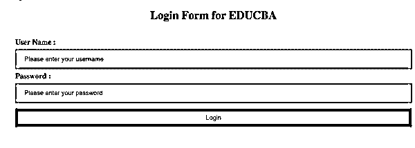
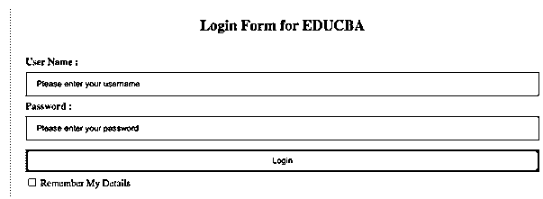
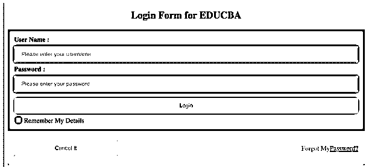

# CSS 中的登录表单

> 原文：<https://www.educba.com/login-form-in-css/>




## CSS 中的登录表单介绍

*   登录表单用于进入任何安全受限功能，如访问银行账户余额查询、用户详细信息更新、向账户添加受益人等。
*   这种登录功能使用户的数据更加安全，不会受到网络攻击。
*   登录/注册页面是用户访问受登录保护的网站时看到的初始页面。无论是注册页面还是登录页面，它都应该具有吸引力、用户友好、易于使用。
*   所以这些登录功能可以用 CSS 来开发。
*   在这个注册/登录表单集合中有各种类型的登录页面。每个登录页面都有自己的一套特性和功能。

实时示例:它们用于银行部门、所有政府网站、个人公司网站以及与军队相关的网站，如海军、空军等。

**语法:**

<small>网页开发、编程语言、软件测试&其他</small>

```
Selector
{ //Open curly brace
Property: Value;
} //closed curly brace
```

**举例:**

```
h2
{     //h2 is a selector
padding: 2px 2px 2px 2px; //padding is property
// 2px 2px 2px 2px are values to property
border: none; //border is property
// none is value to property
margin: 2px 2px 2px 2px; //margin is property
// 2px 2px 2px 2px are values to property
width: 80% //width is property
// 80% is value to property
}
```

### CSS 登录表单是如何工作的？

*   这将通过在 HTML 脚本中添加像 CssFileName.css 这样的显式 CSS 文件来实现。
*   我们可以将显式 css 文件添加为“<link rel="”stylesheet”" href="”CssFileName.css”">”。

**语法:**

```
<!DOCTYPE html>
<html>
<head>
<link rel="stylesheet" href="CssFileName.css">
</head>
<body>
<h1></h2>
<h2></h2>
<p1></p2>
.
.
.
</body>
</html>
```

*   我们也可以在 HTML 文件本身中编写相同的 CSS 登录。
*   在 标签中插入这两个样式标签，在 HTML 文件中写入 CSS 逻辑。

**语法:**

```
<!DOCTYPE html>
<html>
<head>
<style>
//CSS logic
</style>
</head>
<body>
<h1></h2>
<h2></h2>
<p1></p2>
.
.
.
</body>
</html>
```

### 例子

1.  创建登录表单:LoginForm.html

```
<!DOCTYPE html>
<html>
<head>
<style>
button {
background-color: brown; /*sets the button background color as brown*/
padding: 12px 18px; /*sets the button padding as 12px and 18px */
width: 100%; /*sets the button width 100%*/
margin: 6px 0;/*sets the margin 6px and 0px*/
border: none;/*sets the button border is none*/
}
input[type=text], input[type=password] {/*sets the user name and password fields styles*/
padding: 11px 17px; /*sets the user name and password padding as 11px and 18px */
width: 100%;/*sets the user name and password width as 100% */
display: inline-block; /*sets the user name and password display as block color*/
margin: 6px 0;/*sets the user name and password margin as 6px and 0px*/
border: 2px solid red;/*sets the user name and password border with 2px, solid border and red color border*/
box-sizing: border-box; /*sets the user name and password fields as box shape*/
}
span.passwordField {/*sets the password field style*/
padding-top: 16px;/*sets the password field top padding as 16px*/
float: right;/*sets the password field fixed to right*/
}
.mainBody {
padding: 14px; /*sets the total body padding as 14px*/
}
</style>
</head>
<body>
<center><h2>Login Form for EDUCBA</h2></center>
<form action="https://cdn.educba.com/LoginFormCSS.java" method="post">
<div class="mainBody">
<!- creating user name label->
<label for="userName">
<b>User Name :</b>
</label>
<!- creating user name field->
<input type="text" placeholder="Please enter your username" name="userName">
<!- creating password label->
<label for="passwordField">
<b>Password :</b>
</label>
<!- creating password field->
<input type="password" placeholder="Please enter your password" name="passwordField">
<!- creating button ->
<button type="submit">Login</button>
</div>
</form>
</body>
</html>
```

**输出:**




2.  **记住我选项:LoginFormRemberMe.html**

```
<!DOCTYPE html>
<html>
<head>
<style>
button {
background-color: violet; /*sets the button background color as violet*/
padding: 11px 17px; /*sets the button padding as 11px and 17px */
width: 100%; /*sets the button width 100%*/
margin: 7px 0;/*sets the margin 7px and 0px*/
border: none;/*sets the button border is none*/
}
input[type=text], input[type=password] {/*sets the user name and password fields styles*/
padding: 10px 16px; /*sets the user name and password padding as 10px and 16px */
width: 100%;/*sets the user name and password width as 100% */
display: inline-block; /*sets the user name and password display as block color*/
margin: 7px 0;/*sets the user name and password margin as 7px and 0px*/
border: 2px solid orange;/*sets the user name and password border with 2px, solid border and orange color border*/
box-sizing: border-box; /*sets the user name and password fields as box shape*/
}
span.passwordField {/*sets the password field style*/
padding-top: 17px;/*sets the password field top padding as 17px*/
float: right;/*sets the password field fixed to right*/
}
.mainBody {
padding: 16px; /*sets the total body padding as 16px*/
}
</style>
</head>
<body>
<center><h2>Login Form for EDUCBA</h2></center>
<!- If we have backend java file then we will login into the page->
<form action="https://cdn.educba.com/LoginFormCSS.java" method="post">
<div class="mainBody">
<!- creating user name label->
<label for="userName">
<b>User Name :</b>
</label>
<!- creating user name field->
<input type="text" placeholder="Please enter your username" name="userName">
<!- creating password label->
<label for="passwordField">
<b>Password :</b>
</label>
<!- creating password field->
<input type="password" placeholder="Please enter your password" name="passwordField">
<!- creating button ->
<button type="submit">Login</button>
<!- creating checkbox for Remeber Me option ->
<label>
<input type="checkbox" name="rememberMe"> Remember My Details
</label>
</div>
</form>
</body>
</html>
```

**输出:**




3.  **取消按钮和忘记密码链接:LoginFormWithCancelForgotLink.html**

```
<!DOCTYPE html>
<html>
<head>
<style>
button {
background-color: violet; /*sets the button background color as violet*/
padding: 11px 17px; /*sets the button padding as 11px and 17px */
width: 100%; /*sets the button width 100%*/
margin: 7px 0;/*sets the margin 7px and 0px*/
border: none;/*sets the button border is none*/
}
input[type=text], input[type=password] {/*sets the user name and password fields styles*/
padding: 10px 16px; /*sets the user name and password padding as 10px and 16px */
width: 100%;/*sets the user name and password width as 100% */
display: inline-block; /*sets the user name and password display as block color*/
margin: 7px 0;/*sets the user name and password margin as 7px and 0px*/
border: 2px solid orange;/*sets the user name and password border with 2px, solid border and orange color border*/
box-sizing: border-box; /*sets the user name and password fields as box shape*/
}
span.passwordField {/*sets the password field style*/
padding-top: 17px;/*sets the password field top padding as 17px*/
float: right;/*sets the password field fixed to right*/
}
.mainBody {
padding: 16px; /*sets the total body padding as 16px*/
}
.cancelButton {
width: 30%;/*sets the button width 30%*/
}
</style>
</head>
<body>
<center><h2>Login Form for EDUCBA</h2></center>
<!- If we have backend java file then we will login into the page->
<form action="https://cdn.educba.com/LoginFormCSS.java" method="post">
<div class="mainBody" style="background-color:grey">
<!- creating user name label->
<label for="userName">
<b>User Name :</b>
</label>
<!- creating user name field->
<input type="text" placeholder="Please enter your username" name="userName">
<!- creating password label->
<label for="passwordField">
<b>Password :</b>
</label>
<!- creating password field->
<input type="password" placeholder="Please enter your password" name="passwordField">
<!- creating login button ->
<button type="submit">Login</button>
<!- creating checkbox for Remeber Me option ->
<label>
<input type="checkbox" name="rememberMe"> Remember My Details
</label>
</div>
<div class="mainBody" style="background-color:gold">
<!- creating cancel button ->
<button type="button" class="cancelButton">Cancel It</button>
<!- creating link for forgot password ->
Forgot My<a href="#">Password?</a>
</div>
</form>
</body>
</html>
```

**输出:**




### 结论

这是用来限制未经授权的用户访问任何网站或任何应用程序的内部数据。它们用于银行部门、所有政府网站、个人公司网站和与军队相关的网站。这种登录功能使用户的数据更加安全，不会受到网络攻击

### 推荐文章

这里我们讨论介绍，CSS 登录表单如何工作，以及代码实现的例子。您也可以看看以下文章，了解更多信息–

1.  [CSS 字体粗细](https://www.educba.com/css-font-weight/)
2.  [CSS 复选框样式](https://www.educba.com/css-checkbox-style/)
3.  [CSS 线性渐变](https://www.educba.com/css-linear-gradient/)
4.  [CSS 元素选择器](https://www.educba.com/css-element-selector/)


