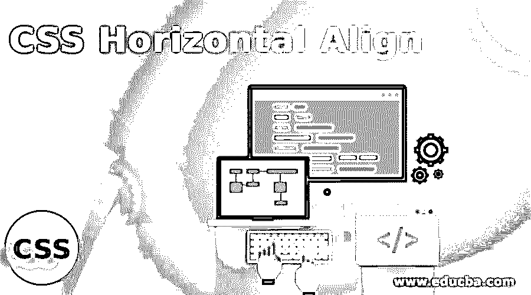
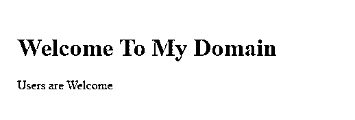
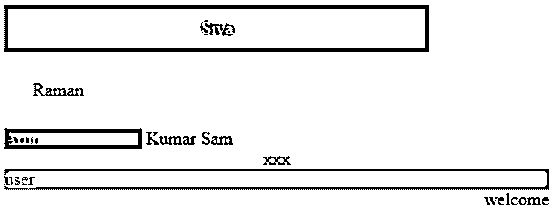
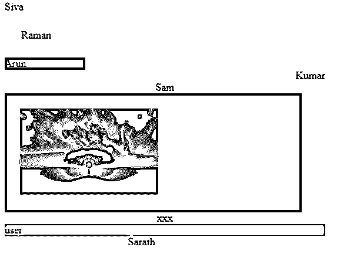

# CSS 水平对齐

> 原文：<https://www.educba.com/css-horizontal-align/>




## CSS 水平对齐简介

CSS 水平对齐是用 CSS 盒子对齐模块特性定义和指定的。它可以通过各种框的不同对齐集进行对齐并与之相关联，同时用于框、布局模型(如块布局、网格布局、表格布局和灵活布局)中。这些是不同的布局集，将按水平顺序设置并与框对齐。框和布局遵循并支持所有 css 文件的水平和垂直布局。同样，图像、文本和动画数据也支持水平布局。

### 语法和参数

CSS 代码是用 html 页面编写的，使用了样式标签，我们可以遵循一些规则和语法来定制更有吸引力的网页。

<small>网页开发、编程语言、软件测试&其他</small>

```
<html>
<head>
<style>
.example{
position:absolute;
right:
left:
width:
height:
background-color:
}
</style>
<body>
</body>
</html>
```

以上代码是使用 css 水平对齐的基本语法，是使用左右位置都可以支持的块元素。我们可以启用上述 css 属性，并传递一些默认值或一些具有任何类型的支持格式的用户定义的值。

### CSS 中水平对齐是如何工作的？

水平对齐用于水平和垂直对齐数据内容，以满足任何 web 应用程序中的常规要求。它有一些不同的方法来实现 CSS 文件中的这些功能。第一种类型是 CSS transform，它是在网页中创建和对齐数据内容的类型之一，用于在两个方向上宽度和高度固定的内容块。有时，对于 html 内容的非固定宽度范围，块被假定为父容器宽度的 100%,对于完全水平的位置，它可以扩展父容器的整个宽度范围，我们可以通过使用一些示例(如 codepen 等)删除内容的自定义宽度范围来标记和检查这一点。在这种技术中，如果数据内容是它所支持的元素的内联级别位置，并且只适用于块级别的元素，这是不可接受的。现代 flexbox 是使用主轴和横轴的布局之一，它取决于 flex-direction 属性。默认情况下，flex-direction 值设置为 row。所以主轴是 X 轴，横轴是 Y 轴，它属于列方向。我们可以使用

标签元素在水平和垂直方向上对齐网页中的元素。因为主要是在具有固定宽度和高度的 div 标签容器中，尽管它们有一些缺省的属性值，以使网页更具吸引力。

如果我们在网页中通过水平位置对齐了文本或任何数据，我们在 html 中使用

标签，它可以考虑到父 html 元素，css margin 属性也启用了默认值，如左边距和右边距的 auto。我们可以将样式规则设置为边距，并且文本将在页面上的行内元素中平行对齐，页面内容的每一行都作为行框。我们已经说过 css 有许多不同的属性，同样，text-align 是用于在网页上对齐文本值的属性之一。使用这些属性，我们可以将文本居中、左对齐、右对齐或两端对齐。auto 有时是属性的默认值，如 margin:0 auto；它可以支持左，右，中心元素，我们可以在文件的边缘线或框中使用这些类型，它将反映在使用 div 标签元素的应用程序中，这对于块框是可能的。

### CSS 水平对齐示例

下面是一些例子:

#### 示例#1

**代码:**

```
<!DOCTYPEhtml>
<html lang="en">
<head>
<meta charset="utf-8">
<title>Welcome To My Domain</title>
<style>
.first {
width: 83%;
margin: 2 auto;
padding: 23px;
background: green;
}
</style>
</head>
<body>
<div class="first">
<h1>Welcome To My Domain</h1>
<p>Users are Welcome</p>
</div>
</body>
</html>
```

**输出:**




#### 实施例 2

**代码:**

```
<!DOCTYPEhtml>
<html>
<head>
<title>Welcome To My Domain</title>
<style>
.first {
padding: 12px;
width: 73%;
margin: 2 auto;
background-color: green;
text-align: center;
color: red;
border-radius: 1 2 52px 53px;
border: 2px yellow;
}
.second{
margin: 12px;
padding: 13px;
color: green;
border: 3px blue;
}
.third{
width: 122px;
display: inline-block;
background-color: blue;
}
.four{
text-align: right;
}
.five{
text-align: center;
}
.six{
text-align: left;}
.seven{
text-align: center;
}
.eight {
background-color: violet;
}
.nine{
float: right;
}
.ten{
position: absolute;
left: 153px;
}
</style>
</head>
<body>
<div class="first">Siva</div>
<div class="second">Raman</div>
Arun
Kumar
Sam
<div class="six">
<div class="seven">xxx</div>
<div class="eight">user</div>
<div class="nine">welcome</div>
</div>
</body>
</html>
```

**输出:**




#### 实施例 3

**代码:**

```
<!DOCTYPEhtml>
<html>
<head>
<title>Welcome To My Domain</title>
<style>
.first {
padding: 12px;
width: 73%;
margin: 2 auto;
background-color: green;
text-align: center;
color: red;
border-radius: 1 2 52px 53px;
border: 2px yellow;
}
.second{
margin: 12px;
padding: 13px;
color: green;
border: 3px blue;
}
.third{
width: 122px;
display: inline-block;
background-color: blue;
}
.four{
text-align: right;
}
.five{
text-align: center;
}
.six{
text-align: left;
}
.seven{
text-align: center;
}
.eight {
background-color: violet;
}
.nine{
float: right;
}
.ten{
position: absolute;
left: 153px;
}
.eleven {
width: 83%;
margin: 2 auto;
padding: 23px;
background: green;
}
.sam {
position: absolute;
right: 3px;
width: 303px;
background-color: yellow;
}
</style>
</head>
<body>
<div class="six">Siva</div>
<div class="second">Raman</div>
<div class="third">Arun</div>
<div class="four">Kumar</div>
<div class="five">Sam</div>
<div class="eleven">

</div>
<div class="seven">xxx</div>
<div class="eight">user</div>
<div class="nine">welcome</div>
<div class="sam">Sarath</div>
</div>
</body>
</html>
```

**输出:**




在上面的三个例子中，我们在网页的左侧、右侧和中间位置的不同场景中使用了水平对齐。在校准中，我们设置了一些默认值。

### 结论

在 CSS 技术中，对齐是创建对用户有吸引力的网页的特征之一。水平对齐是 css 中使用的技术之一，用于对齐某些类型的数据，我们还使用 margin 属性从用户角度对齐数据。

### 推荐文章

这是一个 CSS 水平对齐的指南。在这里，我们还将讨论 css 中的水平对齐是如何工作的？以及不同的示例及其代码实现。您也可以看看以下文章，了解更多信息–

1.  [CSS 3D 变换](https://www.educba.com/css-3d-transforms/)
2.  [GridView CSS](https://www.educba.com/gridview-css/)
3.  [CSS 栏](https://www.educba.com/css-column/)
4.  [CSS 排版](https://www.educba.com/css-typography/)


