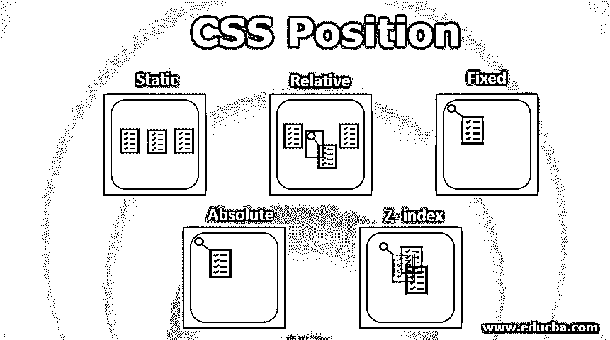
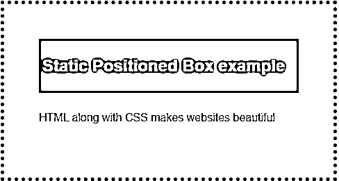
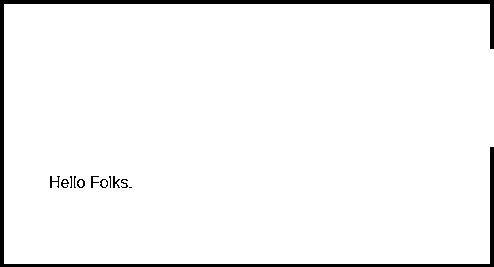
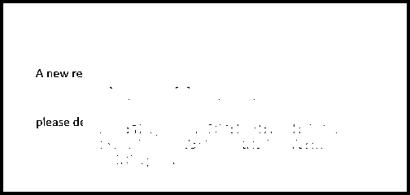
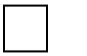
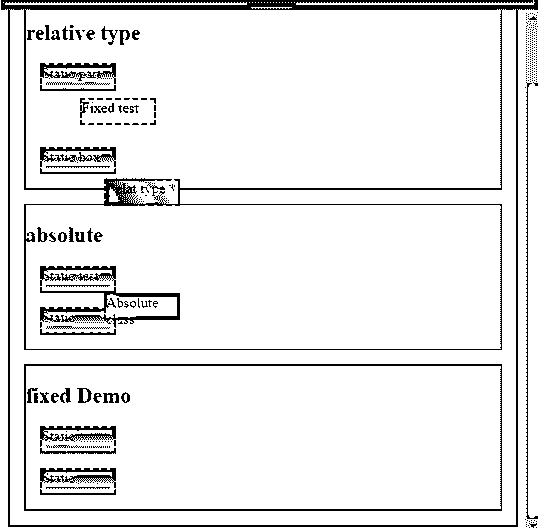

# CSS 位置

> 原文：<https://www.educba.com/css-position/>




## CSS 职位介绍

CSS 位置定义了某个元素在网页上的位置。这篇文章的主要重点是展示如何控制位置部分和内容的显示。用 CSS 旧版本做定位是相当复杂的，因此一个新的标准 CSS 灵活布局有更新的版本。谈到定位和布局模型，这是一个相当困难的部分，因为他们必须处理浏览器的实现问题。这个定位属性有五种不同的方法，即静态、相对、绝对、粘性、固定。

**语法相对:**

<small>网页开发、编程语言、软件测试&其他</small>

```
Position:relative;
Top:10px;
Right:25px;
```

默认情况下，相对定位的元素可以和初始元素一起移动，或者我们可以说它是在正常位置完成的。盒子的位置被校准到正常的流量，之后它可以被用作左、右、上、下属性。

**语法绝对:**

```
Position:absolute;
Top:12px;
Right:23px;
```

这将根据父元素进行操作。它被精确地定位在指定的位置。

**语法静态:**

```
Position:static;
display:inline;
Display:inline-block
float:left;
clear:both;
overflow:hidden;
```

### CSS 职位如何运作？

此属性有助于计算网站中指定的布局和内容。

定位中有三组属性:

*   **属性 1:** Left，Right，Top，Bottom(这暗示了一个元素离视口边缘角的距离)。
*   **属性二:**定位概念。
*   **属性 3:** Z-Index。
*   **属性 4:** 格式化样式。

以下是一些 CSS 职位及其工作:

#### 1.静态

静态位置元素是默认设置的，它们对诸如右、左、下、上等属性没有影响。它们没有任何特殊的方向，它是相对于普通页面定位的。

#### 2.亲戚

在创建 CSS 布局的时候[很有帮助，但是发现很困难。](https://www.educba.com/css-blinking-text/)[具有该属性的 HTML 元素](https://www.educba.com/html-form-elements/)与 static 的工作方式相同，不同之处在于为祖先元素设置了 right，left 值。

#### 3.固定的

固定位置完全类似于绝对定位，但是它们与正常的文本流相冲突，并固定在网页上的某个确切位置，HTML 的所有其他元素的行为就像它不存在于页面上一样。绝对定位和固定定位的关键区别在于，当发生页面滚动时，固定位置会在正在进行的页面上保留它们的空间。

#### 4.绝对的

在这个位置，元素相对于它们自身放置，并且它被排除在文档的正常流程之外。通常，它们被放置在它们的祖先或父元素的左上角。

#### 5.z 指数

在正常流程中，会出现网页中的元素重叠的情况，为了确定这些元素在顶部或底部的准确位置，需要使用 Z 索引。通俗地说，它设置元素的堆叠顺序，或者可以称为三维视口。正边距指定一个元素应该被推到顶部，[负边距意味着](https://www.educba.com/negative-margin-css/)被推到底部。而且 Z-index 不太符合静态定位原则。

### 实现 CSS 位置的示例

以下是 CSS 职位的不同示例:

#### 示例#1:使用静态位置

下面是 CSS 静态位置的例子。

**代码:**

```
<!DOCTYPE html>
<html lang="en">
<head>
<meta charset="utf-8">
<title>Example of Static Positioning</title>
<style>
.box{
color: #fff;
background: #73AD21;
padding: 5px;
}
.container{
padding: 50px;
margin: 50px;
position: relative;
border: 5px dotted;
font-family: Arial, sans-serif;
}
.container p{
line-height: 40px;
}
</style>
</head>
<body>
<div class="container">
<div class="box">
<h2>Static Positioned Box example</h2>
</div>
<p> HTML along with CSS makes websites beautiful </p> </div>
</body>
</html>
```

**输出:**




#### 示例#2:使用相对定位

以下是 [CSS 相对于](https://www.educba.com/what-is-css/)位置的示例。

**代码:**

```
<!DOCTYPE html>
<html lang="en">
<head>
<meta charset="utf-8">
<title>Example Relative Positioning</title>
<style>
.box{
position: relative;
left: 50px;
color: #fff;
background: yellow;
padding: 15px;
}
.container{
padding: 45px;
margin: 45px;
border: 4px solid black;
font-family: italic, sans-serif;
}
.container p{
line-height: 40px;
}
</style>
</head>
<body>
<div class="container">
<div class="box">
<h2>Relative Box</h2>
</div>
<p> Hello Folks.</p>
</div>
</body>
</html>
```

下面的输出在 CSS 中创建了一个边框，并注意到一个元素可以在布局中移动。

**输出:**




#### 示例#3:使用固定定位

这是 CSS 固定位置的示例，如下所示。

**代码:**

```
<!DOCTYPE html>
<html lang="en">
<head>
<meta charset="utf-8">
<title>Example of CSS Fixed Positioning</title>
<style>
.box{
position: fixed;
top: 100px;
left: 150px;
color: #cce;
width: 50%;
background: #efefef;
padding: 20px;
}
.container{
padding:40px;
margin: 40px;
position: relative;
border: 4px solid black;
font-family: calibri, sans-serif;
}
.container p{
line-height: 60px;
}
</style>
</head>
<body>
<div class="container">
<div class="box">
<h2>Fixed Positioned demo</h2>
<div><strong>Note:</strong> The position of this box is fixed relative to the document's viewport. It doesn't scroll with the page.</div>
</div>
<p> A new request has been posted according to the skills . And please decide to to apply for the course</p>
</div>
</body>
</html>
```

**输出:**




#### 示例#4:使用绝对定位

这是 CSS 绝对位置的示例，如下所示。

**代码:**

```
<!DOCTYPE html>
<html lang="en">
<head>
<meta charset="utf-8">
<title>Example of CSS Absolute</title>
<style>
.box-green {
position: absolute;
background: green;
width: 90px;
height: 95px;
left: 6px;
top: 8px;
}
</style>
</head>
<body>
<div class="container">
<div class="box-green"></div>
<div class="box-blue"></div>
</div>
</body>
</html>
```

下面的输出在父元素的开头显示了一个元素。

**输出:**




#### 示例#5:使用所有三种定位的演示

这是 CSS 的位置的例子，通过使用相对，静态和绝对如下。

**代号:ppp.html**

```
<!DOCTYPE HTML>
<html>
<head>
<title> CSS Positioning Demo</title>
<meta http-equiv="Content-Type" content="text/html; charset=utf-8">
</head>
<body class="EDUCBA">
<h1> <c>Position demo <c></h1>

<h2>relative type</h2>
<div>Static part</div>
<div class="relative">Relat type</div>
<div>Static box</div>


<h2>absolute</h2>
<div>Static test</div>
<div class="absolute">Absolute class</div>
<div>Static</div>


<h2>fixed Demo</h2>
<div>Static</div>
<div class="fixed">Fixed test</div>
<div>Static</div>

</body>
</html>
```

**代码:new.css**

```
body {
border: 2px solid black;
}
section {
border: 1px solid black;
margin: 1rem;
position: relative;
}
div {
background: linear-gradient(to bottom, blue, white);
border: 2px dashed black;
height: 26px;
margin: inherit;
width: 80px;
top: 81px;
left: 71px;
}
.relative {
background: linear-gradient (50deg, black, white);
position: relative;
}
.absolute {
background: red;
position: absolute;
}
.fixed {
background: yellow;
position: fixed;
}
```

**输出:**




### 结论

因此，我们已经看到了如何使用 CSS 来指定元素的位置。任何人都可以用 [HTML 和 CSS](https://www.educba.com/html-vs-css/) 的基础知识来学习这些概念。一般来说，HTML 元素是可见的，就像直接订购结构，为了扰乱正常的流程或重叠的元素，使更好的页面布局可以使用 CSS。

### 推荐文章

这是一个 CSS 定位的指南。这里我们讨论 CSS 位置的基本概念、语法、工作原理和代码实现的例子。您也可以浏览我们推荐的其他文章，了解更多信息——

1.  [CSS 表格样式](https://www.educba.com/css-table-styling/)
2.  [CSS 文本下划线](https://www.educba.com/css-text-underline/)
3.  [CSS 边距颜色](https://www.educba.com/css-margin-color/)
4.  [CSS 内边框](https://www.educba.com/css-inner-border/)


