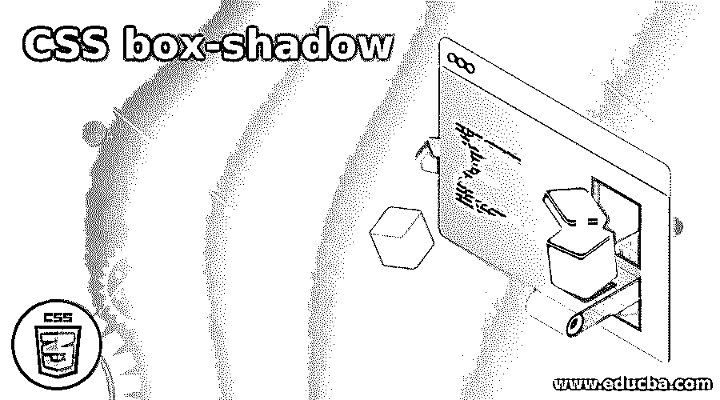
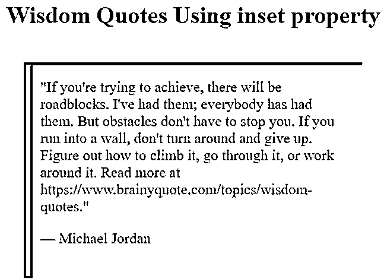
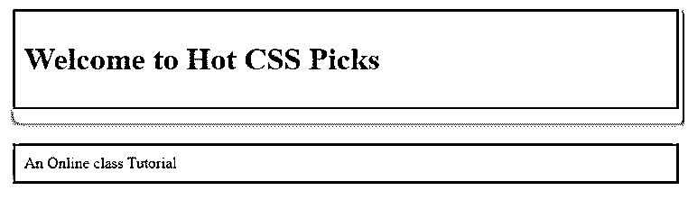
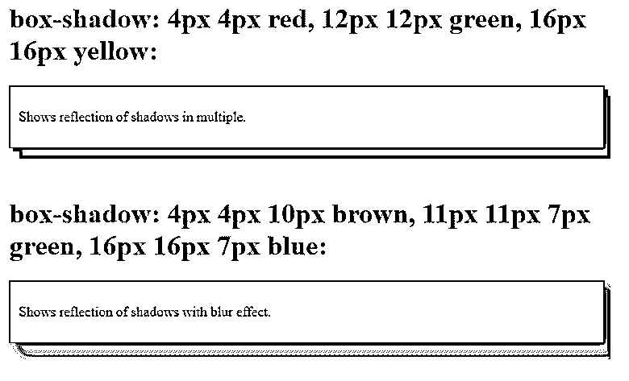
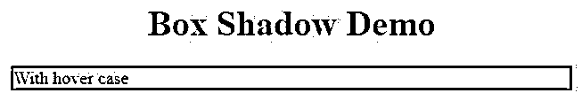
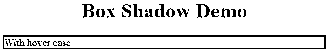
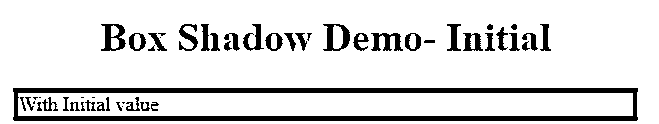
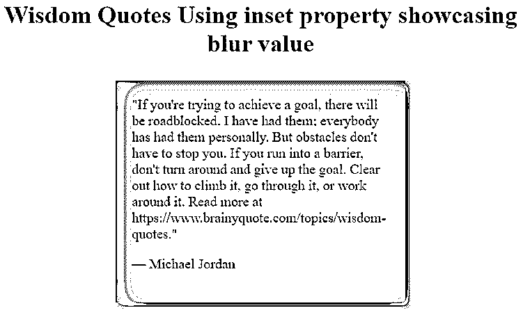

# CSS 框-阴影

> 原文：<https://www.educba.com/css-box-shadow/>




## CSS 盒子简介-阴影

将阴影定义为一个属性，将阴影附加到指定的元素上。这增加了网站创建的深度设计，而不需要图像和其他容器元素。该属性通过绘制边框将一个框从背景中分离出来。这些只是 CSS 中的一个强大的属性，可以创建 8 个纸生命阴影效果。Box-shadow 属性在网页上提供二维效果。

**语法和参数:**

<small>网页开发、编程语言、软件测试&其他</small>

```
box-shadow: none|h-offset v-offset | blur | spread |color |inset|initial|inherit;
```

这里，这两个值后面通常跟有剩余的值。

**举例:**

这里我们有三个参数，前两个设置阴影在两个轴上的位置。

```
#demo1
{
Box-shadow: 5px ,10px, red; // This says offset-x, y, color value.
}
```

### 框阴影属性在 CSS 中是如何工作的？

CSS box-shadow 在这个属性上有六个不同的值。

#### 1 .插入

该值使用 shadow 属性在盒子内部创建阴影，因为它无法在外部创建阴影。这是在属性的开头或结尾声明的。在某些情况下，这可以省略。

**举例:**

**box-shadow:inset 1px 1px 2px 2px 绿色；//[插入][水平偏移][垂直偏移][模糊半径][扩散距离][颜色]**

#### 2.颜色

这将设置阴影框的颜色。

#### 3.水平偏移

它提供了阴影效果的长度。正值用于向右渲染阴影。负值将阴影向左移动。

**举例:**

**盒影:30px 20px**

这里，水平偏移设置为 30px，高于 v 轴，垂直偏移为 20px。

#### 4.垂直偏移

它在 Y 轴上呈现盒子的阴影位置。这里正值会缩小，负值会增大。

**负值示例:**

**盒影:20px-10px；这里负值将阴影移向顶部。**

#### 5.污迹

阴影的清晰度清晰可见。在某些情况下，它是可选的，因为默认值为零，它指定颜色为纯色，阴影更清晰。

**举例:**

**盒影:4px 4px 10px**

#### 6.传播距离

它允许阴影的大小在框中缩小或增大。这里第四个值是传播半径。这分散了向四面八方延伸的阴影。正值使阴影以各种尺寸扩大。各方负价值契约。

**举例:**

**Box-shadow:0 20px 20px-4px；**

在这六个值中，水平和垂直偏移这两个值被赋予了重要性。除了颜色和插入值，CSS 长度是 px、em 和百分比，颜色值使用十六进制值。

### CSS 框-阴影示例

下面是一些例子:

#### 示例#1

使用插入属性值。

这里，红色的边框阴影反映在内部。

**代码:**

```
<!DOCTYPE html>
<html>
<head>
<style>
blockquote {
width: 60%;
margin: 45px auto;
padding: 22px;
font-size: 20px;
box-shadow: inset 12px 4px red;
}
</style>
</head>
<body>
<h1><center> Wisdom Quotes Using inset property</h1>
<blockquote>
<q>If you're trying to achieve, there will be roadblocks. I've had them; everybody has had them. But obstacles don't have to stop you. If you run into a wall, don't turn around and give up. Figure out how to climb it, go through it, or work around it.
Read more at https://www.brainyquote.com/topics/wisdom-quotes.</q>
<p>&mdash; Michael Jordan</p>
</blockquote>
</body>
</html>
```

**输出:**




#### 实施例 2

使用颜色值。

**代码:**

```
<!DOCTYPE html>
<html>
<head>
<title> Box-Shadow using Offset</title>
<style>
.adc1 {
border: 1.5px solid;
padding: 10px;
box-shadow: 6px 9px 9px 9px orange;
}
.adc2 {
border: 1.5px solid;
padding: 10px;
box-shadow: 6px 9px 9px 20px yellow;
}
</style>
</head>
<body>
<div class = "adc1">
<h1>Welcome to Hot CSS Picks</h1>
</div><br><br>
<div class = "adc2">
An Online class Tutorial
</div>
</body>
</html>
```

**输出:**




#### 实施例 3

在盒子上使用多重阴影。

使用单个框阴影属性，我们可以在一个元素上添加多个阴影。因此，可以指定任意数量的不同颜色的阴影，但应该用逗号分隔。在下面的代码框中，阴影指定了三种不同的颜色。方框阴影:4px 4px 红色，12px 12px 绿色，16px 16px 黄色。

**代码:**

```
<!DOCTYPE html>
<html>
<head>
<style>
#multiple1 {
border: 1px solid;
padding: 10px;
box-shadow:4px 4px red, 12px 12px green, 16px 16px yellow;
}
#multiple2 {
border: 1px solid;
padding: 10px;
box-shadow:4px 4px 10px brown, 11px 11px 7px green, 16px 16px 7px blue;
}
</style>
</head>
<body>
<h1>box-shadow: 4px 4px red, 12px 12px green, 16px 16px yellow:</h1>
<div id="multiple1">
<p>Shows reflection of shadows in multiple.</p>
</div>
<br>
</br>
<h1>box-shadow: 4px 4px 10px brown, 11px 11px 7px green, 16px 16px 7px blue:</h1>
<div id="multiple2">
<p>Shows reflection of shadows with blur effect.</p>
</div>
</body>
</html>
```

**输出:**




#### 实施例 4

**代码:**

```
<!DOCTYPE html>
<html>
<head>
<title> Box-Shadow Demo</title>
<style>
.shadbox {
box-shadow: 0 0 0 2px purple;
&:hover {
box-shadow: 0 0 0 4px purple;
}
}
</style>
</head>
<body>
<h1><center> Box Shadow Demo </center> </h1>
<div class="shadbox"> With hover case</div>
</body>
</html>
```

**输出:**

**

** 

当将 y 轴偏移量更改为负值时。

**代码:**

```
<style>
.shadbox {
box-shadow: 0 -1px 0 2px purple;
&:hover {
box-shadow: 0 -1px 0 4px purple;
}
}
</style>
```

因此，在这里我们可以看到边框顶部由于负值而变暗。

**输出；**

#### 


#### 示例 **#5**

使用初始值–默认。

**代码:**

```
<!DOCTYPE html>
<html>
<head>
<title> Box-Shadow Demo</title>
<style>
.shadbox {
box-shadow: initial;
border : 4px solid;
&:hover {
box-shadow: initial;
border : 4px solid;
}
}
</style>
</head>
<body>
<h1><center> Box Shadow Demo- Initial</center> </h1>
<div class="shadbox"> With Initial value</div>
</body>
</html>
```

**输出:**




#### 实施例 6

显示模糊阴影。

**代码:**

```
<!DOCTYPE html>
<html>
<head>
<style>
blockquote {
width: 50%;
margin: 30px auto;
padding: 21px;
font-size: 18px;
box-shadow:  inset 12px 4px 24px 4px green, 4px 4px 10px 3px green;
}
</style>
</head>
<body>
<h1><center> Wisdom Quotes Using inset property showcasing blur value</h1>
<blockquote>
<q>If you're trying to achieve a goal, there will be roadblocked. I have had them; everybody has had them personally. But obstacles don't have to stop you. If you run into a barrier, don't turn around and give up the goal. Clear out how to climb it, go through it, or work around it.
Read more at https://www.brainyquote.com/topics/wisdom-quotes.</q>
<p>&mdash; Michael Jordan</p>
</blockquote>
</body>
</html>
```

**输出:**




### 结论

因此，具有这种阴影盒属性的网页可以使用设计软件中使用的那些元素来创建 3D 效果。因此，在本文中，我们通过详细的演示来了解它们的属性值。这个阴影完全给出了一些惊人的效果。

### 推荐文章

这是一个 CSS 盒子阴影的指南。这里我们分别讨论 CSS 和示例中的框阴影属性是如何工作的。您也可以看看以下文章，了解更多信息–

1.  [CSS 标题设计](https://www.educba.com/css-header-design/)
2.  [CSS 导航栏](https://www.educba.com/css-navigation-bar/)
3.  [复选框 CSS](https://www.educba.com/checkbox-css/)
4.  [CSS 顺序](https://www.educba.com/css-order/)


