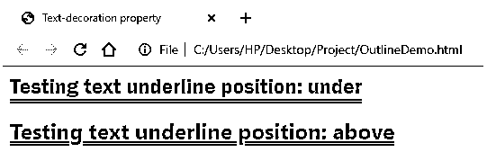
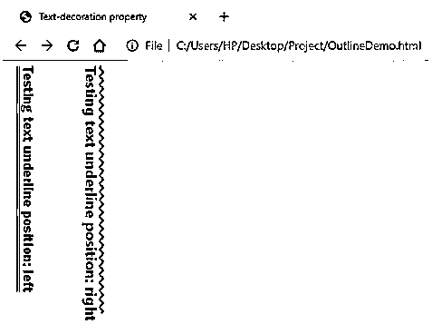
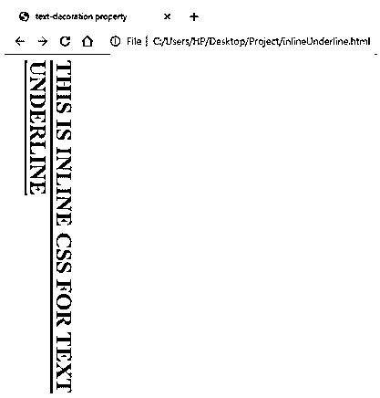

# CSS 文本下划线

> 原文：<https://www.educba.com/css-text-underline/>


## CSS 文本下划线介绍

在这篇文章中，我们将了解 CSS 文本下划线。级联样式表是关于表现的。我们对样式的利用越好，展示就越完美。话虽如此，我们必须知道，在通过 CSS 进行样式化时，有许多细节必须注意。举个简单的例子，让我们给文本加下划线。现在，可以使用 text-decoration 属性完成简单的文本下划线。但是要修复细节，我们必须深入其复杂性并修复定位和偏移属性。我们将在本文中讨论这一点。text-underline-position 和 text-underline-offset 是对属性 text-decoration: underline 提供的下划线的增强功能。

### 文本下划线中的语法

**1。Text-underline-position:** 这个属性定义了下划线相对于文本的位置。

<small>网页开发、编程语言、软件测试&其他</small>

其语法是:

```
text-underline-position: auto| under| left| right| above
```

**对上述语法的解释:**这里，值 auto 为下划线选择一个位置，使用 under 的值确保该行不与下行线交叉，例如，下标的情况，而 above 的值与下行线交叉。如果文本的书写模式为水平，下划线的左右位置与下的相同。当文本模式切换到垂直模式时，就会用到它们。我们可以决定下划线是在文本的左边还是右边。

**2。Text-underline-offset:** 这不是 text-decoration 属性的子属性。此属性设置下划线相对于其原始位置的偏移距离。这里的偏移距离是指与定义路径的距离。

其语法可以是:

```
text-underline-offset: length
```

**对上述语法的解释:**这里，长度可以用 em 或 cm 之类的单位给出。他们将决定偏移距离的长度。然而，包括 Chrome 在内的许多浏览器都不支持该属性。因此，在设计文本样式时，最好避开它。

### CSS 文本下划线的实现示例

以下是实现相同功能的示例:

#### 示例#1

用上面和下面的值演示文本-轮廓-位置并观察差异。

*   在本例中，我们将使用两个值测试文本下划线位置，即 above 和 under。我们可以在各自的输出中观察到属性的两个值之间的细微差异。
*   首先，我们将[创建一个 CSS 文件](https://www.educba.com/css-border-padding/)，因为我们正在使用外部 CSS。
*   我们将创建一个类，在这个类中我们将使用简写属性文本修饰来设置下划线的样式。接下来，我们将使用文本-下划线-位置，并定义它分开。我们可以随意添加其他功能。CSS 类的代码应该如下所示:

**代码:**

```
.class1{
text-decoration: underline double green;
text-underline-position: under;
font-family: 'Franklin Gothic Medium', 'Arial Narrow', Arial, sans-serif;
}
```

*   与上面类似，我们将定义另一个 CSS 类，并保持上面的文本-下划线-位置。代码应该类似于下面给出的代码:

**代码:**

```
.class2{
text-decoration: underline double purple;
text-underline-position: above;
font-family: 'Segoe UI', Tahoma, Geneva, Verdana, sans-serif;
}
```

*   最终的 CSS 代码应该如下所示:

**代码:**

```
.class1{
text-decoration: underline double green;
text-underline-position: under;
font-family: 'Franklin Gothic Medium', 'Arial Narrow', Arial, sans-serif;
}
.class2{
text-decoration: underline double purple;
text-underline-position: above;
font-family: 'Segoe UI', Tahoma, Geneva, Verdana, sans-serif;
}
```

*   接下来，我们将创建一个 HTML 页面。此外，确保在页面中调用外部 CSS 文件。因为我们已经定义了 CSS 类，所以我们可以在任何 HTML 元素中使用它们，将样式应用于特定的元素。在本例中，我们将它与标题元素一起使用，即

    ## 。最终的 HTML 代码应该如下所示:

**代码:**

```
<html>
<head>
<title>Text-decoration property</title>
<link rel = "stylesheet" href = "underline.css">
</head>
<body>
<h2 class="class1">Testing text underline position: under</h2>
<h2 class="class2">Testing text underline position: above</h2>
</body>
</html>
```

**输出:**




*   我们可以清楚地看到，通过将位置设为下方或上方，我们可以获得两种不同样式的文本内容下划线。

#### 实施例 2

用书写模式演示文本-轮廓-位置，并观察左右值的差异

*   对于这个例子，我们应该清楚什么是书写模式。基本上，这也是一个 CSS 属性，定义文本应该如何对齐，即水平方向从左到右或垂直方向从上到下。现在，为了演示下划线位置的 left 和 right 值，我们将使用垂直书写模式。
*   类似于第一个例子，我们将为两个不同的位置值定义 [CSS 类来样式化](https://www.educba.com/css-blinking-text/)。第一个类将被编码为下划线位置在左侧。代码应该类似于下面的代码片段:

**代码:**

```
.class1{
writing-mode: vertical-lr;
position: absolute;
padding-right: 100px;
text-decoration: underline double green;
text-underline-position: left;
font-family: 'Franklin Gothic Medium', 'Arial Narrow', Arial, sans-serif;
}
```

*   第二个类应该在垂直对齐文本的右边有下划线。代码应该类似于以下内容:

**代码:**

```
.class2{
writing-mode: vertical-lr;
padding-left: 100px;
text-decoration: underline wavy purple;
text-underline-position: right;
font-family: 'Segoe UI', Tahoma, Geneva, Verdana, sans-serif;
}
```

*   最终的 CSS 文件应该类似于下面的代码:

**代码:**

```
.class1{
writing-mode: vertical-lr;
position: absolute;
padding-right: 100px;
text-decoration: underline double green;
text-underline-position: left;
font-family: 'Franklin Gothic Medium', 'Arial Narrow', Arial, sans-serif;
}
.class2{
writing-mode: vertical-lr;
padding-left: 100px;
text-decoration: underline wavy purple;
text-underline-position: right;
font-family: 'Segoe UI', Tahoma, Geneva, Verdana, sans-serif;
}
```

*   最终的 HTML 页面应该调用外部 CSS，并在设计元素样式时包含这两个类。HTML 页面的代码应该如下所示:

**代码:**

```
<html>
<head>
<title>Text-decoration property</title>
<link rel = "stylesheet" href = "underline.css">
</head>
<body>
<h2 class="class1">Testing text underline position: left</h2>
<h2 class="class2">Testing text underline position: above</h2>
</body>
</html>
```

*   保存这段代码，并通过浏览器打开 HTML 文件。最终输出应该与下面的屏幕截图有些相似:

**输出:**




#### 实施例 3

在内嵌样式 CSS 中使用文本下划线位置

*   在这个例子中，我们将创建一个 HTML 文件并调用内联样式 CSS 来定义一些文本的下划线样式。最终的 HTML 代码应该是这样的:

**代码:**

```
<html>
<head>
<title>text-decoration property</title>
</head>
<body>
<h1 style="writing-mode: vertical-rl; text-decoration: underline red; text-underline-position: left;">THIS IS INLINE CSS FOR TEXT UNDERLINE</h1>
</body>
</html>
```

*   保存文件并通过浏览器打开，最终输出应该如下所示:

**输出:**




因此，我们看到了如何在通过 CSS 进行样式设计时利用文本下划线位置属性。这是可用于更精细细节的特征或属性。它可以被称为增强属性，用于特殊用途。

### 推荐文章

这是一个 CSS 文本下划线的指南。在这里，我们讨论用适当的代码和输出在 CSS 文本中实现下划线的语法和例子。您也可以浏览我们的其他相关文章，了解更多信息——

1.  [CSS 内联样式](https://www.educba.com/css-inline-style/)
2.  [CSS 字体属性](https://www.educba.com/css-font-properties/)
3.  [CSS 三角形生成器](https://www.educba.com/css-triangle-generator/)
4.  [CSS 填充](https://www.educba.com/css-padding/)


