# CSS 闪烁文本

> 原文：<https://www.educba.com/css-blinking-text/>

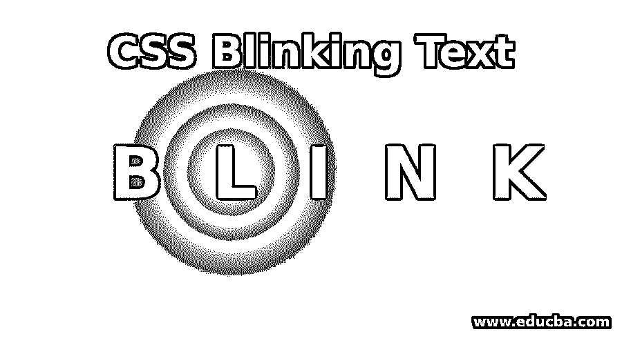


## CSS 闪烁文本介绍

CSS 中的闪烁文本定义为以相等的时间间隔改变文本的颜色。闪烁文本通常用于吸引某人的注意力来查看链接或文本。闪烁文本功能已被弃用，开发者不再使用。

**实时示例:**

<small>网页开发、编程语言、软件测试&其他</small>

在新闻网站更新重要新闻时使用闪烁文字。因为看不断变化的事物是人类的一种倾向。所以，通过让文字闪烁，可以很快吸引一些注意力。

### CSS 中的闪烁文本是如何工作的？

文本将根据分配给它的属性值闪烁。文本闪烁功能可以通过动画属性和@关键帧选择器来实现。

**语法:**

```
selector{
animation: blinker time_in_seconds up_to_blink_time;
}
@keyframes blinker {
60% {
opacity: 0;
}
}
```

**说明:**

*   **动画**:blinker time_in_seconds up_to_blink_time:blinker 使文本闪烁，time _ in _ seconds up 使文本在每个规定的时间后闪烁，up _ to _ blink _ time 决定文本闪烁的时间。
*   **@关键帧**:@关键帧选择器为闪烁的文本提供不透明度。

**Note:** Animation property blinker name and @keyframes blinker name is always the same to work in the blinking feature.

### CSS 闪烁文本的示例

下面是 CSS 闪烁文本的例子:

#### 示例#1

闪烁整个文本示例。

**HTML 代码:BlinkingTotalText.html**

```
<!DOCTYPE html>
&alt;html>
<head>
<meta charset="ISO-8859-1">
<link rel="stylesheet" href="BlinkingTotalText.css">
<title>Blinking Text</title>
</head>
<body>
<h2>Demo for Blinking Entire Text</h2>
<p class="a1">Blinking Text in CSS defined as changing color of the text with
equal time intervals.</p>
<p class="a2">Blinking Text is using when updating important news in the news
website. Because it is human tendency to look at the things which are
changing continuously. So, by making the text blink takes some
attention very quickly.</p>
</body>
</html>
```

**CSS 代码:BlinkingTotalText.css**

```
h2{
color: green;
}
.a1, .a2{
animation:blinking 1.5s infinite;
font-size: 20px;
}
@keyframes blinking{
0%{   color: red;   }
47%{   color: #000; }
62%{   color: transparent; }
97%{   color:transparent; }
100%{  color: #000;   }
}
```

**输出:**

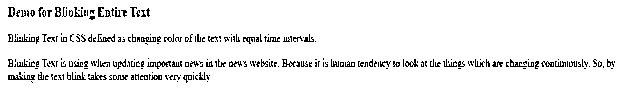


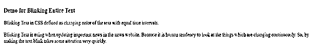


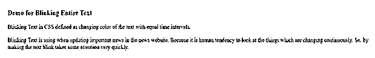


**说明:**

*   正如你在上面的代码中看到的，动画属性有 3 个值，闪烁时间为 1.5s。这意味着文本每 1.5 秒闪烁一次，直到无限长时间。
*   @关键帧选择器在“与上述动画属性值相同”旁边有一个值，则只有“闪烁”属性起作用。
*   正如您在上面的输出图像中所看到的，每个输出图像文本都从红色变为正常的黑色。因此，文字以这种方式闪烁。

#### 实施例 2

闪烁的 Span(部分)标签文本示例。

**HTML 代码:SpanTextBlink.html**

```
<!DOCTYPE html>
<html>
<head>
<meta charset="ISO-8859-1">
<link rel="stylesheet" href="SpanTextBlink.css">
<title>Blinking Text</title>
</head>
<body>
<h2>Demo for Blinking Span Text</h2>
<p>Blinking Text in CSS defined as CHANGING color of the text with
equal time intervals.</p>
<p>Blinking Text is using when UPDATING important news in the news
website. Because it is HUMAN tendency to look at the things which are
changing continuously. So, by making the text blink takes some
attention very quickly.</p>
</body>
</html>
```

**CSS 代码:SpanTextBlink.css**

```
h2{
color: green;
}
p
{
border: 2px solid;
}
.a1, .a2{
animation:blinking 2s infinite;
font-size: 25px;
}
@keyframes blinking{
0%{  color: yellow; }
47%{  color: #000; }
62%{  color: transparent; }
97%{  color:transparent; }
100%{ color: #000;  }
}
```

**输出:**

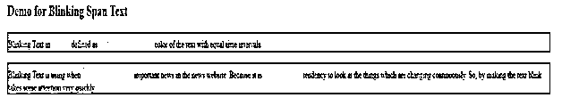


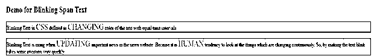


**说明:**

*   正如你在上面的代码中看到的，动画属性有 3 个值，闪烁 2s 无限。这意味着文本每 2 秒闪烁一次，直到无限长时间。
*   @关键帧选择器在“与上述动画属性值相同”旁边有一个值，则只有“闪烁”属性起作用。
*   正如您在上面的输出图像中看到的，每个输出图像文本都从黄色变为正常的黑色。因此，文字以这种方式闪烁。

#### 实施例 3

闪烁标题文本示例。

**HTML 代码:HeaderTextBlink.html**

```
<!DOCTYPE html>
<html>
<head>
<meta charset="ISO-8859-1">
<link rel="stylesheet" href="HeaderTextBlink.css">
<title>Blinking Text</title>
</head>
<body>
<h1>Demo for Blinking Span Text</h1>
<h2 class="a1">Hi Hello I am Header, I can also blink</h2>
</body>
</html>
```

**CSS 代码:HeaderTextBlink.css**

```
h2{
color: green;
}
.a1{
animation:blinking 1s infinite;
}
@keyframes blinking {
0%{                      color: blue;       }
50%{    color: transparent;        }
100%{  color: black;     }
}
```

**输出:**

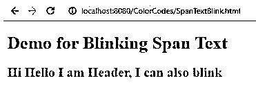


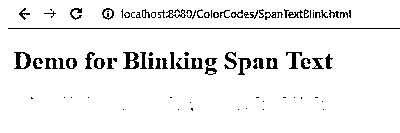


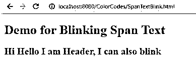


**说明:**

*   正如你在上面的代码中看到的，动画属性有 3 个值，闪烁 1s 无限。这意味着文本每 1 秒闪烁一次，直到无限长时间。
*   @关键帧选择器在“与上述动画属性值相同”旁边有一个值，则只有“闪烁”属性起作用。
*   正如您在上面的输出图像中所看到的，每个输出图像文本都从蓝色变为正常的黑色。因此，文字以这种方式闪烁。

#### 实施例 4

闪烁整个文本示例。

**HTML 代码:LiveButtonDemo.html**

```
<!DOCTYPE html>
<html>
<head>
<meta charset="ISO-8859-1">
<link rel="stylesheet" href="LiveButtonDemo.css">
<title>Blinking Text</title>
</head>
<body>
<h1>Demo for Live Button Blink</h1>
<div class="mainDiv">
<i class="liveButton"></i> LIVE STREAMING
</div>
</body>
</html>
```

**CSS 代码:live button moto . CSS**

```
.liveButton {
height: 20px;
width: 20px;
border-radius: 12px;
background-color: red;
margin-right: 10px;
animation: blinking 1.5s linear infinite;
}
@-webkit-keyframes blinking {
0% { opacity: 1.0; }
50% { opacity: 0.0; }
100% { opacity: 1.0; }
}
.mainDiv {
flex-direction: row;
display: flex;
}
```

**输出:**

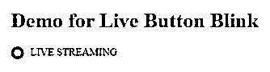


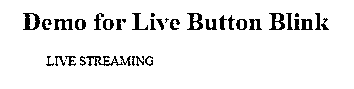


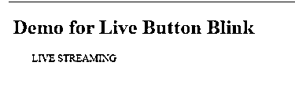


**说明:**

*   正如你在上面的代码中看到的，动画属性有 3 个值，闪烁 1s 无限。这意味着文本每 1.5 秒闪烁一次，直到无限长时间。
*   @-WebKit-关键帧选择器在“与上述动画属性值相同”旁边有一个值，则只有“闪烁”属性起作用。
*   正如您在上面的输出图像中所看到的，每个输出图像文本都从红色变为正常的黑色。因此，文字以这种方式闪烁。

### 结论

文本闪烁功能可以通过动画属性完成，闪烁(任何名称)、闪烁时间、最多闪烁时间以及闪烁(任何名称)旁边的@关键帧选择器与动画和不透明度属性值中给定的相同。

### 推荐文章

这是一个 CSS 闪烁文本的指南。这里我们讨论基本概念，不同的例子，以及在 CSS 中闪烁文本是如何工作的？您也可以看看以下文章，了解更多信息–

1.  [CSS 文本下划线](https://www.educba.com/css-text-underline/)
2.  [CSS 框尺寸](https://www.educba.com/css-box-sizing/)
3.  [CSS 列表](https://www.educba.com/css-lists/)
4.  [CSS 梯度发生器](https://www.educba.com/css-gradient-generator/)


