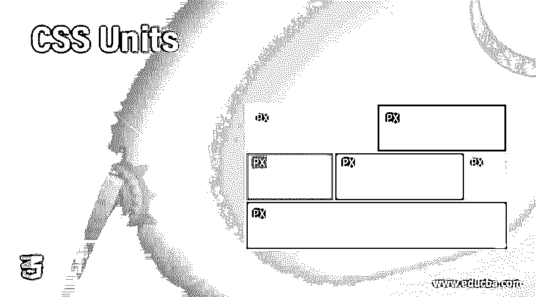
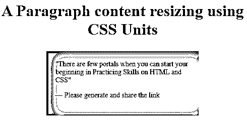
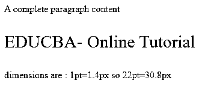
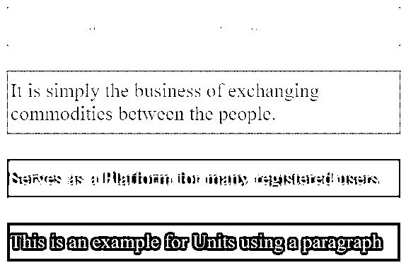
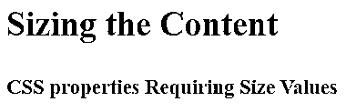
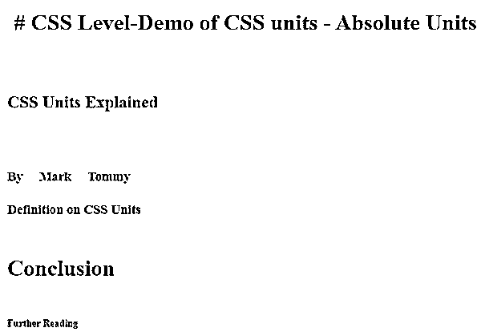
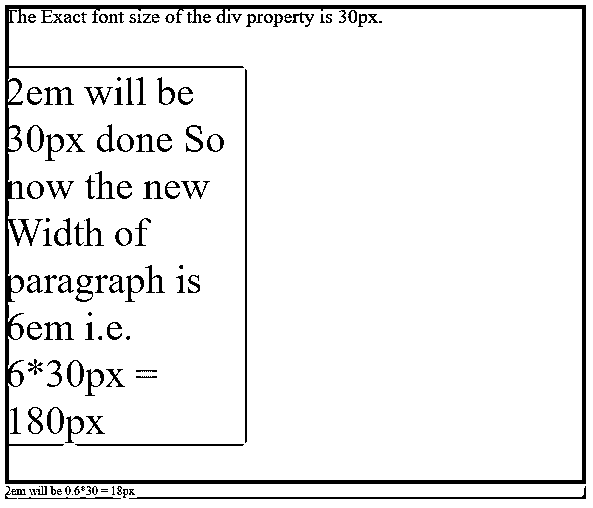
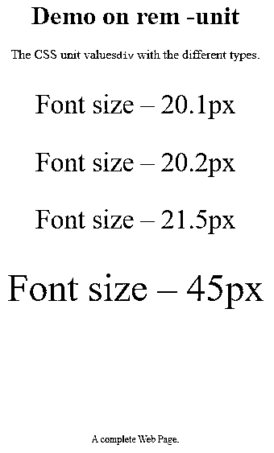
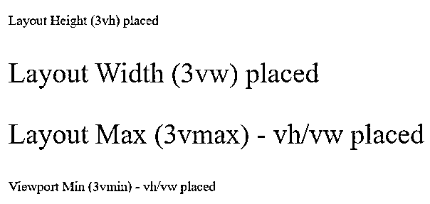

# CSS 单位

> 原文：<https://www.educba.com/css-units/>




## CSS 单元介绍

CSS 单位被定义为长度的不同表达方式。这个单位指定了网页设计如何与各种设备交互，也被认为是一个基本的度量单位。CSS 中的单位有助于 CSS 属性(如边距、宽度、字体大小)用没有空白的单位来表示它们的长度，并且它也接受负值。对于值“0”，可以忽略单位。

### CSS 单元列表(用例子解释每一个)

在这一节中，我们将强调一些流行的 CSS 单元类型来设置属性。CSS 单位有两种类型，分为绝对单位和相对单位。

<small>网页开发、编程语言、软件测试&其他</small>

#### 1.绝对单位

绝对单位的大小是固定的，它不用于屏幕大小，因为屏幕图像的大小是变化的。对于任何设置为绝对值的属性，无论是在手机上还是在大窗口屏幕上，大小都保持不变。例如，已知的输出大小(如页面布局)被视为绝对单位。当我们不期望从站点得到任何响应时，这个单元被认为是好的，并且在区域变得太宽时定义最大和最小宽度也是有益的。

物理绝对单位列表包括:

*   像素:这是最流行的屏幕尺寸单位。这是 CSS 中最常见的单元，它固定了代码中元素的宽度。也用于间距和位置属性。因此，像素是设备的视角，并固定屏幕上元素的大小。

**举例:**

```
<!DOCTYPE html>
<html>
<head>
<style>
blockquote {
width: 50%;
margin: 25px auto;
padding: 18px;
font-size: 14px;
box-shadow:  inset 11px 3px 22px 3px purple, 3px 3px 9px 2px pink;
}
</style>
</head>
<body>
<h1><center> A Paragraph content resizing using CSS Units</h1>
<blockquote>
<q>There are few portals when you can start your beginning in Practicing Skills on HTML and CSS</q>
<p>&mdash; Please generate and share the link</p>
</blockquote>
</body>
</html>
```

**输出:**




*   **pt:** 定义单位为点。在 CSS 中，一个点被指定为 1/72 英寸。对于像打印机这样的设备，最推荐使用这个单元。

**语法:**

```
property : vpt;
```

其中“v”是数值。Ex:身高:10pt

**以点为单位的例子**

```
<!DOCTYPE html>
<html>
<head>
<style>
.pointvalue {
font-size: 22pt;
color:red;
}
</style>
</head>
<body>
<p>A complete paragraph content</p>
<p class="pointvalue">EDUCBA- Online Tutorial</p>
<p> dimensions are : 1pt=1.4px so 22pt=30.8px</p>
</body>
</html>
```

**输出:**




*   **pc:** 这个单位声明是十二点活字长度单位，W3C 不太推荐。

**语法:**

```
property: a pt;
```

其中“a”是任何数值。

*   **英寸:**此英寸专门用于创建印刷书籍页面。

**举例:**

一起实现“pc”和“in”单元

```
<html>
<head>
<title>Absolute unit- Inches</title>
<style>
.examp {
font-size: .7pc;
font-weight:bold;
}
.skill {
font-size: .3in;
line-height: .2in;
}
</style>
</head>
<body>
<div class = "examp"> A complete Guide</gfg>
<div class = "skill"> Beginners to Intermediate How to become a Web Developer   </body>
</html>
```

**输出:**


*   **cm:** 日常最常用的是厘米，在 web 开发案例中使用较少。

**举例:**

```
<!DOCTYPE html>
<html>
<head>
<title> CSS Relative units- Example </title>
<style>
body {
margin: 1cm;
padding: 0.5cm;
font-family: 'Times Roman';
font-size: 0.8cm;
}
p {
padding: 12px 4px;
margin: 1cm;
color: darksalmon;
}
p:nth-of-type(1) {
background: pink;
color: white;
}
p:nth-of-type(2) {
background: yellow;
border: 1px dotted blue;
font-family: 'Dosis';
}
p:nth-of-type(3) {
background: orange;
color: white;
}
p:nth-of-type(4) {
background: #56200e;
}
</style>
</head>
<body>
<p>This is Trading Activity for many investors</p>
<p> It is simply the business of exchanging commodities between the people.</p>
<p>Serves as a Platform for many registered users.</p>
<p>This is an example for Units using a paragraph</p>
</body>
</html>
```

**输出:**




*   **mm:** 长度指定为毫米。

**举例:**

```
<html>
<head>
<title>Absolute unit- MM</title>
<style>
.abc {
font-size: 10mm;
font-weight:bold;
}
.demo {
font-size: 6mm;
line-height: 2mm;
}
</style>
</head>
<body>
<div class = "abc"> Sizing the Content</abc> <br> </br>
<div class = "demo"> CSS properties Requiring Size Values</div>
</body>
</html>
```

**输出:**




**举例:**

```
<!DOCTYPE html>
<html lang="en">
<head>
<meta charset="utf-8">
<title>Demo of CSS units - Absolute Units</title>
<style>
h1 { margin: 0.1in; }       /* inches */
h2 { line-height: 4cm; }     /* centimeters */
h3 { word-spacing: 5mm; }    /* millimeters */
h4 { font-size: 14pt; }      /* points */
h5 { font-size: 2pc; }      /* picas */
h6 { font-size: 14px; }     /* picas */
</style>
</head>
<body>
<h1># CSS Level-Demo of CSS units - Absolute Units</h1>
<h2>CSS Units Explained</h2>
<h3>By Mark Tommy</h3>
<h4>Definition on CSS Units</h4>
<h5>Conclusion</h5>
<h6>Further Reading</h6>
</body>
</html>
```

**输出:**




#### 2.相对单位

这些单元在设备之间不是固定的，并且很好地用于低分辨率屏幕尺寸，并且具有良好的响应站点。它们指定了完全依赖于其他长度属性的相对单位。这对于数字媒体屏幕是特别优选的。少数相关单元是:

*   **百分比**:这有助于将父元素包含在百分比中。
*   **em:** 这个相对单位落在元素 font-size 上。当我们为 HTML 元素定义字体大小时，它们的值是相对的。例如，如果父字体大小为 10px，子字体大小为 0.2 em，则渲染大小为 2px。因此，子元素的字体大小可以增大或减小。

**示例:**在下面的示例中，em 值被计算到像素。

```
<!DOCTYPE html>
<html>
<head>
<style>
div {
font-size: 20px;
background: purple;
}
.base {
font-size: 2em;
width: 6em;
background: red;
}
.derived {
font-size: 0.6em;
background: darksalmon;
}
</style>
</head>
<body>
<div>
The Exact font size of the div property is 30px.
<p class="base">2em will be 30px done So now the new Width of paragraph is 6em i.e. 6*30px = 180px <p>
<p class="derived">2em will be 0.6*30 = 18px</p>
</div>
</body>
</html>
```

**输出:**




*   **rem:** 这个元素的值总是等于根元素的字体大小。这是演示。

**举例:**

```
<html>
<head>
<style>
body {
text-align: center;
}
div {
font-size: 2.1rem;
}
span {
font-size: 3rem;
}
.hex {
font-size: 12px;
padding-top: 120px;
}
</style>
</head>
<h1>Demo on rem -unit</h1>
<p>The CSS unit values<code>div</code> with the different types.
</p>
<div>
<p>Font size &ndash; 20.1px</p>
<div>
<p>Font size &ndash; 20.2px</p>
<div>
<p>Font size &ndash; 21.5px
<br><br> Font size &ndash; 45px</p>
</div>
</div>
</div>
<p class="hex">A complete Web Page.</p>
</html>
```

**输出:**




*   **ch** :等于一个元素‘0’的宽度。这意味着所有字符的宽度相同。

**举例:**

```
width: 20ch;
```

*   **vh** :相对于视口的高度。

**举例:**

```
font-size: 12vh;
```

*   **vw:** 相对于视口的宽度。

**举例:**

```
font-size :8vw;
```

*   **vmin，vmax:** 当我们需要图像适应更小或更大的视窗尺寸时使用。
*   **例如:**这个单位是一个完全较低的字体大小赋值。

**例:相对单位例。**

```
<!DOCTYPE html>
<html>
<head>
<title> CSS Relative units- Example </title>
<style>
.v1 {
font-size:3vh;
}
.v2 {
font-size:3vw;
}
.v3 {
font-size:3vmax;
}
.v4 {
font-size:3vmin;
}
</style>
</head>
<body>
<p class="v1">Layout Height (3vh) placed</p>
<p class="v2">Layout Width (3vw) placed</p>
<p class="v3"> Layout Max (3vmax) - vh/vw placed </p>
<p class="v4"> Viewport Min (3vmin) - vh/vw placed </p>
</body>
</html>
```

**输出:**




**注意:**这里，视窗是你在浏览器屏幕中的可视区域。

### 结论

我们在这里以 CSS 单位的简要说明结束，这是创建页面布局设计时最基本的方面。因此，在这篇文章中，我们看到了不同的 CSS 单元及其工作原理，这对创建更好的布局设计非常有帮助。

### 推荐文章

这是一个 CSS 单位的指南。在这里，我们讨论 CSS 单元的列表及其工作原理，并解释每个示例及其输出。您也可以看看以下文章，了解更多信息–

1.  [CSS 排版](https://www.educba.com/css-typography/)
2.  [CSS 中的不透明度](https://www.educba.com/opacity-in-css/)
3.  [CSS 顺序](https://www.educba.com/css-order/)
4.  [粘滞页脚 CSS](https://www.educba.com/sticky-footer-css/)


