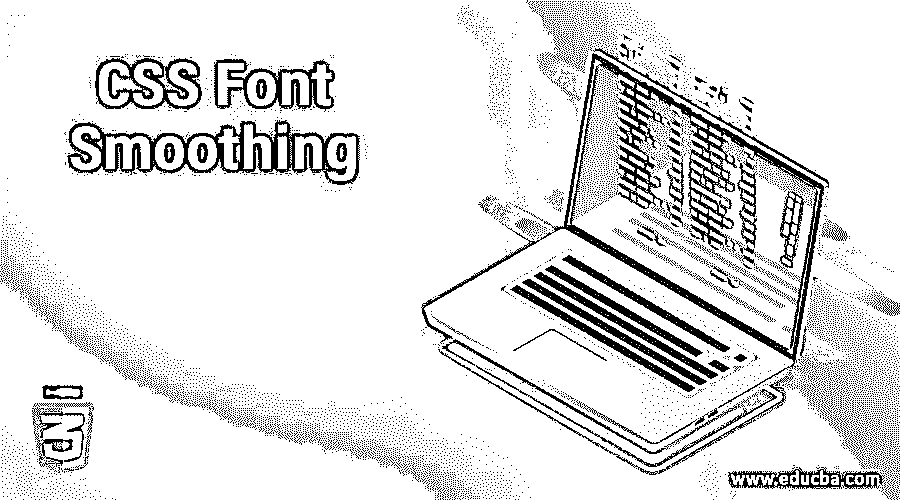
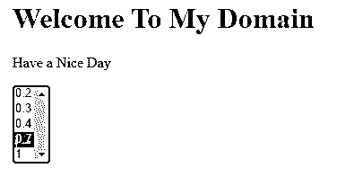

# CSS 字体平滑

> 原文：<https://www.educba.com/css-font-smoothing/>




## CSS 字体平滑简介

CSS 字体平滑是用于设置和控制字体并在网页中显示它们的一个属性，主要取决于字体系列。此外，我们在所有类型的情况下使用的网页，它取决于客户的要求内速记属性是用于字体样式，字体变体，字体粗细，字体拉伸，字体大小，行高和字体系列。可用字体已经安装在字体系列中，并由浏览器定义。它也接受关键字值或任何内置值，如像素、%等格式。在这个主题中，我们将学习 CSS 字体平滑。

**语法和参数**

<small>网页开发、编程语言、软件测试&其他</small>

CSS 代码是使用样式标签与 html 页面一起编写的。我们可以遵循同样的规则和语法来定制更有吸引力的网页。例如，我们可以使用 font smooth 属性在网页中创建用户友好的字体，它使用了它们的属性、特性和具有用户指定值的元素。

```
<html>
<head>
<style>
.first
{
font-smooth: ; //it supports alpha-numeric format values and have some default font-families
}
</style>
</head>
<body>
---some html codes----
</body>
</html>
```

以上代码是初始化字体和对 css 样式表中的值使用 font-smooth 的基本语法。我们主要在字母和数字支持的值中使用，或者是关键字类型的值，或者是 css 代码中预定义的值。使用这些类型的支持值，我们可以称之为字体样式表中使用的参数或参数集。

### CSS 中的字体平滑是如何实现的？

任何关于 CSS 样式的代码，我们都使用了许多带有默认值的属性；它可以是文本、数字、特殊字符等。使用这些类型的值，我们可以启用其 css 属性的特定属性，以使表示更加用户友好。从业务角度来看，客户满意度非常重要。我们可以使用字体平滑元素属性来控制关于 html 页面中呈现的抗锯齿字体的 web 应用程序；此外，它还是基于 web 的应用程序、ID 或一些内置类的默认部分之一。

当我们基于像 font-smooth 这样的元素在 html 标签中使用 css 字体时，font-smooth 是 css 代码中用于计算正确放置在页面中的文本的默认和最广泛使用的属性之一，并且它在 css 样式中具有不同范围和呈现的更大的粗度和厚度，它有助于 CSS 样式代码中的元素，它主要用于 html 的标签中，因为

font-smooth 属性接受带有某些扩展格式(如像素、%)的 alpha 值和数值。这些是一些默认的扩展，这些值可以用于关键字类型的值或一些预定义类型的数值。例如，在 webkit 中，我们可以实现更多类似的属性，具有不同值的关键字，如-webkit-font-smoothing，根据用户需要，具有自动、无、抗锯齿和亚像素抗锯齿的数值类型值，范围在 100 到 900 之间。

如果假设关键字值是正常的，它映射到数值 400，值也是加粗的，它可能会变化。它映射到 700，以查看任何类型的效果值范围，而不是 400 或 700。字体与一些内置的字体一起使用，与那些指定的权重相匹配。因此，如果字体属性，它可能会使用一些子级属性的值范围和功能，如粗体等。它有 700 和正常有 400 个范围，版本有字体系列的一部分，无论浏览器将使用该范围。如果属性不可用，用户浏览器将自动更改粗体或正常版本。它不会模仿其他不可用的权重字体通常主要用于常规和轻型格式，以识别具有替代思想的网页的字体权重。

### CSS 字体平滑示例

下面提到了不同的例子:

#### 示例#1

**代码:**

```
<!DOCTYPE html>
<html>
<head>
<style>
#first {
font-smooth: auto;
font-smooth: never;
font-smooth: always;
font-smooth: 4em;
}
</style>
</head>
<body>
<h1>Welcome To My Domain</h1>
<p id="first">Have a Nice Day</p>
<select onchange="demo(this);" size="5">
<option>0.2
<option>0.3
<option>0.4
<option>0.7
<option selected="selected">1
</select>
</body>
</html>
```

**输出:**




#### 实施例 2

**代码:**

```
<!DOCTYPE html>
<html>
<head>
<title>Welcome To My Domain</title>
<style>
.first > div {
src: url('WWW.facebook.com');
font-family:'MutatorSans';
font-style: normal;
font-smooth: 6em;
}
div.second {
font-smooth: auto;
font-smooth: never;
font-smooth: always;
}
div.third {
font-weight: inherit;
text-transform: uppercase;
font: 1.5rem 'MutatorSans', sans-serif;
font-smooth: 2em;
}
div.four {
font: 80% sans-serif;
font-smooth: 3em;
}
div.five {
font: 13px/11px sans-serif;
font-smooth: 5em;
}
</style>
</head>
<body>
<div class="first">
<h3>Have a Nice day</h3>
<div class="second">Welcome</div>
<div class="third">Welcome</div>
<div class="four">Welcome</div>
<div class="five">Welcome</div>
</div>
<div class="first">
<h3>Welcome Users</h3>
<div class="second">
Have a nice Day
<p>Gud day</p>
</div>
<p><small>Welcome <code>To</code> My Domain</small></p>
</div>
</body>
</html>
```

**输出:**


#### 实施例 3

**代码:**

```
<!DOCTYPE html>
<html>
<head>
<title>Welcome To My Domain</title>
<style>
.first > div {
src: url('WWW.facebook.com');
font-family:'MutatorSans';
font-style: normal;
font-smooth: 6em;
}
div.second {
font-smooth: auto;
font-smooth: never;
font-smooth: always;
}
.img
{
opacity:0.8;
filter: alpha(opacity=1);
background-color: red;
padding: 11px;
font-smooth: 5em;
}
div.third {
font-weight: inherit;
text-transform: uppercase;
font: 1.5rem 'MutatorSans', sans-serif;
font-smooth: 2em;
}
</style>
</head>
<body>
<div class="first">
<h3>Have a Nice day</h3>
<div class="second">Welcome</div>
<div class="third">Welcome</div>
</div>

<p><small>Welcome <code>To</code> My Domain</small></p>
</div>
</body>
</html>
```

**输出:**


### 结论

font-smooth 属性用于控制和插入具有特殊功能的文本，如大小、长度和颜色，它将显示在网页中。网页在正确的位置页面中使用了字体值；它通常支持所有类型的浏览器。

### 推荐文章

这是一个 CSS 字体平滑的指南。这里我们讨论字体平滑是如何在 CSS 和例子中完成的，以及代码和输出。您也可以看看以下文章，了解更多信息–

1.  [CSS 栏](https://www.educba.com/css-column/)
2.  [CSS 新 rap](https://www.educba.com/css-nowrap/)
3.  [粘滞页脚 CSS](https://www.educba.com/sticky-footer-css/)
4.  [CSS 右边距](https://www.educba.com/css-margin-right/)


