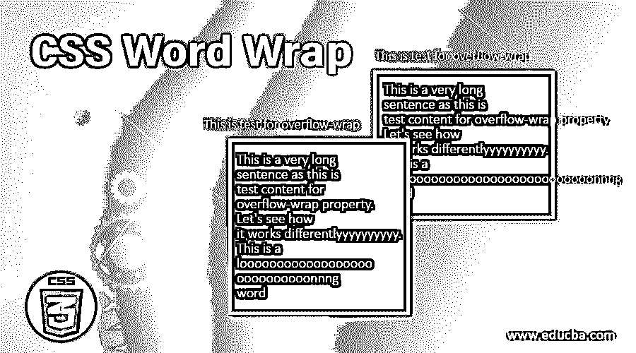
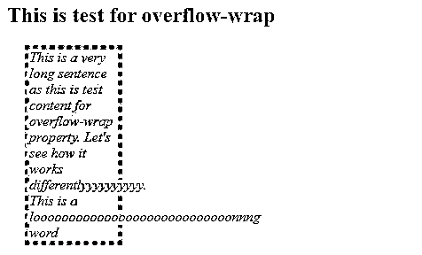
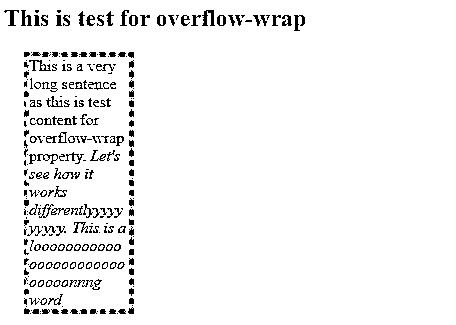
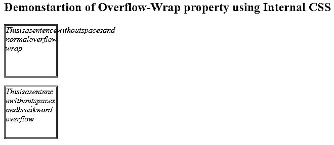

# CSS 自动换行

> 原文：<https://www.educba.com/css-word-wrap/>




## CSS 自动换行介绍

自动换行是一种使内容对用户可读的属性。换句话说，这是一个以这样一种方式分解单词的特性，即单词不会越过所定义的容器的边界。CSS Word Wrap 属性改编自微软提供的同名功能，其中，不是让用户水平滚动来阅读整个句子，而是将句子分成几个部分来适应窗口。word-wrap 属性后来被重命名为 overflow-wrap，但仍被用作别名。

****语法:****

<small>网页开发、编程语言、软件测试&其他</small>

```
overflow-wrap: normal| break-word;
```

### CSS 自动换行的示例

对于属性 overflow-wrap，如果我们正常使用参数值，那么，它将导致字符串在正常的分隔点断开，如句号、空格或逗号分隔符。如果我们使用断词，否则无法破解的单词将会被打破以适应容器。如果我们在一个页面上有多个容器，这个属性可以得到很好的利用。让我们来看看溢出包装属性的一些用法。

#### 示例# 1–演示溢出回绕的正常功能

*   当我们使用 normal 参数时，句子或字符串只在允许的间隔处断开，如逗号分隔、句号或单词间的空格。即使越过边界，它也不会破坏长单词。
*   我们将在这个例子中使用外部 CSS，因此我们将首先创建一个 CSS 文件。
*   我们将为元素定义样式，连同宽度、边距和其他属性，我们将定义溢出换行。CSS 元素样式应该如下所示:

**CSS 代码:**

```
div{
width: 100px;
margin: 20px;
background: palegoldenrod;
border: 5px dotted lightskyblue;
box-shadow: inset 10px 10px 15px 15px white;
font-style: italic;
overflow-wrap:normal;
}
```

*   既然定义了 CSS，我们接下来将创建 HTML 文件。这个例子使用了外部 CSS，因此我们将首先在 HTML 代码中调用相应的文件。
*   然后我们将编码页面的主体，这样我们就可以使用元素。通过这种方式，我们可以看到我们用来设置元素样式的所有属性的演示。代码应该如下所示:

**HTML 代码:**

```
<html>
<head>
<title>Testing for overflow-wrap</title>
<link rel = "stylesheet" href = "wrap.css">
</head>
<body>
<h2>This is test for overflow-wrap</h2>
<div>This is a very long sentence as this is test content for overflow-wrap property. Let's see how it works differentlyyyyyyyyyy. This is a loooooooooooooooooooooooooooonnng word</div>
</body>
</html>
```

可以通过保存 HTML 文件并通过浏览器打开它来观察输出。它应该如屏幕截图所示:

**输出:**




#### 示例 2–演示溢出换行的断字功能

*   当我们为 overflow-wrap 属性使用 break-word 参数时，它会断开长的或者不可断开的单词，以适应定义的容器。
*   像前面的例子一样，我们将使用外部 CSS。因此，我们将首先创建 CSS 文件。
*   我们将保留对元素的定义，并添加一个具有另一个溢出包装特性的类，这样我们就可以将它用于包含长单词的字符串。最终的 CSS 代码将类似于如下代码片段:

**CSS 代码:**

```
div{
width: 100px;
margin: 20px;
background: palegoldenrod;
border: 5px dotted lightskyblue;
box-shadow: inset 10px 10px 15px 15px white;
overflow-wrap:normal;
}
.class1{
font-style: italic;
overflow-wrap: break-word;
}
```

接下来，在创建 HTML 文件时，我们将首先调用 CSS 文件。然后我们将对主体进行编码，使得既有

元素又使用 class1 类。最终的 HTML 代码应该如下所示:

**HTML 代码:**

```
<html>
<head>
<title>Testing for overflow-wrap</title>
<link rel = "stylesheet" href = "wrap.css">
</head>
<body>
<h2>This is test for overflow-wrap</h2>
<div>This is a very long sentence as this is test content for overflow-wrap property.
<em class="class1"> Let's see how it works differentlyyyyyyyyyy. This is a loooooooooooooooooooooooooooonnng word</em>
</div>
</body>
</html>
```

当通过浏览器编译和查看时，此代码将给出以下输出:

**输出:**




这里我们可以清楚地看到，通过使用断词参数，我们能够通过将长词包装在容器中来适应它们。

#### 示例 3——使用内部 CSS 进行溢出包装

*   我们将在这个例子中使用内部 CSS，也就是说，我们将在为 HTML 页面编码时使用
*   我们将首先打开基本的 HTML 标签，如、、等，这样我们就有了页面的基本结构。
*   现在在标签中，我们将打开一个样式标签，并为元素编写我们需要的样式。样式标签的编码可以类似于此:

**CSS 代码:**

```
<style>
p{
height: 100px;
width: 100px;
margin: 10px, 10px, 10px, 10px;
border: double blue;
}
.c1{
font-style: italic;
overflow-wrap: normal;
}
.c2{
font-style: oblique;
overflow-wrap: break-word;
}
</style>
```

我们将定义使用段落元素和样式标签中定义的两个类的主体。代码可以参考下面的代码片段:

**HTML 代码:**

```
<html>
<head>
<title>Demo for Overflow-wrap</title>
<style>
p{
height: 100px;
width: 100px;
margin: 10px, 10px, 10px, 10px;
border: double blue;
}
.c1{
font-style: italic;
overflow-wrap: normal;
}
.c2{
font-style: oblique;
overflow-wrap: break-word;
}
</style>
</head>
<body>
<h2>Demonstartion of Overflow-Wrap property using Internal CSS</h2>
<p class="c1">Thisisasentencewithoutspacesand normaloverflow-wrap</p>
<p class="c2">Thisisasentencewithoutspacesandbreakwordoverflow</p>
</body>
</html>
```

当通过 web 浏览器编译和打开时，该代码将给出期望的输出。它将给出以下输出:

**输出:**




### 结论

通过上面的三个例子，我们演示了溢出换行或自动换行属性的基本用法。请注意，由于它们都是别名，我们可以将属性用作自动换行或溢出换行。这两种语法都将满足代码，并且不会产生运行时问题。此外，在构建页面时，开发人员应该尝试将此属性与其他属性相结合。通过使用 box 结构，我们可以在页面上容纳比简单呈现更多的内容。每个元素的容器将占用有限的空间，自动换行将确保文本保留在相应容器的边界内。

### 推荐文章

这是一个 CSS 自动换行的指南。这里我们讨论 CSS 自动换行的介绍，以及不同的例子和代码实现。您也可以看看以下文章，了解更多信息–

1.  [CSS 填充](https://www.educba.com/css-padding/)
2.  [CSS 文本下划线](https://www.educba.com/css-text-underline/)
3.  [CSS 形状生成器](https://www.educba.com/css-shape-generator/)
4.  [CSS 阴影](https://www.educba.com/css-drop-shadow/)


