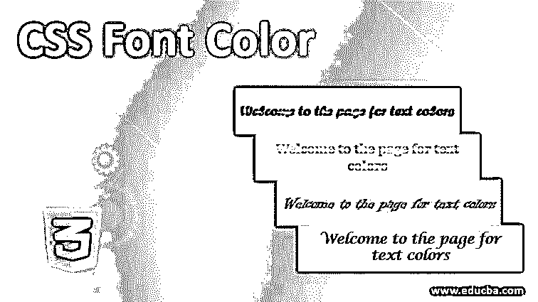
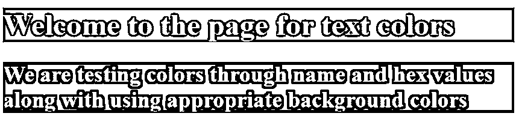
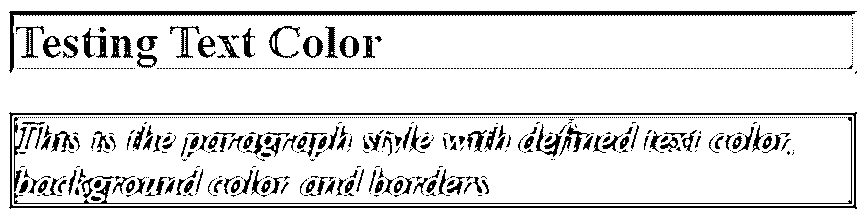
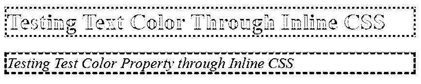

# CSS 字体颜色

> 原文：<https://www.educba.com/css-font-color/>




## CSS 字体颜色介绍

级联样式表或 CSS 是关于开发者如何向用户展示他的页面。人们必须知道什么会吸引最终用户使用合适的样式。设计页面样式的核心基础之一是决定配色方案。配色方案应该非常仔细地选择。谁是最终受众，应该是优先考虑的问题。选择文本颜色也属于同样的方案。文本有许多可以通过 CSS 决定的属性，颜色就是其中之一。然而，在决定字体的颜色时，我们必须选择适合它的背景色。白底粉彩字体有什么用？.这对用户来说会很费力，而且很可能会离开页面。

### 文本颜色语法和用途

可以使用 color 属性设置文本的颜色。这可以为 HTML 元素、id 和类声明。这将是一个好主意，设置背景颜色。文本颜色的语法如下:

<small>网页开发、编程语言、软件测试&其他</small>

```
color: Color Name / Hex Value/ RGB Value
```

虽然颜色名称仅提供少数选项，但后两个参数，即十六进制值和 RGB 值提供了更广泛的选项，用户可以从颜色的各种色调和阴影中进行选择。这些值可以在互联网上查看，并用于设计各个元素的样式。该属性的全局值是 initial 和 inherit。initial 将文本的颜色设置为默认颜色，inherit 将文本的颜色设置为父元素中的颜色。

### CSS 中字体颜色的例子

让我们看看下面的例子，看看文本颜色属性是如何工作的:

#### 1.使用不同类型的参数设置文本颜色

*   在本例中，我们将使用不同类型的值，即颜色名称、十六进制值或 RGB 值来设置各种元素的颜色。我们将使用外部样式表，所以我们将首先创建 CSS 文件。
*   我们将首先定义标题元素的测试颜色，即

    # 。我们将定义背景颜色，以保持字体颜色的可见性与背景同步。代码应该类似于:

```
h1{
color: cornflowerblue;
background-color:#8b008b  ;
}
```

*   类似于上面的代码片段，我们将为一个类设置字体颜色和背景颜色。这个想法是，任何元素在需要时都可以使用这种配色方案。它应该编码如下:

```
.cls1{
color: rgb(220, 20, 60);
background-color: #000000;
}
```

*   正如我们所看到的，代码具有所有三种类型的值，即十六进制值(#000000 代表黑色)、RGB 值(rgb(220，20，60)代表深红色)和颜色名称(cornflowerblue)。结合这两个片段，我们将得到最终的 CSS 文件:

**CSS 代码:**

```
h1{
color: cornflowerblue;
background-color:#8b008b  ;
}
.cls1{
color: rgb(220, 20, 60);
background-color: #000000;
}
```

*   接下来，我们将编写一个 HTML 页面。请注意，我们将使用单独创建的 CSS 文件[,因此我们将通过 HTML 页面调用该表单。](https://www.educba.com/css-drop-shadow/)
*   我们将以同时使用

    # 和 cls1 的方式对页面进行编码。代码应该类似于:

**HTML 代码:**

```
<html>
<head>
<title>Testing Text Color</title>
<link rel = "stylesheet" href = "color.css">
</head>
<body>
<h1>Welcome to the page for text colors</h1>
<h2 class="cls1">We are testing colors through name and hex values along with using appropriate background colors</h2>
</body>
</html>
```

*   保存 html 文件并在浏览器中打开，结果应该如下所示:

**输出:**




#### 2.使用内部 CSS 的文本颜色演示

*   对于这个例子，我们将使用内部 CSS，即在我们的 HTML 代码中，我们将在样式标签<stlyle>中包含样式定义。我们将从创建一个 html 文件开始。在标签中，我们将定义</stlyle>

**CSS 代码:**

```
<style>
.colCls{
color: darkolivegreen;
font-size: 30px;
background-color:lightcoral;
border-style: inset;
border-color: rgb(255, 182, 193);
}
p{
color: #ff8c00 ;
font-style: italic;
font-size: 25px;
background-color: dimgrey;
border-color: goldenrod;
border-style: double;
}
</style>
```

*   接下来，在 body 标签中，我们将使用通过内部 CSS 样式化的类和元素。最终的 html 代码应该是这样的:

**HTML 代码:**

```
<html>
<head>
<title>Text color using internal CSS</title>
<style>
.colCls{
color: darkolivegreen;
font-size: 30px;
background-color:lightcoral;
border-style: inset;
border-color: rgb(255, 182, 193);
}
p{
color: #ff8c00 ;
font-style: italic;
font-size: 25px;
background-color: dimgrey;
border-color: goldenrod;
border-style: double;
}
</style>
</head>
<body>
<h1 class="colCls">Testing Text Color</h1>
<p>This is the paragraph style with defined text color, background color and borders.</p>
</body>
</html>
```

*   保存该文件并通过浏览器打开，将得到以下输出:

**输出:**




#### 3.使用内联 CSS 的文本颜色演示

*   对于这个例子，我们将使用 style 参数定义标签中元素的样式。HTML 文件的编码应该如下所示:

**HTML 代码:**

```
<html>
<head>
<title>Text color using internal CSS</title>
</head>
<body>
<h1 style="color: darkolivegreen; font-size: 30px; background-color:lightseagreen; border-style: dotted;
border-color:lightskyblue;">Testing Text Color Through Inline CSS</h1>
<p  style="color:forestgreen ;font-style: italic; font-size: 20px; background-color: lightcoral;
border-color: firebrick; border-style: dashed;">Testing Test Color Property through Inline CSS</p>
</body>
</html>
```

*   元素

    # (标题)和

    (段落)使用内联 CSS 样式化。代码的输出应该类似于下面的屏幕截图:

**输出:**




上面的三个例子解释了如何为文本设置颜色，并使其与背景和边框颜色相协调。正如我们在上面的例子中所讨论的，这可以通过外部、内部以及内联 CSS 来实现。像往常一样，总有余地对其他属性组合进行任何进一步的实验。请注意，文本颜色的选择应该让用户感觉舒服。需要的时候应该是华丽的，否则应该是含蓄的。

### 推荐文章

这是一个 CSS 字体颜色的指南。在这里，我们讨论了介绍和文本颜色的语法和使用，以及不同的例子和它的代码实现。您也可以阅读以下文章，了解更多信息——

1.  [CSS 填充](https://www.educba.com/css-padding/)
2.  [CSS 位置](https://www.educba.com/css-position/)
3.  [CSS 形状生成器](https://www.educba.com/css-shape-generator/)
4.  [CSS 内边框](https://www.educba.com/css-inner-border/)


