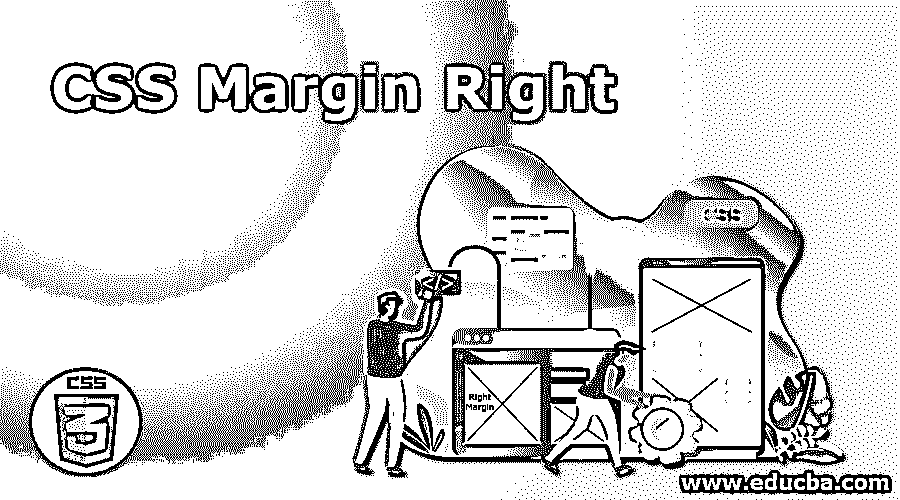
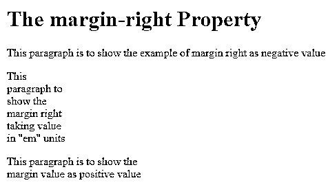
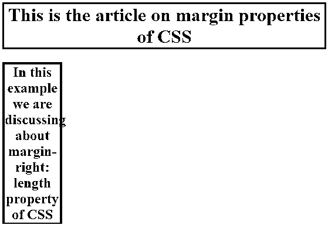
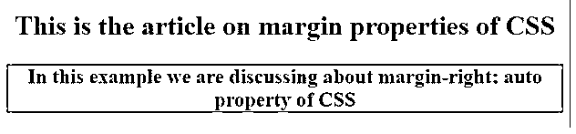
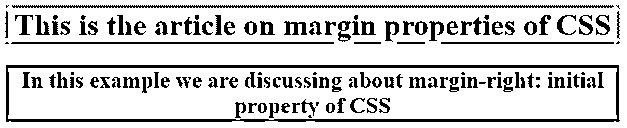

# CSS 右边距

> 原文：<https://www.educba.com/css-margin-right/>




## 什么是 CSS 边距对？

在 CSS 中，margin-right 是设置元素右侧边距的属性，该属性用于设置元素的右边部分或页面的右边框。此属性也不支持负值，它可以将任何正数作为值，并将“零”作为默认值。

### CSS 边距权限属性的功能

CSS 的 margin 属性用于设置页面元素或边框周围的空间。边距设置清除元素周围的空间，通常在边框之外。CSS 的 margin 属性有元素的值，它们是上边距、下边距、左边距、右边距。

<small>网页开发、编程语言、软件测试&其他</small>

**语法**

```
Margin-right: margin_value;
```

*   margin_value 可以是长度、百分比、自动、初始或继承。

一般来说，这种右边距属性具有很少的负值、正值等值，如下所示。

#### 例子

```
<!DOCTYPE html>
<html>
<head>
<style>
p.ex1 {
margin-right: -4px;
}
p.ex2 {
margin-right: 35em;
}
p.ex3 {
margin-right: 450px;
}
</style>
</head>
<body>
<h1>The margin-right Property</h1>
<p class ="ex1"> This paragraph is to show the example of margin right as negative value </p>
<p class="ex2"> This paragraph to show the margin right taking value in "em" units </p>
<p class ="ex3">This paragraph is to show the margin value as positive value</p>
</body>
</html>
```

**输出**




在上面的程序中，我们首先将第一段声明为负值，其右侧为-4px 像素，我们将某个长度值声明为 35em，这将把该段写在右侧，类似地，第三段作为正值，其右侧为元素或页面的 450 px 像素。

### CSS 右边距示例

让我们用例子来看看上面 margin-right 的 margin 值。

#### 1.长度

该值用于设置 margin-right 的边距值，margin-right 用于设置固定值，其单位为像素(px)、厘米(cm)、磅(pt)等。这个属性允许我们设置负值，默认值为零。

**语法:**

```
margin-right : length;
```

**例子**

```
<!DOCTYPE html>
<html>
<head>
<title>
Educba Training
</title>
<style>
h1 {
margin-right: 100px;
border:3px solid red;
}
h2 {
margin-right:550px;
border:4px solid blue;
}
</style>
</head>
<body style = "text-align:center">
<h1> This is the article on margin properties of CSS </h1>
<h2> In this example we are discussing about margin-right: length property of CSS</h2>
</body>
</html>
```

**输出**

**

** 

#### 2.百分率

这是 margin-right 属性的边距值，相对于包含文本块的元素的宽度。该属性值以百分比形式指定。

**语法**

```
margin-right: margin value in percentage;
```

**例子**

```
<!DOCTYPE html>
<html>
<head>
<style>
p.ex1 {
margin-right: 80%;
}
</style>
</head>
<body>
<h1>The margin-right : percentage value Property</h1>
<p>This is the article on margin properties of CSS </p>
<p class="ex1">In this example we are discussing about margin-right: percentage value property of CSS</p>
<p>This example is about how we specify the value of 80%</p>
</body>
</html>
```

**输出**

在上面的程序中，我们指定 margin-right 为 80%,只有该段落将被写在元素右侧的 80%,因此您可以在上面的截图中看到输出。


#### 3.汽车

该属性值由浏览器本身设置，这意味着它在需要时使用，并由浏览器本身计算。

**语法**

```
margin-right: auto;
```

**例子**

```
<!DOCTYPE html>
<html>
<head>
<title>
Educba Training
</title>
<style>
h1 {
margin-right: auto;
border:5px solid yellow;
}
h2 {
margin-right:auto;
border:1px solid green;
}
</style>
</head>
<body style = "text-align:center">
<h1> This is the article on margin properties of CSS </h1>
<h2> In this example we are discussing about margin-right: auto property of CSS </h2>
</body>
</html>
```

**输出**

在上面的程序中，我们可以看到我们用黄色设置了 5px 的边框，用绿色设置了 1 px 的边框。




#### 4.最初的

此属性用于将右边距值设置为其默认值。

**语法**

```
margin-right : initial;
```

**例子**

```
<!DOCTYPE html>
<html>
<head>
<title>
Educba Training
</title>
<style>
h1 {
margin-right: initial;
border:2px solid pink;
}
h2 {
margin-right:initial;
border:3px solid orange;
}
</style>
</head>
<body style = "text-align:center">
<h1> This is the article on margin properties of CSS </h1>
<h2> In this example we are discussing about margin-right: initial property of CSS </h2>
</body>
</html>
```

**输出**




在上面的程序中，我们将初始值声明为 margin-right 值，我们将边界设置为 2px(粉红色)和 3px(橙色)。

在本文中，我们还将 inherit 作为 margin-right 属性的一个值，该值实际上是从其父元素继承的。

### 结论

CSS 的 margin-right 属性也有不同的值，例如长度，它可以有正值或负值，单位有像素(px)、厘米(cm)、em 等，auto 用于设置所需的值，初始值用于设置默认值，inherit values 用于从其父元素继承值。如果未指定上述任何值，则该属性的默认值为零像素。

### 推荐文章

这是一个 CSS 页边空白的指南。在这里，我们讨论一个关于 CSS 页边空白权利和它的不同例子以及它的代码实现的简要概述。您也可以浏览我们推荐的其他文章，了解更多信息——

1.  [CSS 滚动条](https://www.educba.com/css-scrollbar/)
2.  [CSS 动画过渡](https://www.educba.com/css-animation-transition/)
3.  [CSS 过渡效果](https://www.educba.com/css-transition-effects/)
4.  [CSS Clearfix](https://www.educba.com/css-clearfix/)


