# CSS 颜色代码

> 原文：<https://www.educba.com/css-color-codes/>

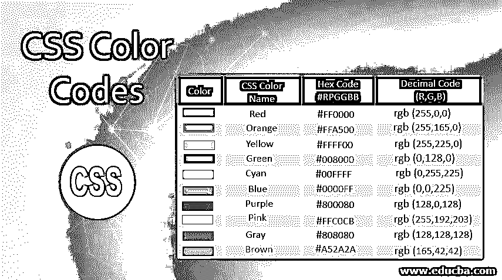


## CSS 颜色代码介绍

在 CSS 颜色代码通过使用十六进制值和十进制值给出不同的颜色。默认情况下，每种颜色都有自己的十六进制值。一般情况下，我们只是简单地直接提到颜色名称。但是在 CSS 程序里面，这些颜色以十六进制格式给出，并给出想要的颜色。十六进制颜色值包含 0 到 9 个数字和 A 到 F 个字符。十进制值包含 0 到 255 个数字。

**1。**十六进制值必须后跟哈希(#)。

<small>网页开发、编程语言、软件测试&其他</small>

```
background: #ffff;
```

**2。**十进制值可以带 RGB 属性。

```
background: rgb(255,0,0);
```

**场景:**当我们想用淡红色或淡蓝色或介于 40%以上的红色或蓝色之间的颜色时。在这种情况下，我们不能给 40%的红色或 40%的蓝色赋值。我们必须指定其等效的颜色代码。所以，这种情况下颜色代码非常有用。

### CSS 中颜色代码是如何工作的？

下面我们展示颜色代码是如何工作的:

#### 1.十六进制颜色代码

正如我们所讨论的，十六进制色码包含 0 到 9 个数字和 A 到 F 个字符。这些十六进制颜色由 CSS 处理器处理，并给出相应的颜色。

**语法#1**

```
div
{
background: #ffff;
}
```

**解释:**这个十六进制值给出了背景颜色。

**语法#2**

```
div
{
color: #ffff;
}
```

**解释:**这个十六进制值赋予文本颜色。

#### 2.十进制色码

如我们所讨论的，十进制色码采用 0-255 个数字。这些十进制颜色由 CSS 处理器处理，并给出相应的颜色。

**语法#3**

```
div
{
background: rgb(255,0,0);
}
```

**说明:**这个十进制数值给出了一个背景色。

**语法#4**

```
div
{
color: rgb(255,0,0);
}
```

**解释:**这个十进制值赋予文本颜色。

### 为什么 RGB 只有三个值？

RGB 的意思是红绿蓝。这三种是原色。我们知道所有的颜色都是由这三种颜色混合而成的。所以，我们只取这 3 个值。

十六进制和十进制值可以应用于以下属性

*   背景
*   颜色
*   边境

### 实现 CSS 颜色代码的示例

下面是实现相同功能的示例:

#### 示例#1

使用十六进制代码来背景色

**代码:**

```
<!DOCTYPE html>
<html>
<head>
<title>Color Code</title>
</head>
<style>
.header {
text-align: center;
color: #FF0000; /* red color */
}
.p1 {
background: #00FFFF; /* cyan color */
border: 2px solid;
padding: 5px;
text-align: justify;
}
.p2 {
background: #0000FF; /* blue color */
border: 2px solid;
padding: 5px;
text-align: justify;
}
.p3 {
background: #0000A0; /* dark blue color */
border: 2px solid;
padding: 5px;
text-align: justify;
}
.p4 {
background: #ADD8E6; /* light blue color */
border: 2px solid;
padding: 5px;
text-align: justify;
}
.p5 {
background: #800080; /* purple  color */
border: 2px solid;
padding: 5px;
text-align: justify;
}
.p6 {
background: #FFFF00; /* yellow color */
border: 2px solid;
padding: 5px;
text-align: justify;
}
.p7 {
background: #00FF00; /* lime color */
border: 2px solid;
padding: 5px;
text-align: justify;
}
.p8 {
background: #FF00FF     ; /* magenta color */
border: 2px solid;
padding: 5px;
text-align: justify;
}
.p9 {
background: #FFFFFF; /* white color */
border: 2px solid;
padding: 5px;
text-align: justify;
}
.p10 {
background: #C0C0C0; /* silver color */
border: 2px solid;
padding: 5px;
text-align: justify;
}
</style>
<body>
<h2 class="header">Background Colors with Hexadecimal Color Code</h2>
<p class="p1">Hi, I am color code background color. I can also
generate color.</p>
<p class="p2">Hi, I am color code background color. I can also
generate color.</p>
<p class="p3">Hi, I am color code background color. I can also
generate color.</p>
<p class="p4">Hi, I am color code background color. I can also
generate color.</p>
<p class="p5">Hi, I am color code background color. I can also
generate color.</p>
<p class="p6">Hi, I am color code background color. I can also
generate color.</p>
<p class="p7">Hi, I am color code background color. I can also
generate color.</p>
<p class="p8">Hi, I am color code background color. I can also
generate color.</p>
<p class="p9">Hi, I am color code background color. I can also
generate color.</p>
<p class="p10">Hi, I am color code background color. I can also
generate color.</p>
</body>
</html>
```

**输出:**

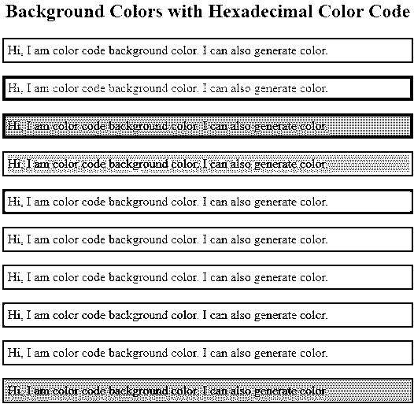


#### 实施例 2

使用十六进制代码来文本颜色

**代码:**

```
<!DOCTYPE html>
<html>
<head>
<title>Color Code</title>
</head>
<style>
.header {
text-align: center;
color: #808080; /* gray color */
}
.p1 {
color: #000000; /* black color */
border: 2px solid;
padding: 5px;
text-align: justify;
}
.p2 {
color: #FFA500; /* orange color */
border: 2px solid;
padding: 5px;
text-align: justify;
}
.p3 {
color: #A52A2A; /* brown blue color */
border: 2px solid;
padding: 5px;
text-align: justify;
}
.p4 {
color: #800000; /* maroon color */
border: 2px solid;
padding: 5px;
text-align: justify;
}
.p5 {
color: #008000; /* green  color */
border: 2px solid;
padding: 5px;
text-align: justify;
}
.p6 {
color: #808000; /* olive color */
border: 2px solid;
padding: 5px;
text-align: justify;
}
.p7 {
color: #008080; /* teal color */
border: 2px solid;
padding: 5px;
text-align: justify;
}
.p8 {
color: #E238EC  ; /* crimson color */
border: 2px solid;
padding: 5px;
text-align: justify;
}
.p9 {
color: #34282C; /* charcoal color */
border: 2px solid;
padding: 5px;
text-align: justify;
}
.p10 {
color: #000080; /* navy blue color */
border: 2px solid;
padding: 5px;
text-align: justify;
}
</style>
<body>
<h2 class="header">Text Colors with Hexadecimal Color Code</h2>
<p class="p1">Hi, I am color code background color. I can also
generate color.</p>
<p class="p2">Hi, I am color code background color. I can also
generate color.</p>
<p class="p3">Hi, I am color code background color. I can also
generate color.</p>
<p class="p4">Hi, I am color code background color. I can also
generate color.</p>
<p class="p5">Hi, I am color code background color. I can also
generate color.</p>
<p class="p6">Hi, I am color code background color. I can also
generate color.</p>
<p class="p7">Hi, I am color code background color. I can also
generate color.</p>
<p class="p8">Hi, I am color code background color. I can also
generate color.</p>
<p class="p9">Hi, I am color code background color. I can also
generate color.</p>
<p class="p10">Hi, I am color code background color. I can also
generate color.</p>
</body>
</html>
```

**输出:**

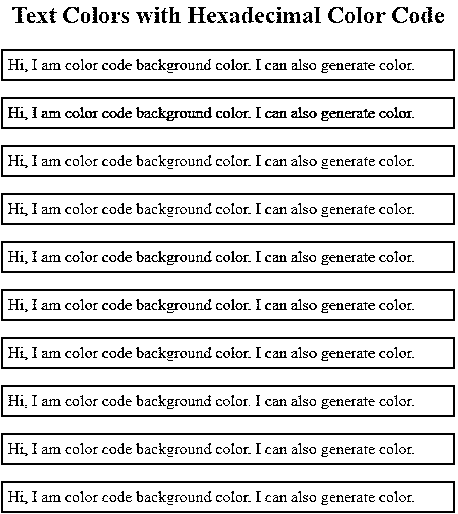


#### 实施例 3

使用十进制(RGB)代码作为边框

**代码:**

```
<!DOCTYPE html>
<html>
<head>
<title>Color Code</title>
</head>
<style>
.header {
text-align: center;
color: rgb(218, 165, 32) /* golden rod color */
}
.p1 {
border: 5px solid rgb(244, 164, 96); /* sandy brown color */
padding: 5px;
}
.p2 {
border: 5px solid rgb(245, 222, 179); /* wheat color */
padding: 5px;
}
.p3 {
border: 5px solid rgb(47, 79, 79); /* dark slate gray color */
padding: 5px;
}
.p4 {
border: 5px solid rgb(245, 245, 220); /* beige color */
padding: 5px;
}
.p5 {
border: 5px solid rgb(240, 255, 240); /* honey dew color */
padding: 5px;
}
.p6 {
border: 5px solid rgb(199, 21, 133); /* medium violet red color */
padding: 5px;
}
.p7 {
border: 5x solid rgb(0,255,127); /* spring green color */
padding: 5px;
}
.p8 {
border: 5px solid rgb(75, 0, 130); /* indigo color */
padding: 5px;
}
.p9 {
border: 5px solid rgb(255, 0, 255); /* fuchsia color */
padding: 5px;
}
.p10 {
border: 5px solid rgb(30, 144, 255); /* dodger blue */
padding: 5px;
}
</style>
<body>
<h2 class="header">Border colors with decimal Color Code</h2>
<p class="p1"></p>
<p class="p2"></p>
<p class="p3"></p>
<p class="p4"></p>
<p class="p5"></p>
<p class="p6"></p>
<p class="p7"></p>
<p class="p8"></p>
<p class="p9"></p>
<p class="p10"></p>
</body>
</html>
```

**输出:**

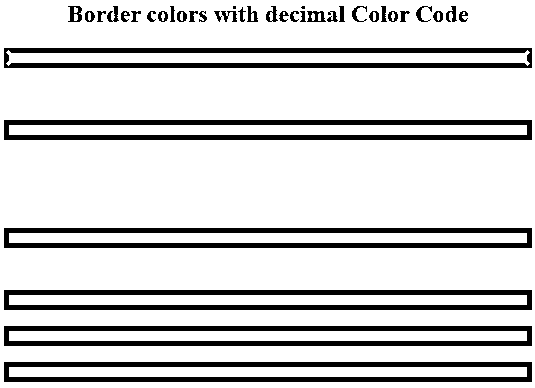


### 带有六进制和十进制代码的不同颜色

了解颜色以及六进制和十进制代码:

#### 1.红色


#### 2.橙色

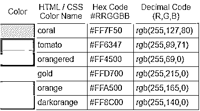


#### 3.黄色

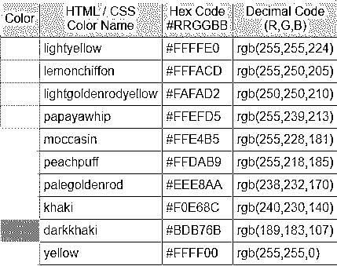


#### 4.绿色

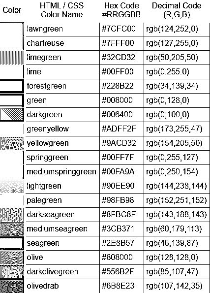


#### 5.青色

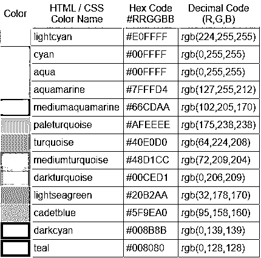


#### 6.蓝色

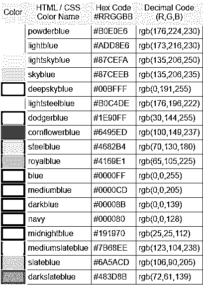


#### 7.紫色

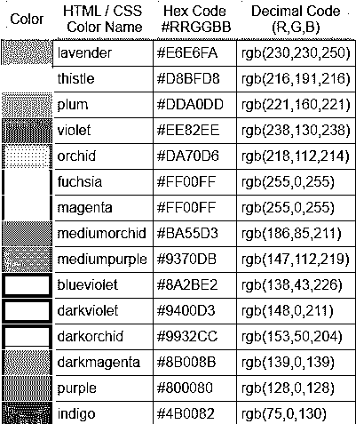


#### 8.粉色

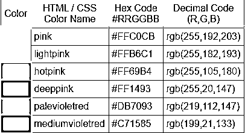


#### 9.白色

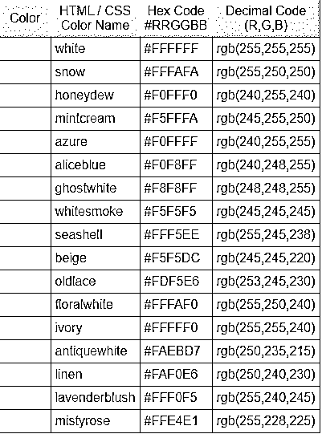


#### 10.灰色

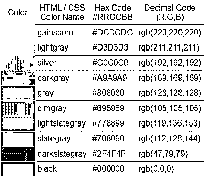


#### 11.棕色

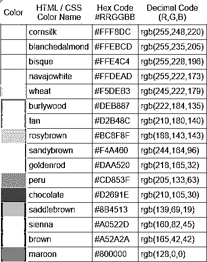


### 推荐文章

这是一个 CSS 颜色代码的指南。这里我们讨论什么是 CSS 中的颜色代码，它是如何工作的？以及相应的示例和输出。您也可以浏览我们的其他相关文章，了解更多信息——

1.  [CSS 形状生成器](https://www.educba.com/css-shape-generator/)
2.  [CSS 文本格式](https://www.educba.com/css-text-formatting/)
3.  [CSS 选择器的类型](https://www.educba.com/types-of-css-selectors/)
4.  [CSS 内联样式](https://www.educba.com/css-inline-style/)


