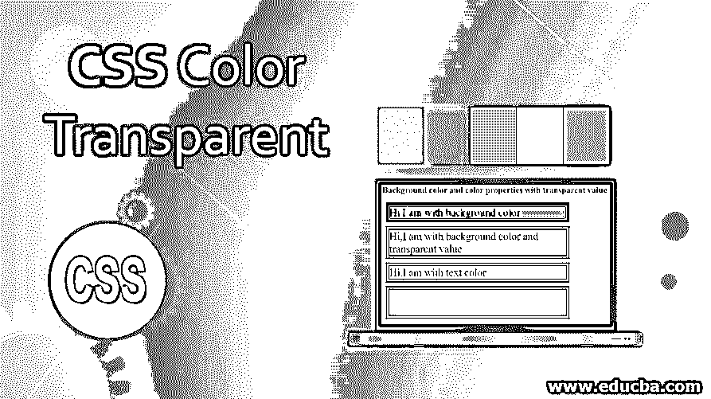
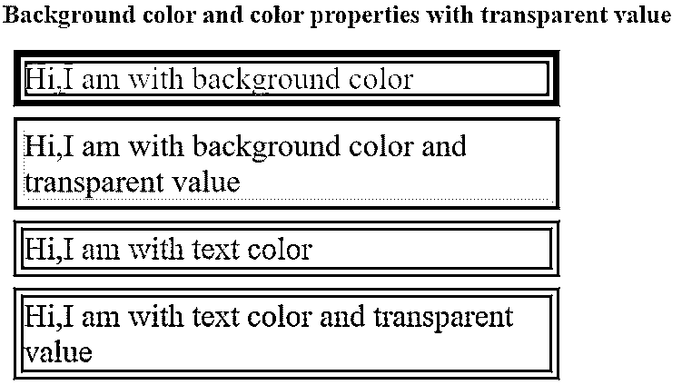
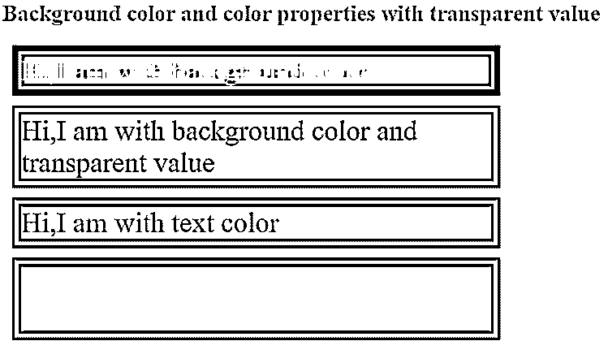
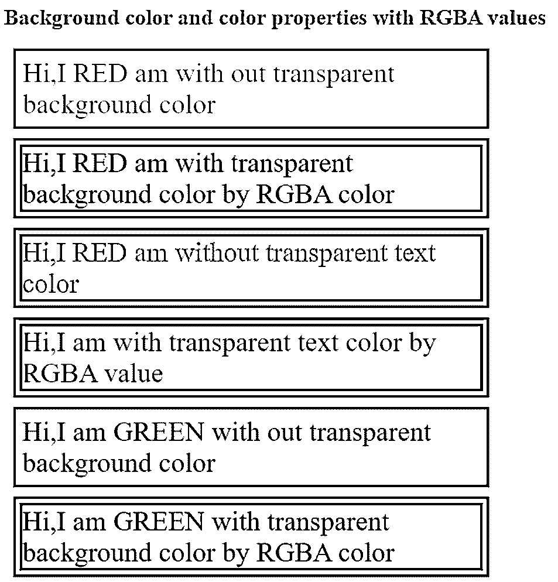
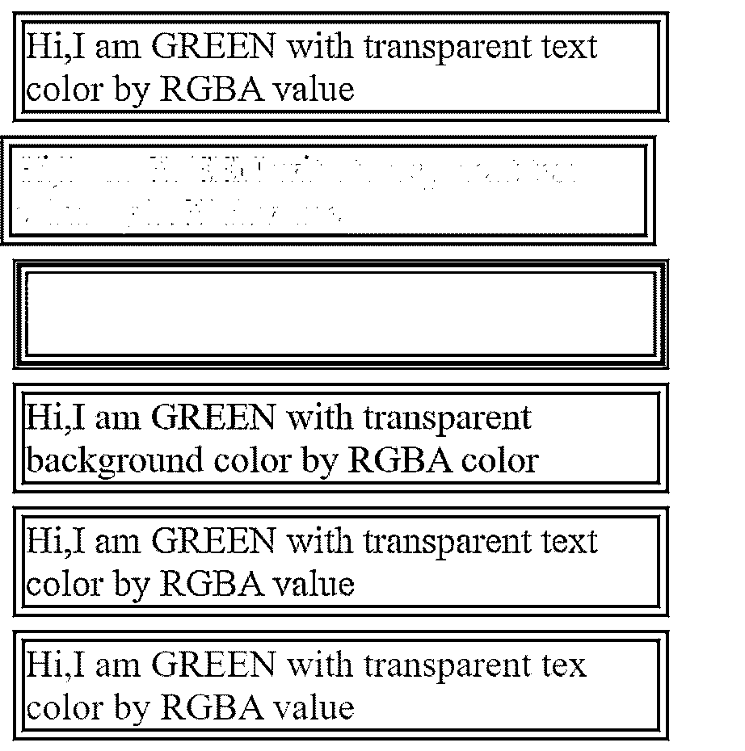
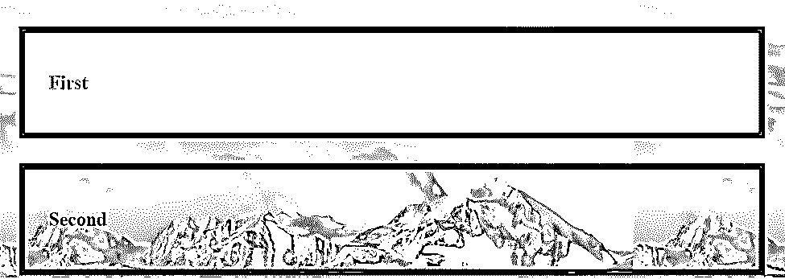

# CSS 颜色透明

> 原文：<https://www.educba.com/css-color-transparent/>




## CSS 颜色透明简介

CSS 中的透明色使背景元素从页面的另一个顶部元素中可见。透明色可以应用背景色属性和颜色。如果我们将背景色设为透明，那么它会使背景的背面元素完全可见。但是在实时应用中，我们不需要半透明的颜色。半透明特征可以通过具有背景颜色和颜色属性的 rgba 值来实现。

**实时使用:**如果客户希望他/她的页面背景颜色或文本颜色比实际颜色浅，或者如果他想从元素顶部看东西，那么我们使用透明背景颜色和带有 rgba 值的颜色属性。

<small>网页开发、编程语言、软件测试&其他</small>

### 透明色在 CSS 中是如何工作的？

正如我们所讨论的，透明色可以与背景色和颜色属性一起应用。

下面是给定的语法，

**语法 1:**

```
div
{
background-color: transparent;
}
```

背景色透明值使背景色完全透明(消失)

**语法 2:**

```
div
{
background-color: rgba(value1, value2, value3, value4);
}
```

*   **值 1:** 给出 0 到 255 或 0 到 100%之间的红色
*   **值 2:** 给出 0 到 255 或 0 到 100%之间的绿色
*   **值 3:** 给出 0 到 255 或 0 到 100%之间的蓝色
*   **Value4** :这是一个 alpha 参数，给出 0 到 1 之间的透明度。0 表示完全透明，1 表示完全不透明。

我们可以将背景色设置为具有所需可见性百分比的红色、绿色和蓝色。

**语法 3:**

```
div
{
color: transparent;
}
```

具有透明值的文本颜色使颜色完全透明(消失)。

**语法 4:**

```
div
{
color: rgba(value1, value2, value3, value4);
}
```

我们可以将文本的颜色设置为具有所需可见性百分比的红色、绿色和蓝色。

### CSS 颜色透明的例子

以下是 CSS 的示例:

#### 示例#1

背景颜色和具有透明值的颜色:

**HTML 代码:**

```
<!DOCTYPE html>
<html>
<head>
<meta charset="ISO-8859-1">
<link rel="stylesheet" href="BackgroundColorAndColorTransparent.css">
<title>Transparent Color</title>
</head>
<body>
<font color="green" style=""><h2>Background color and color
properties with transparent value</h2></font>
<div class="topBColor">Hi,I am with background color</div>
<div class="tBColor">Hi,I am with background color and
transparent value</div>
<div class="topColor">Hi,I am with text color</div>
<div class="tColor">Hi,I am with text color and transparent value</div>
</body>
</html>
```

**CSS 代码:**

```
.topBColor {
font-size: 30px;
width:500px;
background-color: blue;
margin:10px;
border: 10px double brown;
}
.tBColor {
font-size: 30px;
width:500px;
background-color: transparent;
margin:10px;
border: 10px double brown;
}
.topColor {
font-size: 30px;
width:500px;
color:brown;
margin:10px;
margin:10px;
border: 10px double brown;
}
.tColor {
font-size: 30px;
width:500px;
color:transparent;
margin:10px;
margin:10px;
border: 10px double brown;
}
```

**透明前输出:**




**透明后输出:**




**说明:**

在上面的代码中第一个和第三个<sup>和第</sup>段分别拍摄了背景和颜色属性而没有拍摄透明。所以，在最后的输出中，这 2 段输出是不能改变的。

而在第 2 段<sup>和最后一段</sup>中，背景色和颜色分别采用了透明。所以，在最后的输出中，这 2 段输出发生了变化。因为透明属性给出了 100%的透明度，所以第 2 <sup>和第 3</sup>段的背景色和最后一段的文字消失了。

#### 实施例 2

背景色和带有 rgba 值的颜色:

**HTML 代码:**

```
<!DOCTYPE html>
<html>
<head>
<meta charset="ISO-8859-1">
<link rel="stylesheet" href="BackgroundColorAndColorRGBA.css">
<title>Transparent Color</title>
</head>
<body>
<font color="brown" style=""><h2>Background color and color
properties with RGBA values</h2></font>
<div class="redB">Hi,I RED am with out transparent background color</div>
<div class="redBCR">Hi,I RED am with transparent  background color by RGBA color</div>
<div class="redC">Hi,I RED am without transparent text color</div>
<div class="redRC">Hi,I am with transparent text color by RGBA value</div>
<div class="greenB">Hi,I am GREEN with out transparent background color</div>
<div class="greenBCR">Hi,I am GREEN with transparent  background color by RGBA color</div>
<div class="greenC">Hi,I am GREEN with transparent text color by RGBA value</div>
<div class="greenRC">Hi,I am GREEN with transparent tex color by RGBA value</div>
<div class="blueB">Hi,I am GREEN with out transparent background color</div>
<div class="blueBCR">Hi,I am GREEN with transparent  background color by RGBA color</div>
<div class="blueC">Hi,I am GREEN with transparent text color by RGBA value</div>
<div class="blueRC">Hi,I am GREEN with transparent tex color by RGBA value</div>
</body>
</html>
```

**CSS 代码:**

```
.redB {
font-size: 30px;
width:500px;
background-color: red;
margin:10px;
border: 10px double brown;
}
.redBCR {
font-size: 30px;
width:500px;
background-color: rgba(255,0,0,0.4);
margin:10px;
border: 10px double brown;
}
.redC {
font-size: 30px;
width:500px;
color:red;
margin:10px;
border: 10px double brown;
}
.redRC {
font-size: 30px;
width:500px;
color:rgba(255,0,0,0.4);;
margin:10px;
border: 10px double brown;
}
.greenB {
font-size: 30px;
width:500px;
background-color: green;
margin:10px;
border: 10px double brown;
}
.greenBCR {
font-size: 30px;
width:500px;
background-color: rgba(0,255,0,0.4);;
margin:10px;
border: 10px double brown;
}
.greenC {
font-size: 30px;
width:500px;
color:green;
margin:10px;
border: 10px double brown;
}
.greenRC {
font-size: 30px;
width:500px;
color:rgba(0,255,0,0.4);;
border: 10px double brown;
}
.blueB {
font-size: 30px;
width:500px;
background-color: blue;
margin:10px;
border: 10px double brown;
}
.blueBCR {
font-size: 30px;
width:500px;
background-color: rgba(0,0,255,0.4);
margin:10px;
border: 10px double brown;
}
.blueC {
font-size: 30px;
width:500px;
color:brown;
margin:10px;
border: 10px double brown;
}
.blueRC {
font-size: 30px;
width:500px;
color:rgba(0,0,255,0.4);;
margin:10px;
border: 10px double brown;
}
```

**输出:**







**说明:**

在上面的例子中，背景色没有 rgba 属性值，背景色有 rgba 属性值。在上面的例子中，文本颜色没有 rgba 属性值，文本颜色有 rgba 属性值。上面的输出清楚地区分了如果我们将 rgba 值应用于背景色和颜色会发生什么。rgba 在 0 到 1 值之间改变颜色。0 表示完全透明，1 表示完全不透明。

#### 实施例 3

具有透明值的背景颜色使背景图像可见:

**HTML 代码:**

```
<!DOCTYPE html>
<html>
<head>
<meta charset="ISO-8859-1">
<link rel="stylesheet" href="BackgroundImageWithRGBA.css">
<title>Transparent Color</title>
</head>
<body>
<div>
<h1>First</h1>
</div>
<div class="second">
<h1>Second</h1>
</div>
</body>
```

**CSS 代码:**

```
body {
background: url("m1.jpg") aqua;
}
div {
background-color: gray;
border: 10px solid maroon;
padding: 40px;
margin: 40px;
}
.second {
background-color: transparent;
}
```

**输出:**




**说明:**

在上面的代码中，第一个标题是不透明的，因此背景部分不可见，但第二个标题是透明的，因此背景图像部分完全可见(透明表示 100%透明)。

### 结论

透明色可以应用背景色和颜色属性，透明色也可以通过 rgba 属性值来实现。

### 推荐文章

这是一个 CSS 颜色透明的指南。在这里，我们讨论介绍，透明色如何在 CSS 中工作，语法和输出的例子。您也可以浏览我们推荐的其他文章，了解更多信息——

1.  [CSS 填充](https://www.educba.com/css-padding/)
2.  [CSS 文本下划线](https://www.educba.com/css-text-underline/)
3.  [CSS 框尺寸](https://www.educba.com/css-box-sizing/)
4.  [CSS 位置](https://www.educba.com/css-position/)


