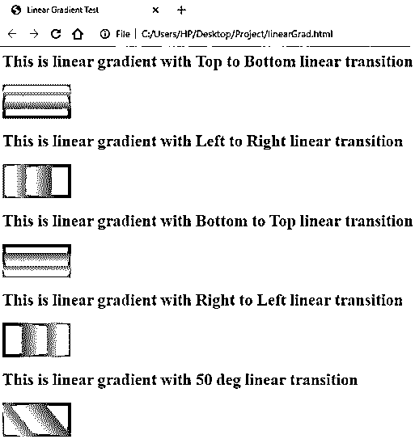
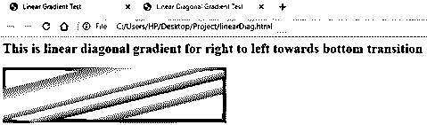
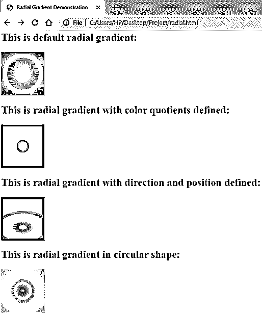

# CSS 梯度生成器

> 原文：<https://www.educba.com/css-gradient-generator/>


## CSS 渐变生成器简介

CSS 渐变是属于数据类型 image 的特性之一。CSS 渐变生成器用于两种或多种颜色之间的各种转换，因此，可以作为元素的背景。为了以一种更虚拟的方式来表达这个特性，渐变可以被定义为一个块，其中两种颜色按照开发人员希望的方式进行转换。

### CSS 渐变语法和类型

CSS 渐变主要有两种类型。第一种是线性梯度，第二种是径向梯度。使用线性渐变，可以确保两种或多种颜色的线性过渡，如水平、垂直等。另一方面，径向渐变以一个中心点和形状作为颜色的过渡。

<small>网页开发、编程语言、软件测试&其他</small>

*   下面是用于在 CSS 中创建线性渐变的语法:

```
background-image: linear-gradient(direction/angle, color1, color2, color3...)
```

*   在这里，开发者可以选择定义方向(向左、向下等)或者使用角度定制他们的渐变。
*   CSS 中的[径向渐变使用以下语法创建:](https://www.educba.com/radial-gradient-in-css/)

```
background-image: radial-gradient(shape/size 'at' position, color1, color2, color3...)
```

*   如果参数是成形的，那么它可以是圆形或椭圆形。如果参数是尺寸，那么有四个值可以使用，即最近边、最近角、最远边、最远角。

### CSS 渐变生成器示例

让我们看一些例子，学习 CSS 中渐变功能的使用。

#### 1.通过外部 CSS 实现两种颜色的线性渐变

*   我们将首先创建一个 CSS 文件，因为我们在这个例子中使用了外部样式。我们将创建具有不同梯度方向的 ID，以便可以展示所有的值。这些 ID 可以用下面的方式写。可以根据需要实现其他功能。

**代码:**

```
#linear1
{
height: 50px;
width: 100px;
background-image: linear-gradient(to bottom,  pink, purple );
}
```

*   此外，我们还可以添加一个 ID，使用角度而不是方向来定义两种颜色的过渡。语法如下:

**代码:**

```
#linearAngle
{
height: 50px;
width: 100px;
background-image: linear-gradient(50deg,  pink, purple );
}
```

*   最后，完整的 CSS 文件应该如下所示:(grad.css)

**代码:**

```
#linear1
{
height: 50px;
width: 100px;
background-image: linear-gradient(to bottom,  pink, purple );
}
#linear2
{
height: 50px;
width: 100px;
background-image: linear-gradient(to right,  pink, purple );
}
#linear3
{
height: 50px;
width: 100px;
background-image: linear-gradient(to top,  pink, purple );
}
#linear4
{
height: 50px;
width: 100px;
background-image: linear-gradient(to left,  pink, purple );
}
#linearAngle
{
height: 50px;
width: 100px;
background-image: linear-gradient(50deg,  pink, purple );
}
```

*   现在，我们将创建一个 HTML 页面。由于这是一个外部 CSS，我们将首先在页面的 header 部分调用 CS 文件。
*   此外，我们将通过不同的元素/块调用所有的 id。HTML 文件的编码如下:

**代码:**

```
<html>
<head>
<title>Linear Gradient Test</title>
<link rel = "stylesheet" href = "grad.css">
</head>
<body>
<h2>This is linear gradient with Top to Bottom linear transition</h2>
<div id="linear1"></div>
<h2>This is linear gradient with Left to Right linear transition</h2>
<div id="linear2"></div>
<h2>This is linear gradient with Bottom to Top linear transition</h2>
<div id="linear3"></div>
<h2>This is linear gradient with Right to Left linear transition</h2>
<div id="linear4"></div>
<h2>This is linear gradient with 50 deg linear transition</h2>
<div id="linearAngle"></div>
</body>
</html>
```

*   将此代码保存为 HTML 文件，并在浏览器中打开它，将获得类似于以下屏幕截图的结果:

**输出:**




#### 2.使用多种颜色的对角线过渡的线性渐变。

*   我们也可以使用多个方向来创建对角线渐变。
*   在这个例子中，我们将演示如何创建一个对角线过渡的线性渐变。我们将在这个演示中使用外部 CSS。
*   我们将为对角线渐变创建一个 CSS ID。我们可以使用两种以上的颜色来获得更好的过渡图像。最终的 CSS 文件应该类似于下面的代码:

**代码:**

```
#linearDiag
{
height: 100px;
width: 400px;
background-image: linear-gradient(to left bottom, indigo,blue, green, yellow, orange, red);
}
```

我们现在将创建一个 HTML 页面。一旦我们在头部分调用了外部 CSS 文件，我们将为主体部分编写代码，这样我们就可以使用在 CSS 文件中创建的 ID。最终的 HTML 代码应该如下所示:

**代码:**

```
<html>
<head>
<title>Linear Diagonal Gradient Test</title>
<link rel = "stylesheet" href = "grad.css">
</head>
<body>
<h2>This is linear diagonal gradient for right to left towards bottom transition</h2>
<div id="linearDiag"></div>
</body>
```

*   要获得输出，保存 HTML 文件并通过浏览器打开它。它应该类似于下面的截图:

**输出:**




#### 3.通过外部 CSS 使用三种颜色的径向渐变。

*   我们将在这个例子中使用外部样式，所以首先，我们将创建一个 CSS 文件。
*   在 CSS 文件中，我们将用不同的径向渐变参数集(位置、形状、颜色商等)编写不同的 id。最终的 CSS 代码应该如下所示:

**代码:**

```
#radi1
{
height: 100px;
width: 100px;
background-image: radial-gradient(yellow, orange, red);
}
#radi2
{
height: 100px;
width: 100px;
background-image: radial-gradient(yellow 5%, orange 10%, red 20%);
}
#radi3
{
height: 100px;
width: 100px;
background-image: radial-gradient(closest-corner at 50% 70%, green, blue, purple);
}
#radiCirc
{
height: 100px;
width: 100px;
background-image: radial-gradient(circle, red, yellow, orange);
}
```

*   我们将创建一个 HTML 文件，并在标题部分调用样式表。在 body 部分，我们将使用 CSS 代码中定义的每个 id 创建不同的块。HTML 应该类似于以下代码:

**代码:**

```
<html>
<head>
<title>Radial Gradient Demonstration</title>
<link rel = "stylesheet" href = "radial.css">
</head>
<body>
<h2>This is default radial gradient:</h2>
<div id="radi1"></div>
<h2>This is radial gradient with color quotients defined:</h2>
<div id="radi2"></div>
<h2>This is radial gradient with direction and position defined:</h2>
<div id="radi3"></div>
<h2>This is radial gradient in circular shape:</h2>
<div id="radiCirc"></div>
</body>
</html>
```

*   保存该文件并通过浏览器打开，将得到以下输出:

**输出:**




解释:上面的例子涵盖了 CSS 渐变的大部分基本用法。开发人员还有一个选择，他们可以多次重复定制线性渐变。这可以通过函数 repeating-linear-gradient()来实现。可以传递类似于线性梯度的参数，并获得重复的结果。

### 推荐文章

这是一个 CSS 渐变生成器的指南。在这里，我们讨论了 CSS 梯度发生器的基本概念和适当的代码和输出的例子。您也可以浏览我们的其他相关文章，了解更多信息——

1.  [CSS 文本下划线](https://www.educba.com/css-text-underline/)
2.  [CSS 位置](https://www.educba.com/css-position/)
3.  [CSS 列表](https://www.educba.com/css-lists/)
4.  [CSS 属性选择器](https://www.educba.com/css-attribute-selector/)


