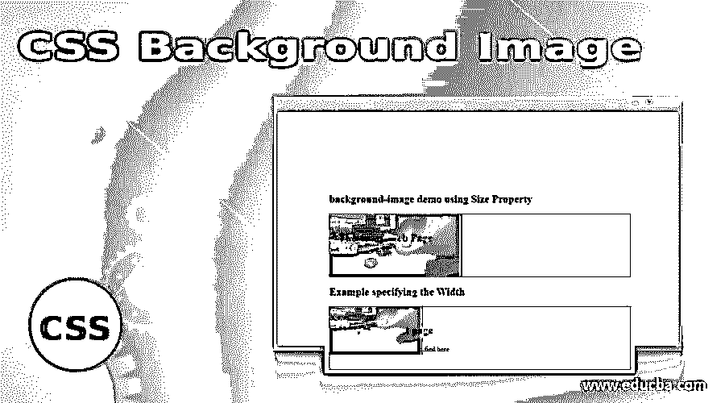
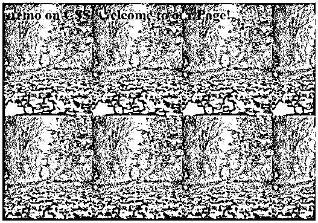
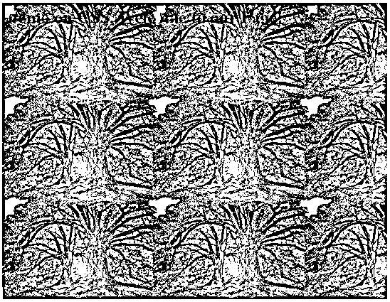
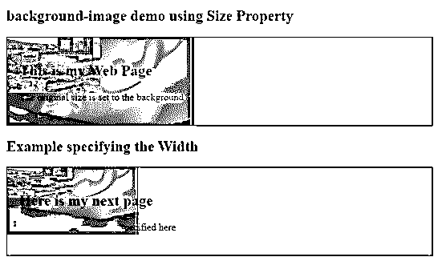
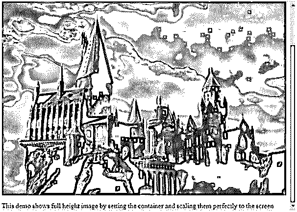
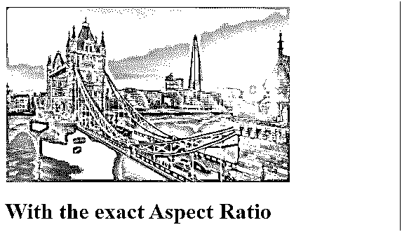
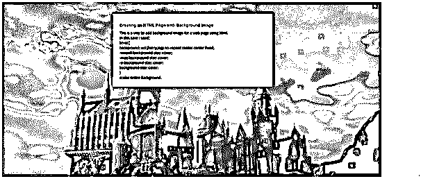

# CSS 背景图像

> 原文：<https://www.educba.com/css-background-image/>




## CSS 背景图像介绍

CSS 背景图像被定义为一个 CSS 属性来设置元素的背景图像。图像可以作为图形或元素的渐变来应用。这个属性在一个 HTML 页面中被赋值，并且可以通过阻塞元素和内联来实现。该属性的核心好处是它允许在页面顶部放置额外的 HTML 内容，如标题，还提供分层功能，以便我们可以选择在相同的可用空间内添加其他图像和文本内容。

**语法:**

<small>网页开发、编程语言、软件测试&其他</small>

```
background-image: url|none|initial|inherit;
```

背景图像有四个参数:

**URL:** 在页面中使用图像非常简单，只需使用 URL()值，它提供了图像的文件路径。我们还可以为 url()设置 URI。

### 如何使用各种方法在 CSS 中添加背景图片？

让我们看看背景图片是如何在 HTML 中包含一些方法的。

**1。使用内联 CSS:** 最简单和健壮的方法是使用带有< div >元素的背景图像属性。

**2。使用嵌入式 CSS:** 使用类或 Id 部分**引用。**

背景图像可以使用如下属性来执行:

*   **background-repeat:** 这个方法和 background-image 一起出现，并指定背景图像应该如何重复或不重复。它采用一些可能的值，如 no-repeat(不重复图像)、repeat-x(水平平铺图像)、repeat-y(垂直平铺图像)。
*   **背景-位置:**这最终指定了背景图像的位置，其值为上、下、右、左、中心以及这些值的组合(例如:左下)。水平和垂直值可以根据需要进行组合。
*   **背景尺寸:**指定要放置的图像的尺寸，并允许控制尺寸。以下是要分配给背景尺寸的值:
*   **自动:**这是默认值大小。
*   **length:** 允许以像素为单位指定图像的宽度和高度(10 px 30px)。
*   **覆盖:**完全缩放背景图像，使元素的某个区域被整个背景图像覆盖，通过缩放避免图像的某些部分。
*   **百分比:**以百分比指定图像的宽度和高度。(10 % 30%)
*   **中心:**将图像放置在中心。

背景图像不能是任何静态图像，我们也可以提供像动画 gif 运动图像。

### 实现 CSS 背景图像的例子

下面是 CSS 背景图片的例子:

#### 示例#1

本示例完全设置背景图像。

**代码:**

**back.html**

```
<html>
<head>
<style>
body {
background-image: url(background.jpg);
background-color: coral;
}
</style>
</head>
<body>
<h1>Demo on CSS. Welcome to our Page!</h1>
</body>
<html>
```

**输出:**




与改变图像的高度和宽度相同的代码。根据规范，原始图像在页面中被缩小。下面是设置为定义的像素的代码。

**代码:**

**ff.html**

```
<body>
<div class="dem1">

</div>
</body>
```

**代码:**

**ff.css**

```
.dem1{
width:900px;
height:300px;
margin:auto;
}
.dem2{
width:50%;
height:80%;
}
```

**输出:**
T3】


#### 实施例 2

设置两个背景图像。

**代码:**

```
<html>
<head>
<style>
body {
background-image: url(tenor.jpg), url(paper.jpg);
background-color: coral;
}
</style>
</head>
<body>
<h1>Demo on CSS. Welcome to our Page!</h1>
</body>
<html>
```

**输出:**




#### 实施例 3

指定背景需要图像属性，大小就像我们在#bg1 类下指定的那样。并在 body 上提供 CSS 部分，覆盖完整的 HTML 代码以适应窗口屏幕。

**代码:**

```
<!DOCTYPE html>
<html>
<head>
<style>
#bg1 {
border: 1px solid black;
padding: 20px;
background: url(wind.png);
background-repeat:no-repeat;
background-size: auto;
}
#bg2 {
border: 1px solid black;
padding: 20px;
background: url(wind.png);
background-repeat: no-repeat;
background-size: 500px 200px;
}
</style>
</head>
<body>
<h2>background-image demo using Size Property</h2>
<div id="bg1">
<h2>This is my Web Page</h2>
<p>The original size is set to the background</p>
</div>
<h2>Example specifying the Width</h2>
<div id="bg2">
<h2>Here is my next page</h2>
<p>Well, the dimensions are specified here</p>
</div>
</body>
</html>
```

**输出:**




#### 实施例 4

用位置设置全尺寸背景。

**代码:**

```
<!DOCTYPE html>
<html>
<head>
<h1> Full Background image </h1>
<meta name="viewport" content="width=device-width, initial-scale=1.1">
<style>
body, html {
height: 100%;
margin: 1;
}
.full {
background-image: url("harry.jpg");
height: 100%;
background-position: center;
background-repeat: no-repeat;
background-size: cover;
}
</style>
</head>
<body>
<div class="full"></div>
<p>This demo shows full-height image by setting the container and scaling them perfectly to the screen</p>
</body>
</html>
```

使用 CSS 时，我们必须通过设置属性 size 来覆盖，使图像适合屏幕。

**输出:**

**

** 

#### 实施例 5

使用具有边框属性的精确纵横比

**代码:**

**fit.html**

```
<!DOCTYPE html>
<html>
<head>
<script type="text/javascript" src="scripts.js">
</script>
<link rel="stylesheet" href="styles.css">
</head>
<body>
<div></div>
</body>
<h1> With the exact Aspect Ratio </h1>
</html>
```

**代码:**

**。css**

```
div {
width: 100%;
height: 250px;
background-image: url('https://www.cityam.com/wp-content/uploads/2020/02/London_Tower_Bridge_City.jpg');
background-repeat: no-repeat;
background-size: contain;
border: 2px solid yellow;
}
```

因此，当缩放图像以适合该区域时，原始图像不会模糊。下面是上面代码的结果。

**输出:**




#### 实施例 6

在背景图像上添加文本封面。

**代码:**

**fit.html**

```
<html>
<head>
<meta http-equiv="Content-Type" content="text/html; charset=utf-8" />
<title>Creating an HTML PAge with Background Image</title>
<style>
body {
font-family: "Calibri", cursive;
font-size: 14px;
color: #036;
}
h1,h2,h3 {
font-family: Arial,Comic Sans MS, sans-serif;
font-size: 14px;
font-weight: bold;
}
html {
background: url(harry.jpg) no-repeat centercenter fixed;
-webkit-background-size: cover;
-moz-background-size: cover;
-o-background-size: cover;
background-size: cover;
}
#desk { width: 500px; margin: 40px auto; padding: 22px; background: white; -moz-box-shadow: 0 0 22px black; -webkit-box-shadow: 0 0 22px black; box-shadow: 0 0 22px blue; }
</style>
<head>
<body>
<div id="desk">
<h1>Creating an HTML PAge with Background Image</h1>
This is a way to add background image for a web page using html. <br />
In this case I used:<br />
<strong>html</strong> {<br />
background: url (harry.jpg) no-repeat centercenter fixed;<br />
-webkit-background-size: cover;<br />
-moz-background-size: cover;<br />
-o-background-size: cover;<br />
background-size: cover;<br />
}<br />
scales entire Background. <br />
</div>
</body>
</html>
```

**输出:**




### 结论

因此，在本教程中，我们已经看到了一个简单的方法来使用 CSS 编码图像，我们还学习了图像如何适应屏幕。CSS 背景图片为网站提供了很好的功能，网页设计者对他们的主题感觉良好。因此，在这一节结束时，你将能够很好地定制作品。

### 推荐文章

这是一个 CSS 背景图片的指南。在这里，我们讨论一个 CSS 背景图片和它的不同例子及其代码实现的简要概述。您也可以浏览我们推荐的其他文章，了解更多信息——

1.  [CSS 在技术中的应用](https://www.educba.com/what-is-css/)
2.  [使用 CSS 命令的技巧和诀窍](https://www.educba.com/css-commands/)
3.  [CSS 的六大优势介绍](https://www.educba.com/advantages-of-css/)
4.  [CSS 页眉设计(示例)](https://www.educba.com/css-header-design/)


