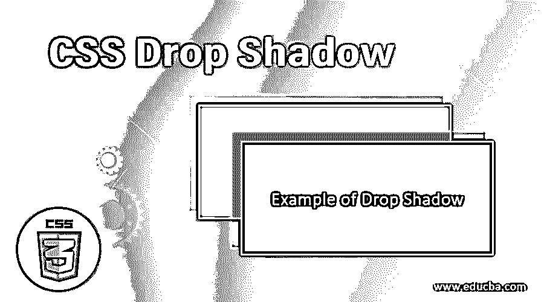
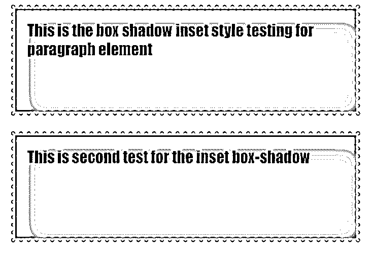
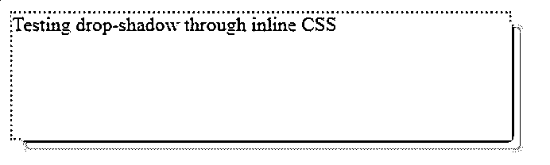

# CSS 阴影

> 原文：<https://www.educba.com/css-drop-shadow/>




## CSS 阴影介绍

CSS 将每个元素视为一个盒子。它提供了各种功能来设计每个元素的样式。但是就页面和整体布局中元素的呈现而言，盒子模型是 CSS 提供的最重要的特性。除此之外，CSS 还提供了另一个特性，当把元素当作一个盒子时，我们可以给它一个阴影效果。这种特性通常被称为方框阴影，但也可以称为投影。

### 如何创建投影？

**语法:**

<small>网页开发、编程语言、软件测试&其他</small>

投影或方框阴影的语法如下:

```
box-shadow: horizontal-offset vertical-offset blur-radius spread-radius(option) color
```

这里，水平偏移是指阴影向左或向右。如果该值为正值，那么阴影将向右，负值时阴影将向左。垂直偏移指的是顶部或底部阴影。如果该值为正值，阴影将位于框的底部或下方，如果为负值，阴影将位于框的顶部或上方。模糊决定了阴影的清晰度。模糊半径越大，阴影越不清晰。扩散半径是一个可选参数，决定阴影的大小。正值表示尺寸较大，负值表示尺寸较小。颜色是一个决定阴影颜色的参数。

```
box-shadow: none|inset|initial|inherit
```

上面给出的是一些可以和 box-shadow 属性一起使用的值。没有一个会给盒子留下阴影。插图将给出内阴影而不是外阴影。该属性是可选的。initial 会将 box-shadow 属性的所有值设置为初始状态。最后，继承将获取父元素的属性值，并使用相同的属性值来设计当前元素的样式。

### CSS 阴影示例

让我们看一些例子来理解投影属性在 CSS 中是如何工作的:

#### 示例#1

通过外部 CSS 演示基本的盒子阴影属性。

*   我们将通过外部 CSS 实现这个例子。所以首先，我们将创建一个 CSS 文件。
*   由于盒子阴影也可以作为盒子模型的一部分，我们将为标题元素

    ## 创建一个盒子模型样式。

**代码:**

```
h2{
width: 500px;
font-size: 18px;
padding: 20px 50px;
border: 10px dotted pink;
margin: 10px 50px;
box-shadow: 5px 5px 10px purple;
background-color: lightcoral;
text-align: center;
}
```

*   类似地，我们将为段落元素

    创建另一种样式。

**代码:**

```
p{
height: 50px;
width: 300px;
padding: 10px;
border: 15px double lightskyblue;
margin: 10px 60px;
box-shadow: -10px 10px 15px 15px grey;
background-color: lightslategrey;
color: white;
font-family: Arial, Helvetica, sans-serif;
font-size: 20px;
}
```

*   将上面两个片段组合起来后，CSS 文件应该是这样的。

**代码:**

```
h2{
width: 500px;
font-size: 18px;
padding: 20px 50px;
border: 10px dotted pink;
margin: 10px 50px;
box-shadow: 5px 5px 10px purple;
background-color: lightcoral;
text-align: center;
}
p{
height: 50px;
width: 300px;
padding: 10px;
border: 15px double lightskyblue;
margin: 10px 60px;
box-shadow: -10px 10px 15px 15px grey;
background-color: lightslategrey;
color: white;
font-family: Arial, Helvetica, sans-serif;
font-size: 20px;
}
```

*   接下来，我们将创建一个 HTML 页面。由于这是一个外部 CSS，我们将在 head 部分调用 CSS 文件。
*   我们将使用元素

    ## 和

    ，这样我们就可以看到样式的最终结果。

*   最终的 HTML 代码应该与此类似。

**代码:**

```
<html>
<head>
<title>Testing Box Shadow</title>
<link rel = "stylesheet" href = "box.css">
</head>
<body>
<h2>This is test for box-shadow or drop-shadow</h2>
<p>This is the box model style testing for paragraph element</p>
</body>
</html>
```

*   一旦保存了该文件，就可以通过浏览器打开它。
*   最终结果应该类似于下图:

**输出:**


#### 实施例 2

通过外部 CSS 演示“嵌入”功能。

*   默认情况下，box-shadow 将为元素生成外部阴影。但是，如果想要显示内部阴影，可以使用可选的特征插图。
*   像前面的例子一样，我们将首先[创建一个 CSS 文件](https://www.educba.com/css-blinking-text/)。
*   我们将对段落元素进行样式化，并利用嵌入特性来[显示一个内边框](https://www.educba.com/css-inner-border/)。
*   最终的 CSS 代码应该类似于这个代码片段。

**代码:**

```
p{
height: 100px;
width: 400px;
padding: 15px;
border: 5px dotted lightskyblue;
margin: 20px 60px;
box-shadow: inset 10px 10px 15px 15px grey;
color: blue;
font-size: 20px;
font-family: fantasy;
}
```

*   既然 [CSS 文件已经完成](https://www.educba.com/css-border-padding/)，我们将继续编写 HTML 页面。我们将使用段落元素< p >，这样我们可以看到嵌入功能是如何为盒子阴影工作的。

**代码:**

```
<html>
<head>
<title>Testing Box Shadow</title>
<link rel = "stylesheet" href = "box.css">
</head>
<body>
<p>This is the box shadow inset style testing for paragraph element</p>
<p>This is second test for the inset box-shadow</p>
</body>
</html>
```

*   保存这个 HTML 文件并通过任何浏览器打开，应该会得到类似下面的输出。

**输出:**




#### 实施例 3

通过内联 CSS 演示投影。

*   因为我们在这个例子中使用了内联 CSS，所以我们可以直接编码 HTML 页面。
*   我们将使用段落元素

    的样式参数添加样式。

**代码:**

```
<html>
<head>
<title>Testing Drop Shadow</title>
</head>
<body>
<p style="height: 100px; width: 400px; box-shadow: 10px 10px 5px grey; border: 2px dotted lightblue;">Testing drop-shadow through inline CSS</p>
</body>
</html>
```

*   保存这个 HTML 页面，并通过浏览器打开以查看以下输出。

**输出:**




上面的例子演示了投影的使用。这是一个可以用来给元素带来三维效果的特征。可以在箱式模型中尝试各种组合，也可以单独使用。

### 推荐文章

这是一个 CSS 投影指南。在这里，我们讨论了一个简单的概述，如何创建不同的例子及其代码实现下降阴影。您也可以浏览我们推荐的其他文章，了解更多信息——

1.  [CSS 命令](https://www.educba.com/css-commands/)
2.  [CSS 面试问题](https://www.educba.com/css-interview-questions/)
3.  [CSS 内边框](https://www.educba.com/css-inner-border/)
4.  [CSS 列表](https://www.educba.com/css-lists/)


