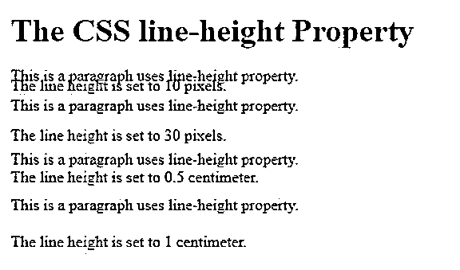
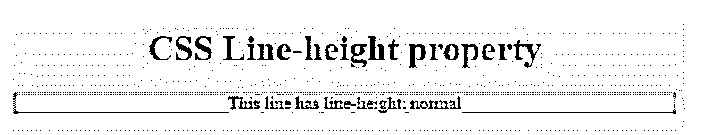
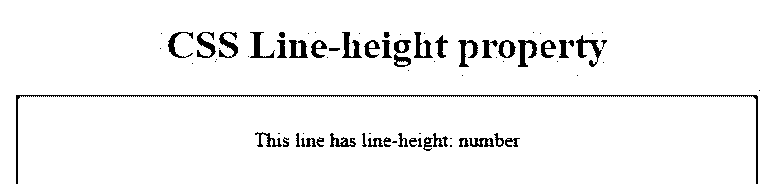
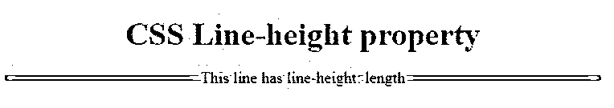
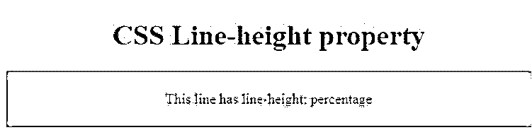
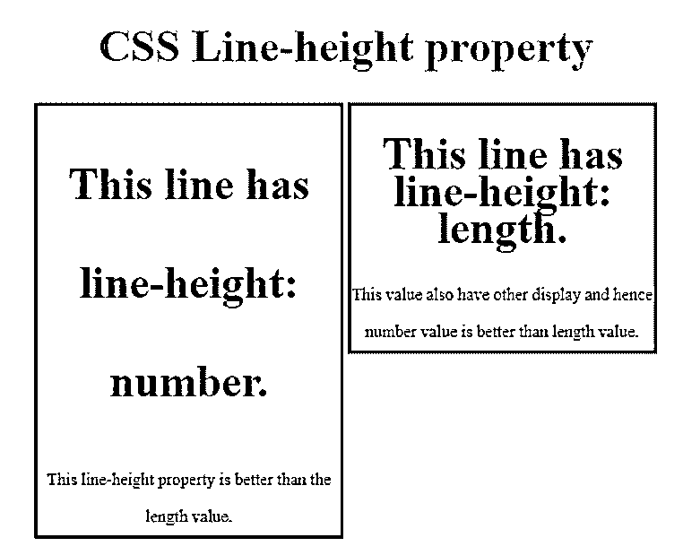

# CSS 线条高度

> 原文：<https://www.educba.com/css-line-height/>


## CSS 行高介绍

在 CSS line-height 属性中，线条绘制在文本行之间。该属性采用数值或百分比值。此属性用于文本行之间的行间距，默认情况下，浏览器会在文本行之间创建一定的间距，以便文本易于阅读。通常，此属性设置文本行之间的高度。此属性中使用了一些属性值，如 normal、number、length、percentage (%)、initial、inherit，其中 normal 值是默认值。

### CSS 线条属性的工作

在 CSS 中，指定两行文本之间的行间距或空白文本。该属性不接受任何负值，默认值为 normal。

<small>网页开发、编程语言、软件测试&其他</small>

一般来说，我们可以以具有一般值行高属性为例。

**举例:**

**代码:**

```
<!DOCTYPE html>
<html>
<head>
<style>
div.a {
line-height: 10px;
}
div.b {
line-height: 30px;
}
div.c {
line-height: 0.5cm;
}
div.d {
line-height: 1cm;
}
</style>
</head>
<body>
<h1>The CSS line-height Property</h1>
<div class="a">This is a paragraph uses line-height property.<br>
The line height is set to 10 pixels.</div>
<div class="b">This is a paragraph uses line-height property.<br>
The line height is set to 30 pixels.</div>
<div class="c">This is a paragraph uses line-height property.<br>
The line height is set to 0.5 centimeter.</div>
<div class="d">This is a paragraph uses line-height property.<br>
The line height is set to 1 centimeter.</div>
</body>
</html>
```

**输出:**




**带有值的行高属性的语法:**

```
line-height: normal | number | length | percentage | initial | inherit;
line-height: normal;
line-height: number(4.5);
line-height: length( 2em);
line-height: percentage (23%);
global values like:
line-height: inherit | initial | unset ;
```

因此可以按照上面的语法指定行高属性。

下面列出了该属性中最常用的值。

**值:**

*   **正常:**通常浏览器会将此作为默认值，具体取决于用户。
*   **number:** 该值为元素字体大小的倍数，无单位。在设计元素样式时，这个值是最可取的。
*   **长度:**该值用于计算线条框的高度，单位为 em。
*   **百分比:**该值相对于元素的字体大小，乘以元素的字体大小。

### CSS 行高示例

以下是 line-property 值的示例:

#### 示例 1:正常

**代码:**

```
<!DOCTYPE html>
<html>
<head>
<title>Educba training</title>
<style>
.div {
line-height: normal;
background: cyan;
color: black;
}
</style>
</head>
<body style = "text-align:center;">
<h1 style = "color:red;">
CSS Line-height property
</h1>
<div class="div">
This line has line-height: normal
</div>
</body>
</html>
```

**输出:**




#### 例子 2:数字

**代码:**

```
<!DOCTYPE html>
<html>
<head>
<title>Educba training</title>
<style>
.div {
line-height: 4.5;
background: cyan;
color: black;
}
</style>
</head>
<body style = "text-align:center;">
<h1 style = "color:red;">
CSS Line-height property
</h1>
<div class="div">
This line has line-height: number
</div>
</body>
</html>
```

**输出:**




#### 示例 3:长度

**代码:**

```
<!DOCTYPE html>
<html>
<head>
<title>Educba training</title>
<style>
.div {
line-height: 0.4em;
background: cyan;
color: black;
}
</style>
</head>
<body style = "text-align:center;">
<h1 style = "color:red;">
CSS Line-height property
</h1>
<div class="div">
This line has line-height: length
</div>
</body>
</html>
```

**输出:**




#### 例 4:百分比

**代码:**

```
<!DOCTYPE html>
<html>
<head>
<title>Educba training</title>
<style>
.div {
line-height: 400%;
background: cyan;
color: black;
}
</style>
</head>
<body style = "text-align:center;">
<h1 style = "color:red;">
CSS Line-height property
</h1>
<div class="div">
This line has line-height: percentage
</div>
</body>
</html>
```

**输出:**




从上面的例子中，我们可以看到行高属性中可以使用的所有不同的值。

在上面的例子中，我们必须注意到值“数字”比值“长度”更好，为什么我们将在下面的例子中看到:

**代码:**

```
<!DOCTYPE html>
<html>
<head>
<title>Educba training</title>
<style>
.num {
line-height: 2.2;
border: solid red;
}
.len {
line-height: 2.2em;
border: solid green;
}
.box {
width: 18em;
display: inline-block;
vertical-align: top;
font-size: 15px;
}
h1{
font-size: 40px;
}
</style>
</head>
<body style = "text-align:center;">
<h1 style = "color:red;">
CSS Line-height property
</h1>
<div class="box num">
<h1>This line has line-height: number.</h1> This line-height property is better than the length value.
</div>
<div class= "box len">
<h1>This line has line-height: length.</h1> This value also have other display and hence number value is better than length value.
</div>
</body>
</html>
```

**输出:**




在上面的程序中，我们可以看到带有红色边框的第一个框使用带有值 number 的 line-height 属性，带有绿色边框的第二个框使用带有值 length 的 line-height 属性。第一个框声明为无单位数，第二个框的单位为“em”。因此，从输出中，我们可以看到数字值更加清晰易读，而如果我们使用带有“em”单位的长度，则行距会更小，这可能会导致混乱或无法识别的文本，从而降低用户的可用性。因此，我们使用具有无单位数值的行高属性，这比具有单位“em”的长度值更可取。

并非所有的浏览器都支持 CSS 的行高属性，但是只有少数浏览器支持这个属性，它们是:Google Chrome、Opera、Internet Explorer、Firefox、Apple Safari 等。我们还应该注意到，并不是所有版本的浏览器都支持这个属性，这些浏览器的最新版本或某些特定版本支持 CSS 的行高属性。

### 结论

在本文中，我们得出结论，CSS 的行高属性用于表示两条基线之间应该存在的空间量。通常，该属性用于 CSS 中使用该属性的元素的行距样式。这个行高属性有不同的值，它将 normal 作为文本或元素块的行之间的行高的默认值。此 line-height 属性采用的值有 normal(默认值)、number(无单位数)、length(单位为“em”)、percentage(百分比)以及线条间粗细的单位%。

### 推荐文章

这是一个 CSS 行高的指南。这里我们分别讨论 CSS 线条属性的介绍以及工作和例子。您也可以看看以下文章，了解更多信息–

1.  [CSS 颜色图表](https://www.educba.com/css-color-chart/)
2.  [CSS z 索引](https://www.educba.com/css-z-index/)
3.  [CSS 验证器](https://www.educba.com/css-validator/)
4.  [CSS 边框生成器](https://www.educba.com/css-border-generator/)


