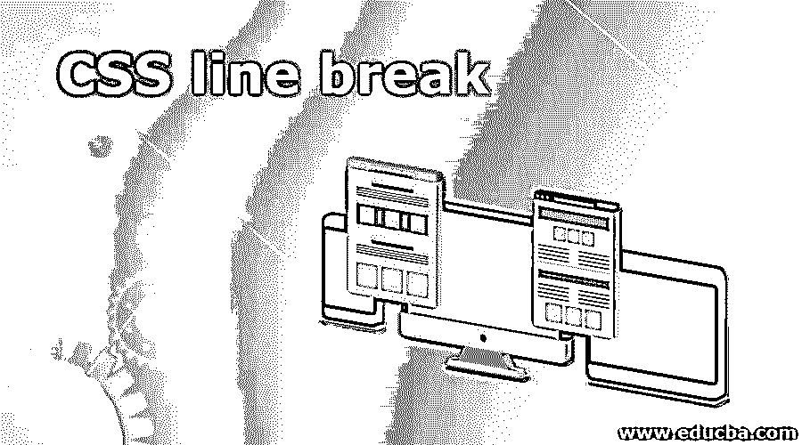
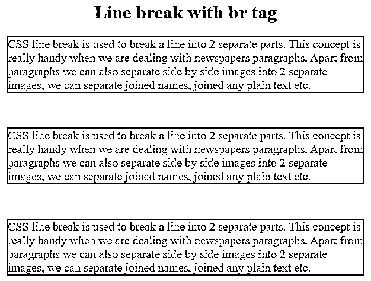
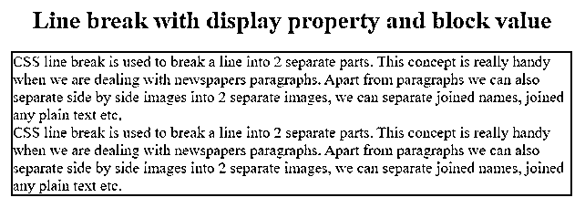
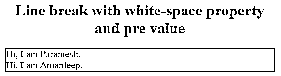
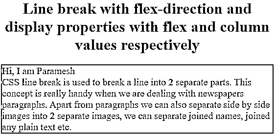

# CSS 换行符

> 原文：<https://www.educba.com/css-line-break/>




## CSS 换行符介绍

CSS 换行符用于将一行分成两个独立的部分。当我们处理报纸段落时，这个概念真的很方便。除了段落，我们还可以把并排的图片分成两个独立的图片，我们可以分开连接的名字，连接任何纯文本，等等。在这个主题中，我们将详细学习工作和例子。

### C 作品中如何换行？

CSS 换行符可以用很多方法来完成。下面列出了它们的语法。

<small>网页开发、编程语言、软件测试&其他</small>

*   标签
*   显示属性
*   空白属性
*   伸缩方向和显示属性

#### 1.
标签

在需要换行的地方，我们简单地使用这个
标签来换行。

**语法:**

```
<html>
<body>
Some content
<br>
Again some content
<br>
Again some content
</body>
</html>
```

#### 2.显示属性

使用块值显示特性可以断开两条附着的线。

**语法:**

```
p span {
display: block;
}
<p>contentcontent</p>
```

#### 3.空白属性

带有预值的空白属性使您可以换行。

**语法:**

```
p {
white-space: pre;
}
<p>Hi
I am Paramesh</p>
```

#### 4.伸缩方向和显示属性

具有列值的伸缩方向和具有伸缩值的显示属性使您可以换行。

**语法:**

```
<p>hello How are you</p>
p {
display: flex;
flex-direction: column;
}
```

### CSS 换行符示例

下面举几个例子

#### 示例#1

使用
标签换行

**代码:**

```
<!DOCTYPE html>
<html>
<title>
Line break
</title>
<head>
<style>
h1
{
color: green;
text-align: center;
}
p
{
color: blue;
border: solid 2px red;
font-size: 20px;
}
</style>
</head>
<body>
<h1>Line break with br tag</h1>
<p>CSS line break is used to break a line into 2 separate parts. This concept is really handy when we are dealing with newspapers paragraphs. Apart from paragraphs we can also separate side by side images into 2 separate images, we can separate joined names, joined any plain text etc.</p>
<br> <!--break the line we will get white space-->
<p>CSS line break is used to break a line into 2 separate parts. This concept is really handy when we are dealing with newspapers paragraphs. Apart from paragraphs we can also separate side by side images into 2 separate images, we can separate joined names, joined any plain text etc.</p>
<br> <!--break the line we will get white space-->
<p>CSS line break is used to break a line into 2 separate parts. This concept is really handy when we are dealing with newspapers paragraphs. Apart from paragraphs we can also separate side by side images into 2 separate images, we can separate joined names, joined any plain text etc.
</p>
</body>
</html>
```

**输出:**




#### 实施例 2

显示属性的换行符

**代码:**

```
<!DOCTYPE html>
<html>
<title>
Line break
</title>
<head>
<style>
h1
{
color: blue;
text-align: center;
}
p
{
color: red;
border: solid 2px green;
font-size: 20px;
}
p span {
display: block;/*break the line*/
}
</style>
</head>
<body>
<h1>Line break with display property and block value</h1>
<p>CSS line break is used to break a line into 2 separate parts. This concept is really handy when we are dealing with newspapers paragraphs. Apart from paragraphs we can also separate side by side images into 2 separate images, we can separate joined names, joined any plain text etc. CSS line break is used to break a line into 2 separate parts. This concept is really handy when we are dealing with newspapers paragraphs. Apart from paragraphs we can also separate side by side images into 2 separate images, we can separate joined names, joined any plain text etc.</p>
</body>
</html>
```

**输出:**




#### 实施例 3

带有空白属性的换行符

**代码:**

```
<!DOCTYPE html>
<html>
<title>
Line break
</title>
<head>
<style>
h1
{
color: maroon;
text-align: center;
}
p
{
color: blue;
border: solid 2px purple;
font-size: 20px;
}
p{
white-space: pre;/*break the line*/
}
</style>
</head>
<body>
<h1>Line break with white-space property and pre value</h1>
<p>Hi, I am Paramesh.
Hi, I am Amardeep.</p>
</body>
</html>
```

**输出:**




#### 实施例 4

具有伸缩方向和显示属性的换行符

**代码:**

```
<!DOCTYPE html>
<html>
<title>
Line break
</title>
<head>
<style>
h1
{
color: brown;
text-align: center;
}
p
{
color: navy;
border: solid 2px orange;
font-size: 20px;
}
p {
display: flex;
flex-direction: column;/*break the line*/
}
</style>
</head>
<body>
<h1>Line break with flex-direction and display properties with flex and column values respectively</h1>
<p>Hi, I am Paramesh
CSS line break is used to break a line into 2 separate parts. This concept is really handy when we are dealing with newspapers paragraphs. Apart from paragraphs we can also separate side by side images into 2 separate images, we can separate joined names, joined any plain text etc.</p>
</body>
</html>
```

**输出:**




### 结论

换行符用于将一行分成两个独立的部分。这种换行符可以通过 4 种方式完成，如
标记、显示、空白和伸缩方向以及显示属性。

### **推荐文章**

这是一个 CSS 换行符的指南。在这里，我们讨论一个 CSS 换行符的介绍，它是如何工作的，以及相应的例子。您也可以阅读以下文章，了解更多信息——

1.  [带 CSS 的 XML](https://www.educba.com/xml-with-css/)
2.  [CSS z 索引](https://www.educba.com/css-z-index/)
3.  [CSS 中的可见性](https://www.educba.com/visibility-in-css/)
4.  [文本装饰 CSS](https://www.educba.com/text-decoration-css/)


