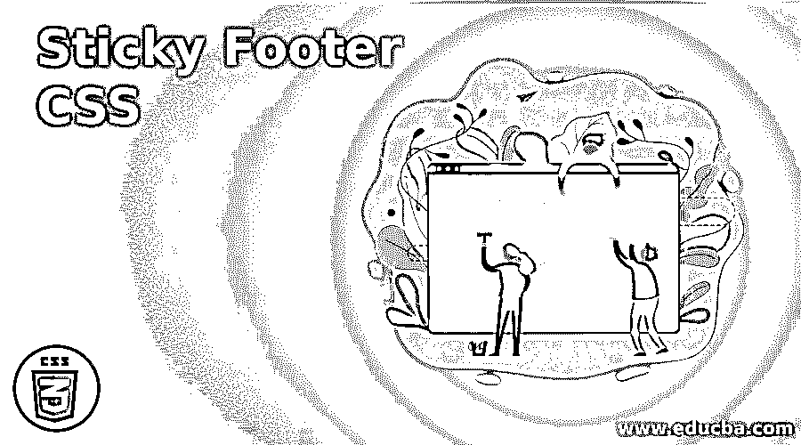
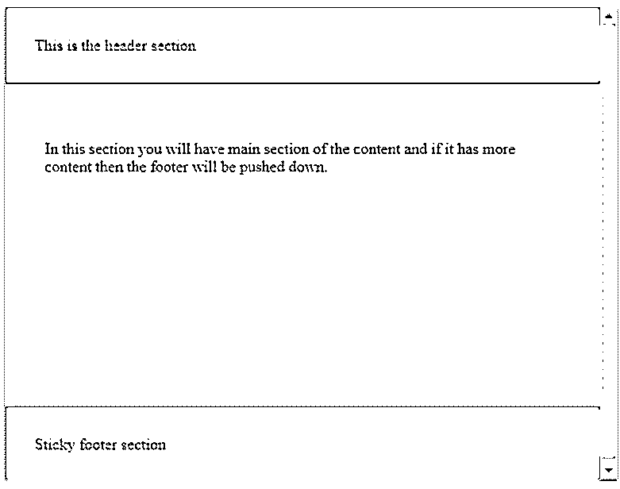
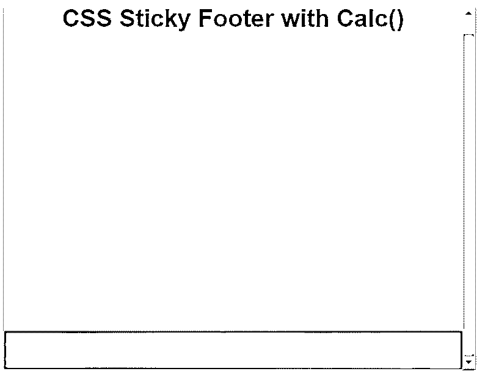
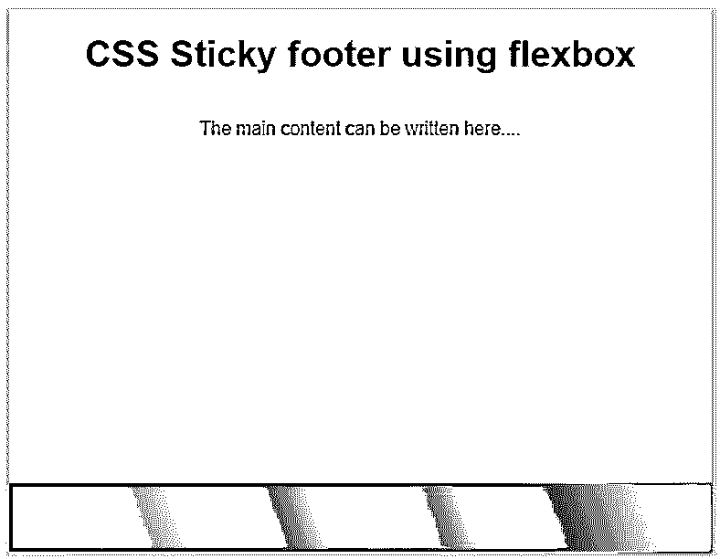
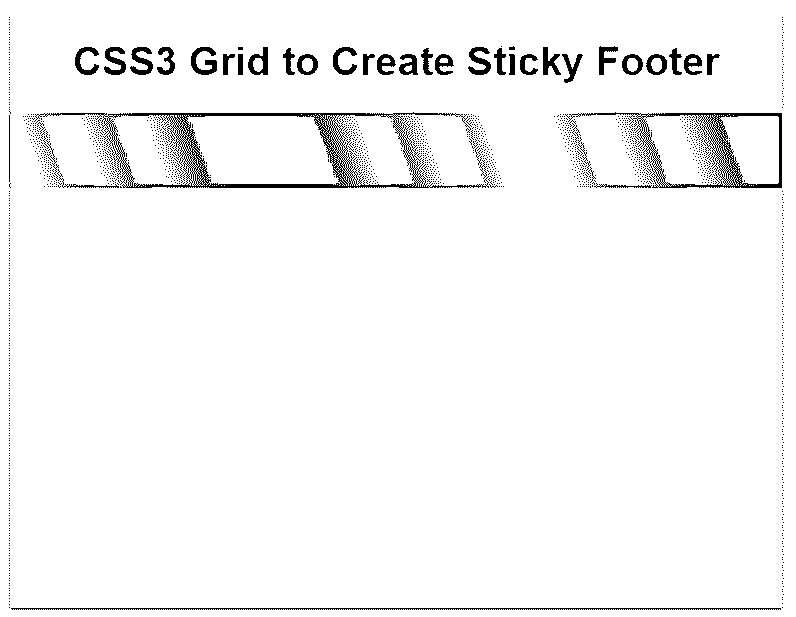

# 粘性页脚 CSS

> 原文：<https://www.educba.com/sticky-footer-css/>




## 粘滞页脚 CSS 介绍

在 CSS 中，当我们创建网站或网页时，它既有页眉又有页脚。页眉和页脚是页面或任何文档的顶部和底部。在 CSS 中，有两种类型的页眉和页脚，它们可以是固定的，也可以是粘性的，用于页眉和页脚的定位。这种粘性页脚用于将页脚粘在页面底部，而不考虑页面上的内容量。只有当页面内容很短时，这种粘性页脚才会起作用，这意味着如果页面上有足够的空间将页脚向下推到页面上。

### CSS 中粘性页脚的使用

CSS 中的 Sticky footer 用于将页脚固定在页面底部。

<small>网页开发、编程语言、软件测试&其他</small>

**举例:**

**代码:**

```
<!doctype html>
<html lang="en">
<head>
<title>CSS Cookbook: sticky footer</title>
<style>
body {
background-color: #fff;
color: #333;
font: 6.2em /   Arial;
padding: 0;
margin: 0;
}
* {
box-sizing: border-box;
}
section {
height: 400px;
width: 600px;
}
.wrapper {
min-height: 120%;
display: grid;
grid-template-rows: auto 1fr auto;
}
.page-header,
.page-footer {
background-color: cyan;
color: red;
padding: 30px;
}
.page-body {
padding: 40px;
}
.preview {
height: 500px;
overflow: auto;
}
</style>
</head>
<body>

<div class="wrapper">
This is the header section 
<main class="page-body">
<p> In this section you will have main section of the content and if it has more content then the footer will be pushed down. </p>
</main>
Sticky footer section
</div>

</body>
</html>
```

**输出:**




在上面的例子中，我们有。我们指定的最小高度为集装箱高度的 120%的包装。在上面的截图中，我们可以看到三个不同的部分，分别是页眉、中间的主要内容部分和页脚部分。

### 粘贴页脚的方法

下面给出的是粘页脚的方法:

#### 1.使用 calc()方法创建粘性页脚

当我们甚至想要移除所有额外的元素并且高度可以在包装器中调整时，该方法用于创建粘性页脚。

**举例:**

**代码:**

```
<!DOCTYPE html>
<html>
<head>
<title>Educba Training </title>
</head>
<style>
body {
margin: 0;
height: 100%;
text-align: center;
font-family: sans-serif;
}
.wrapper {
min-height: calc(100vh - 70px);
}
footer {
height: 50px;
background: linear-gradient(70deg, #ae63e4, #47cf73);
}
</style><body>
<div class="wrapper">
<h1>CSS Sticky Footer with Calc()</h1>
</div>

</body>
</html>
```

**输出:**




在上面的例子中，我们可以看到，这个粘性页脚工作，直到内容很短，否则页脚被向下推。

#### 2.使用 flexbox 创建粘性页脚

正如我们所知，保持内容的高度是最大的任务，而让页脚必须在底部要困难得多。因此，这可以通过在 CSS 中使用 flexbox 来实现，这使得内容的横向传播变得很容易。如果熟悉 flexbox 的属性，我们需要将垂直部分包装在 flex 容器中，这是必须指定的，如果我们水平展开它，它会自动扩展容器的空间。

**举例:**

**代码:**

```
<!DOCTYPE html>
<html>
<head>
<title>Educba Training</title>
</head>
<style>
body {
margin: 0;
height: 100%;
display: flex;
min-height: 100vh;
text-align: center;
flex-direction: column;
font-family:  sans-serif;
}
.main-content {
flex: 1;
}
footer {
padding: 30px;
background: linear-gradient(70deg, blue, green, red, yellow);
}
</style>
<body>

<h1>CSS Sticky footer using flexbox </h1>

<main class="main-content">
<p>The main content can be written here.... </p>
</main>

</body>
</html>
```

**输出:**




在上面的例子中，我们可以看到我们使用 flex 作为 display 属性的值。如果我们知道 flexbox 的所有 CSS 属性，那么使用 flexbox 创建粘性页脚就很容易了。

#### 3.使用显示属性的网格值创建粘性页脚

这主要用于在 CSS 中实现这个粘性页脚。但是这并不可取，因为它不受支持。

**举例:**

**代码:**

```
<!DOCTYPE html>
<html>
<head>
<title>Educba Training </title>
</head>
<style>
body {
margin: 0;
height: 100%;
text-align: center;
font-family: sans-serif;
}
body {
min-height: 100%;
display: grid;
grid-template-rows: 1fr auto;
}
footer {
grid-row-start: 2;
grid-row-end: 3;
padding: 30px;
background: linear-gradient(70deg, yellow, green, yellow, green);
}
</style>
<body>
<div class="main-wrapper">
<h1>CSS3 Grid to Create Sticky Footer</h1>
</div>

</body>
</html>
```

**输出:**




在上面的例子中，我们可以看到，我们已经用 grid value 声明了 display 属性，它将具有其他不同的网格属性，如 grid-row-start、grid-row-end、color 等。

这里我们看到了粘滞页脚，这是 CSS 属性，并不是所有的浏览器都支持。其中有火狐、谷歌 Chrome、Opera 等。

### 结论

在本文中，我们得出结论，粘滞页脚是 CSS 中的页脚类型之一。这个 footer 属性在 CSS 中使用一个固定的或者粘性的页脚。我们看到，可以使用不同的方法创建粘滞页脚，例如使用 calc()方法属性，使用 flexbox 创建粘滞页脚，这可以帮助布局的内容水平和垂直扩展，使用网格值作为显示属性创建粘滞页脚。这里我们看到了每个方法的例子。

### 推荐文章

这是一个指南粘页脚 CSS。这里我们讨论粘滞页脚 CSS 的介绍以及粘滞页脚和方法的工作。您也可以看看以下文章，了解更多信息–

1.  [CSS 验证器](https://www.educba.com/css-validator/)
2.  CSS 中的[按钮](https://www.educba.com/button-in-css/)
3.  [CSS 溢出](https://www.educba.com/css-overflow/)
4.  [CSS 边框生成器](https://www.educba.com/css-border-generator/)


