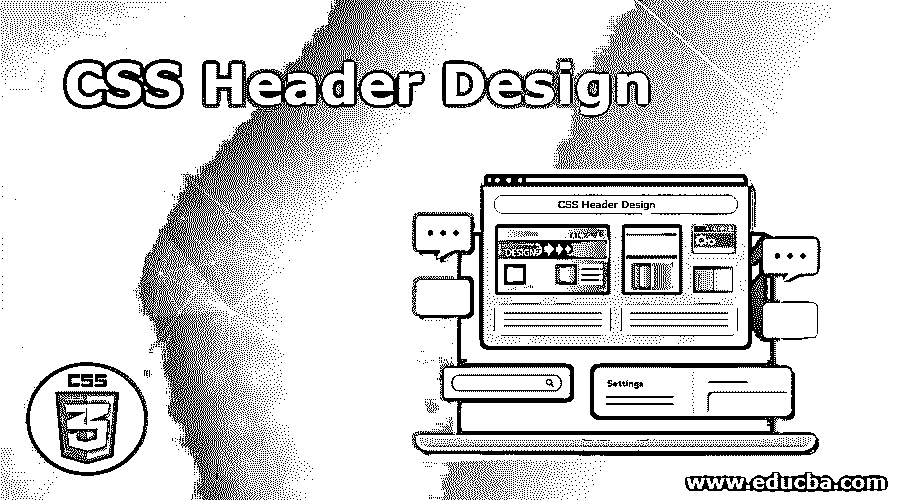
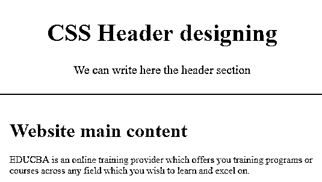
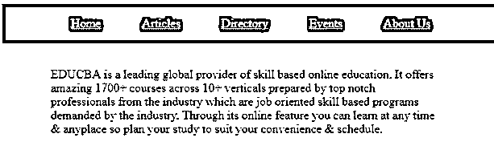
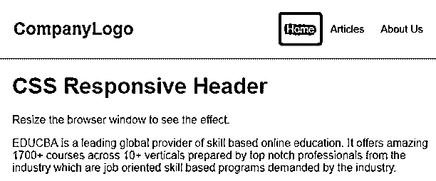

# CSS 标题设计

> 原文：<https://www.educba.com/css-header-design/>

## CSS 页眉设计介绍

一个网站有一个布局，主要分为页眉、页脚、菜单和内容。在这里，我们将看到关于网站布局的标题部分。页眉位于网站布局的顶部，包含徽标或网站名称，还包含一些关于网站内容的简要信息。网站的页眉部分是设计网站时非常重要的一部分，它用来抓住客户的注意力，让客户很快与这样的网站建立联系。因此，网站的标题设计应该是独特的，吸引客户或用户。

### CSS 中页眉设计的作用

在这篇文章中，我们将看到如何设计一个网站的标题。页眉通常位于页面的顶部，这是网站的关键部分。页眉和页脚是网站的关键元素。页眉更重要，因为客户的访问更多是在页眉上，然后才是网站内容和页脚。页眉:网站设计中最推荐的页眉尺寸是 1024px ×768px。让我们看一个简单的网站标题的例子。

<small>网页开发、编程语言、软件测试&其他</small>

### CSS 页眉设计的实现实例

下面是 CSS 标题设计的例子:

#### 示例#1

**代码:**

`<!DOCTYPE html>
<html>
<head>
<title>Educba Training </title>

</head>
<body>

<h1>CSS Header designing </h1>

We can write here the header section 

<h1> Website main content </h1>

EDUCBA is an online training provider which offers you training programs or courses across any field which you wish to learn and excel on. 

</body>
</html>`

**输出:**

**说明:**在上面的程序中，我们可以看到我们用 CSS 的不同样式属性设计了网站的页眉。这就是网站的标题部分。CSS 中还有另一个属性，你可以使用 CSS 固定定位来创建一个固定的或者粘性的标题，比如值为 fixed 或者 sticky 的 CSS 位置属性。下面我们来看一个例子。

#### 实施例 2

**代码:**

`<!DOCTYPE html>
<html>
<head>
<title>Educba Training </title>

</head>
<body>

<nav>
<a href="#"> Home </a>
<a href="#"> Articles </a>
<a href="#"> Directory </a>
<a href="#"> Events </a>
<a href="#"> About Us</a>
</nav>

 EDUCBA is a leading global provider of skill based online education. It offers amazing 1700+ courses across 10+ verticals prepared by top notch professionals from the industry which are job oriented skill based programs demanded by the industry. Through its online feature you can learn at any time & anyplace so plan your study to suit your convenience & schedule. 

</body>
</html>`

**输出:**

**解释:**在上面的程序中，我们已经看到了 CSS 属性在 header 部分的位置，我们已经将它的值声明为“fixed ”,你可以在上面的截图中看到。正如我们所知，有许多方法可以创建静态或响应标头。响应标题被定义为可以根据任何屏幕大小进行调整。有一些选项可以创建响应标题，它们的设计如下例所示。

#### 实施例 3

**代码:**

`<!DOCTYPE html>
<html>
<head>

</head>
<body>

<a href="#default" class="logo">CompanyLogo</a>

<a class="active" href="#home">Home</a>
<a href="#contact">Articles</a>
<a href="#about">About Us</a>

<h1>CSS Responsive Header</h1>

Resize the browser window to see the effect.

 EDUCBA is a leading global provider of skill based online education. It offers amazing 1700+ courses across 10+ verticals prepared by top notch professionals from the industry which are job oriented skill based programs demanded by the industry. 

</body>
</html>`

**输出:**

**解释:**在上面的程序中，我们已经创建了一个 responsive header，这意味着作为一个浏览器的大小如何增加或减少，甚至标题也相应地调整自己的大小，因此该标题被称为 responsive header。我们应该注意，如果我们为标题指定固定的宽度，那么它将不会响应，所以最好使用中心对齐。我们还可以看到，我们已经声明了媒体查询，其中我们必须为响应性标题设计编码，我们已经使用“500px”管理了最大宽度，这是我们使用两种语言 HTML 和 CSS 完成的。

### 结论

在本文中，我们看到了如何在 CSS 中创建一个标题。在这篇文章中，我们得出结论，标题是任何网站布局中非常关键和重要的部分。正如我们所见，标题是吸引顾客的主要部分，因此有效标题的设计非常重要。我们还看到了如何使用 CSS 的 position 属性创建一个 header，该属性提供了像 sticky 或 fixed 这样的值。最后，我们讨论了一个响应头，我们使用媒体查询来创建响应头，我们可以根据浏览器的大小来调整响应头的大小。

### 推荐文章

这是一个 CSS 标题设计的指南。在这里，我们讨论一个 CSS 头设计和它的不同例子及其代码实现的简要概述。您也可以浏览我们推荐的其他文章，了解更多信息——

1.  [CSS 在技术中的应用](https://www.educba.com/what-is-css/)
2.  [使用 CSS 命令的技巧和诀窍](https://www.educba.com/css-commands/)
3.  [CSS 的六大优势介绍](https://www.educba.com/advantages-of-css/)
4.  [CSS 中按钮的一些属性](https://www.educba.com/button-in-css/)

