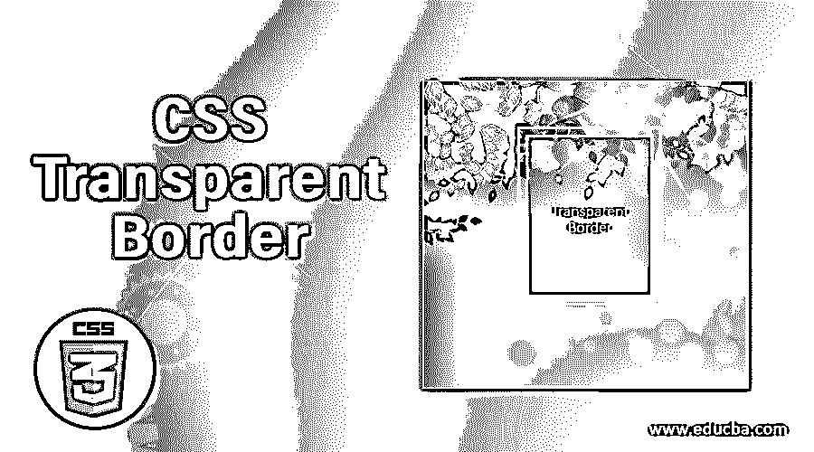
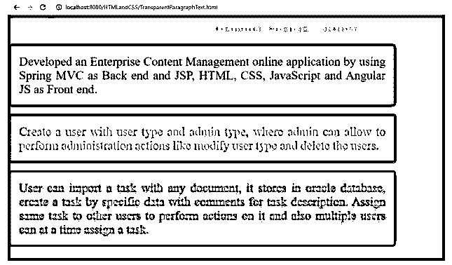
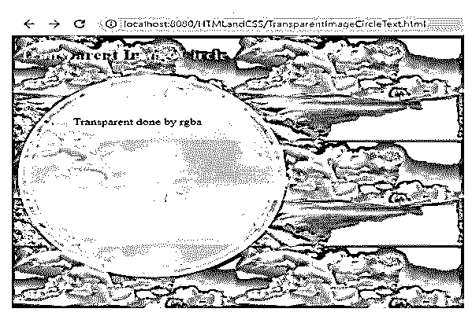
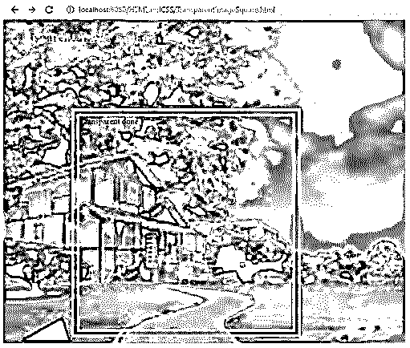
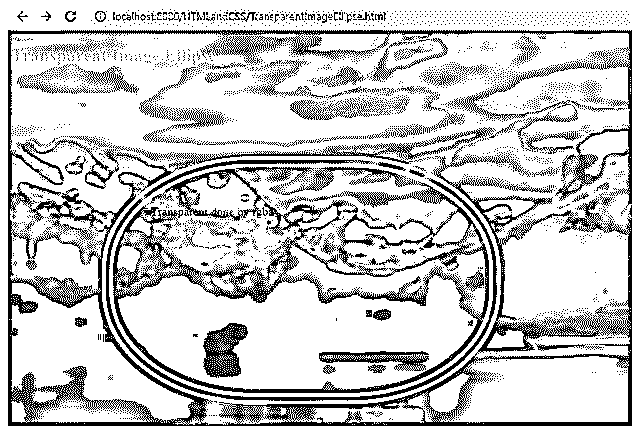
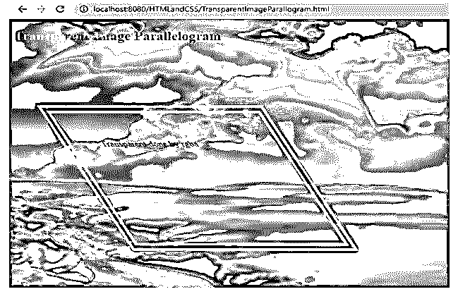

# CSS 透明边框

> 原文：<https://www.educba.com/css-transparent-border/>




## CSS 透明边框介绍

CSS 透明边框意味着如果我们将边框应用为透明或 rgba，则可以看到后面的对象。透明边框属性通过使后面的对象清晰可见来美化 HTML 页面。

**实时场景:**如果任何网页想要图像边框或文本边框透明，那么毫无疑问我们使用 transparent 属性或 rgba 属性。

<small>网页开发、编程语言、软件测试&其他</small>

**CSS 中透明关键字的历史**

*   CSS1 版本中首次引入了透明关键字。
*   透明关键字可用于背景颜色和边框。

### CSS 中透明边框是如何工作的？

*   透明边框通过使用 transparent 关键字和 rgba 属性来应用。
*   如果我们将边框设为透明，那么整个边框将消失，背景将代替边框显示。
*   如果我们将 border 作为 rgba，那么我们可以设置我们希望看到多少背景。
*   为了准确起见，大部分时间都使用图像。

**语法 1:**

```
div
{
border: value1 value2 transparent;//border values
}
```

*   **Value1:** 设置边框尺寸，如 2px、3px、4px 等。价值观念
*   **Value2:** 设置边框类型，如实线、虚线、双线、凹槽、脊线、虚线等。
*   **透明:**使背景可见。

**语法 2:**

```
div
{
border: value1 value2 rgba(value1, value2, value3, value4);//border values
}
```

*   **值 1:** 给出 0 到 255 或 0 到 100%之间的红色
*   **值 2:** 给出 0 到 255 或 0 到 100%之间的绿色
*   **值 3:** 给出 0 到 255 或 0 到 100%之间的蓝色
*   **Value4:** 这是一个 alpha 参数，给出 0 到 1 之间的透明度。0 表示完全透明，1 表示完全不透明。

### CSS 透明边框的示例

下面是 CSS 透明边框的例子:

#### 示例#1

段落透明。

**HTML 代码:TransparentParagraphText.html**

```
<!DOCTYPE html>
<html>
<head>
<meta charset="ISO-8859-1">
<link rel="stylesheet" href="TransparentParagraphText.css">
<title>Transparent border</title>
</head>
<body>
<font color="green"><h2 align="center">Transparent
Paragraph Conclusion</h2></font>
<p class="style1" align="center">Developed an Enterprise Content
Management online application by using Spring MVC as Back end and JSP,
HTML, CSS, JavaScript and Angular JS as Front end.</p>
<p class="style2" align="center">Create a user with user type and
admin type, where admin can allow to perform administration actions
like modify user type and delete the users.</p>
<p class="style3" align="center">User can import a task with any
document, it stores in oracle database, create a task by specific data
with comments for task description. Assign same task to other users to
perform actions on it and also multiple users can at a time assign a
task.</p>
</body>
</html>
```

**CSS 代码:****transparent tparagraph text . CSS**

```
.style1
{
width: 900px;
background: gray;
border: 20px double transparent;
font-size: 20px;
text-align: justify;
}
.style2
{
width: 900px;
background:aqua;
border: 20px double transparent;
font-size: 20px;
text-align: justify;
}
.style3
{
width: 900px;
background: fuchsia;
border: 20px double transparent;
font-size: 20px;
text-align: justify;
}
body
{
background: maroon;
}
```

**输出:**




**说明:**

*   正如你在上面的输出中看到的，如果我们使用没有透明背景色的边框，灰色是可见的，但是如果我们使用透明背景色的边框，灰色是可见的。
*   为什么 border 在第二个输出中不可见，因为它被 transparent 关键字覆盖，它是使背景灰色可见的边框。

#### 实施例 2

通过图像的 rgba 属性透明。

**HTML 代码:TransparentImageCircleText.html**

```
<!DOCTYPE html>
<html>
<head>
<meta charset="ISO-8859-1">
<link rel="stylesheet" href="TransparentImageCircleText.css">
<title>Transparent border</title>
</head>
<body>
<font color="brown"><h2>Transparent Image
Circle</h2></font>
<div class="image">
Transparent done by rgba
</div>
</body>
</html>
```

**CSS 代码:transparentimagecircletext . CSS**

```
.image
{
width: 200px;
height: 200px;
padding: 55px;
border-radius: 300px; /* for getting circle shape */
border: double 15px rgba(254,254,254,0.7);
background: rgba(254,254,254,0.7);
}
body
{
background: url("p3.jpg");
height: 100%;
}
```

**应用透明后的输出:**




**说明:**

*   从上面的输出可以看出，如果我们使用透明(rgba)背景的边框，从圆形的顶部可以看到图像。

**Note:** Transparent can also be achieved by rgba property.

#### 实施例 3

通过图像的 rgba 属性透明。

**HTML 代码:TransparentImageSquare.html**

```
<!DOCTYPE html>
&codelt;html>
<head>
<meta charset="ISO-8859-1">
<link rel="stylesheet" href="TransparentImageSquare.css">
<title>Transparent border</title>
</head>
<body>
<font color="brown"><h2>Transparent Image
Square</h2></font>
<div class="image">
Transparent done by rgba
</div>
</body>
</html>
```

**CSS 代码:TransparentImageSquare.css**

```
.image
{
height: 400px;
width: 400px;
margin: 120px;
border: 15px double rgba(255,255,255,.7);
}
body
{
background: url("p4.jpg");
background-size: 100% 100%; /*makes image displayed in entire page*/
}
```

**应用透明后的输出:**




**说明:**

*   正如你在上面的输出中看到的，如果我们使用透明(rgba)背景的边框，从正方形的顶部可以看到图像。

**Note:** Transparent can also be achieved by rgba property.

#### 实施例 4

通过图像的 rgba 属性透明。

**HTML 代码:TransparentImageEllips.html**

```
<!DOCTYPE html>
<html>
<head>
<meta charset="ISO-8859-1">
<link rel="stylesheet" href="TransparentImageEllipse.css">
<title>Transparent border</title>
</head>
<body>
<font color="brown"><h2>Transparent Image
Square</h2></font>
<div class="image">
Transparent done by rgba
</div>
</body>
</html>
```

**CSS 代码:TransparentImageEllips.css**

```
.image
{
width: 400px;
height: 200px;
border-radius: 200px/150px;
padding:50px;
margin: 120px;
border: 15px double rgba(255,255,255,.7);
}
body
{
background: url("p5.jpg");
background-size: 100% 100%; /*makes image displayed in entire page*/
}
```

**应用透明后的输出:**




**说明:**

*   从上面的输出可以看出，如果我们使用透明(rgba)背景的边框，那么从椭圆形状的顶部可以看到图像。

**Note:** Transparent can also be achieved by rgba property.

#### 实施例 5

通过图像的 rgba 属性透明。

**HTML 代码:TransparentImageParallogram.html**

```
<!DOCTYPE html>
<html>
<head>
<meta charset="ISO-8859-1">
<link rel="stylesheet" href="TransparentImageParallogram.css">
<title>Transparent border</title>
</head&gt
<body>
<font color="brown"><h2>Transparent Image
Parallelogram</h2></font>
<div class="image">
Transparent done by rgba
</div>
</body>
</html>
```

**CSS 代码:transparentimageparallogram . CSS**

```
.image {
width: 250px;
height : 150px;
transform : skew( 30deg);
padding: 50px;
margin: 120px;
border: 15px double rgba(230, 230, 230, .7);
height: 150px;
transform: skew(30deg);
}
body {
background: url("p3.jpg");
background-size: 100% 100%; /*makes image displayed in entire page*/
}
```

**应用透明(rgba)后的输出:**




**说明:**

*   正如你在上面的输出中看到的，如果我们使用透明(rgba)背景的边框，图像从平行四边形的顶部是可见的。

**Note:** Transparent can also be achieved by rgba property.

### 结论

用于通过边框显示背景的边框透明属性。边框透明也可以通过 rgba 属性值来实现。

### 推荐文章

这是一个 CSS 透明边框的指南。在这里我们讨论介绍，例子和透明边框在 CSS 中是如何工作的？您也可以看看以下文章，了解更多信息–

1.  [CSS 形状生成器](https://www.educba.com/css-shape-generator/)
2.  [CSS 闪烁文本](https://www.educba.com/css-blinking-text/)
3.  [CSS 列表](https://www.educba.com/css-lists/)
4.  [CSS 梯度发生器](https://www.educba.com/css-gradient-generator/)


