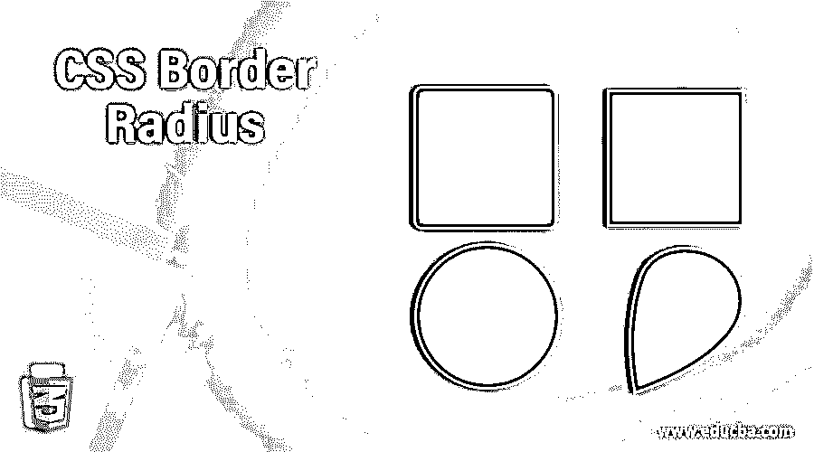

# CSS 边框半径

> 原文：<https://www.educba.com/css-border-radius/>




## CSS 边框半径介绍

CSS 的 border-radius 属性描述了元素角的半径。该属性允许向元素添加圆角。要创建圆角，可以设置单个半径，或两个半径来生成椭圆角。

CSS 边框半径属性可以定义为:

<small>网页开发、编程语言、软件测试&其他</small>

*   < length >或< percentage >的一个、两个、三个或四个值。它用于将拐角对齐到单个半径。
*   可选地以值“/”和一个、两个、三个或四个< length >或< percentage >开头。它用于创建一个额外的半径，这样你就可以得到椭圆角

**长度**:用纵向值表示圆半径的大小，或者椭圆的长半轴和短半轴的大小。

**百分比**:用百分比值表示圆半径的大小，或者椭圆的长短轴。

### 语法和参数

CSS border-radius 属性的语法可以写成如下所示:

```
border-radius:  length or percentage (can be specified up to 1 to 4 values)
```

这四个参数可以用以下几点来说明:

*   当你指定一个值时，它将决定所有角的半径。
*   通过定义两个值，第一个值用于左上角和右下角，而第二个值用于右上角和左下角。
*   如果定义了三个值，左上角将使用第一个值，第二个值将用于右上角和左下角，右下角将使用第三个值。
*   如果定义了四个值，则按左上角、右上角、右下角和左下角的顺序排列的每个值将分别应用于边框。

**例如，**

```
border-radius: 15px;
border-radius: 15px 30%;
border-radius: 15% 25%;
border-radius: 10px 15px 10px 15px;
```

### CSS 中的边框半径属性是如何工作的？

CSS border-property 是一种格式，用边框的左上角、边框的右上角、边框的右下角和边框的左下角这四个属性来配置半径。通过使用 border-radius 速记属性，可以使用 border-*-radius 属性独立创建圆角。border-*-radius 属性将包含一个或两个值，表示为长度或百分比(百分比与相关的边框尺寸相关)。

### 实现 CSS 边框半径的示例

下面是提到的例子:

#### 示例#1

**代码:**

```
<!DOCTYPE html>
<html lang="en">
<head>
<meta charset="utf-8">
<title> CSS Border Radius Example </title>
<style>
.txt {
border-radius: 25px;
background: grey;
padding: 10px;
text-align: center;
width: 400px;
height: 150px;
}
</style>
</head>
<body>
<h2> Welcome to EDUCBA... </h2>
<div class= "txt">
EDUCBA (Corporate Bridge Consultancy Pvt Ltd) is a leading global provider of skill based education addressing the needs of 500,000+ members across 40+ Countries. Our unique step-by-step, online learning model along with amazing 2500+ courses prepared by top-notch professionals from the Industry help participants achieve their goals successfully.
</div>
</body>
</html>
```

**输出:**


**解释:**在上面的例子中，我们已经将边界半径设置为 25px，这将在 div 块的每个角上设置相同值的边界半径。该属性在。txt 类以及其他 CSS 样式。

#### 实施例 2

**代码:**

```
<!DOCTYPE html>
<html lang="en">
<head>
<meta charset="utf-8">
<title> CSS Border Radius Example </title>
<style>
.txt {
border-radius: 25px 50px;
background: grey;
padding: 10px;
text-align: center;
width: 400px;
height: 150px;
}
</style>
</head>
<body>
<h2> Welcome to EDUCBA... </h2>
<div class= "txt">
EDUCBA (Corporate Bridge Consultancy Pvt Ltd) is a leading global provider of skill based education addressing the needs of 500,000+ members across 40+ Countries. Our unique step-by-step, online learning model along with amazing 2500+ courses prepared by top-notch professionals from the Industry help participants achieve their goals successfully.
</div>
</body>
</html>
```

**输出:**


**解释:**在上面的例子中，我们将边框半径设置为 25px 和 50px，其中 25px 设置 div 块的左上侧和右下侧的边框半径，50px 设置 div 块的右上侧和左下侧的边框半径。该属性在。txt 类以及其他 CSS 样式。

#### 实施例 3

**代码:**

```
<!DOCTYPE html>
<html lang="en">
<head>
<meta charset="utf-8">
<title> CSS Border Radius Example </title>
<style>
.txt {
border-radius: 25px 50px 75px;
background: grey;
padding: 10px;
text-align: center;
width: 400px;
height: 150px;
}
</style>
</head>
<body>
<h2> Welcome to EDUCBA... </h2>
<div class= "txt">
EDUCBA (Corporate Bridge Consultancy Pvt Ltd) is a leading global provider of skill based education addressing the needs of 500,000+ members across 40+ Countries. Our unique step-by-step, online learning model along with amazing 2500+ courses prepared by top-notch professionals from the Industry help participants achieve their goals successfully.
</div>
</body>
</html>
```

**输出:**


**解释:**在上面的例子中，我们将边框半径设置为 25px、50px 和 75px，其中 25px 设置 div 块的左上边框半径，50px 设置 div 块的右上边框半径和左下边框半径，75px 设置 div 块的右下边框半径。该属性在。txt 类以及其他 CSS 样式。

#### 实施例 4

**代码:**

```
<!DOCTYPE html>
<html lang="en">
<head>
<meta charset="utf-8">
<title> CSS Border Radius Example </title>
<style>
.txt {
border-radius: 25px 50px 75px 100px;
background: grey;
padding: 10px;
text-align: center;
width: 400px;
height: 150px;
}
</style>
</head>
<body>
<h2> Welcome to EDUCBA... </h2>
<div class= "txt">
EDUCBA (Corporate Bridge Consultancy Pvt Ltd) is a leading global provider of skill based education addressing the needs of 500,000+ members across 40+ Countries. Our unique step-by-step, online learning model along with amazing 2500+ courses prepared by top-notch professionals from the Industry help participants achieve their goals successfully.
</div>
</body>
</html>
```

**输出:**


**解释:**在上面的例子中，我们将边框半径设置为 25px、50px、75px 和 100px，其中 25px 设置左上角的边框半径，50px 设置右上角的边框半径，75px 设置右下角的边框半径，100px 设置 div 块左下角的边框半径。该属性在。txt 类以及其他 CSS 样式。

### 结论

到目前为止，我们已经研究了 CSS border-radius 属性，该属性使 web 开发人员能够在他们的设计功能中方便地使用圆角，而不需要 corner 对象或使用几个 div 标签，这是关于 CSS3 前景的最热门话题之一。为了创建圆角设计，web 设计人员将不再需要使用个性化的边角图形或晦涩难懂的 JavaScript 文件来恢复复杂的表格结构。

### 推荐文章

这是一个 CSS 边框半径的指南。在这里我们讨论一个关于 CSS 边框半径的介绍，语法，它是如何工作的编程例子。您也可以浏览我们的其他相关文章，了解更多信息——

1.  [CSS 填充](https://www.educba.com/css-padding/)
2.  [CSS 字体属性](https://www.educba.com/css-font-properties/?source=leftnav)
3.  [CSS 光标](https://www.educba.com/css-cursor/?source=leftnav)
4.  [CSS 边距颜色](https://www.educba.com/css-margin-color/?source=leftnav)


