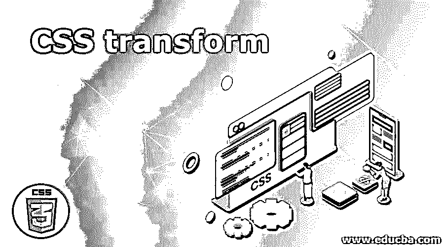
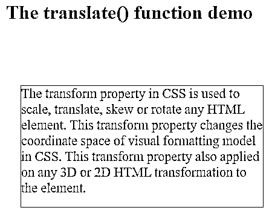
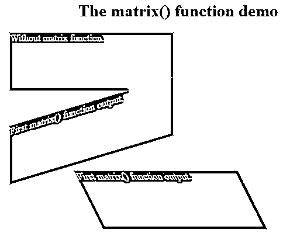

# CSS 转换

> 原文：<https://www.educba.com/css-transform/>




## CSS 转换简介

CSS 中的 transform 属性用于缩放、平移、倾斜或旋转任何 HTML 元素。此 transform 属性更改 CSS 中可视格式模型的坐标空间。此转换属性还应用于元素的任何 3D 或 2D HTML 转换。

### CSS 中的 transform 是如何完成的？

CSS 中的这个转换属性可以用多个函数来完成。基于这个函数，参数转换所执行的操作。

<small>网页开发、编程语言、软件测试&其他</small>

**1。无:**是 transform 属性的默认值；意思是不转型。

2D 矩阵:

**2。matrix(v1，v2，v3，v4，v5，v6):** 用 6 个值定义 2D 变换。

**语法:**

```
element
{
transform: matrix(v1,v2,v3,v4,v5,v6);
}
```

**3D 矩阵:**

**3。matrix3d(v1，v2，v3，v4，v5，v6，…，v16):** 用 16 个值定义 3D 变换。

**语法:**

```
element
{
transform: matrix(v1,v2,v3,v4,v5,v6,.....,v16);
}
```

translate():这用于翻译元素。

**4。translateX(x 坐标):**仅定义 x 轴的平移。

**语法:**

```
element
{
transform: translateX(value);
}
```

**5。translateY(y 坐标):**定义唯一 y 轴的平移。

**语法:**

```
element
{
transform: translateY(value);
}
```

**6。translateZ(z 坐标):**仅定义 z 轴的平移。

**语法:**

```
element
{
transform: translateZ(value);
}
```

**7。translate(x 坐标，y 坐标):**它定义了 2D 平移。

**语法:**

```
element
{
transform: translate(value1,value2);
}
```

**8。translate3d(x 坐标，y 坐标，z 坐标):**定义了 3d 平移。

**语法:**

```
>element
{
transform: translate3d(value1,value2,value3);
}
```

scale():这用于比例变换。

**9。scaleX(x 坐标):**仅定义 x 轴的比例变换。

**语法:**

```
element
{
transform: scaleX(value);
}
```

10。scaleY(y): 为唯一的 y 轴定义比例变换。

**语法:**

```
element
{
transform: scaleY(value);
}
```

**11。scaleZ(z):** 仅定义 z 轴的缩放变换。

**语法:**

```
element
{
transform: scaleZ(value);
}
```

**12。scale(x 坐标，y 坐标):**定义了 2D 比例变换。

**语法:**

```
element
{
transform: scale(value1,value2);
}
```

13。scale3d(x 坐标，y 坐标，z 坐标):定义 3d 比例变换。

**语法:**

```
element
{
transform: scale3d(value1, value2, value3);
}
```

rotate():这用于旋转元素。

**14。rotate(angleValue):** 定义某个角度的 2D 旋转。

**语法:**

```
element
{
transform:  rotate(value);
}
```

15。rotateX(x 坐标):它只相对于 x 轴旋转元素。

**语法:**

```
element
{
transform:  rotateX(value);
}
```

16。rotateY(y 坐标):它只相对于 y 轴旋转元素。

**语法:**

```
element
{
transform:  rotateY(value);
}
```

**17。rotateZ(z 坐标):**它只相对于 z 轴旋转元素。

**语法:**

```
element
{
transform:  rotateZ(value);
}
```

18。rotate3d(x 坐标，y 坐标，z 坐标，angleValue): 将元素在 x，y，z 轴旋转指定的角度。

**语法:**

```
element
{
transform:  rotate3d(value1, value2, value3);
}
```

skew():这用于倾斜转换。

**19。skewX(angleXValue** ):它只定义了相对于 x 轴的 2D 倾斜变换。

**语法:**

```
element
{
transform:  skewX(value);
}
```

20。skewY(angleYValue): 它定义了仅关于 y 轴的 2D 倾斜变换。

**语法:**

```
element
{
transform:  skewY(value);
}
```

**21。skew(xAngle，杨乐):**它定义了相对于 x 轴和 y 轴的 2D 倾斜变换。

**语法:**

```
element
{
transform:  skew(value1, value2);
}
```

perspective():这用于查看转换。

**22。perspective(value):** 定义了变换后的 3D 元素的视图。

**语法:**

```
element
{
transform:  perspective(value);
}
```

### CSS 转换的实现示例

以下是 CSS 转换的示例:

#### 示例 1–翻译功能

**代码:**

```
<!DOCTYPE html>
<html>
<head>
<style>
div {
background-color: lightgray;
width: 400px;
height: 200px;
color: maroon;
font-size: 22px;
border: 1px solid green;
transform: translate(250px,80px);
}
h1
{
color:navy;
text-align: center;
}
</style>
</head>
<body>
<h1>The translate() function demo</h1>
<div>
The transform property in CSS is used to scale, translate, skew or rotate any HTML element. This transform property changes the coordinate space of visual formatting model in CSS.
This transform property also applied on any 3D or 2D HTML transformation to the element.
</div>
</body>
</html
```

**输出:**




#### 示例 2–旋转功能

**代码:**

```
<!DOCTYPE html>
<html>
<head>
<style>
div {
margin: 10px;
width: 320px;
height: 120px;
background-color: lightgray;
color: green;
font-size: 22px;
border: 2px solid red;
}
#div1 {
transform: rotate(20deg); /*rotate the element clock wise direction*/
}
#div2 {
transform: rotate(-20deg); /*rotate the element anti clock wise direction*/
}
h1
{
color: maroon;
text-align: center;
}
</style>
</head>
<body>
<h1>The rotate() function demo</h1>
<div>
Without rotating
</div>
<div id="div1">
Rotating the element 20 degrees clock wise direction
</div>
<div id="div2">
Rotating the element 20 degrees anti clock wise direction
</div>
</body>
</html>
```

**输出:**

**T2】**


 **#### 示例 3–比例函数

**代码:**

```
<!DOCTYPE html>
<html>
<head>
<style>
div {
margin: 150px;
width: 320px;
height: 120px;
background-color: lightgray;
color: green;
font-size: 18px;
border: 2px solid red;
transform: scale(1,2);/*scale in x and y direction*/
}
h1
{
color: green;
text-align: center;
}
</style>
</head>
<body>
<h1>The scale() function demo</h1>
<div>
The transform property in CSS is used to scale, translate, skew or rotate any HTML element. This transform property changes the coordinate space of visual formatting model in CSS.
</div>
</body>
</html>
```

**输出:**

**T2】**


 **#### 示例 4–偏斜函数

**代码:**

```
<!DOCTYPE html>
<html>
<head>
<style>
div {
margin:20px;
width: 320px;
height: 120px;
background-color: lightpink;
color: blue;
font-size: 18px;
border: 2px solid red;
}
#div1 {
transform: skew(20deg, 20deg);
}
#div2 {
transform: skew(-20deg, -20deg);
}
h1
{
color: orange;
text-align: center;
}
</style>
</head>
<body>
<h1>The skew() function demo</h1>
<div>
Without skew
</div>
<div id="div1">
Skew the element 20 degrees clock wise direction
</div>
<div id="div2">
Skew the element 20 degrees anti clock wise direction
</div>
</body>
</html>
```

**输出:**

**T2】**


 **#### 示例 5–矩阵函数

**代码:**

```
<!DOCTYPE html>
<html>
<head>
<style>
div {
width: 310px;
margin: 20px;
height: 110px;
background-color: brown;
border: 1px solid orange;
color: white;
font-size: 18px;
}
.div1 {
transform: matrix(1, -0.3, 0, 1, 0, 0);
}
.div2 {
transform: matrix(1, 0, 0.5, 1, 150, 0);
}
h1
{
color: navy;
text-align: center;
}
</style>
</head>
<body>
<h1>The matrix() function demo</h1>
<div>
Without matrix function.
</div>
<div class="div1">
First matrix() function output.
</div>
<div class="div2">
First matrix() function output.
</div>
</body>
</html>
```

**输出:**




### 结论

CSS transform 属性用于旋转、倾斜、缩放、平移和排列 HTML 元素。每个功能都有不同的功能，如旋转()，倾斜()，缩放()和矩阵()等。

### 推荐文章

这是一个 CSS 转换的指南。在这里，我们讨论一个关于 CSS 转换和它的不同例子的简要概述，以及它的代码实现。您也可以浏览我们推荐的其他文章，了解更多信息——

1.  [CSS 字体变体](https://www.educba.com/css-font-variant/)
2.  [CSS 命令](https://www.educba.com/css-commands/)
3.  [CSS 的优势](https://www.educba.com/advantages-of-css/)
4.  CSS 中的[按钮](https://www.educba.com/button-in-css/)


******