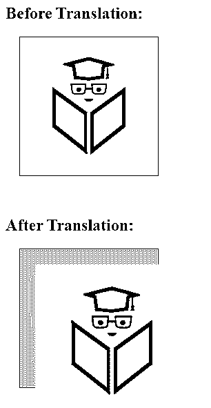
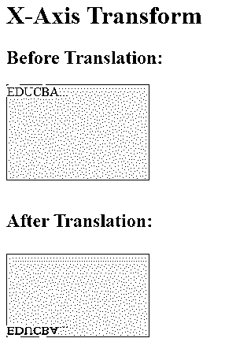
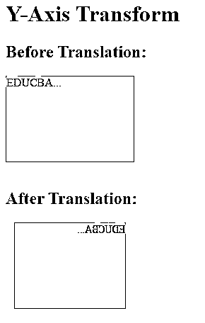
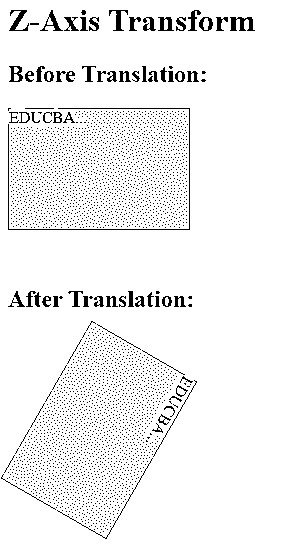
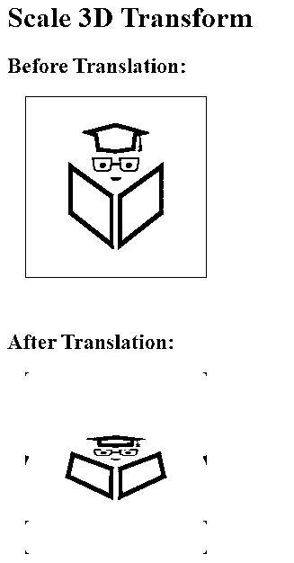
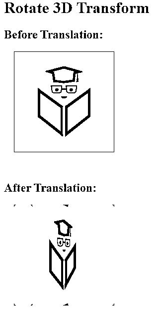
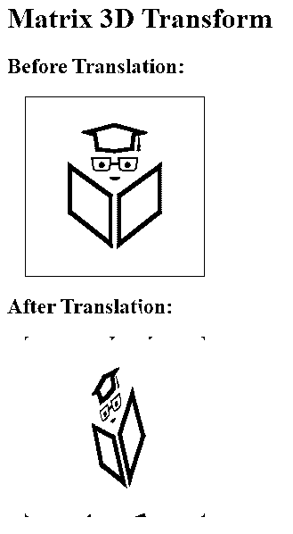
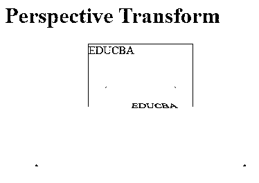

# CSS 3D 转换

> 原文：<https://www.educba.com/css-3d-transforms/>


## CSS 3D 转换简介

CSS 变换的实现可以移动、旋转、倾斜、挤压和拉伸元素。网页设计者将通过 CSS 3D 转换超越他们的显示对手，进入图形设计的新领域。前端开发人员将通过为传统网站创建一个新的维度来改进他们的 CSS 3D 转换设计。

变换后的项目不会影响相应的元素，但是可以以与完全定位的元素相同的方式重叠自身。尽管如此，转换后的元素在布局中的默认位置仍然需要更多的空间。我们可以开始使用 3d 变换将元素移动到 x 轴、y 轴和 z 轴。

<small>网页开发、编程语言、软件测试&其他</small>

**注意**:CSS3 的 transform 属性使用 transform 的函数来控制元素使用的坐标系，以增加变换效果。

### CSS 3D 转换的功能

以下是 CSS 中的 3D 变换函数:

*   **translate3d(x，Y，z):** 它提供 3d 平移，并沿着 X、Y 和 Z 轴移动元素。
*   **translateX(x):** 通过沿 X 轴移动元素来指定 3D 平移。
*   **translateY(y):** 通过沿 Y 轴移动元素来指定 3D 平移。
*   **translateZ(z):** 通过沿 Z 轴移动元素来指定 3D 平移。
*   **scale3d():** 它提供 3d 缩放平移，并沿 X、Y 和 Z 轴缩放元素。
*   **rotate3D():** 提供指定角度沿 X、Y、Z 方向的 3D 旋转。
*   **matrix3D():** 定义了 16 个值的 4*4 变换矩阵。
*   **perspective(n):** 它描述了在 3D 中转换的元素的透视视觉。此外，随着这种函数值的上升，该元素将出现在离观察者更远的地方。

### CSS 3D 变换的示例

我们将在下面例子的帮助下讨论如何在 CSS 中使用上述 3D 转换。

#### 示例#1

**代码:**

```
<!DOCTYPE html>
<html lang="en">
<head>
<meta charset="utf-8">
<title>CSS 3D Transform Functions</title>
<style>
.container{
width: 200px;
height: 200px;
perspective: 400px;
border: 1px solid #ffd630;
background: #F5F5F5;
margin: 20px;
}
.transformed {
-webkit-transform: translate3d(30px, 30px, 40px); /* this is for Chrome, Safari, Opera browsers */
transform: translate3d(30px, 30px, 40px); /*this is standard syntax*/
}
</style>
</head>
<body>
<h2>Before Translation:</h2>
<div class="container">

</div><br>
<h2>After Translation:</h2>
<div class="container">

</div>
</body>
</html>
```

**输出:**




在接下来的例子中，使用上面的步骤来显示 html 页面的结果。

#### 实施例 2

**代码:**

```
<!DOCTYPE html>
<html lang="en">
<head>
<meta charset="utf-8">
<title> CSS 3D Transform Functions </title>
<style>
div{
width: 180px;
height: 120px;
background-color: #F5F5F5;
border: 1px solid #ffd630;
}
.x_axis {
-webkit-transform: rotateX(150deg);  /* this is for Chrome, Safari, Opera browsers */
transform: rotateX(150deg);  /*this is standard syntax*/
}
</style>
</head>
<body>
<h1>X-Axis Transform</h1>
<h2>Before Translation:</h2>
<div class="container">
EDUCBA...
</div><br>
<h2>After Translation:</h2>
<div class="x_axis">
EDUCBA...
</div>
</body>
</html>
```

**输出**




在上面的输出中，rotateX()函数通过其 X 轴的一个元素以给定的角度旋转:

#### 实施例 3

**代码:**

```
<!DOCTYPE html>
<html lang="en">
<head>
<meta charset="utf-8">
<title> CSS 3D Transform Functions </title>
<style>
div{
width: 180px;
height: 120px;
background-color: #F5F5F5;
border: 1px solid #ffd630;
}
.y_axis {
-webkit-transform: rotateY(150deg);  /* this is for Chrome, Safari, Opera browsers */
transform: rotateY(150deg);  /*this is standard syntax*/
}
</style>
</head>
<body>
<h1>Y-Axis Transform</h1>
<h2>Before Translation:</h2>
<div class="container">
EDUCBA...
</div><br>
<h2>After Translation:</h2>
<div class="y_axis">
EDUCBA...
</div>
</body>
</html>
```

**输出:**




在上面的输出中，rotateY()函数通过其 Y 轴的一个元素以给定的角度旋转:

#### 实施例 4

**代码:**

```
<!DOCTYPE html>
<html lang="en">
<head>
<meta charset="utf-8">
<title> CSS 3D Transform Functions </title>
<style>
div{
width: 180px;
height: 120px;
background-color: #F5F5F5;
border: 1px solid #ffd630;
}
.z_axis {
-webkit-transform: rotateZ(120deg);  /* this is for Chrome, Safari, Opera browsers */
transform: rotateZ(120deg);  /*this is standard syntax*/
}
</style>
</head>
<body>
<h1>Z-Axis Transform</h1>
<h2>Before Translation:</h2>
<div class="container">
EDUCBA...
</div><br><br>
<h2>After Translation:</h2><br><br>
<div class="z_axis">
EDUCBA...
</div>
</body>
</html>
```

**输出:**




在上面的输出中，rotateZ()函数通过其 Z 轴的一个元素以给定的角度旋转:

#### 实施例 5

**代码:**

```
<!DOCTYPE html>
<html lang="en">
<head>
<meta charset="utf-8">
<title>CSS 3D Transform Functions</title>
<style>
.container{
width: 200px;
height: 200px;
perspective: 400px;
border: 1px solid #ffd630;
background: #ffd630;
margin: 20px;
}
.transformed {
-webkit-transform: scale3d(1, 1, 2) rotate3d(1, 0, 0, 60deg); /* this is for Chrome, Safari, Opera browsers */
transform: scale3d(1, 1, 1) rotate3d(1, 0, 0, 60deg); /*this is standard syntax*/
}
</style>
</head>
<body>
<h1>Scale 3D Transform</h1>
<h2>Before Translation:</h2>
<div class="container">

</div><br>
<h2>After Translation:</h2>
<div class="container">

</div>
</body>
</html>
```

**输出:**




#### 实施例 6

**代码:**

```
<!DOCTYPE html>
<html lang="en">
<head>
<meta charset="utf-8">
<title>CSS 3D Transform Functions</title>
<style>
.container{
width: 200px;
height: 200px;
perspective: 400px;
border: 1px solid #ffd630;
background: #ffd630;
margin: 20px;
}
.transformed {
-webkit-transform: rotate3d(0, 1, 0, 60deg); /* this is for Chrome, Safari, Opera browsers */
transform: rotate3d(0, 1, 0, 60deg); /*this is standard syntax*/
}
</style>
</head>
<body>
<h1>Rotate 3D Transform</h1>
<h2>Before Translation:</h2>
<div class="container">

</div><br>
<h2>After Translation:</h2>
<div class="container">

</div>
</body>
</html>
```

**输出:**




#### 实施例 7

**代码:**

```
<!DOCTYPE html>
<html lang="en">
<head>
<meta charset="utf-8">
<title>CSS 3D Transform Functions</title>
<style>
.container{
width: 200px;
height: 200px;
perspective: 400px;
border: 1px solid #ffd630;
background: #ffd630;
margin: 20px;
}
.transformed {
-webkit-transform: matrix3d(0.459127, -0.359572, 0.706613, 0, 0.200942, 0.890958, 0.428884, 0, -0.923565, 0, 0.506836, 1, 0, 1, 0, 1);  /* this is for Chrome, Safari, Opera browsers */
transform: matrix3d(0.459127, -0.359572, 0.706613, 0, 0.200942, 0.890958, 0.428884, 0, -0.923565, 0, 0.506836, 1, 0, 1, 0, 1);  /*this is standard syntax*/
}
</style>
</head>
<body>
<h1>Matrix 3D Transform</h1>
<h2>Before Translation:</h2>
<div class="container">

</div>
<h2>After Translation:</h2>
<div class="container">

</div>
</body>
</html>
```

**输出:**




#### 实施例 8

**代码:**

```
<!DOCTYPE html>
<html lang="en">
<head>
<meta charset="utf-8">
<title> CSS 3D Transform Functions </title>
<style>
.class_one {
height: 150px;
width: 150px;
margin-left: 120px;
border: 1px solid blue;
perspective: 120px;
}
.class_two {
padding: 60px;
border: 2px solid #ffd630;
background: #ffd630;
transform-style: preserve-3d;
transform: rotateX(60deg);
}
</style>
</head>
<body>
<h1>Perspective Transform</h1>
<div class="class_one">EDUCBA
<div class="class_two">EDUCBA</div>
</div>
</body>
</html>
```

**输出:**




### 结论

在本文中，我们通过使用纯 CSS 转换讨论了 3D 转换的重要性，并使用 CSS 讨论了直接来自 3D 结构构建块的透视图。幸运的是，归根结底，3D 转换比 CSS 的 exist 更有用、更重要；CSS 的作用仅仅是增加功能性。

### 推荐文章

这是一个 CSS 3D 转换的指南。在这里，我们还讨论了 css 3d 转换的定义和功能，以及不同的例子和代码实现。您也可以看看以下文章，了解更多信息–

1.  [CSS 颜色图表](https://www.educba.com/css-color-chart/)
2.  [CSS 过渡效果](https://www.educba.com/css-transition-effects/)
3.  [CSS 动画过渡](https://www.educba.com/css-animation-transition/)
4.  [CSS 滚动条](https://www.educba.com/css-scrollbar/)


