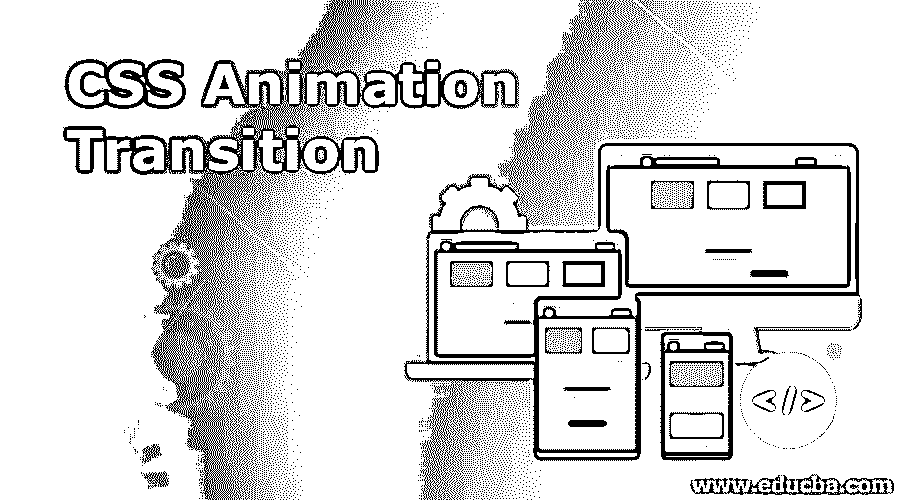
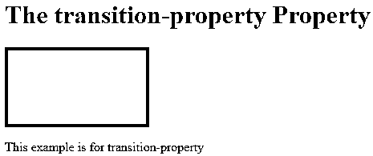
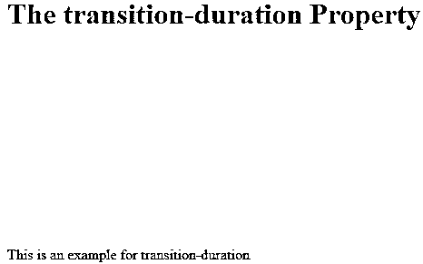
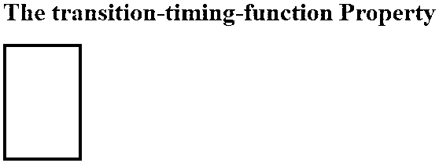
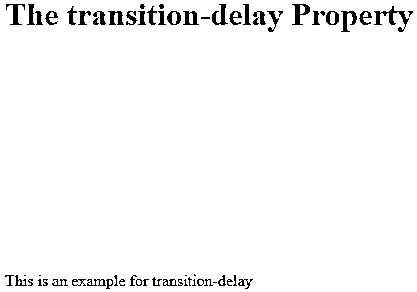
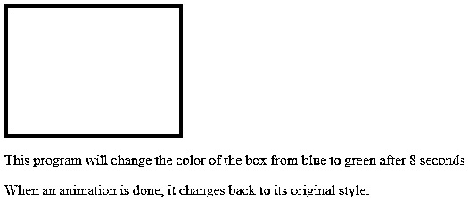

# CSS 动画过渡

> 原文：<https://www.educba.com/css-animation-transition/>




## CSS 动画过渡介绍

在本文中，我们将讨论 CSS 动画，它是指应用于布局或幻灯片中任何元素的效果过程，它允许您从一种样式切换到另一种样式任意次数。为此，它们使用特定时间段内元素的关键帧。CSS 过渡是指元素从一个布局或幻灯片移动到另一个布局或幻灯片的效果，它发生在 CSS 属性在特定时间间隔内从一个值更改为另一个值时。在这方面，我们必须注意，动画可以使用不同的多个关键帧设置多个过渡点，而过渡只能将样式从一种状态更改为另一种状态，而不是多个点。

### CSS 动画和过渡的工作

在本文中，我们提供了 CSS 编写转换行为的能力，可以将元素的属性或行为从一种状态更改为另一种状态，还提供了动画，允许更改不同关键帧中元素的行为或外观。现在让我们先看看过渡概念，然后看看动画。

<small>网页开发、编程语言、软件测试&其他</small>

**转换:**如上所述，转换是指元素以不同的风格从一种状态转换到另一种状态。CSS 过渡属性提供了不同的属性。它们如下:

#### 1.过渡属性

通过指定 CSS 属性的名称，将此属性应用于应该应用过渡的对象。因此，只对列出的过渡属性进行动画制作，对其他属性的更改照常进行。要指定多个属性，可以在 transition-property 值中使用逗号分隔。

**语法:**

```
Transition-property: value of property to be applied;
```

下面列出了一些常见的过渡属性:

*   背景颜色
*   边缘
*   填料
*   顶端
*   宽度
*   底部
*   农作物

**举例:**

**代码:**

```
<!DOCTYPE html>
<html>
<head>
<style>
div {
width: 180px;
height: 100px;
background: blue;
transition-property: width;
}
</style>
</head>
<body>
<h1>The transition-property Property</h1>
<div></div>
<p> This example is for transition-property </p>
</body>
</html>
```

**输出:**




#### 2.过渡持续时间

此属性指定转换在哪个时间段发生的持续时间。在这种情况下，您可以为每个值指定持续时间，或者只为所有其他过渡属性指定一次持续时间。时间值可以是秒或毫秒，也可以是分数测量值(0.5 s)。

**语法:**

```
Transition-duration: time in seconds;
```

**举例:**

**代码:**

```
<!DOCTYPE html>
<html>
<head>
<style>
div {
width: 100px;
height: 200px;
background: pink;
transition: width;
transition-duration: 10s;
}
</style>
</head>
<body>
<h1>The transition-duration Property</h1>
<div></div>
<p> This is an example for transition-duration </p>
</body>
</html>
```

**输出:**




#### 3.过渡时间函数

该属性用于设置我们可以控制元素过渡移动的速度。该函数通常将值标识符保存为线性、渐出、渐入和渐出。

**语法:**

```
Transition-timing-function: values identifiers;
```

**举例:**

**代码:**

```
<!DOCTYPE html>
<html>
<head>
<style>
div {
width: 100px;
height: 150px;
background: blue;
transition-timing-function: linear;
}
</style>
</head>
<body>
<h1>The transition-timing-function Property</h1>
<div></div>
</body>
</html>
```

**输出:**




#### 4.过渡延迟

顾名思义，该属性可用于设置时间延迟，时间值以秒或毫秒为单位，这可以帮助用户设置显示或执行转换可以延迟多长时间。

**语法:**

```
Transition-delay: value in time;
```

**举例:**

**代码:**

```
<!DOCTYPE html>
<html>
<head>
<style>
div {
width: 150px;
height: 200px;
background: pink;
transition-delay: 50s;
}
</style>
</head>
<body>
<h1>The transition-delay Property</h1>
<div></div>
<p> This is an example for transition-delay </p>
</body>
</html>
```

**输出:**




**CSS 动画:**动画是一种效果，其中元素可以从一种样式改变为另一种样式，例如许多 CSS 属性如下:动画名称、动画持续时间、动画方向、可以使用关键帧指定的属性，这些关键帧在特定时期保存元素的样式。它包括关键帧规则，这些规则具有动画名称、动画断点和其他与动画相关的属性。有的动画动画-计时-函数，还有动画-迭代-计数。

**让我们看看几个动画属性及其描述:**

| **动画属性** | **描述** |
| **动画-延迟** | 该属性规定了动画开始后必须有多长时间的延迟 |
| **动画方向** | 这描述了动画可以被指定的方向，例如向前、向后等。 |
| **动画-全模式** | 每当动画不播放时，它提供样式 |
| **动画-迭代-计数** | 这提供了动画应该播放的次数。 |
| **动画播放状态** | 这使您可以知道动画是正在运行还是正在播放 |
| **动画-计时-功能** | 这允许您指定在动画速度曲线上实现的时间。 |

让我们看看下面程序中实现的几个动画属性。

**举例:**

**代码:**

```
<!DOCTYPE html>
<html>
<head>
<style>
div {
width: 200px;
height: 150px;
background-color: blue;
animation-name: box;
animation-duration: 8s;
}
@keyframes box {
from {background-color: blue;}
to {background-color: green;}
}
</style>
</head>
<body>
<div></div>
<p> This program will change the color of the box from blue to green after 8 seconds</p>
<p>When an animation is done, it changes back to its original style.</p>
</body>
</html>
```

**输出:**





在上面的程序中，我们可以看到使用了一些动画属性，如 animation-name、animation-duration，并且该程序给出了一个动画，其中动画被命名为一个盒子，其事件是在 8 秒的持续时间后其颜色从蓝色变为绿色。

### 结论

在这篇文章中，我们总结了 CSS 过渡和动画的细节。在本文中，我们首先看到了转换，这意味着它允许用户通过一些属性(如转换属性、转换持续时间、转换延迟和转换计时功能)将属性从一种状态更改为另一种状态。其次，我们看到了定义为的动画，它允许元素使用关键帧从一种样式更改为另一种样式。该动画还提供了一些属性，如动画名称、动画延迟、动画方向、动画填充模式、动画迭代计数、动画计时功能、动画持续时间等。

### 推荐文章

这是一个 CSS 动画过渡的指南。在这里，我们讨论一个 CSS 动画过渡的简要概述，以及它的工作与例子和代码实现。您也可以浏览我们推荐的其他文章，了解更多信息——

1.  [CSS 溢出](https://www.educba.com/css-overflow/)
2.  [CSS 滚动条](https://www.educba.com/css-scrollbar/)
3.  [CSS 招数](https://www.educba.com/css-tricks/)
4.  [CSS 顺序](https://www.educba.com/css-order/)


