# 负边距 CSS

> 原文：<https://www.educba.com/negative-margin-css/>

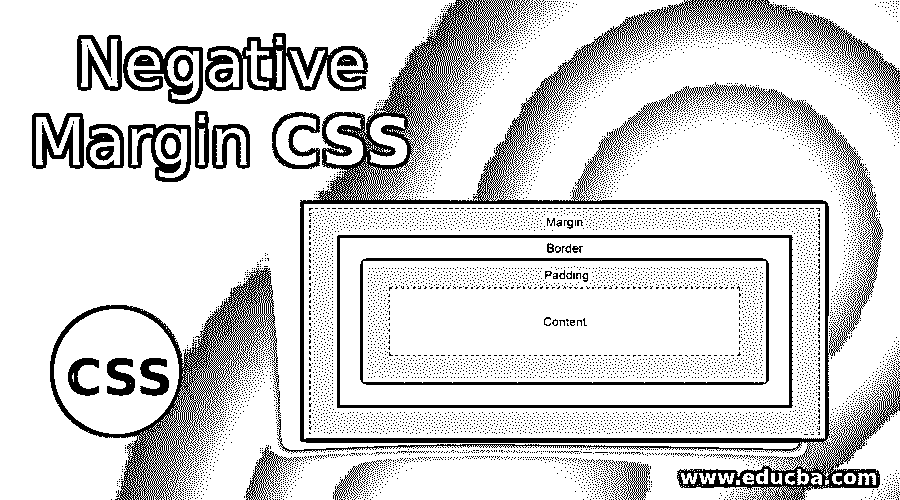


## 负边距 CSS 介绍

正边距值将内容移向其位置或页面的内侧。但是，如果我们采用负的边距值，它会将内容移出它的位置或页面。html 中的 margin 属性在盒状结构的最外层元素的内容周围留出空间。html 中的 padding 属性在盒状结构的最内部元素的内容周围提供空间。填充和边距周围的空间称为边框。

您可以在下面看到填充、边距和边框之间的差异:

<small>网页开发、编程语言、软件测试&其他</small>

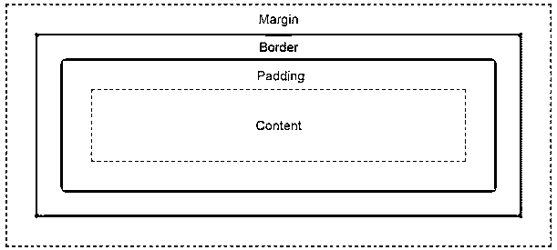


上图显示了正的边距值。

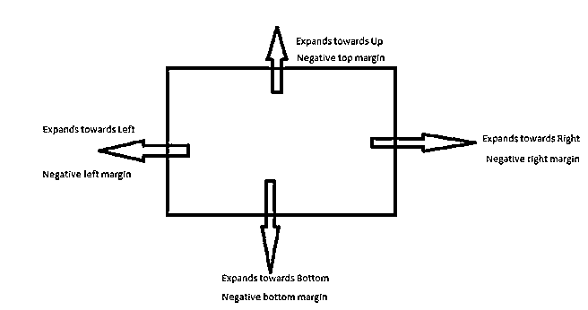


### 负边距在 CSS 中是如何工作的？

*   负的边距值给出了一个重叠的特征。这对开发网页非常有帮助。
*   **实时场景:**如果我们想在图像上放一些文字，我们只需使用负边距。

**语法 1:**

```
div
{
margin: -10px,-10px,-10px,-10px; //margin positions
}
```

**语法 1 解释:**

*   如果我们用 4 个负值应用边距，那么第一个值用于顶部，第二个值用于右侧，第三个值用于底部，第四个值用于左侧。

**语法 2:**

```
div
{
margin: -10px,-10px,-10px; //margin positions
}
```

**语法 2 解释:**

*   如果我们用 3 个负值应用边距，那么第一个值分别用于顶部，第二个值用于左侧和右侧，第三个值用于底部。

**语法 3:**

```
div
{
margin: -10px,-10px; //margin positions
}
```

**语法 3 解释:**

*   如果我们用 2 个负值来应用边距，那么第一个值分别用于顶部和底部，第二个值分别用于左侧和右侧。

**语法 4:**

```
div
{
margin: -10px; //margin positions
}
```

**语法 4 解释:**

*   如果我们只使用一个负值来应用边距，那么它将被平均应用于所有四个边。
*   如果我们只想对单侧应用负边距，[，那么 CSS 提供了](https://www.educba.com/what-is-css/)预定义的属性。
*   左边距:-10px:左边距-10px。

**语法:**

```
div
{
margin-left: -10px;
}
```

*   右边距:-10px:右边距-10px。

**语法:**

```
div
{
margin-right: 10px;
}
```

*   上边距:-10px:上边距-10px。

**语法:**

```
div
{
margin-top: -10px;
}
```

*   下边距:-10px:应用下边距-10px。

**语法:**

```
div
{
margin-bottom: -10px;
}
```

### 负边距 CSS 的示例

下面是 CSS 中的负边距示例:

#### 示例#1

底边的负边距。

**HTML 代码:**

```
<!DOCTYPE html>
<html>
<head>
<meta charset="ISO-8859-1">
<link rel="stylesheet" href="NegativeMarginBottom.css">
<title>Negative Margin</title>
</head>
<body>
<font color="green"><h2 align="center">Negative Margin</h2></font>

<p class="style1">I am working with Negative margin</p>
</body>
</html>
```

**CSS 代码:**

```
.style1 {
font-size: 30px;
margin-bottom: -50px;
background: olive;
}
.image {
width: 500px;
height: 500px;
float:left; /* Keeps the image at left side */
}
```

**应用负值前的输出:**

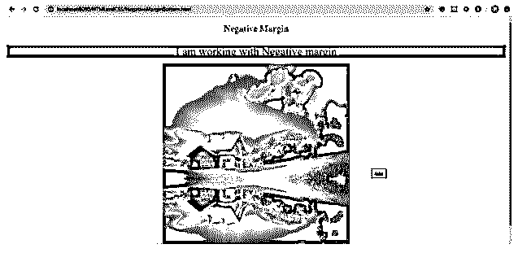


**应用负值后的输出:**

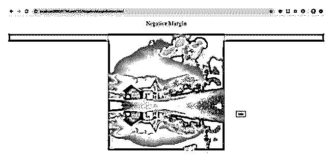


**说明:**

*   正如你所看到的输出负底部空白，段落重叠的图像。
*   负的下边距将内容移到下边。

#### 示例# 2–左侧的负边距。

**HTML 代码:**

```
<!DOCTYPE html>
<html>
<head>
<meta charset="ISO-8859-1">
<link rel="stylesheet" href="NegativeMarginLeft.css">
<title>Negative Margin</title>
</head>
<body>
<font color="green"><h2 align="center">Negative Margin</h2></font>

<p class="style1">I am working with Negative margin</p>
</body>
</html>
```

**CSS 代码:**

```
.style1 {
font-size: 30px;
margin-left: -50px;
background: olive;
}
.image {
width: 500px;
height: 500px;
float:left; /* Keeps the image at left side */
}
```

**应用负值前的输出:**

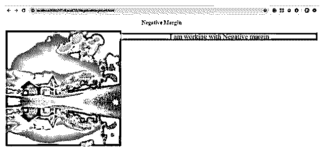


**应用负值后的输出:**

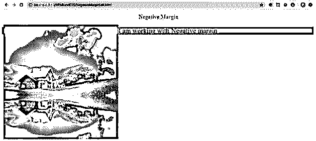


**说明:**

*   正如您在输出负左边距中看到的，段落与图像重叠。负的左边距将内容向左移动。
*   正如您可以观察到的最左端，该段落来自图像。

#### 示例 3–上边的负边距。

**HTML 代码:**

```
<!DOCTYPE html>
<html>
<head>
<meta charset="ISO-8859-1">
<link rel="stylesheet" href="NegativeMarginTop.css">
<title>Negative Margin</title>
</head>
<body>
<font color="green"><h2 align="center">Negative Margin</h2></font>
<p>

</p>
<p class="style1" align="center">I am working with Negative margin</p>
</body>
</html>
```

**CSS 代码:**

```
.style1 {
font-size: 30px;
margin-top:-50px;
background: olive;
}
.image {
width: 400px;
height: 400px;
display: block;
margin-left: auto;
margin-right: auto;
}
```

**应用负值前的输出:**

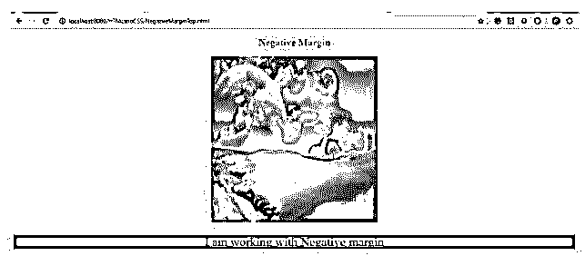


**应用负值后的输出:**

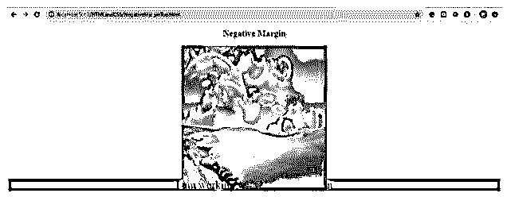


**说明:**

*   正如你在输出负上边距中看到的，段落与图像重叠。负上边距将内容移动到上边。

#### 例 4–右边的负边距。

**HTML 代码:**

```
<!DOCTYPE html>
<html>
<head>
<meta charset="ISO-8859-1">
<link rel="stylesheet" href="NegativeMarginRight.css">
<title>Negative Margin</title>
</head>
<body>
<font color="green"><h2 align="center">Negative Margin</h2></font>

<p class="style1" align="center">I am working with Negative margin</p>
</body>
</html>
```

**CSS 代码:**

```
font-size: 30px;
margin-right: -50px;
background: olive;
}
.image {
width: 500px;
height: 500px;
float:right; /* Keeps the image at right side */
}
```

**应用负值前的输出:**

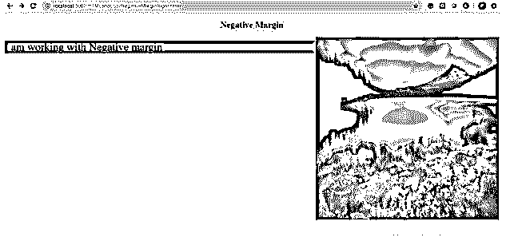


**应用负值后的输出:**

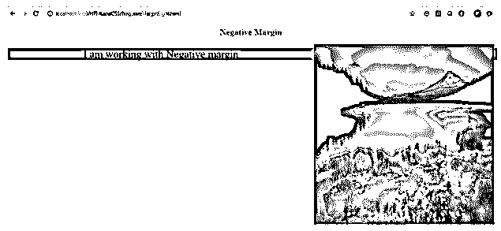


**说明:**

*   正如您在输出负右边距中看到的，段落与图像重叠。负右边距将内容向右移动。
*   正如你可以观察到的最右端，这个段落来自图像。

#### 示例 5–文本的负边距。

**HTML 代码:**

```
<!DOCTYPE html>
<html>
<head>
<meta charset="ISO-8859-1">
<link rel="stylesheet" href="NegativeMarginText.css">
<title>Negative Margin</title>
</head>
<body>
<font color="green"><h2 align="center">Negative Margin</h2></font>
<p class="style1" align="center">First Paragraph: I am working with Negative margin.It always tries to move the text away from it's position</p>
<p class="style2" align="center">Second Paragraph: I am working with Negative margin.It always tries to move the text away from it's position</p>
</body>
</html>
```

**CSS 代码:**

```
.style1 {
font-size: 30px;
background: brown;
width: 600px;
}
.style2 {
font-size: 30px;
width: 600px;
background: orange;
margin: -50px -20px -50px -80px;
}
```

**应用负值前的输出:**

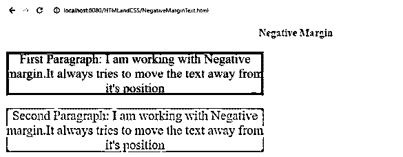


**应用负值后的输出:**

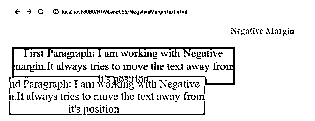


**说明:**

*   正如您在输出负边距中看到的，该段落与另一个段落重叠。
*   负边距将内容从其位置移开。
*   我们可以得出结论，边距负值也可以应用于文本。

### 结论

负边距将内容从其位置向外移动。我们可以将负边距应用于顶部、右侧、底部和左侧，并将负边距应用于多个值，如正边距值。

### 推荐文章

这是一个负边距 CSS 的指南。在这里，我们讨论的基本概念，例子，以及如何在 CSS 负保证金工程？您也可以看看以下文章，了解更多信息–

1.  [CSS 形状生成器](https://www.educba.com/css-shape-generator/)
2.  [CSS 位置](https://www.educba.com/css-position/)
3.  [文本阴影的 CSS](https://www.educba.com/css-for-text-shadow/)
4.  [CSS 属性选择器](https://www.educba.com/css-attribute-selector/)


