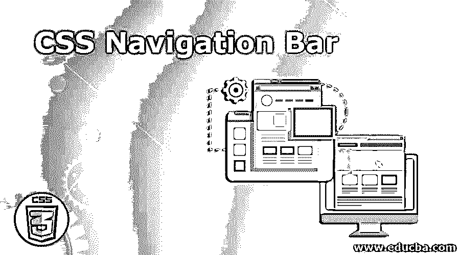
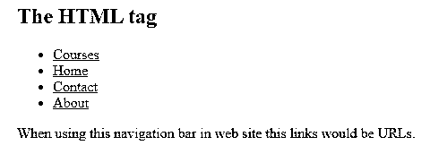
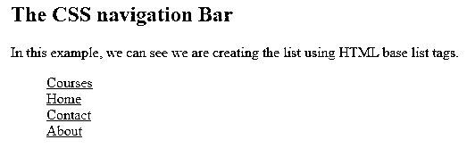
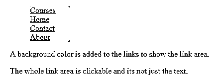
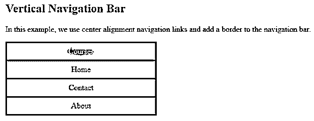
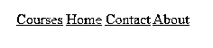
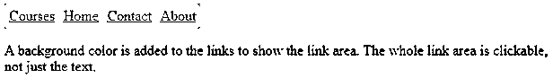

# CSS 导航栏

> 原文：<https://www.educba.com/css-navigation-bar/>




## CSS 导航栏介绍

在元素布局中使用导航栏来提供导航链接，这有助于在文档内或文档外移动，例如创建列表、菜单、索引等。导航栏由使用 HTML 基本标签的链接列表组成，如

*   Wait. This navigation bar is the most important part of the website, so users use it to help them navigate to different parts of the website. In this article, we can see how to create a navigation bar. This attribute is realized through horizontal and vertical navigation bars, making the website more user-friendly. In this topic, we will learn CSS navigation bar.

### 使用导航栏的示例

在 CSS 中，导航栏属性用于设置导航链接，以便在文档内或文档外从一个链接移动到另一个链接。导航栏需要一个 HTML 基础。让我们先看一个从标准 HTML 列表构建导航栏的例子，然后我们可以看到 CSS 程序，其中没有像 HTML 程序中那样为每个链接添加项目符号。

<small>网页开发、编程语言、软件测试&其他</small>

#### 示例#1

```
<!DOCTYPE html>
<html>
<head>
<title> Educba Training </title>
<body>
<h2> The HTML tag </h2>
<ul>
<li><a href="#Courses">Courses</a></li>
<li><a href="#news">Home</a></li>
<li><a href="#contact">Contact</a></li>
<li><a href="#about">About</a></li>
</ul>
<p>When using this navigation bar in web site this links would be URLs.</p>
</body>
</html>
```

**输出:**




在上面的程序中，我们可以看到这是一个 HTML 程序，由用于显示链接的

*   Tags, which are displayed by bullets. In order to delete these bullets in CSS, we use the list-style-type attribute. This can be seen as the following CSS program.

#### 实施例 2

```
<!DOCTYPE html>
<html>
<head>
<title> Educba Training </title>
<style>
ul {
list-style-type: none;
margin: 2;
padding: 2;
}
</style>
</head>
<body>
<h2> The CSS navigation Bar </h2>
<p>In this example, we can see we are creating the list using HTML base list tags.</p>
<ul>
<li><a href="#Courses">Courses</a></li>
<li><a href="#Home">Home</a></li>
<li><a href="#contact">Contact</a></li>
<li><a href="#about">About</a></li>
</ul>
</body>
</html>
```

**输出:**




在上面的程序中，我们可以看到我们使用了 HTML 标签，如

*   Tags, which are used to create a list of links, such as "Course", "Home", "Contact" and "About" links. In this example, we see "list-style-type: none", which helps to delete bullets, and the navigation bar doesn't need any list making tools, as we saw in the HTML program above. It also sets the margin and padding values to 2.

现在让我们看看下面内容中的垂直和水平导航栏:

##### 1.CSS 垂直导航栏

为了构建一个垂直导航栏，我们可以在创建的列表中使用

**例#1**

```
<!DOCTYPE html>
<html>
<head>
<title> Educba Training </title>
<style>
ul {
list-style-type: none;
margin: 3;
padding: 4;
}
li a {
display: block;
width: 80px;
background-color: pink;
}
</style>
</head>
<body>
<ul>
<li><a href="#Courses">Courses</a></li>
<li><a href="Home">Home</a></li>
<li><a href="#Contact">Contact</a></li>
<li><a href="#About">About</a></li>
</ul>
<p>A background color is added to the links to show the link area.</p>
<p>The whole link area is clickable and its not just the text.</p>
</body>
</html>
```




在上面的程序中，我们可以看到“display”属性的值是一个块，这使得整个链接区域是可点击的，我们将其宽度设置为“80 px ”,背景颜色为“粉色”,这使得该区域是可点击的。

在下面的程序中，我们可以为链接创建垂直导航条文本对齐和边框属性样式。这可以在下面的程序中显示。

**例 2**

```
<!DOCTYPE html>
<html>
<head>
<title> Educba Training </title>
<style>
ul {
list-style-type: none;
margin: 0;
padding: 0;
width: 300px;
background-color: pink;
border: 3px solid black;
}
li a {
display: block;
color: #000;
padding: 8px 16px;
text-decoration: none;
}
li {
text-align: center;
border-bottom: 3px solid black;
}
li:last-child {
border-bottom: none;
}
li a.active {
background-color: #4CAF50;
color: white;
}
li a:hover:not(.active) {
background-color: grey;
color: white;
}
</style>
</head>
<body>
<h2>Vertical Navigation Bar</h2>
<p>In this example, we use center alignment navigation links and add a border to the navigation bar.</p>
<ul>
<li><a class="active" href="#Courses">Courses</a></li>
<li><a href="#Home">Home</a></li>
<li><a href="#Contact">Contact</a></li>
<li><a href="#About">About</a></li>
</ul>
</body>
</html>
```

**输出:**




在上面的程序中，我们使用了一个活动链接来让用户知道用户在哪个页面或链接上。我们还设置了链接块的边界，我们还使用了悬停属性，这样每当我们将光标移动到其他链接时，它的颜色就会变为灰色。

##### 2.CSS 水平导航栏

这个水平条是使用内嵌或浮动列表项创建的。让我们看看下面的例子。

**例#1:**

为了创建水平栏，我们使用

*   Element as an embedded element.

```
<!DOCTYPE html>
<html>
<head>
<style>
ul {
list-style-type: none;
margin: 3;
padding: 3;
}
li {
display: inline;
}
</style>
</head>
<body>
<ul>
<li><a href="#Courses">Courses</a></li>
<li><a href="#Home">Home</a></li>
<li><a href="#Contact">Contact</a></li>
<li><a href="#About">About</a></li>
</ul>
</body>
</html>
```

**输出:**




在上面的程序中，我们可以看到 display 属性是一个移除了换行符的内联值。

现在我们将在下面的例子中看到浮动项是如何声明的。

**例 2**

```
<!DOCTYPE html>
<html>
<head>
<style>
ul {
list-style-type: none;
margin: 0;
padding: 0;
overflow: hidden;
}
li {
float: left;
}
li a {
display: block;
padding: 5px;
background-color: pink;
}
</style>
</head>
<body>
<ul>
<li><a href="#Courses">Courses</a></li>
<li><a href="#Home">Home</a></li>
<li><a href="#Contact">Contact</a></li>
<li><a href="#About">About</a></li>
</ul>
<p>A background color is added to the links to show the link area. The whole link area is clickable, not just the text.</p>
</body>
</html>
```

**输出:**




### 结论

在本文中，我们得出结论，CSS 中的导航栏用于从文档内部或外部的一个链接导航到另一个链接。这个导航栏以 HTML 为基础标签来创建列表、索引等。导航栏只是列出了任何项目的显示。这可以使用

*   or

### 推荐文章

这是一个 CSS 导航栏的指南。这里我们讨论 CSS 导航条的工作方式，并举例说明以便更好的理解。您也可以阅读以下文章，了解更多信息——

1.  [CSS 颜色图表](https://www.educba.com/css-color-chart/)
2.  [CSS 边框颜色](https://www.educba.com/css-border-color/)
3.  [CSS 中的可见性](https://www.educba.com/visibility-in-css/)
4.  [CSS 垂直对齐](https://www.educba.com/css-vertical-align/)


