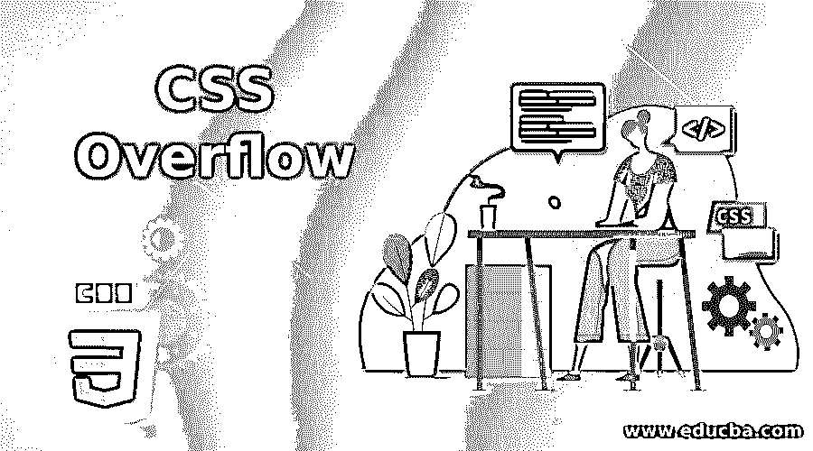
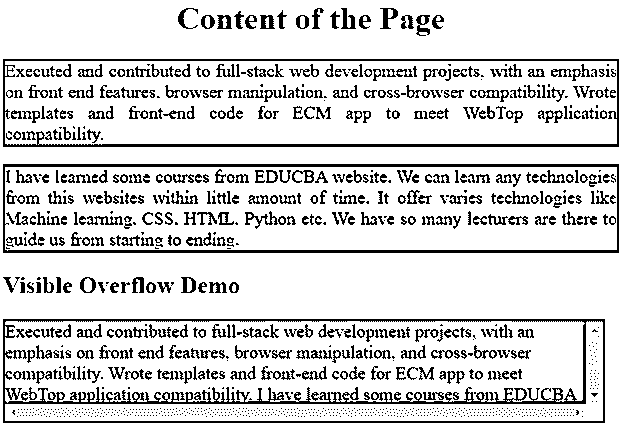
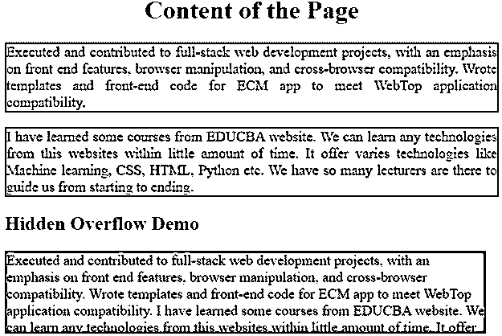
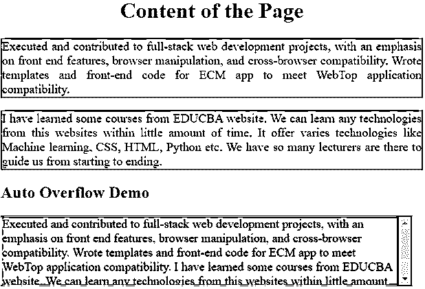
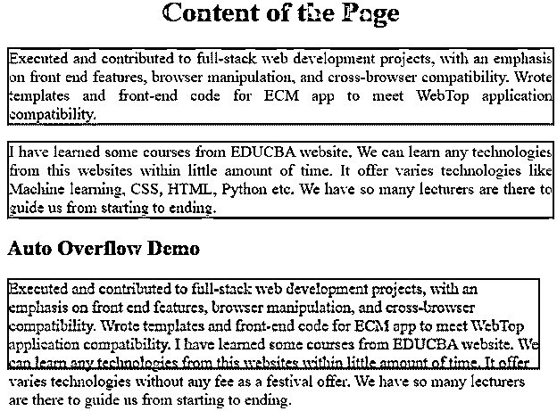

# CSS 溢出

> 原文：<https://www.educba.com/css-overflow/>




## CSS 溢出介绍

CSS 溢出属性总是决定当页面内容从元素框区域溢出时会发生什么。此属性指定绝对定位元素内容(剪辑内容)或向内容添加滚动条，如果内容太大而无法在指定的框区域内对齐。该属性通常有 4 个在应用程序中经常使用的值，它们是 auto、hidden、scroll、visible。

### CSS 中什么是溢出？

溢出是 CSS(级联样式表)中的属性。它用于在内容太大而无法放入指定区域时适当地调整内容以免溢出。溢出属性有 4 个值，它们总是在我们的应用程序中使用。他们是

<small>网页开发、编程语言、软件测试&其他</small>

#### 1.卷起

它将滚动条添加到元素的额外内容中。

**代码:**

```
div
{
overflow: scroll;
}
```

#### 2.隐藏的

它只指定了一部分内容，其余的内容将被隐藏。

**代码**

```
div
{
overflow: hidden;
}
```

#### 3.汽车

如果内容不适合宽度，此自动值会自动给出滚动条。

**代码:**

```
div
{
overflow: auto;
}
```

#### 4.看得见的

这是溢出属性的默认值。其工作原理与卷轴相同。

**代码:**

```
div
{
overflow: visible;
}
```

### 例子

以下是要实施的示例:

#### 1.滚动值溢出

**HTML 代码:**

```
<!DOCTYPE html>
<html>
<meta charset="ISO-8859-1">
<title>Visible Overflow</title>
<!-- including CSS file -->
<link rel="stylesheet" href="VisibleOverflow.css">
<head>
</head>
<body>
<h1>Content of the Page</h1>
<p class="content">Executed and contributed to full-stack web development projects, with an emphasis on front end features, browser manipulation, and cross-browser compatibility. Wrote templates and front-end code for ECM app to meet WebTop application compatibility.</p>
<p class="content">I have learned some courses from EDUCBA website. We can learn
any technologies from this websites within little amount of time. It
offer varies technologies like Machine learning, CSS, HTML, Python
etc. We have so many lecturers are there to guide us from starting to
ending.</p>
<h2>Visible Overflow Demo</h2>
<div class="visible">Executed and contributed to full-stack web development projects, with an emphasis on front end features, browser manipulation, and cross-browser compatibility. Wrote templates and front-end code for ECM app to meet WebTop application compatibility.Ihave learned some courses from EDUCBA website. We can learn anytechnologies from this websites within little amount of time. It offervaries technologies without any fee as a festival offer. Wehave so many lecturers are there to guide us from starting to ending.</div>
</body>
</html>
```

**CSS 代码:**

```
h1 {
color: brown;
text-align: center;
}
h2
{
color: brown;
}
.visible {
overflow: scroll;
background-color: gray;
width: 600px;
height: 100px;
border-style: solid;
border-width: 2px;
border-color: blue;
font-size: 18px;
}
.content
{
color: green;
text-align: justify;
border-style: solid;
border-width: 2px;
border-color: blue;
font-size: 18px;
}
```

**输出:**




#### 2.隐藏值溢出

**HTML 代码:**

```
<!DOCTYPE html>
<html>
<meta charset="ISO-8859-1">
<title>Visible Overflow</title>
<!-- including CSS file -->
<link rel="stylesheet" href="VisibleOverflow.css">
<head>
</head>
<body>
<h1>Content of the Page</h1>
<p class="content">Executed and contributed to full-stack web development projects, with an emphasis on front end features, browser manipulation, and cross-browser compatibility. Wrote templates and front-end code for ECM app to meet WebTop application compatibility.</p>
<p class="content">I have learned some courses from EDUCBA website. We can learn
any technologies from this websites within little amount of time. It
offer varies technologies like Machine learning, CSS, HTML, Python
etc. We have so many lecturers are there to guide us from starting to
ending.</p>
<h2>Hidden Overflow Demo</h2>
<div class="visible">Executed and contributed to full-stack web development projects, with an emphasis on front end features, browser manipulation, and cross-browser compatibility. Wrote templates and front-end code for ECM app to meet WebTop application compatibility.Ihave learned some courses from EDUCBA website. We can learn anytechnologies from this websites within little amount of time. It offervaries technologies without any fee as a festival offer. Wehave so many lecturers are there to guide us from starting to ending.</div>
</body>
</html>
```

**CSS 代码:**

```
h1 {
color: red;
text-align: center;
}
h2
{
color: red;
}
.visible {
overflow: hidden;
background-color: gray;
width: 600px;
height: 100px;
border-style: solid;
border-width: 2px;
border-color: fuchsia;
font-size: 18px;
}
.content
{
color: green;
text-align: justify;
border-style: solid;
border-width: 2px;
border-color: fuchsia;
font-size: 18px;
}
```

**输出:**




#### 3.自动值溢出

**HTML 代码:**

```
<!DOCTYPE html>
<html>
<meta charset="ISO-8859-1">
<title>Visible Overflow</title>
<!-- including CSS file -->
<link rel="stylesheet" href="VisibleOverflow.css">
<head>
</head>
<body>
<h1>Content of the Page</h1>
<p class="content">Executed and contributed to full-stack web development projects, with an emphasis on front end features, browser manipulation, and cross-browser compatibility. Wrote templates and front-end code for ECM app to meet WebTop application compatibility.</p>
<p class="content">I have learned some courses from EDUCBA website. We can learn
any technologies from this websites within little amount of time. It
offer varies technologies like Machine learning, CSS, HTML, Python
etc. We have so many lecturers are there to guide us from starting to
ending.</p>
<h2>Auto Overflow Demo</h2>
<div class="visible">Executed and contributed to full-stack web development projects, with an emphasis on front end features, browser manipulation, and cross-browser compatibility. Wrote templates and front-end code for ECM app to meet WebTop application compatibility.Ihave learned some courses from EDUCBA website. We can learn anytechnologies from this websites within little amount of time. It offervaries technologies without any fee as a festival offer. Wehave so many lecturers are there to guide us from starting to ending.</div>
</body>
</html>
```

**CSS 代码:**

```
h1 {
color: olive;
text-align: center;
}
h2
{
color: olive;
}
.visible {
overflow: auto;
background-color: gray;
width: 600px;
height: 100px;
border-style: solid;
border-width: 2px;
border-color: lime;
font-size: 18px;
}
.content
{
color: blue;
text-align: justify;
border-style: solid;
border-width: 2px;
border-color: lime;
font-size: 18px;
}
```

**输出:**




#### 4.溢出可见值

**HTML 代码:**

```
<!DOCTYPE html>
<html>
<meta charset="ISO-8859-1">
<title>Visible Overflow</title>
<!-- including CSS file -->
<link rel="stylesheet" href="VisibleOverflow.css">
<head>
</head>
<body>
<h1>Content of the Page</h1>
<p class="content">Executed and contributed to full-stack web development projects, with an emphasis on front end features, browser manipulation, and cross-browser compatibility. Wrote templates and front-end code for ECM app to meet WebTop application compatibility.</p>
<p class="content">I have learned some courses from EDUCBA website. We can learn
any technologies from this websites within little amount of time. It
offer varies technologies like Machine learning, CSS, HTML, Python
etc. We have so many lecturers are there to guide us from starting to
ending.</p>
<h2>Auto Overflow Demo</h2>
<div class="visible">Executed and contributed to full-stack web development projects, with an emphasis on front end features, browser manipulation, and cross-browser compatibility. Wrote templates and front-end code for ECM app to meet WebTop application compatibility.Ihave learned some courses from EDUCBA website. We can learn anytechnologies from this websites within little amount of time. It offervaries technologies without any fee as a festival offer. Wehave so many lecturers are there to guide us from starting to ending.</div>
</body>
</html>
```

**CSS 代码:**

```
h1 {
color: orange;
text-align: center;
}
h2
{
color: orange;
}
.visible {
overflow: visible;
background-color: gray;
width: 600px;
height: 100px;
border-style: solid;
border-width: 2px;
border-color: maroon;
font-size: 18px;
}
.content
{
color: blue;
text-align: justify;
border-style: solid;
border-width: 2px;
border-color: maroon;
font-size: 18px;
}
```

**输出:**




### 结论

此属性用于处理具有隐藏、自动、可见和滚动值的溢出内容。

### 推荐文章

这是一个 CSS 溢出的指南。这里我们讨论一个介绍，什么是 CSS 中的溢出，以及用 CSS 和 HTML 代码实现的例子。您也可以浏览我们的其他相关文章，了解更多信息——

1.  [CSS 颜色代码](https://www.educba.com/css-color-codes/)
2.  [CSS 列表](https://www.educba.com/css-lists/)
3.  [CSS z 索引](https://www.educba.com/css-z-index/)
4.  [CSS 颜色图表](https://www.educba.com/css-color-chart/)


