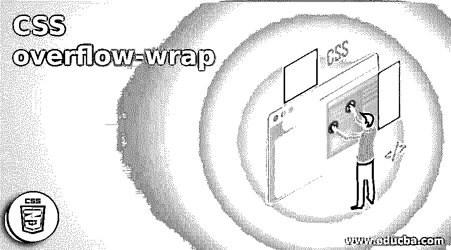
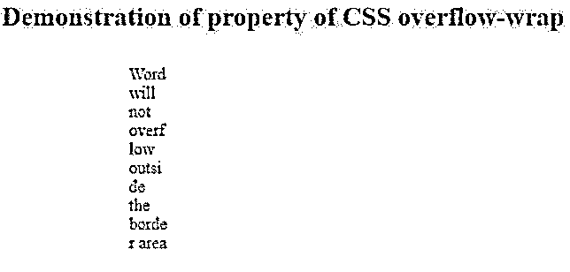
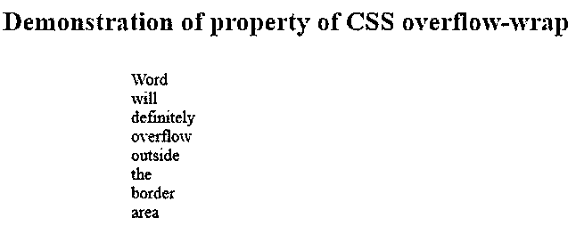
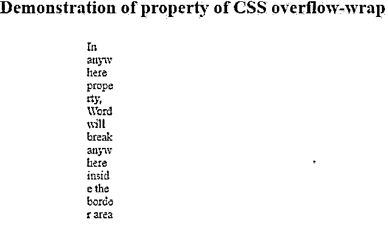

# CSS 溢出-换行

> 原文：<https://www.educba.com/css-overflow-wrap/>




## CSS 溢出-换行介绍

下面的文章提供了 CSS 溢出包装的概要。CSS overflow wrap 属性有助于将句子中的长单词在边界区域内特定的限定范围内换行。以便单词不会溢出到边框部分之外。利用它的各种参数值来获得一个更好的 HTML 用户界面设计，它符合你的项目中所要求的设计。在本文中，我们将通过许多示例来了解使用 CSS overflow wrap 属性来限制 HTML 页面边框区域内的文本的方法。

### CSS 溢出换行的语法

下面给出了 CSS 溢出-换行的语法:

<small>网页开发、编程语言、软件测试&其他</small>

```
overflow-wrap: anywhere|initial|break-word|normal|inherit;
```

您可能会好奇 CSS 溢出包装中的属性参数是什么？实际上，这些是溢出换行的各种类型的值，它们将阻止或溢出边框或区域内的文本。

要得到这个问题的答案，您需要参考下表，其中有提到各种参数值的定义/细节。

| **值** | **描述** |
| 常态 | 话语会从他们想要的边界流出来。这里一个字都不会断。只有当单词结束且新单词开始时，才会出现换行。Normal 是 CSS 溢出换行属性的默认值。 |
| 断字 | 在某些情况下，您可能会要求在任何情况下，句子中的单词都不能流出边界区域。在这些情况下，您应该将 CSS 溢出换行属性用作“断字”。为了将整个句子包含在其边框内，“break-word”属性将长单词分成几段以适合边框。 |
| 任何地方 | 当使用“anywhere”属性时，单词会在任意随机部分断开，因此长单词将位于它们指定的区域内。它通过随机分解句子中的单词来防止溢出。 |
| 最初的 | 初始值使溢出换行属性成为默认属性。 |
| 继承 | 子元素自动继承其父元素的特性。 |

### 溢出包装在 CSS 中是如何工作的？

*   我们必须利用 HTML 中 CSS 的基本语法，将 CSS 溢出换行的参数的所需属性放入到指定的边界区域内，以实现所需的句子换行，从而确保不会发生溢出。
*   溢出换行属性的概念基本上是从仅为 internet explorer 浏览器设计的自动换行属性中获得的。
*   之后支持所有其他浏览器，如 Safari，Chrome，opera，Firefox 等。CSS 中引入了溢出包装属性，所以使用这个包装功能。
*   在下一节中，您可以查看示例，以便了解如何通过在 CSS 中使用不同的溢出换行属性值来将单词包含在句子的边界线内。

### CSS 溢出-换行的示例

下面是一些例子:

#### 示例#1

在第一个示例中，我们将看到一个称为“断字”的溢出换行属性的图示。当 overflow wrap 的值为 break-word 时，单词将自动拆分成块，以便它可以包含在边框区域内。为了更好地理解，您还应该引用代码中的行内注释。

**代码:**

```
<!DOCTYPE html>
<html>
<head>
<style>
.ofw {
margin: 20px 51px 74px 105px;
padding: 10px 10px;
color: black;
background-color: yellow;
font-size: 15px;
width: 35px;
overflow-wrap: break-word; //declaring the overflow wrap property
}
div {
text-align: left;
}
h2 {
color: blue;
}
h2 {
text-align: left;
}
</style>
</head>
<body>
<h2>Demonstration of property of CSS overflow-wrap</h2>
<div class="ofw">
Word will not overflow outside the border area
</div>
</body>
</html>
```

**输出:**




如果你仔细看上面的输出，你会发现，这里的单词不会从它们指定的边界区域出来，因为我们使用了溢出换行的 CSS 属性作为“断字”。

#### 实施例 2

在第二种情况下，您将看到称为“正常”的溢出回绕属性的另一个示例。单词将流出边界线，但不会在边界线之间断开，以保持单词的连续性。

**代码:**

```
<!DOCTYPE html>
<html>
<head>
<style>
.ofw {
margin: 20px 51px 74px 105px;
padding: 10px 10px;
color: black;
background-color: yellow;
font-size: 15px;
width: 35px;
overflow-wrap: normal;
}
div {
text-align: left;
}
h2 {
color: blue;
}
h2 {
text-align: left;
}
</style>
</head>
<body>
<h2>Demonstration of property of CSS overflow-wrap</h2>
<div class="ofw">
Word will definitely overflow outside the border area
</div>
</body>
</html>
```

**输出:**




仔细检查上面的输出。这里的单词是从指定的边界区域出来的，因为我们使用了溢出换行的 CSS 属性作为“正常”。因此，在这种情况下，单词不会在中间断开，而是只有当一个单词结束并开始一个新单词时，才会自动应用断开。

#### 实施例 3

在此示例中，您将经历另一个称为“anywhere”的溢出包装属性的示例。在这里，单词的连续性被破坏，但是边界的包含保持完整，确保没有溢出。

**代码:**

```
<!DOCTYPE html>
<html>
<head>
<style>
.ofw {
margin: 20px 51px 74px 105px;
padding: 10px 10px;
color: black;
background-color: yellow;
font-size: 15px;
width: 35px;
overflow-wrap: anywhere;
}
div {
text-align: left;
}
h2 {
color: blue;
}
h2 {
text-align: left;
}
</style>
</head>
<body>
<h2>Demonstration of property of CSS overflow-wrap</h2>
<div class="ofw">
In anywhere property, Word will break anywhere inside the border area
</div>
</body>
</html>
```

**输出:**




参见上面的输出。在这里，单词在任意部分被打断，这样这些单词将保留在它们指定的边界区域内，因为我们将溢出换行的 CSS 属性用作“anywhere”。

### 结论

在本文中，我们用许多例子演示了在 HTML 页面的 CSS 代码中使用溢出换行属性值的方法。这篇文章对于从事 HTML 和 CSS 前端开发和设计的开发人员非常有益。

### 推荐文章

这是一个 CSS 溢出包装的指南。在这里，我们讨论 CSS 溢出包装的介绍，溢出包装如何与编程示例一起工作。您也可以看看以下文章，了解更多信息–

1.  [CSS 格式化程序](https://www.educba.com/css-formatter/)
2.  [CSS 选择器第 n 个子节点](https://www.educba.com/css-selector-nth-child/)
3.  [粘滞页脚 CSS](https://www.educba.com/sticky-footer-css/)
4.  [CSS 按钮边框](https://www.educba.com/css-button-border/)


