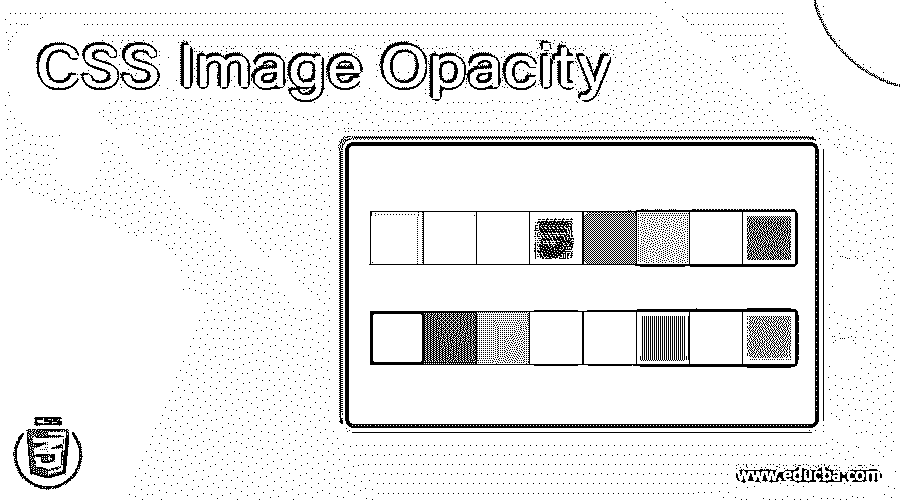
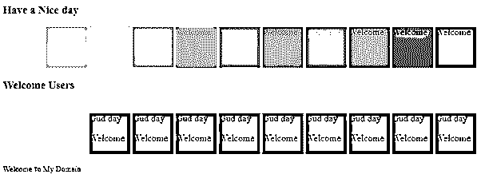
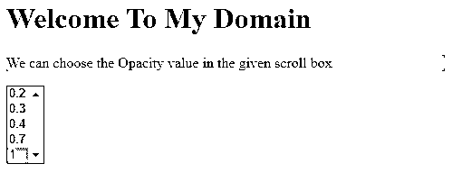
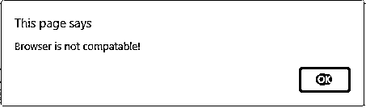

# CSS 图像不透明度

> 原文：<https://www.educba.com/css-image-opacity/>




## CSS 图像不透明度介绍

CSS 图像不透明度被定义为用于实现缺少透明度的图像质量的属性之一，这是通过使用从屏幕后面的元素的确切大小插入具有规则不透明度的伪元素来实现的；同时，不透明度水平将随着图像在网页屏幕中的位置而变化。无论我们在 css 中的不透明度属性中分配了什么值，该范围都将是应用程序的规定；在这些图像属性中，不透明度级别的范围是从 0.0 到 1.0。

**语法和参数**

<small>网页开发、编程语言、软件测试&其他</small>

CSS 代码是在 html 页面中使用样式标签编写的；我们可以遵循一些规则和语法来定制更有吸引力的网页。我们在大多数 web 应用程序中使用图像格式数据类型；图像格式有自己的属性，称为不透明度，具有用户指定的值。

```
<html>
<head>
<style>
.first
{
opacity:values; // value ranges from 0.0 to 1.0
}
--some css style codes with user specification values---
</style>
<body>

---some html codes-----
</body>
</html>
```

我们已经编写了上面的代码，它具有在网页中使用不透明图像的基本语法。这里的不透明度值是 css 样式属性的参数。

### 图像不透明度在 CSS 中是如何工作的？

在 CSS 样式的代码中，我们使用了很多属性，属性的默认值可以是文本，数字，特殊字符等等。使用这些类型的值，我们可以启用其 css 属性的特定属性，以使演示更具吸引力。我们可以在 html 代码中使用图像元素属性；它是一个默认的 html 标签，ID，或者一些内置的类。当我们在 html 图像中使用 css 不透明度时，基于标签的元素是默认的并且在 html 代码中最广泛使用的，用于插入图像的不透明度随着 css 样式的不同范围和呈现而增加，它也有助于 CSS 样式代码中的元素。因为

不透明度用于描述对象，即图像、视频、动画等任何东西。，它应该在 web 屏幕上完全可见，没有延迟，透明。在单个网页上，不透明(opacity)元素优化了 1 的值，其他全透明元素具有控制这些值的不透明度。如果该值被认为是 0 不透明度，则图像或视频动画，无论是什么对象，在网页屏幕上都是完全不可见的，但是该值被网页上的物理空间所占据。如果元素在屏幕中处于不可见状态，我们可以使用不透明属性以及在 CSS 中启用可见属性。我们知道 opacity 属性以两种不同的方式赋值；第一种方法是我们前面已经提到的不透明度属性元素已经用范围初始化了值。

但在第二种方式中，我们也可以指定阿尔法通道的价值与 RGBA 格式(红色，绿色，蓝色，阿尔法)的背景颜色的声明，我们也改变 R，G 和 B 的价值与我们的自定义格式，它指定了任何颜色的透明背景。它还指定了我们如何在透明元素中执行非透明子元素；通常，父元素的不透明度值将被描述给它的子元素；然而，我们使用透明的背景和不透明的子元素，同时保持它们的透明容器。

### CSS 图像不透明度的示例

以下是 CSS 图像不透明度的示例:

#### 示例#1

**代码:**

```
<!DOCTYPE html>
<html>
<head>
<title>Welcome To My Domain</title>
<style>
.first > div {
display: inline-block;
height: 70px;
width: 70px;
background: green;
}
div.second {
opacity: 0;
}
div.third {
opacity: 0.1;
}
div.four {
opacity: 0.2;
}
div.five {
opacity: 0.3;
}
div.six {
opacity: 0.4;
}
div.seven {
opacity: 0.5;
}
div.eight {
opacity: 0.6;
}
div.nine {
opacity: 0.7;
}
div.ten {
opacity: 0.8;
}
div.eleven {
opacity: 0.9;
}
div.twelve {
opacity: 1;
}
</style>
</head>
<body>
<div class="first">
<h3>Have a Nice day</h3>
<div class="second">Welcome</div>
<div class="third">Welcome</div>
<div class="four">Welcome</div>
<div class="five">Welcome</div>
<div class="six">Welcome</div>
<div class="seven">Welcome</div>
<div class="eight">Welcome</div>
<div class="nine">Welcome</div>
<div class="ten">Welcome</div>
<div class="eleven">Welcome</div>
<div class="twelve">Welcome</div>
</div>
<div class="first">
<h3>Welcome Users</h3>
<div class="second">
Have a nice Day
<p>Gud day</p>
</div>
<div class="second">
Welcome
<p>Welcome</p>
</div>
<div class="opacity80">
Gud day
<p>Welcome</p>
</div>
<div class="opacity70">
Gud day
<p>Welcome</p>
</div>
<div class="opacity60">
Gud day
<p>Welcome</p>
</div>
<div class="opacity50">
Gud day
<p>Welcome</p>
</div>
<div class="opacity40">
Gud day
<p>Welcome</p>
</div>
<div class="opacity30">
Gud day
<p>Welcome</p>
</div>
<div class="opacity20">
Gud day
<p>Welcome</p>
</div>
<div class="opacity10">
Gud day
<p>Welcome</p>
</div>
<div class="opacity0">
Gud day
<p>Welcome</p>
</div>
<p><small>Welcome <code>To</code> My Domain</small></p>
</div>
</body>
</html>
```

**输出:**




#### 实施例 2

**代码:**

```
<html>
<head>
<style>
.img
{
opacity:0.8;
filter: alpha(opacity=1);
background-color: red;
padding: 11px;
}
</style>
<body>

</body>
</html>
```

**输出:**


#### 实施例 3

**代码:**

```
<!DOCTYPE html>
<html>
<head>
<style>
#first {
background-color: pink;
}
</style>
</head>
<body>
<h1>Welcome To My Domain</h1>
<p id="first">We can choose the Opacity value in the given scroll box</p>
<select onchange="demo(this);" size="5">
<option>0.2
<option>0.3
<option>0.4
<option>0.7
<option selected="selected">1
</select>
<script>
function demo(i) {
var a = i.options[i.selectedIndex].text;
var b = document.getElementById("first");
if (b.style.a !== undefined) {
b.style.a = a;
} else {
alert("Browser is not compatable!");
}
}
</script>
</body>
</html>
```

**输出:**







在上面的三个例子中，我们已经在三个不同的场景和最终的例子中使用了不透明度值。如果用户基于需求从提到的不透明度值支持浏览器，它可能在 web 应用中变化。

### 结论

图像不透明度属性用于批评 html 和 CSS 中使用基于数字和字母字符的不透明度属性的图像属性。它也放在网页的正确位置，因为它也检查，不影响其他内容，如图像和动画。

### 推荐文章

这是一个 CSS 图像不透明度的指南。在这里，我们讨论图像不透明度如何在 CSS 和例子中工作，以及代码和输出。您也可以看看以下文章，了解更多信息–

1.  [CSS 子选择器](https://www.educba.com/css-child-selector/)
2.  [CSS 旋转文本](https://www.educba.com/css-rotate-text/)
3.  [CSS 文本颜色](https://www.educba.com/css-text-color/)
4.  [CSS 轮廓属性](https://www.educba.com/css-outline-property/)


