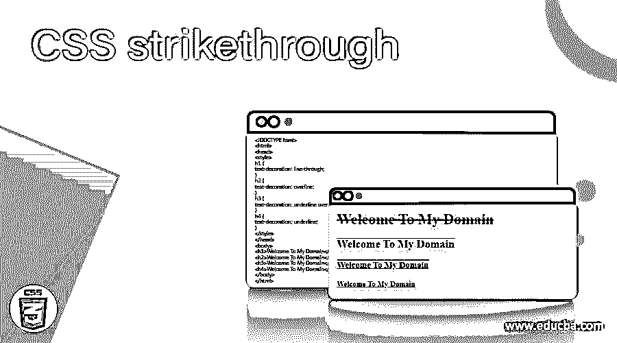
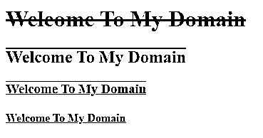
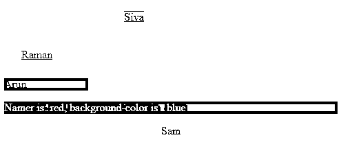
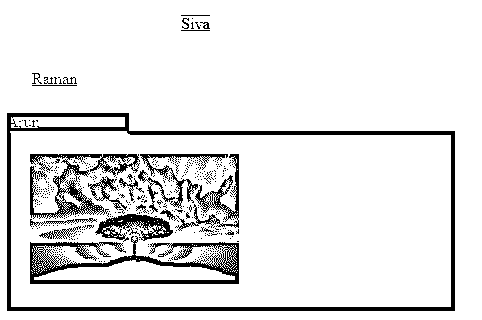

# CSS 删除线

> 原文：<https://www.educba.com/css-strikethrough/>

## CSS 删除线介绍

css 删除线什么都不是，但是每当我们启用文件中的 text-decoration 属性时，就会在 CSS 中创建带有删除线效果的文本数据。这也是 css 中的动画效果之一，在一些默认值的帮助下，比如线条是 text-decoration 属性提到的默认值之一。我们使用它作为内嵌或任何其他具有相同效果的样式表，内嵌和轮廓特性主要在

标签中启用，但选择器意味着我们要格式化 html 元素。

**语法和参数**

<small>网页开发、编程语言、软件测试&其他</small>

CSS 代码是在 html 页面中使用样式标签编写的；我们可以遵循一些规则和语法来定制更有吸引力的网页。我们使用文本格式类型作为所有 css 属性和它们的属性。

`<html>
<head>

</head>
<body>

--some  html codes---
</body>
</html>`

以上代码是 text-decoration 属性中 css 删除线值的基本代码；如果用户根据自己的需要更改这些值，它可能会有所不同。这里的参数是，我们可以在属性中指定值，也可以在代码中调用值。

### CSS 中的删除线是如何工作的？

在 CSS 样式代码中，我们使用了很多属性，带有默认值的属性。它可以是文本、数字、特殊字符等。;使用这些类型的值，我们可以启用它们的 css 属性的特定属性，以使演示更具吸引力。通过使用一些默认的 html 标签、ID 或一些内置的类，我们可以在基于 html 文本的元素中使用 css 颜色代码。当我们在基于 html 标签的元素中使用 css 删除线时,

# 是默认的，也是在 html 代码中最广泛使用的，用于使它们成为 css 样式的颜色和表示，它也帮助 CSS 中的任何元素。

# 主要是我们在 html 中使用的标签，因为

接下来，我们可以借助 html 网页中的 span 元素使用 css 删除线，就像我们使用

# 标题标签、

标签一样。尽管如此，html 中提供的元素是以默认 ID 给出的；这些 id 在样式代码的标题部分声明；ID 可以是任何使用的样式，与 html 标签中使用的样式相同。尽管如此，重要的一点是 id 值应该以特殊字符开始，如' # '符号；之后，我们可以使用任意数量的格式，如字母、数字等。借助于 span 元素，我们可以在 css 中对内联和轮廓元素使用删除线文本；这是在 css 样式表的文本装饰属性中添加删除线的方法之一。它也遵循上述两种方法，但不同之处是没有' # '符号。css 代码中的符号。

前缀值应该在点运算符中强制开始，否则 css 代码不会在 html 网页中使用，演示文稿不会在屏幕上显示。除了在

此外，css 使用了不同的属性集，并与文本、颜色、视频等相关联。并且基于一些数据在这些属性中被改变“颜色、方向、字母间距、单词间距、文本缩进、文本对齐、文本装饰、文本转换、空白和文本阴影”这些是一些默认的属性，这些属性已经在每个属性的样式代码中被使用，并且它有它们自己的 CSS 特性。

### CSS 删除线示例

以下是下面提到的例子

#### 示例#1

**代码:**

`<!DOCTYPE html>
<html>
<head>

</head>
<body>
<h1>Welcome To My Domain</h1>
<h2>Welcome To My Domain</h2>
<h3>Welcome To My Domain</h3>
<h4>Welcome To My Domain</h4>
</body>
</html>`

**输出:**

#### 实施例 2

**代码:**

`<!DOCTYPE html>
<html>
<head>
<title>Welcome To My Domain</title>

</head>
<body>

Siva

Raman

Arun

Namer is: red, background-color is : blue

Sam

</body>
</html>`

**输出:**

#### 实施例 3

**代码:**

`<!DOCTYPE html>
<html>
<head>
<title>Welcome To My Domain</title>

</head>
<body>

Siva

Raman

Arun

</body>
</html>`

**输出:**

### 结论

删除线文本是一个重要的属性，因为它用在具有基于文本的功能的 CSS 文本装饰属性中。它被放置在具有正确位置的网页中；它不影响其他内容，如图像和动画。

### 推荐文章

这是一个 CSS 删除线的指南。在这里，我们将讨论 CSS 中删除线的工作原理，以及代码和输出的例子。您也可以看看以下文章，了解更多信息–

1.  [CSS 链接颜色](https://www.educba.com/css-link-color/)
2.  [CSS 父选择器](https://www.educba.com/css-parent-selector/)
3.  [CSS 旋转文本](https://www.educba.com/css-rotate-text/)
4.  [CSS Viewport](https://www.educba.com/css-viewport/)

