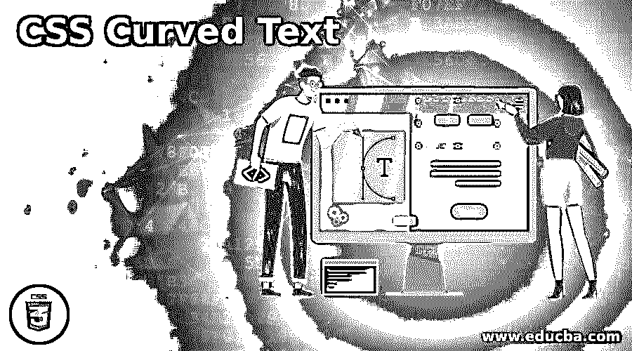
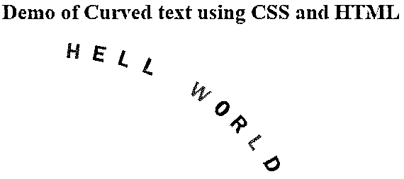

# CSS 弯曲文本

> 原文：<https://www.educba.com/css-curved-text/>




## CSS 弯曲文本介绍

以下文章提供了 CSS 弯曲文本的概要。有组织的表现是造型的根本。CSS 的理念是让页面/网站看起来完全符合要求。有一些直接的方法可以实现某些定制。然后，有一些间接的方法来实现特定的输出。弯曲文字恰好属于后一类。对于弯曲的文本，我们指的是沿着一条路径的文本，这条路径不是直的。它可以是锯齿形或圆形，或者任何优选的形状。这使得页面的标题突出。它也可以用于其他目的。

### 方法和例子

如上所述，CSS 中没有提供直接的属性来实现弯曲文本。但是，我们可以利用 transform 属性来创建弯曲的文本。这将包括将文本放置在彼此协调的不同角度，使得文本落在定义的轨迹上。我们将定义一些类，并在 HTML 页面上相应地调用它们，这样每个字母都以一定的角度放置，文本看起来是弯曲的。

<small>网页开发、编程语言、软件测试&其他</small>

#### 示例 1–使用外部 CSS 的弯曲文本。

形容词（adjective 的缩写）由于我们在这个例子中使用了外部 CSS，我们将首先从创建 CSS 页面开始。

b.正如在方法中看到的，我们将为这个例子创建许多类。这个想法是，一个单词的所有字母必须放在不同的角度，为此我们将创建一个不同的类，具有不同的变换程度。

碳（carbon 的缩写）让我们把 HELLO WORLD 这个术语打破。它分成 10 个字母。因此，如果我们遵循我们的方法，在这个例子中将定义 10 个类，每个类分别对应一个字母。

d.现在，每个字母的类可以编码如下。

```
.c1 {
transform: rotate(6deg);
color: violet;
}
.c2 {
transform: rotate(12deg);
color: indigo;
}
.c3 {
transform: rotate(18deg);
color: blue;
}
.c4 {
transform: rotate(24deg);
color: green;
}
.c5 {
transform: rotate(30deg);
color: yellow;
}
.c6 {
transform: rotate(36deg);
color: orange;
}
.c7 {
transform: rotate(43deg);
color: red;
}
.c8 {
transform: rotate(48deg);
color: purple;
}
.c9 {
transform: rotate(54deg);
color: goldenrod;
}
.c10 {
transform: rotate(60deg);
color: teal;
}
```

e.除了这些类之外，让我们以下面的方式来设计标题元素

# 的样式。

```
h1 span {
font-size: 26px ;
transform-origin: bottom;
font-family: 'Franklin Gothic Medium', 'Arial Narrow', Arial, sans-serif;
height: 300px;
width: 50px;
left: 50;
top: 50;
position: absolute;
}
```

氟（fluorine 的缩写）因此，最终的 CSS 代码应该是这样的。

```
h1 span {
font-size: 26px ;
transform-origin: bottom;
font-family: 'Franklin Gothic Medium', 'Arial Narrow', Arial, sans-serif;
height: 300px;
width: 50px;
left: 50;
top: 50;
position: absolute;
}
.c1 {
transform: rotate(6deg);
color: violet;
}
.c2 {
transform: rotate(12deg);
color: indigo;
}
.c3 {
transform: rotate(18deg);
color: blue;
}
.c4 {
transform: rotate(24deg);
color: green;
}
.c5 {
transform: rotate(30deg);
color: yellow;
}
.c6 {
transform: rotate(36deg);
color: orange;
}
.c7 {
transform: rotate(43deg);
color: red;
}
.c8 {
transform: rotate(48deg);
color: purple;
}
.c9 {
transform: rotate(54deg);
color: goldenrod;
}
.c10 {
transform: rotate(60deg);
color: teal;
}
```

g.既然 CSS 代码已经完成，我们将转移到示例的 HTML 部分。

h.现在，按照这种方法，每个字母将被写在不同的中，不同的类将被调用。这将确保每个字母放置的角度不同于其他字母。

我们将首先在 header 部分调用外部 CSS 文件。

```
<head>
<title>Hi There</title>
<link rel = "stylesheet" href = "curvedText.css">
</head>
```

j.转到正文部分，我们将在 Header

# 标记中调用总共十个 spanss，每个 span 代表 HELLO WORLD 这个术语的一个不同的字母。

```
<h1>
H
E
L
L
0
W
0
R
L
D
</h1>
```

k.结合正文和标题部分，最终的 HTML 页面应该是这样的。

```
<html>
<head>
<title> Demo of Curved text using CSS and HTML </title>
<link rel = "stylesheet" href = "curvedText.css">
</head>
<body>
<h2>Demo of Curved text using CSS and HTML</h2>
<h1>
H
E
L
L
0
W
0
R
L
D
</h1>
</body>
</html>
```

长度我们将保存这个 html 页面，并通过浏览器打开它。

最终的结果将是这样的:




米（meter 的缩写））正如我们在截图中看到的，由于每个字母以相等的角度放置，所以形成了一个圆形路径。可以试验这些角度，以获得所需的任何类型的路径。

#### 示例 2——使用内部 CSS 的弯曲文本。

形容词（adjective 的缩写）对于这个例子，我们将采用相同的逻辑，但是不使用外部 CSS 文件，我们将只在 HTML 页面的 head 部分的 style 标签


