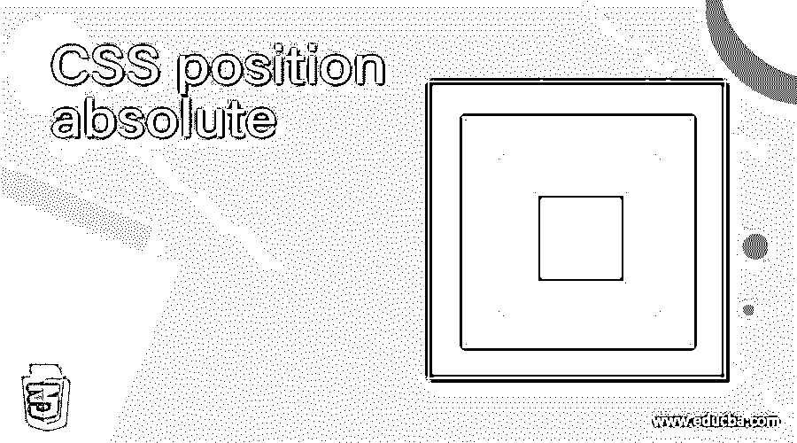
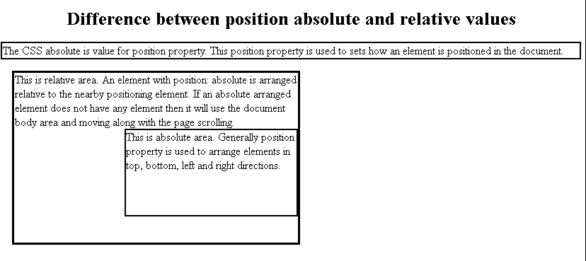
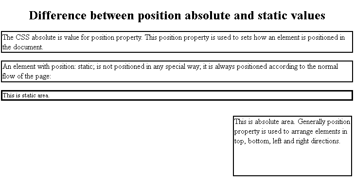
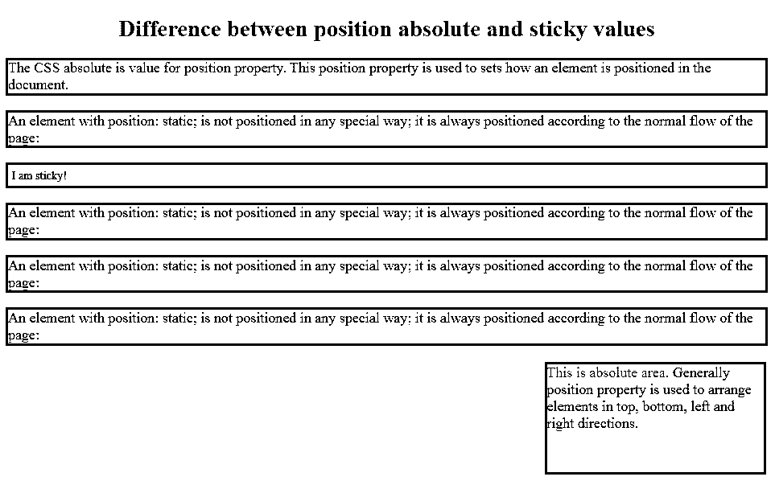

# CSS 绝对位置

> 原文：<https://www.educba.com/css-position-absolute/>




## 绝对 CSS 位置的定义

CSS absolute 是位置属性的值。此位置属性用于设置元素在文档中的定位方式。具有 position: absolute 的元素相对于附近的定位元素排列。如果一个绝对排列的元素没有任何元素，它将使用文档主体区域，并随着页面滚动而移动。通常，position 属性用于在上、下、左、右方向排列元素。

### position absolute 在 CSS 中是如何工作的？

绝对值正在处理此位置的位置属性:绝对值没有任何定位的祖先；它只使用文档正文。

<small>网页开发、编程语言、软件测试&其他</small>

**语法:**

```
div
{
Position: absolute;
}
```

位置属性包含 4 个值。他们是

1.  静电
2.  亲戚
3.  固定的
4.  粘的

为了更好地理解 absolute，我们必须知道所有位置属性值的其余部分。

**1。Static:position:** Static 是 position 属性的默认值。它不受顶部、左侧、右侧和底部属性的影响。

**语法:**

```
div
{
Position: static;
}
```

**2。Relative: position:** Relative 就是相对于它的正常位置定位的。它将受到顶部、左侧、右侧和底部属性的影响。

**语法:**

```
div
{
Position: relative;
}
```

**3。固定:位置:**固定相对于视口定位。这意味着即使我们滚动页面，它也总是停留在同一个地方。

**语法:**

```
div
{
Position: fixed;
}
```

**4。Sticky: position:** Sticky 用于基于页面滚动粘贴在特定位置。该元素总是在相对和固定之间切换。它就像是固定的，但开始滚动后会卡住。

**语法:**

```
div
{
Position: sticky;
}
```

### CSS 绝对位置示例

以下是不同的例子:

#### 示例 1–相对和绝对之间的差异

**代码:**

```
<!DOCTYPE html>
<html>
<head>
<style>
.rel {
margin: 20px;
position: relative;
height: 300px;
border: 4px solid blue;
width: 500px;
color: navy;
font-size: 20px;
}
.abs {
position: absolute;
width: 300px;
height: 150px;
top: 98px;
right: 0;
border: 3px solid brown;
font-size: 20px;
}
p
{
color: navy;
font-size: 20px;
border: 3px solid brown;
}
h1
{
color: green;
text-align: center;
}
span
{
color: red;
}
</style>
</head>
<body>
<h1>Difference between position absolute and relative values</h1>
<p>The CSS absolute is value for position property. This position property is used to sets how an element is positioned in the document.</p>
<div class="rel">This is relative area. An element with position: absolute is arranged relative to the nearby positioning element. If an absolute arranged element does not have any element then it will use the document body area and moving along with the page scrolling.
<div class="abs">This is absolute area. Generally position property is used to arrange elements in top, bottom, left and right directions.</div>
</div>
</body>
</html>
```

**输出:**




#### 示例 2–静态和绝对的区别

**代码:**

```
<!DOCTYPE html>
<html>
<head>
<style>
.stat {
position: static;
color: fuchsia;
border: 4px solid red;
}
.abs {
position: absolute;
width: 300px;
height: 150px;
color: fuchsia;
top: 300px;
right: 10px;
border: 3px solid brown;
font-size: 20px;
}
p
{
color: navy;
font-size: 20px;
border: 3px solid red;
}h1
{
color: blue;
text-align: center;
}
span
{
color: red;
}
</style>
</head>
<body>
<h1>Difference between position absolute and static values</h1>
<p>The CSS absolute is value for position property. This position property is used to sets how an element is positioned in the document.</p>
<p>An element with position: static; is not positioned in any special way; it is
always positioned according to the normal flow of the page:</p>
<div class="stat">
This is static area.
</div>
<div class="abs">This is absolute area. Generally position property is used to arrange elements in top, bottom, left and right directions.</div>
</div>
</body>
</html>
```

**输出:**




#### 示例 3–粘性和绝对的区别

**代码:**

```
<!DOCTYPE html>
<html>
<head>
<style>
.sti {
position: sticky;
top: 0;
padding: 5px;
background-color: lightgray;
border: 3px solid brown;
}
.abs {
position: absolute;
width: 300px;
height: 150px;
color: fuchsia;
top: 500px;
right: 10px;
border: 3px solid brown;
font-size: 20px;
}
p
{
color: navy;
font-size: 20px;
border: 3px solid red;
}h1
{
color: maroon;
text-align: center;
}
span
{
color: red;
}
</style>
</head>
<body>
<h1>Difference between position absolute and sticky values</h1>
<p>The CSS absolute is value for position property. This position property is used to sets how an element is positioned in the document.</p>
<p>An element with position: static; is not positioned in any special way; it is
always positioned according to the normal flow of the page:</p>
<div class="abs">This is absolute area. Generally position property is used to arrange elements in top, bottom, left and right directions.</div>
<div class="sti">I am sticky!</div>
<div style="padding-bottom:2000px">
<p>An element with position: static; is not positioned in any special way; it is
always positioned according to the normal flow of the page:</p>
<p>An element with position: static; is not positioned in any special way; it is
always positioned according to the normal flow of the page:</p>
<p>An element with position: static; is not positioned in any special way; it is
always positioned according to the normal flow of the page:</p>
</div>
</body>
</html>
```

**输出:**




### 结论

它是位置属性值。具有 position: absolute 的元素相对于附近的定位元素排列。如果一个绝对排列的元素没有任何元素，它将使用文档主体区域，并随着页面滚动而移动。

### 推荐文章

这是一个 CSS 绝对位置的指南。这里我们讨论 CSS 中绝对位置的工作原理，以及不同的例子和代码实现。您也可以阅读以下文章，了解更多信息——

1.  [CSS 计数器](https://www.educba.com/css-counter/)
2.  [CSS 溢出](https://www.educba.com/css-overflow/)
3.  [CSS 中的可见性](https://www.educba.com/visibility-in-css/)
4.  [文本装饰 CSS](https://www.educba.com/text-decoration-css/)


