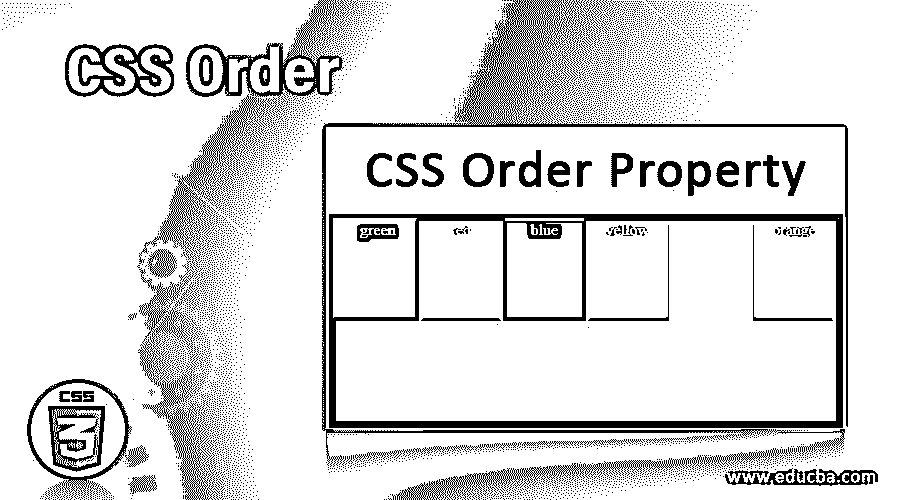
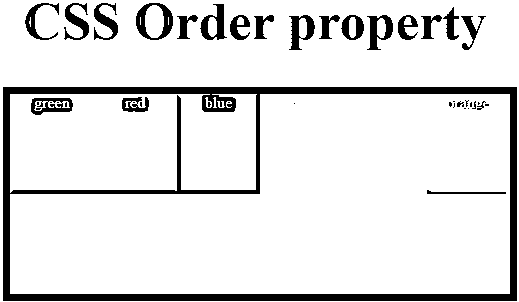
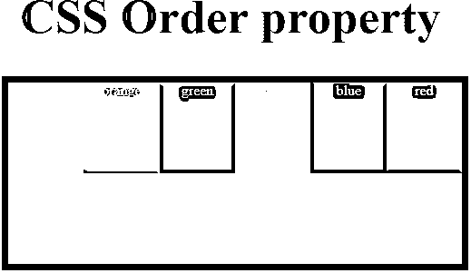
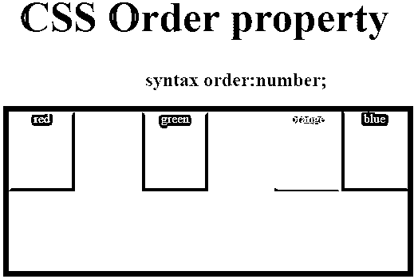

# CSS 顺序

> 原文：<https://www.educba.com/css-order/>




## CSS 顺序介绍

在这篇文章中，我们正在讨论 CSS 的一个顺序属性。此订单属性是灵活框布局模块的子属性。此属性用于在灵活容器中以某种顺序排列灵活项目。这些弹性项目按照弹性项目顺序值的升序或降序排列在元素中。因此，这个 order 属性可用于更改源文档中的排序。默认情况下，这些 flex 项目的列出顺序与源文档中的顺序相同。通常，order 属性用于相对于同一容器中的其他 flex 项目按顺序排列 flex 项目。

### CSS 顺序是如何工作的？

在 CSS 中，order 属性指定 flexes 项在容器内的元素布局中以升序或降序显示的顺序。Order 属性仅用于对可视元素进行排序，这不会影响逻辑 tab 键的顺序，因此它不能用于非可视媒体，如声音或语音媒体。因此，这个属性造成了 DOM 和元素内容的视觉呈现之间的脱节，这反过来会影响导航变低。这个 order 属性在一些主流浏览器中得到支持，如 Firefox、Google Chrome、Internet Explorer、Apple Safari、Opera 等。

<small>网页开发、编程语言、软件测试&其他</small>

让我们看看下面的语法和例子。如果元素中没有 flex 项目，则此属性无效。

**语法:**

```
order: integer | initial | inherit;
```

*   **integer:** 该值以整数值指定，即以数字表示。默认情况下，如果没有指定值，则此处的值为 0。
*   **初始:**用于将数值设置为默认值。
*   **inherit:** 该值取自其父元素的计算值，作为继承值。

通常，用户更喜欢将 order 属性值作为一个整数值，这样便于相应地指定项目的顺序。由于整数值可以是正值也可以是负值，因此 order 属性采用这两个值来排列元素布局中的 flex 项目。

### 实现 CSS 顺序的示例

让我们看一个在 CSS 中使用的 order 属性的一般例子，它同时使用了正和负的 order 属性值。以下是一些例子:

#### 示例#1

**代码:**

```
<!DOCTYPE html>
<html>
<head>
<title>Educba Training</title>
<style>
#main {
width: 500px;
height: 200px;
border: 7px solid black;
display: flex;
flex-wrap: nowrap;
margin-left:80px;
margin-bottom:80px;
}
#main div {
width: 250px;
height: 100px;
}
h1 {
color:#007700;
font-size:53px;
margin-left:70px;
margin-top:70px;
}
h3 {
margin-top:-20px;
margin-left:50px;
}
div#red1{order:-2;}
div#yellow1{order:0;}
div#green1{order:-3;}
div#pink1{oreder:1;}
div#orange1{orde4r:2;}
div#blue1{order:-1;}
div{
color:white;}
}
</style>
</head>
<body>
<center>
<h1>CSS Order property</h1>
<div id="main">
<div style="background-color:red;"id="red1">
red</div>
<div style="background-color:yellow;"id="yellow1">
yellow</div>
<div style="background-color:green;"id="green1">
green</div>
<div style="background-color:pink;"id="pink1">
pink</div>
<div style="background-color:orange;"id="orange1">
orange</div>
<div style="background-color:blue;"id="blue1">
blue</div>
</div>
</center>
</body>
</html>
```

**输出:**




**说明:**在上面的程序中，我们可以看到我们既指定了正数，也指定了负数。我们可以看到，首先显示的是负数，然后是零值的颜色，然后是正值。

#### 实施例 2

现在让我们看一个上面的 order 属性值的例子。

```
order: integer;
```

此属性值用于以数字形式指定顺序值，该数字可以是正数，也可以是负数，其中此属性为容器中的每一项指定数字。

**语法:**

```
order: number;
```

**代码:**

```
<!DOCTYPE html>
<html>
<head>
<title>Educba Training</title>
<style>
#main {
width: 500px;
height: 200px;
border: 7px solid black;
display: flex;
flex-wrap: nowrap;
margin-left:80px;
margin-bottom:80px;
}
#main div {
width: 250px;
height: 100px;
}
h1 {
color:#007700;
font-size:53px;
margin-left:70px;
margin-top:70px;
}
div#red1{order:6;}
div#yellow1{order:4;}
div#green1{order:3;}
div#pink1{oreder:1`;}
div#orange1{orde4r:2;}
div#blue1{order:5;}
div{
color:white;}
}
</style>
</head>
<body>
<center>
<h1>CSS Order property</h1>
<div id="main">
<div style="background-color:red;"id="red1">
red</div>
<div style="background-color:yellow;"id="yellow1">
yellow</div>
<div style="background-color:green;"id="green1">
green</div>
<div style="background-color:pink;"id="pink1">
pink</div>
<div style="background-color:orange;"id="orange1">
orange</div>
<div style="background-color:blue;"id="blue1">
blue</div>
</div>
</center>
</body>
</html>
```

**输出:**




**解释:**在上面的程序中，我们可以看到我们使用了 integer 属性值来指定颜色的顺序。在上面的程序中，我们有 6 种不同的颜色和不同的排列方式，我们可以看到我们给了粉红色为“1”，橙色为“2”，绿色为“3”，黄色为“4”，蓝色为“5”，红色为“6”。

订单:初始；当我们希望将顺序值设置为默认值时，将使用该属性值。这个性质可以用下面的例子来说明。

**语法:**

```
order: initial;
```

**代码:**

```
<!DOCTYPE html>
<html>
<head>
<title>Educba Training</title>
<style>
#main {
width: 500px;
height: 200px;
border: 7px solid black;
display: flex;
flex-wrap: nowrap;
margin-left:80px;
margin-bottom:80px;
}
#main div {
width: 250px;
height: 100px;
}
h1 {
color:#007700;
font-size:53px;
margin-left:70px;
margin-top:70px;
}
div{
order: initial;
color:white;}
}
</style>
</head>
<body>
<center>
<h1>CSS Order property</h1>
<div id="main">
<div style="background-color:red;"id="red1">
red</div>
<div style="background-color:yellow;"id="yellow1">
yellow</div>
<div style="background-color:green;"id="green1">
green</div>
<div style="background-color:pink;"id="pink1">
pink</div>
<div style="background-color:orange;"id="orange1">
orange</div>
<div style="background-color:blue;"id="blue1">
blue</div>
</div>
</center>
</body>
</html>
```

**输出:**




**说明:**在上面的程序中，我们可以看到 order 属性被指定为 initial，字体颜色为白色。该属性值显示了我们第一次尝试将哪种颜色作为第一种颜色时的颜色顺序。因此，最初阶段的顺序是红色为“1”，黄色为“2”，绿色为“3”，粉红色为“4”，橙色为“5”，蓝色为“6”。这样元素布局中的颜色项。

### 结论

在本文中，我们得出结论，CSS 的 order 属性用于按顺序排列 flex 项目。此属性是灵活框布局的子属性。该属性有不同的值，如整数值，可以有正值和负值，初始值是默认值，继承值是从父元素获取的值。order 属性的默认值为零。

### 推荐文章

这是一个 CSS 命令的指南。在这里我们讨论一个关于 CSS 顺序、语法的介绍，它是如何用例子来实现的。您也可以浏览我们的其他相关文章，了解更多信息——

1.  [CSS 位置](https://www.educba.com/css-position/)
2.  [CSS 光标](https://www.educba.com/css-cursor/)
3.  [CSS 验证器](https://www.educba.com/css-validator/)
4.  [CSS 颜色图表](https://www.educba.com/css-color-chart/)


