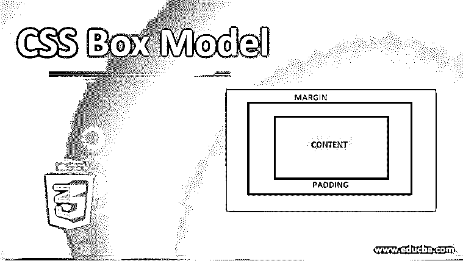
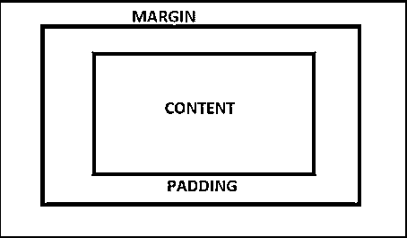
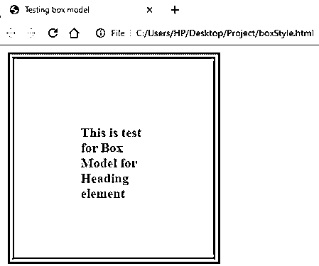
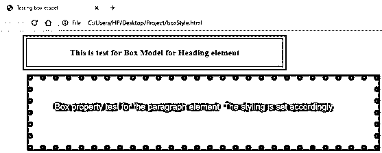
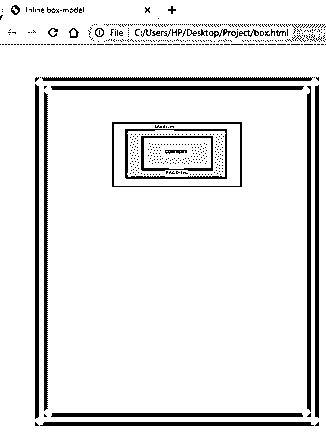

# CSS 盒子模型

> 原文：<https://www.educba.com/css-box-model/>




## CSS 盒子模型介绍

级联样式表为[提供了样式 HTML 元素](https://www.educba.com/html-form-elements/)。但是，为了设计元素的样式，我们必须了解 HTML 元素以及它们在 CSS 中的行为。设计网页最重要的部分之一是决定布局。如果元素在页面上的位置被恰当地规划，它可以变得动态和有响应性。页面的呈现取决于元素的呈现方式。在普通 HTML 中，如果我们使用不同的元素，它们会以队列的形式一个接一个地呈现。然而，CSS 为我们提供了一个定制这部分显示的选项，这是本文将要详细讨论的内容。CSS 的这一特性被称为盒子模型。每个元素可以等同于一个盒子， [CSS 让开发者决定这个盒子的各种参数来定制每个元素的呈现并创建页面的整体布局。](https://www.educba.com/what-is-css/)

### 盒子模型元素和语法

在盒子模型中主要有四个元素，盒子(元素)的行为依赖于它们。这些是:

<small>网页开发、编程语言、软件测试&其他</small>

*   **内容:**这是元素的主要内容。它可以是文本、链接、图像、视频或任何其他内容。
*   **填充:**这是内容与内容边框(是另一个元素)之间的间隙。
*   **Border:** 这可以可视化为元素内容的实体边界。
*   **边距:**这是特定页面上各种框之间保持的空间，即两个边框之间的空间。

**语法:**

```
element_name{
height:<value>;
width:<value>;
border:<value>;
padding: <value>;
margin:<value>;
}
```

箱形模型的图示为:




### 在 CSS 盒模型中实现的示例

现在让我们看看一些基本的例子，看看盒子模型在 CSS 中是如何工作的:

#### 1.为单个元素设计盒模型。

*   对于这个例子，我们将采用外部 CSS 方法来设计页面的样式。因此，首先，我们将创建一个 CSS 文件。
*   我们将为标题元素编写盒子模型样式，即

    ## 。我们将定义填充、边距和边框等元素。我们可以根据需要添加额外的功能，如背景颜色，字体大小，字体风格等。CSS 文件应该如下所示:

**代码:**

```
h2{
height: 100px;
width: 100px;
font-size: 20px;
padding: 100px;;
border: 10px double blueviolet;
margin: 10px;
background-color: lightcoral;
}
```

*   接下来，我们将创建一个 HTML 页面。由于我们使用外部 CSS，我们将主要在 HTML 页面中调用 CSS 文件。
*   我们将使用标题元素

    ## 来演示 CSS 文件中的布局样式。HTML 代码应该如下所示:

**代码:**

```
<html>
<head>
<title>Testing box model</title>
<link rel = "stylesheet" href = "box.css">
</head>
<body>
<h2>This is test for Box Model for Heading element</h2>
</body>
</html>
```

*   保存 HTML 文件并通过浏览器打开它会给出输出。应该和截图差不多:




#### 2.为页面上的多个元素设计布局。

*   对于这个例子，我们也将使用外部 CSS 方法。因此，我们将创建一个 CSS 文件。
*   我们将为标题元素

    ## 编写布局样式。我们还将修复文本属性。

    ## 的样式代码应该类似于下面的代码片段:

**代码:**

```
h2{
width: 500px;
font-size: 20px;
padding: 20px 50px;
border: 10px double blueviolet;
margin: 10px 50px;
background-color: lightcoral;
text-align: center;
}
```

*   接下来，我们将为段落元素编写一个类似的布局样式，即

    。代码应该是:

**代码:**

```
p{
height: 50px;
width: 700px;
padding: 50px;
border: 15px dotted blueviolet;
margin: 10px 60px;
background-color: lightslategrey;
color: white;
font-family: Arial, Helvetica, sans-serif;
font-size: 20px;
}
```

*   结合这两者，最终的 CSS 文件应该类似于下面的代码。请注意，更多的功能可以添加到这些按照网页的要求。

**代码:**

```
h2{
width: 500px;
font-size: 20px;
padding: 20px 50px;
border: 10px double blueviolet;
margin: 10px 50px;
background-color: lightcoral;
text-align: center;
}
p{
height: 50px;
width: 700px;
padding: 50px;
border: 15px dotted blueviolet;
margin: 10px 60px;
background-color: lightslategrey;
color: white;
font-family: Arial, Helvetica, sans-serif;
font-size: 20px;
}
```

*   现在 CSS 文件已经完成，我们将编码 HTML 页面。像前面的例子一样，我们将首先在 HTML 页面中调用外部样式表。
*   现在，我们将利用

    ## 和

    为页面编写代码。编码应该如下所示:

**代码:**

```
<html>
<head>
<title>Testing box model</title>
<link rel = "stylesheet" href = "box.css">
</head>
<body>
<h2>This is test for Box Model for Heading element</h2>
<p>Box property test for the paragraph element. The styling is set accordingly.</p>
</body>
</html>
```

*   在保存 HTML 文件并通过浏览器打开它之后，可以观察到最终的输出。应该是这样的:

**输出:**




#### 3.使用 box-model 作为内嵌 CSS，以图像作为内容。

*   因为我们在这个例子中使用了内联样式 CSS，所以我们将在 HTML 代码中为段落元素

    设置布局样式。这个内联样式代码应该如下所示:

**代码:**

```
<p style="height:400px; width: 200px; padding: 50px 100px; border: 20px double greenyellow; margin: 50px 50px;"></p>
```

*   因为我们应该使用图像作为内容，所以我们将图像放在项目文件夹中，并使用元素调用

    标记中的图像，如下所示:

**代码:**

```
<p style="height:400px; width: 200px; padding: 50px 100px; border: 20px double greenyellow; margin: 50px 50px;">

</p>
```

*   最终的 HTML 页面应该是这样的:

**代码:**

```
<html>
<head>
<title>Inline box-model</title>
</head>
<body>
<p style="height:400px; width: 200px; padding: 50px 100px; border: 20px double greenyellow; margin: 50px 50px;">

</p>
</body>
</html>
```

**输出:**




**Note:** Please note the height and width of the image can be decided in accordance with the height and width of the box being styled for the element.

*   上面的例子给出了盒子模型在 CSS 中工作的基本概念。这可以用来决定各种元素应该如何分布在页面上。定制特性并尝试所有参数的不同选项将对此有一个更广泛的想法。

### 推荐文章

这是一个 CSS 盒子模型的指南。这里我们讨论 CSS 盒子模型的介绍以及实现盒子模型的例子。您也可以浏览我们的其他相关文章，了解更多信息——

1.  [CSS 内联样式](https://www.educba.com/css-inline-style/)
2.  [CSS 分页](https://www.educba.com/css-pagination/)
3.  [什么是 CSS？](https://www.educba.com/what-is-css/)
4.  [HTML 中的 SUP 标签](https://www.educba.com/sup-tag-in-html/)


