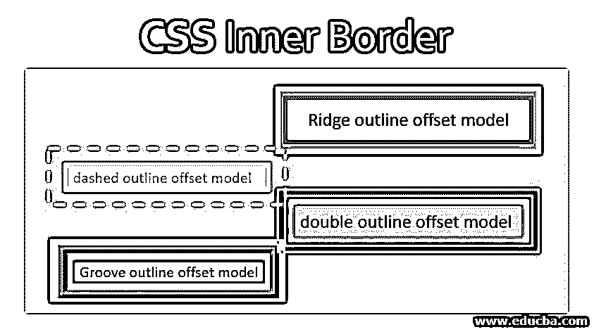
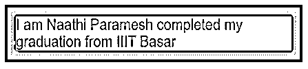
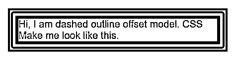
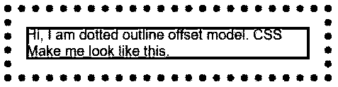
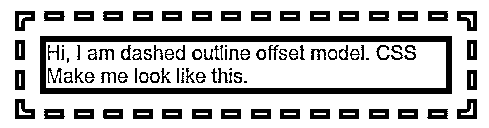
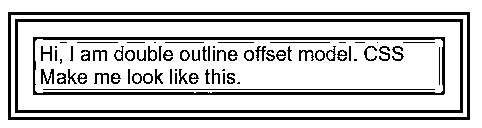
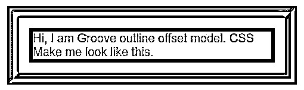
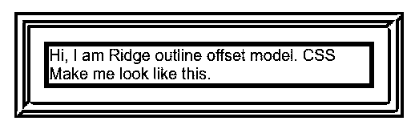
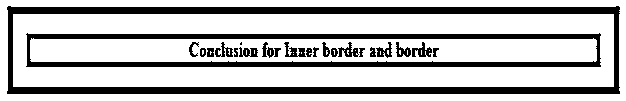

# CSS 内部边框

> 原文：<https://www.educba.com/css-inner-border/>




## CSS 内部边框介绍

内边框什么也不是，只是在边框和轮廓属性或元素之间创建的空间。我们可以将内边框应用于段落和标题的文本、表格内容和图像。没有限制内边界总是矩形或正方形，它可以是任何形状。

内边框的矩形边框形状:

<small>网页开发、编程语言、软件测试&其他</small>




内边框的矩形边框-半径形状:


上面两张图片的结论是，内边框可以是任何形状。

### 内边框的工作原理

内部边框正在处理名为 outline 和 outline-offset 的属性。Outline 属性分别描述元素边框大小、边框类型和边框颜色。

**语法:**

```
div{
outline: 10px solid green;
}
```

轮廓偏移描述边框和轮廓元素之间的距离或间距。

**语法:**

```
div{
outline-offset: 10px;
}
```

### CSS 内部边框的语法示例

下面是 CSS 内部边框的例子:

#### 轮廓边框有多种类型

*   实心:它给边框以实心，就像粗体文本一样。
*   **虚线:**用虚线给出边框。
*   **虚线:**用虚线给出边框。
*   **Double:** 它以双实线给出边框。
*   **凹槽:**它给外部弯曲的边缘作为边界。
*   **脊:**它提供内部弯曲边缘作为边界(与凹槽功能相反)。

#### 示例# 1–带实线边框的轮廓和偏移。

**语法:**

```
div{
outline: 10px solid green;
outline-offset: 10px;
}
```

**代码:**

```
<!DOCTYPE html>
<html>
<head>
<title>SolidOutline</title>
</head>
<style>
.solid {
width:400px;
length:100px;
margin: 40px 40px 40px 180px;
font-size:20px;
font-family:sans-serif;
border: 6px solid blue;
background-color: orange;
outline: 10px solid green;
outline-offset: 5px ;
}
</style>
<body>
<div class="solid">
Hi, I am dashed outline offset model. CSS Make me look like this.
</div>
</body>
</html>
```

**输出:**




#### 示例 2–轮廓和偏移虚线边框

**语法:**

```
div{
outline: 10px dotted blue;
outline-offset: 15px;
}
```

**代码:**

```
<!DOCTYPE html>
<html>
<head>
<title>DottedOutline</title>
</head>
<style>
.dotted {
width:400px;
length:100px;
margin: 40px 40px 40px 180px;
font-size:20px;
font-family:sans-serif;
border: 6px solid yellow;
background-color: brown;
outline: 10px dotted purple ;
outline-offset: 15px ;
}
</style>
<body>
<div class="dotted">
Hi, I am dotted outline offset model. CSS Make me look like this.
</div>
</body>
</html>
```

**输出:**




#### 示例# 3–带虚线边框的轮廓和偏移

**语法:**

```
div{
outline: 10px dashed blue;
outline-offset: 12px;
}
```

**代码:**

```
<!DOCTYPE html>
<html>
<head>
<title>DashedOutline</title>
</head>
<style>
.dashed {
width:400px;
length:100px;
margin: 40px 40px 40px 180px;
font-size:20px;
font-family:sans-serif;
border: 6px solid brown;
background-color: silver;
outline: 10px dashed red ;
outline-offset: 15px ;
}
</style>
<body>
<div class="dashed">Hi, I am dashed outline offset model. CSS Make me look like this. </div>
</body>
</html>
```

**输出:**




#### 示例# 4–带双边框的轮廓和偏移

**语法:**

```
div{
outline: 10px double brown;
outline-offset: 13px;
}
```

**代码:**

```
<!DOCTYPE html>
<html>
<head>
<title>DoubleOutline</title>
</head>
<style>
.double {
width:400px;
length:100px;
margin: 40px 40px 40px 180px;
font-size:20px;
font-family:sans-serif;
border: 6px solid orange;
background-color: yellow;
outline: 10px double maroon ;
outline-offset: 15px ;
}
</style>
<body>
<div class="double">Hi, I am double outline offset model. CSS Make me look like this. </div>
</body>
</html>
```

**输出:**




#### 示例# 5–带凹槽边框的轮廓和偏移

**语法:**

```
div{
outline: 10px groove yellow;
outline-offset: 14px;
}
```

**代码:**

```
<!DOCTYPE html>
<html>
<head>
<title>GrooveOutline</title>
</head>
<style>
.groove {
width:400px;
length:100px;
margin: 40px 40px 40px 180px;
font-size:20px;
font-family:sans-serif;
border: 6px solid black;
background-color: gray;
outline: 20px groove teal ;
outline-offset: 17px ;
}
</style>
<body>
<div class="groove">Hi, I am Groove outline offset model. CSS Make me look like this. </div>
</body>
</html>
```

**输出:**




#### 示例# 6–带脊线边框的轮廓和偏移

**语法:**

```
div{
outline: 10px ridge silver;
outline-offset: 10px;
}
```

**代码:**

```
<!DOCTYPE html>
<html>
<head>
<title>RidgeOutline</title>
</head>
<style>
.ridge {
width:400px;
length:100px;
margin: 40px 40px 40px 180px;
font-size:20px;
font-family:sans-serif;
border: 6px solid navy;
background-color: orange;
outline: 20px ridge teal ;
outline-offset: 17px ;
}
</style>
<body>
<div class="ridge">Hi, I am Ridge outline offset model. CSS Make me look like this.       </div>
</body>
</html>
```

**输出:**




### 结论

内部边框总是在边框和外部元素之间创建空间，边框创建从文本到顶部的空间，而轮廓边框在边框到外部元素之间创建空间。

**结论类比:**




黑色是在顶部和文本之间创建的边框，内部边框是在边框轮廓之间创建的绿色。

### 推荐文章

这是一个 CSS 内部边框的指南。这里我们讨论一下内边框的介绍，工作原理，以及不同的例子。您也可以看看以下文章，了解更多信息–

1.  [CSS 选择器的类型](https://www.educba.com/types-of-css-selectors/)
2.  [菜单图标 CSS](https://www.educba.com/menu-icon-css/)
3.  [CSS 边框填充](https://www.educba.com/css-border-padding/)
4.  [CSS 闪烁文本](https://www.educba.com/css-blinking-text/)


