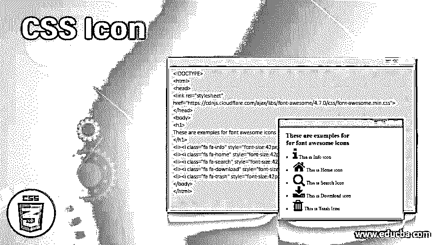
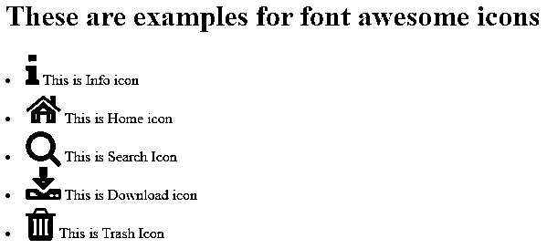
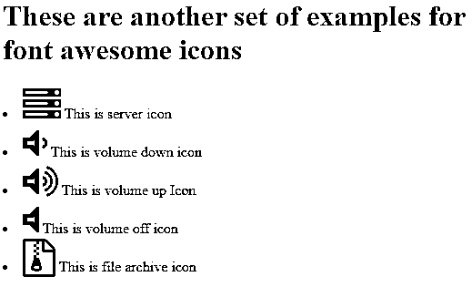
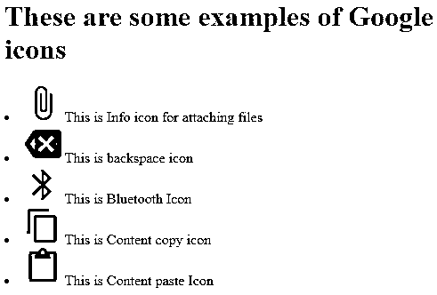
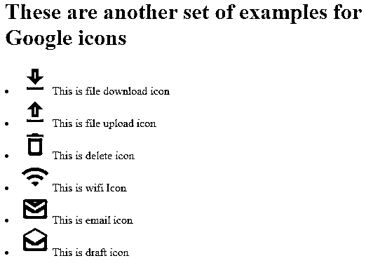
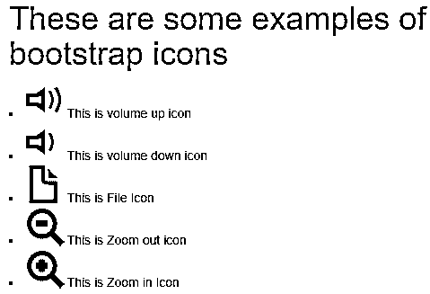
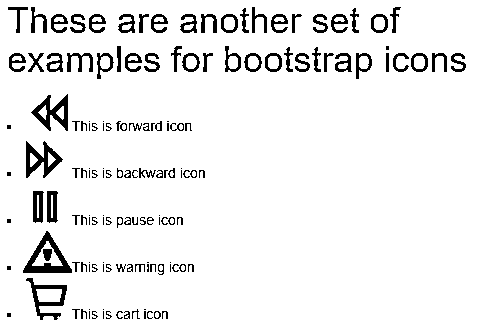

# CSS 图标

> 原文：<https://www.educba.com/css-icon/>




## CSS 图标的定义

CSS icons 帮助编码人员使用内容交付网络的一些库中可用的过多图标，以便编码人员可以随时使用它们(无需下载它们)，使他们的前端 UI 更有吸引力、更吸引人和用户友好。这些图标基本上减少了用户界面中裸露的文本元素，增加了可读性，并为最终用户提供了更吸引眼球的外观。在这篇文章中，我们将通过许多例子来学习如何使用 CSS 图标。

### 语法和参数

我们可以在 HTML 页面中使用许多可用的图标库，以便在 CSS 的帮助下在代码中使用它们。这些库有大量的图标，可以在使用 CSS 的 HTML 代码中免费使用，以提供对最终用户更有吸引力的良好外观。一旦您在代码中导入或链接了一个库，您就可以自由地使用库中的任何图标。

<small>网页开发、编程语言、软件测试&其他</small>

您需要使用以下语法导入库:

```
<link rel="stylesheet" href="<link of the libraries>">
```

您可以查看示例部分，我们将如何在不同情况下使用库来使用我们想要的图标

### 什么是 CSS 图标？

以下是大多数情况下可用的不同类型的图标:

1.  字体牛逼库中的图标:[https://cdnjs.cloudflare.com/](https://cdnjs.cloudflare.com/ajax/libs/font-awesome/4.7.0/css/font-awesome.min.css)
2.  谷歌图书馆的图标:[https://fonts.googleapis.com/](https://fonts.googleapis.com/icon?family=Material+Icons)
3.  字体引导库的图标:[https://maxcdn.bootstrapcdn.com/](https://maxcdn.bootstrapcdn.com/bootstrap/3.3.7/css/bootstrap.min.css)

它们中的每一个都包含了大量的图标，你可以在例子中使用它们。完整列表可在相应的链接中找到。

### CSS 图标示例

下面是一些例子:

#### 示例#1

我们将看到一些字体真棒图标的例子。这是借助 CSS 在 HTML 代码中使用图标的最简单的方法。在你的代码中链接了字体图标库之后，你需要把需要的类放到元素中来使用它。不需要手动下载。仔细看看我们是如何导入字体图标库的，然后在 CSS 的帮助下，我们在 HTML 代码中使用了这些图标。

**代码:**

```
<!DOCTYPE>
<html>
<head>
<link rel="stylesheet"
href="https://cdnjs.cloudflare.com/ajax/libs/font-awesome/4.7.0/css/font-awesome.min.css">
</head>
<body>
<h1>
These are examples for font awesome icons
</h1>
<li><i class="fa fa-info" style="font-size:42px;"></i>  This is Info icon</li>
<li><i class="fa fa-home" style="font-size:42px;"></i>  This is Home icon</li>
<li><i class="fa fa-search" style="font-size:42px;"></i>  This is Search Icon</li>
<li><i class="fa fa-download" style="font-size:42px;"></i>  This is Download icon</li>
<li><i class="fa fa-trash" style="font-size:42px;"></i>  This is Trash Icon</li>
</body>
</html>
```

**输出:**




#### 实施例 2

我们将会看到更多字体图标的例子。

**代码:**

```
<!DOCTYPE>
<html>
<head>
<link rel="stylesheet"
href="https://cdnjs.cloudflare.com/ajax/libs/font-awesome/4.7.0/css/font-awesome.min.css">
</head>
<body>
<h1>
These are another set of examples for font awesome icons
</h1>
<li><i class="fa fa-server" style="font-size:42px;"></i>  This is server icon</li>
<li><i class="fa fa-volume-down" style="font-size:42px;"></i>  This is volume down icon</li>
<li><i class="fa fa-volume-up" style="font-size:42px;"></i>  This is volume up Icon</li>
<li><i class="fa fa-volume-off" style="font-size:42px;"></i>  This is volume off icon</li>
<li><i class="fa fa-file-archive-o" style="font-size:42px;"></i>  This is file archive icon</li>
</body>
</html>
```

**输出:**




#### 实施例 3

我们将看到一些谷歌图标的例子。这是另一种借助谷歌图标库在 HTML 代码中使用图标的技术。在你的代码中链接了 Google 图标库之后，你需要把想要的类添加到元素中来使用它。这里不需要手动下载。观察我们是如何导入 Google 图标库的，然后我们在 HTML 代码中借助 CSS 使用了该库中的一些图标。

**代码:**

```
<!DOCTYPE>
<html>
<head>
<link rel="stylesheet"
href="https://fonts.googleapis.com/icon?family=Material+Icons">
</head>
<body>
<h1>
These are some examples of Google icons
</h1>
<li><i class="material-icons" style="font-size:42px;">attach_file</i>  This is Info icon for attaching files</li>
<li><i class="material-icons" style="font-size:42px;">backspace</i>  This is backspace icon</li>
<li><i class="material-icons" style="font-size:42px;">bluetooth</i>  This is Bluetooth Icon</li>
<li><i class="material-icons" style="font-size:42px;">content_copy</i>  This is Content copy icon</li>
<li><i class="material-icons" style="font-size:42px;">content_paste</i>  This is Content paste Icon</li>
</body>
</html>
```

**输出:**




#### 实施例 4

我们会看到更多谷歌图标的例子。

**代码:**

```
<!DOCTYPE>
<html>
<head>
<link rel="stylesheet"
href="https://fonts.googleapis.com/icon?family=Material+Icons">
</head>
<body>
<h1>
These are another set of examples for Google icons
</h1>
<li><i class="material-icons" style="font-size:42px;">file_download</i>  This is file download icon </li>
<li><i class="material-icons" style="font-size:42px;">file_upload</i>  This is file upload icon </li>
<li><i class="material-icons" style="font-size:42px;">delete</i>  This is delete icon</li>
<li><i class="material-icons" style="font-size:42px;">wifi</i>  This is wifi Icon</li>
<li><i class="material-icons" style="font-size:42px;">email</i>  This is email icon</li>
<li><i class="material-icons" style="font-size:42px;">drafts</i>  This is draft icon</li>
</body>
</html>
```

**输出:**




#### 实施例 5

我们将看到一些引导图标的例子。这是使用图标最流行的方法之一。不需要手动下载引导图标，你需要在代码中链接这个库并从中添加图标类，这就足够了。浏览代码，了解我们是如何导入字体图标库的，然后在 CSS 的帮助下，我们在 HTML 代码中使用了该库中的一些图标。

**代码:**

```
<!DOCTYPE>
<html>
<head>
<link rel="stylesheet"
href="https://maxcdn.bootstrapcdn.com/bootstrap/3.3.7/css/bootstrap.min.css">
</head>
<body>
<h1>
These are some examples of bootstrap icons
</h1>
<li><i class="glyphicon glyphicon-volume-up" style="font-size:42px;"></i>  This is volume up icon</li>
<li><i class="glyphicon glyphicon-volume-down" style="font-size:42px;"></i>  This is volume down icon</li>
<li><i class="glyphicon glyphicon-file" style="font-size:42px;"></i>  This is File Icon</li>
<li><i class="glyphicon glyphicon-zoom-out" style="font-size:42px;"></i>  This is Zoom out icon</li>
<li><i class="glyphicon glyphicon-zoom-in" style="font-size:42px;"></i>  This is Zoom in Icon</li>
</body>
</html>
```

**输出:**




#### 实施例 6

我们将会看到更多引导图标的例子。

**代码:**

```
<!DOCTYPE>
<html>
<head>
<link rel="stylesheet"
href="https://maxcdn.bootstrapcdn.com/bootstrap/3.3.7/css/bootstrap.min.css">
</head>
<body>
<h1>
These are another set of examples for bootstrap icons
</h1>
<li><i class="glyphicon glyphicon-backward" style="font-size:42px;"></i>  This is forward icon</li>
<li><i class="glyphicon glyphicon-forward" style="font-size:42px;"></i>  This is backward icon</li>
<li><i class="glyphicon glyphicon-pause" style="font-size:42px;"></i>  This is pause icon</li>
<li><i class="glyphicon glyphicon-warning-sign" style="font-size:42px;"></i>  This is warning icon</li>
<li><i class="glyphicon glyphicon-shopping-cart" style="font-size:42px;"></i>  This is cart icon</li>
</body>
</html>
```

**输出:**




### 结论

这个话题到此结束。这里我们讨论了大量的例子，展示了我们在日常生活中与网页、智能手机等交互时经常看到的 CSS 图标。通过实现这些技术，您还可以在前端开发 UI 中放置不同的图标。这对网页设计者会有帮助。

### 推荐文章

这是一个 CSS 图标指南。这里我们也讨论一下 css 图标的定义和是什么？以及不同的示例及其代码实现。您也可以看看以下文章，了解更多信息–

1.  [CSS 背景图片](https://www.educba.com/css-background-image/)
2.  [CSS 向下箭头](https://www.educba.com/css-arrow-down/)
3.  [CSS 屏蔽](https://www.educba.com/css-masking/)
4.  [CSS 加载器](https://www.educba.com/css-loader/)


