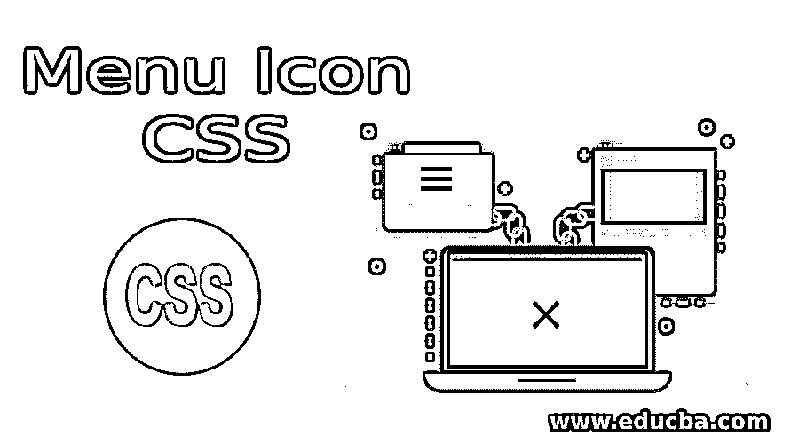
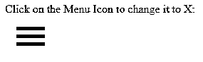
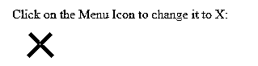

# 菜单图标 CSS

> 原文：<https://www.educba.com/menu-icon-css/>




## CSS 中菜单图标的介绍

我们所访问的网页，已经以飞速的速度发展，并且还在继续发展。然而，页面的基本结构仍然与早期的页面相似，并添加了更多的动态。有些东西是网页必须强制拥有的。用于验证网页的一个这样的检查点是三栏菜单图标，点击后，它像手风琴一样打开，向访问者提供他们在网站上可以浏览的所有内容的概览。

### CSS 中菜单图标的例子

在这篇文章中，我们将探索如何在 CSS 和 HTML 的帮助下创建菜单图标的各种方法。让我们来看看这个例子:

<small>网页开发、编程语言、软件测试&其他</small>

#### 例子# 1–通过 CSS 创建一个基本的菜单图标。

我们将编写一个简单的 CSS 代码来创建具有特定高度和宽度的栏，并在 HTML 页面中调用标记三次，以获得结果三栏图标。

形容词（adjective 的缩写）创建一个样式表(即 MenuIcon.css ),并为

标记编写如下定义:

```
div {
width: 35px;
height: 5px;
background-color: black;
margin: 6px 0;
}
```

b.现在，创建一个 HTML 页面，TestIcon.html。我们将调用样式表并使用它来创建一个菜单。

```
<html>
<head>
<link rel = "stylesheet" href = "MenuIcon.css">
</head>
<body>
<div></div>
<div></div>
<div></div>
</body>
</html>
```

碳（carbon 的缩写）保存页面，通过 IE/Chrome/Firefox 打开 HTML 文件，看结果。在页面的左上角会有一个菜单图标。


在这个例子中，已经指定了每个水平条的高度和宽度。边距在每个栏和黑色背景色之间增加了一些距离，突出了每个栏，看起来就像一个菜单栏。

#### 例子# 2——用 CSS 制作菜单图标动画。

形容词（adjective 的缩写）在这个例子中，bar 已经创建了一个 CSS 类菜单，在这个菜单中我们为 div 创建了规范，并创建了它的 CSS 伪元素，即 After 和 Before。定义了菜单的大小，这将封装菜单图标的条，定义了 div 的大小和边距，这将是中间条，前后的伪元素将是菜单图标的上下条。

```
.menu{
margin: 1em;
width: 40px;
}
.menu:after,
.menu:before,
.menu div {
background-color:black;
border-radius: 3px;
content: '';
display: block;
height: 5px;
margin: 7px 0;
transition: all .2s ease-in-out;
}
```

b.现在，我们将使用第一个和第三个条来制作图标的动画，它们是前后的伪元素。

```
.menu:hover:before {
transform: translateY(12px) rotate(135deg);
}
.menu:hover:after {
transform: translateY(-12px) rotate(-135deg);
}
.menu:hover div {
transform: scale(0);
}
```

碳（carbon 的缩写）动画的逻辑是这样的，当鼠标悬停在上面时，上栏(前)和下栏(后)旋转到指定的角度和方向。悬停时，中间的条(格)变为 0，即消失。

d.下面是这个动画的完整 CSS 代码:(menuIcon.css)

```
.menu{
margin: 1em;
width: 40px;
}
.menu:after,
.menu:before,
.menu div {
background-color:black;
border-radius: 3px;
content: '';
display: block;
height: 5px;
margin: 7px 0;
transition: all .2s ease-in-out;
}
/* Move the upper bar */
.menu:hover:before {
transform: translateY(12px) rotate(135deg);
}
/* Move the lower bar */
.menu:hover:after {
transform: translateY(-12px) rotate(-135deg);
}
/* Make the mid bar fade out */
.menu:hover div {
transform: scale(0);
}
```

e.现在，我们将通过一个 HTML 文件使用这个 CSS 代码来查看最终的输出。

```
<html>
<head>
<link rel = "stylesheet" href = "MenuIcon.css">
</head>
<body>
p>Hover over the Menu Icon to change it to X:</p>
<div class="menu">
<div></div>
</div>
</body>
</html>
```

同样的输出是:


#### 示例 3–**编写 CSS 和 JavaScript 函数来激活菜单图标。**

形容词（adjective 的缩写）另一种方法是用每个条的变换创建一个 CSS 图标，并在点击时通过 javaScript 函数调用它。

b.为了编写 CSS 代码，我们将定义一个类似于前面例子的菜单类。我们将为每个条形创建三个类(before、mid 和 after)，而不是伪元素。我们将在每个图标上应用相应的转换逻辑，并准备好我们的 CSS 代码(menuIcon2.css)

```
.menu{
margin: 1em;
width: 40px;
}
.before, .mid, .after {
background-color: #333;
width: 40px;
height: 5px;
margin: 6px 0;
transition: all .2s ease-in-out;
}
/* Animate bar#1 */
.change .before {
transform: rotate(-45deg) translate(-9px, 6px) ;
}
/* make bar#2 vanish post tranformation */
.change .mid {
transform: scale(0);
}
/* Animate bar#3 */
.change .after {
transform: rotate(45deg) translate(-8px, -8px) ;
}
```

碳（carbon 的缩写）一旦这个 CSS 代码准备好了，我们将编写一个小函数来触发菜单图标到十字图标的转换。我们将在 HTML 文件中调用这个函数，这样在单击鼠标时，icon 就会转换为 X。

```
function menuIcon(x) {
x.classList.toggle("change");
}
```

d.我们将在 HTML 文件的

```
<html>
<head>
<link rel = "stylesheet" href = "MenuIcon2.css">
<script>
function menuIcon(x) {
x.classList.toggle("change");
}
</script>
</head>
<body>
<p>Click on the Menu Icon to change it to X:</p>
<div class="menu" onclick="menuIcon(this)">
<div class="before"></div>
<div class ="mid"></div>
<div class="after"></div>
</div>
</body>
</html>
```

e.当我们检查 HTML 文件时，输出应该是这样的:




单击菜单图标时，它将转换为 X:




### 结论

所以，这些是我们如何使用简单的 CSS 和 HTML 来创建和动画菜单图标的一些例子。通过修改转换逻辑，可以尝试更多的选项。在菜单图标上还有许多其他类型的变换，我们每天都会在不同的网页上遇到。其中一些看起来非常有趣。但是现在我们知道了创建图标菜单图标的基本逻辑，尝试不同的转换逻辑将会很有趣。

### 推荐文章

这是一个菜单图标 CSS 指南。这里我们讨论 CSS 中菜单图标的基本概念和各种例子。您也可以看看以下文章，了解更多信息–

1.  [CSS 形状生成器](https://www.educba.com/css-shape-generator/)
2.  [CSS 内联样式](https://www.educba.com/css-inline-style/)
3.  [CSS 列表](https://www.educba.com/css-lists/)
4.  [CSS 按钮边框](https://www.educba.com/css-button-border/)


