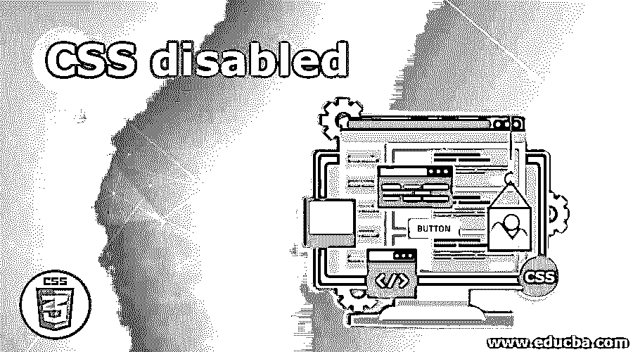
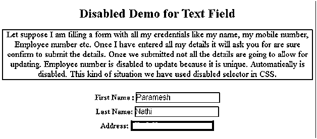
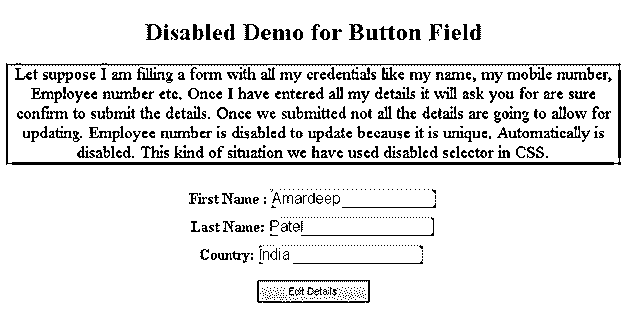
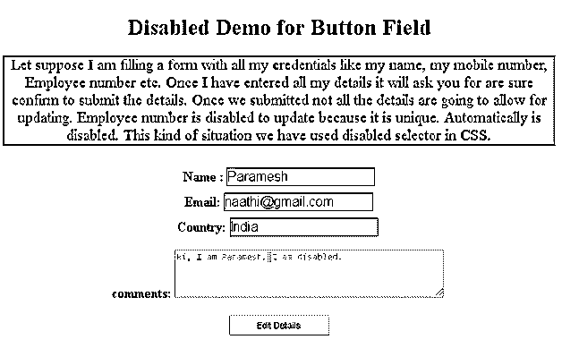

# CSS 已禁用

> 原文：<https://www.educba.com/css-disabled/>




## CSS 禁用简介

disabled 是 CSS 中的一个选择器，用来禁用 HTML 元素。这个禁用的选择器主要用于表单元素，如文本区域、按钮、复选框、下拉框等。

**实时示例:**假设我们正在填写一个表单，其中包含我们所有的凭据，如姓名、手机号码、员工编号等。一旦我们输入了所有的细节，它将要求确认提交细节。一旦我们提交，并不是所有的细节都允许更新。员工编号不可更新，因为它是唯一的。它自动被禁用。在这种情况下，我们在 CSS 中使用了禁用的选择器。

<small>网页开发、编程语言、软件测试&其他</small>

### CSS 中的 disabled 是怎么做到的？

正如我们讨论过的，在 HTML 表单页面上禁用 done。我们可以禁用按钮、文本字段、复选框、下拉框等。通过在所需的 HTML 表单元素上使用禁用的选择器。

**语法:**

```
input[type=text]:disabled {
//CSS declarations
}
<form action="">
Country: <input type="text" disabled="disabled" value="Pakistan">
</form>
```

### 禁用 CSS 的实现示例

以下是一些例子:

#### 示例# 1–禁用字段

**代码:**

```
<!DOCTYPE html>
<html>
<head>
<title>disabled selector</title>
<style>
h1 {
color:orange;
}
input[type=text]:enabled {
background: lightgray;
}
input[type=text]:disabled {
background: red;
font-size: 20px;
}
input {
margin-top:10px;
border:1px solid brown;
font-size: 20px;
}
body {
text-align:center;
}
p
{
color: brown;
font-size: 22px;
border: 2px ridge blue;
}
label
{
font-size: 20px;
color: green;
font-weight: bold;
}
</style>
</head>
<body>
<h1>Disabled Demo for Text Field</h1>
<p>
Let suppose I am filling a form with all my credentials like my name, my mobile number, Employee number etc. Once I have entered all my details it will ask you for are sure confirm to submit the details. Once we submitted not all the details are going to allow for updating. Employee number is disabled to update because it is unique. Automatically is disabled. This kind of situation we have used disabled selector in CSS.
</p>
<form action="">
<label>First Name :</label><input type="text" value="Paramesh"><br>
<label>Last Name: </label><input type="text" value="Nathi"><br>
<label>Address: </label><input type="text" disabled="disabled"
value="Phanigiri">
</form>
</body>
</html>
```

**输出:**




**解释:**正如您在输出中看到的，名和姓可以编辑，但地址是禁用的，因此我们可以编辑它。

#### 示例 2–禁用按钮

**代码:**

```
<!DOCTYPE html>
<html>
<head>
<title>disabled selector</title>
<style>
h1 {
color:orange;
}
input[type=text]:enabled {
background: lightblue;
}
input[type=text]:disabled {
background: red;
font-size: 20px;
}
input {
margin-top:10px;
border:1px solid pink;
font-size: 20px;
}
body {
text-align:center;
}
p
{
color: red;
font-size: 22px;
border: 2px ridge green;
}
label
{
font-size: 20px;
color: blue;
font-weight: bold;
}
button
{
color: purple;
height: 30px;
width: 150px;
}
</style>
</head>
<body>
<h1>Disabled Demo for Button Field</h1>
<p>
Let suppose I am filling a form with all my credentials like my name, my mobile number, Employee number etc. Once I have entered all my details it will ask you for are sure confirm to submit the details. Once we submitted not all the details are going to allow for updating. Employee number is disabled to update because it is unique. Automatically is disabled. This kind of situation we have used disabled selector in CSS.
</p>
<form action="">
<label>First Name :</label><input type="text" value="Amardeep"><br>
<label>Last Name: </label><input type="text" value="Patel"><br>
<label>Country: </label><input type="text" value="India">
<br>
<br>
<button type="button" disabled>Edit Details</button>
</form>
</body>
lt;/html>
```

**输出:**




**解释:**正如你在输出中看到的，名字和姓氏是可以编辑的，但是按钮被禁用了，所以我们不能编辑它。

#### 示例 3–禁用文本区域

**代码:**

```
<!DOCTYPE html>
<html>
<head>
<title>disabled selector</title>
<style>
h1 {
color:red;
}
input[type=text]:enabled {
background: lightgreen;
}
input[type=text]:disabled {
background: red;
font-size: 20px;
}
input {
margin-top:10px;
border:1px solid red;
font-size: 20px;
}
body {
text-align:center;
}
p
{
color: fuchsia;
font-size: 22px;
border: 2px ridge navy;
}
label
{
font-size: 20px;
color: orange;
font-weight: bold;
}
button
{
color: red;
height: 30px;
width: 150px;
}
</style>
</head>
<body>
<h1>Disabled Demo for Button Field</h1>
<p>
Let suppose I am filling a form with all my credentials like my name, my mobile number, Employee number etc. Once I have entered all my details it will ask you for are sure confirm to submit the details. Once we submitted not all the details are going to allow for updating. Employee number is disabled to update because it is unique. Automatically is disabled. This kind of situation we have used disabled selector in CSS.
</p>
<form action="">
<label>Name :</label><input type="text" value="Paramesh"><br>
<label>Email: </label><input type="text" value="naathi@gmail.com"><br>
<label>Country: </label><input type="text" value="India">
<br>
<br>
<label>comments:</label>
<textarea id="textArea" rows="4" cols="50" disabled>Hi, I am Paramesh. I am disabled.</textarea>
<br>
<br>
<button type="button">Edit Details</button>
</form>
</body>
</html>
```

**输出:**




**解释:**如你所见，我们无法编辑文本区域，因为它已被禁用。

### 结论

CSS 中的 Disabled 是一个选择器，用于禁用元素和样式禁用元素。我们可以在按钮、文本区域、按钮、文本字段等表单字段上使用这个禁用的选择器。

### 推荐文章

这是一个禁用 CSS 的指南。在这里，我们讨论一个关于 CSS disabled 和它的不同的例子及其代码实现的简要概述。您也可以浏览我们推荐的其他文章，了解更多信息——

1.  [CSS 调整大小](https://www.educba.com/css-resize/)
2.  [CSS 的优势](https://www.educba.com/advantages-of-css/)
3.  [CSS 面试问题](https://www.educba.com/css-interview-questions/)
4.  CSS 中的[按钮](https://www.educba.com/button-in-css/)


