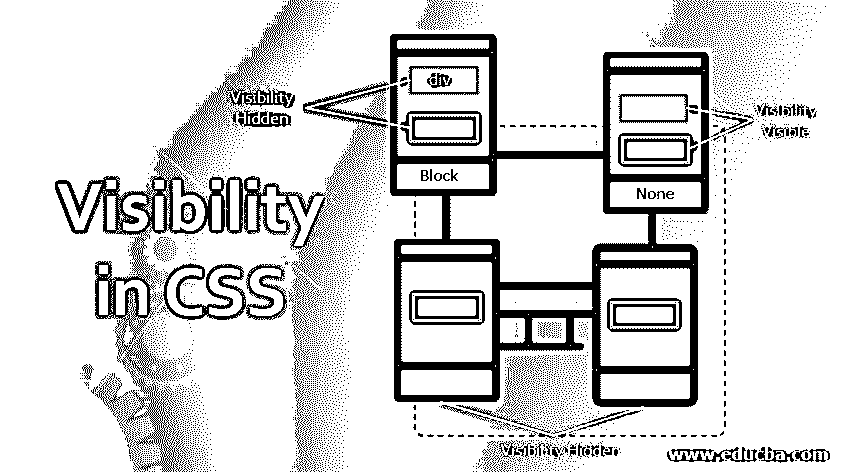
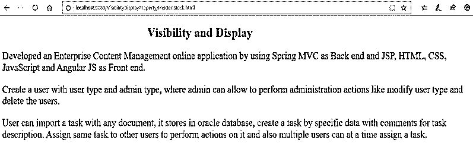
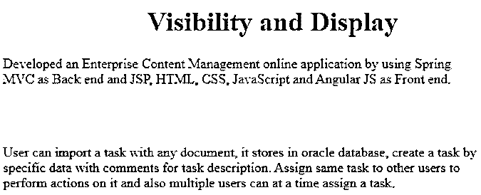
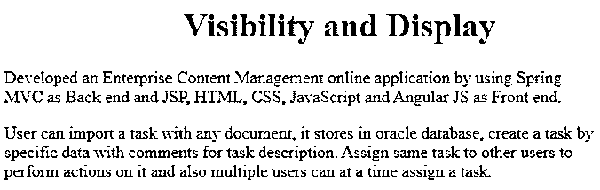
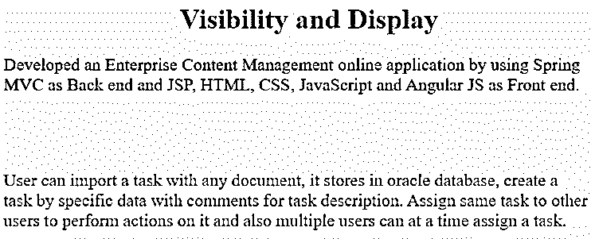
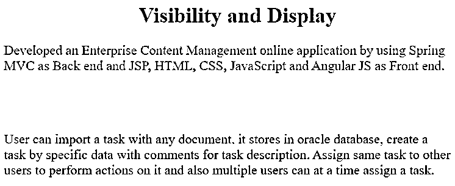

# CSS 中的可见性

> 原文：<https://www.educba.com/visibility-in-css/>




## CSS 中的可见性介绍

可见性是指出现或能够看见的东西。Visibility 属性，用于显示或隐藏页面中的内容或图像。清楚的理解你必须知道显示和显示属性的区别，可见性属性都可以显示和遮挡内容，但区别在于可见性属性隐藏了内容而不移动或干扰下面的内容或其旁边的内容。属性通过忽略该位置上的前一个内容来向上或向旁边移动内容。我们将在下面的概念中看到它是如何发生的。在这个主题中，我们将学习 CSS 中的可见性。

### CSS 中的可见性和显示属性是如何工作的？

可见性属性可以使用两个值

<small>网页开发、编程语言、软件测试&其他</small>

1.  **隐藏**
2.  **可见**

**语法:**

```
Class1
{
visibility: hidden;
}
Class2
{
visibility : visible;
}
```

**说明:**

*   **可见性:**隐藏，隐藏内容，不将内容从页面向下或向侧面移动。
*   **可见性:**可见**，**可见页面中隐藏的内容。

**Note:** Cannot apply hidden and visible properties at a time for a single class.

**举例:**

```
Class1
{
visibility: hidden;
visibility: visible;
}
```

如果您试图在单个类中应用这两个值，第二个值属性总是会重写。

显示属性可以使用 4 个值

1.  **块**
2.  **无**
3.  **内嵌**
4.  **内嵌块**

**说明:**

*   **显示:**块，从新一行开始显示内容。
*   **显示:**无**，**忽略此处之前的内容，内容上移或侧移。
*   **显示:**内嵌**，**就像一个 span 标签，但不改变高度和宽度。
*   **显示:**内嵌块**，**就像一个 span 标签，通过改变高度和宽度来创建漂亮的框。我们可以说它是浮动先前属性的替换。

**Note:** Cannot apply all the properties at a time for a single class as in the Visibility example.

**代码示例:**

1.  可见性:隐藏和显示:包含内容的块
2.  可见性:可见和显示:无内容

**在应用可见性和显示属性输出之前:**




1.  **可见性:隐藏和显示:用内容遮挡:**隐藏内容，不干扰下面或旁边的内容。与应用上述可见性和显示属性之前相比，您可以看到输出中的变化。

**语法:**

```
.hiddenBlock{
display: block;
visibility: hidden;
color: green;
}
```

**举例:**

**HTML 代码:HiddenBlock.html**

```
<!DOCTYPE html>
<html>
<head>
<meta charset="ISO-8859-1">
<link rel="stylesheet" type="text/css" href="HiddenBlock.css">
<title>Visibility and Display</title>
</head>
<body>
<h1 class="head">Visibility and Display</h1>
<p class="hiddenBlock1">Developed an Enterprise Content Management
online application by using Spring MVC as Back end and JSP, HTML, CSS,
JavaScript and Angular JS as Front end.</p>
<p class="hiddenBlock2">Create a user with user type and admin
type, where admin can allow to perform administration actions like
modify user type and delete the users.</p>
<p class="hiddenBlock3">User can import a task with any document,
it stores in oracle database, create a task by specific data with
comments for task description. Assign same task to other users to
perform actions on it and also multiple users can at a time assign a
task.</p>
</body>
</html>
```

**CSS 代码:HiddenBlock.css**

```
.hiddenBlock1{
display: block;
visibility: visible;
color: blue
}
.hiddenBlock2{
display: block;
visibility: hidden;
color: green;
}
.hiddenBlock3{
display: block;
visibility: visible;
color: brown;
}
.head{
color:red;
margin-left: 30%;
}
```

**输出:**




2.  **可见性:可见和显示:无内容:**忽略应用段落的内容，并将内容向上或向一侧移动。与应用上述可见性和显示属性之前相比，您可以看到输出中的变化。

**语法:**

```
.visibleNone{
display: none;
visibility: visible;
color: green;
}
```

**举例:**

**HTML 代码:VisibleNone.html**

```
<!DOCTYPE html>
<html>
<head>
<meta charset="ISO-8859-1">
<link rel="stylesheet" type="text/css" href="VisibleNone.css">
<title>Visibility and Display</title>
</head>
<body>
<h1 class="head">Visibility and Display</h1>
<p class="visibleNone1">Developed an Enterprise Content Management
online application by using Spring MVC as Back end and JSP, HTML, CSS,
JavaScript and Angular JS as Front end.</p>
<p class="visibleNone2">Create a user with user type and admin
type, where admin can allow to perform administration actions like
modify user type and delete the users.</p>
<p class="visibleNone3">User can import a task with any document,
it stores in oracle database, create a task by specific data with
comments for task description. Assign same task to other users to
perform actions on it and also multiple users can at a time assign a
task.</p>
</body>
</html>
```

**CSS 代码:visible one . CSS**

```
.visibleNone1{
display: block;
visibility: visible;
color: blue
}
.visibleNone2{
display: none;
visibility: visible;
color: green;
}
.visibleNone3{
display: block;
visibility: visible;
color: brown;
}
.head{
color:red;
margin-left: 30%;
}
```

**输出:**




*   我们可能会怀疑，有没有其他不使用可见性来隐藏内容的方法:hidden。
*   是的，我们有这样的属性。

**不使用可见性隐藏内容的其他属性:隐藏:**它们是

1.  颜色:rgb(0，0，0，0)
2.  不透明度:0

1.  **Color: rgb(0，0，0，0):** 这个属性也像 visibility: hidden did 一样使内容对肉眼不可见。但是内容还是存在的。你可以看到下面的输出与可见性输出**相同。**

**语法:**

```
.colorRGB{
color: rgb(0,0,0,0);
font-size: 25px;
}
```

**举例:ColorRGB.html**

```
<!DOCTYPE html>
<html>
<head>
<meta charset="ISO-8859-1">
<link rel="stylesheet" type="text/css" href="ColorRGB.css">
<title>Visibility and Display</title>
</head>
<body>
<h1 class="head">Visibility and Display</h1>
<p class="color1">Developed an Enterprise Content Management online
application by using Spring MVC as Back end and JSP, HTML, CSS,
JavaScript and Angular JS as Front end.</p>
<p class="color2">Create a user with user type and admin type,
where admin can allow to perform administration actions like modify
user type and delete the users.</p>
<p class="color3">User can import a task with any document, it
stores in oracle database, create a task by specific data with
comments for task description. Assign same task to other users to
perform actions on it and also multiple users can at a time assign a
task.</p>
</body>
</html>
```

**CSS 代码:ColorRGB.css**

```
.color1{
display: block;
visibility: visible;
color: blue;
font-size: 20px;
}
.color2{
color: rgb(0,0,0,0);
font-size: 20px;
}
.color3{
display: block;
visibility: visible;
color: brown;
font-size: 20px;
}
.head{
color:red;
margin-left: 30%;
}
```

**输出:**




*   **不透明度:0:** 这个属性也使肉眼看不见的内容成为可见性:隐藏，但内容依然存在。您可以在下面看到输出与可见性输出相同。

**语法:**

```
.opacity{
opacity: 0;
font-size: 25px;
}
```

**HTML 代码:Opacity.html**

```
<!DOCTYPE html>
<html>
<head>
<meta charset="ISO-8859-1">
<link rel="stylesheet" type="text/css" href="Opacity.css">
<title>Visibility and Display</title>
</head>
<body>
<h1 class="head">Visibility and Display</h1>
<p class="opacity1">Developed an Enterprise Content Management
online application by using Spring MVC as Back end and JSP, HTML, CSS,
JavaScript and Angular JS as Front end.</p>
<p class="opacity2">Create a user with user type and admin type,
where admin can allow to perform administration actions like modify
user type and delete the users.</p>
<p class="opacity3">User can import a task with any document, it
stores in oracle database, create a task by specific data with
comments for task description. Assign same task to other users to
perform actions on it and also multiple users can at a time assign a
task.</p>
</body>
</html>
```

**CSS 代码:Opacity.css**

```
.opacity1{
display: block;
visibility: visible;
color: blue;
font-size: 20px;
}
.opacity2{
opacity: 0;
font-size: 20px;
}
.opacity3{
display: block;
visibility: visible;
color: brown;
font-size: 20px;
}
.head{
color:red;
margin-left: 30%;
}
```

**输出:**




### 结论

我们可以用 visibility 属性、opacity 属性和 color: grbproperty 来隐藏内容。它不会通过应用可见性属性来向上或向侧面移动内容。

### 推荐文章

这是一个关于 CSS 中可见性的指南。在这里，我们将讨论 CSS 中的可见性和显示属性是如何工作的，以及示例和输出。您也可以看看以下文章，了解更多信息–

1.  [CSS 内联样式](https://www.educba.com/css-inline-style/)
2.  [CSS 字体属性](https://www.educba.com/css-font-properties/)
3.  [CSS 文本格式](https://www.educba.com/css-text-formatting/)
4.  [CSS 溢出](https://www.educba.com/css-overflow/)


