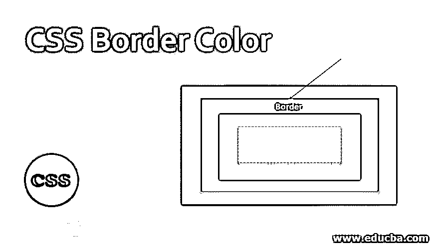
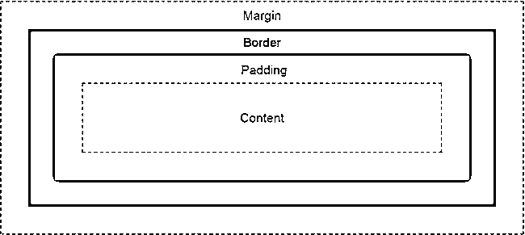
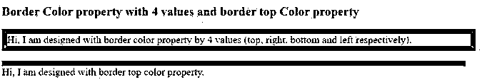
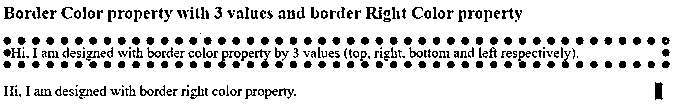
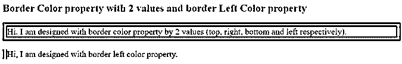
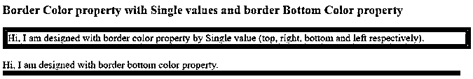

# CSS 边框颜色

> 原文：<https://www.educba.com/css-border-color/>




## CSS 边框颜色介绍

填充和边距周围的空间称为填充和边距之间的颜色称为边框颜色。当我们想要将 HTML 主体从一个内容分离到另一个内容时，使用边框颜色。通过使用边框颜色，边框颜色一次应用于所有的边，或者一次应用于不同的边。填充、边距和边框颜色之间的区别如下所示，我们知道所有页面中的常见样式，我们总是更喜欢 CSS




<small>网页开发、编程语言、软件测试&其他</small>

### CSS 中边框颜色是如何工作的？

使用 border-color 属性获取内容或图像周围的边框颜色。

#### 语法 1

**代码:**

```
div
{
border-color: value1, value2, value3, value4; //border color values
}
```

**解释:**如果我们用 4 个值应用边框颜色，那么第一个值用于顶部，第二个值用于右侧，第三个值用于底部，第四个值用于左侧。

#### 语法 2

**代码:**

```
div
{
border-color: value1, value2, value3; //border color values
}
```

**解释:**如果我们用 3 个值应用边框颜色，那么第一个值用于顶部，第二个值用于左侧和右侧，第三个值用于底部。

#### 语法 3

**代码:**

```
div
{
border-color: value1, value2; //border color values
}
```

**解释:**如果我们用 2 个值应用边框颜色，那么第一个值分别用于顶部和底部，第二个值分别用于左侧和右侧。

#### 语法 4

**代码:**

```
div
{
border-color: value//border color value
}
```

**解释:**如果我们只应用单一值的边框颜色，那么对所有四个边都同样应用。如果我们想应用边框样式只有一边，如顶部或右侧或底部或左侧。你可以使用下面的语法。

### 特定边的边框颜色

#### 语法 1

**代码:**

```
div
{
border-top-color: value//border top side color
}
```

#### 语法 2

**代码:**

```
div
{
border-right-color: value//border right side color
}
```

#### 语法 3

**代码:**

```
div
{
border-bottom-color: value//border bottom side color
}
```

#### 语法 4

**代码:**

```
div
{
border-left-color: value//border left side color
}
```

### 实现 CSS 边框颜色的示例

下面是提到的例子:

#### 示例#1

BorderColor4ValuesandTopColor.html

**HTML 代码:**

```
<!DOCTYPE html>
<html>
<head>
<meta charset="ISO-8859-1">
<link rel="stylesheet" href="BorderColor4ValuesandTopColor.css">
<title>Border Color</title>
</head>
<body>
<font color="green"><h2>Border Color property with 4 values and border
top Color property</h2></font>
<p class="style1">Hi, I am designed with border color property by 4
values (top, right, bottom and left respectively).</p>
<p class="style2">Hi, I am designed with border top color property.</p>
</body>
</html>
```

**CSS 代码:**

```
.style1 {
border-style:solid;
border-color: brown red blue green; /* Gives the color at top, right, bottom and left respectivily */
border-width: 10px;
font-size: 20px;
width: 900px;
}
.style2 {
border-top-style:solid;
border-top-color: blue;
border-width: 10px;
font-size: 20px;
width: 900px;
}
```

**输出:**




**解释:**第一段通过给 border-color 属性赋值 4 个值，分别给顶部、右侧、底部和左侧赋予棕色、红色、蓝色和绿色。通过给 border-top-color 属性赋值，第二个段落呈现蓝色。

#### 实施例 2

BorderColor3ValuesAndRightColor.html

**HTML 代码:**

```
<!DOCTYPE html>
<html>
<head>
<meta charset="ISO-8859-1">
<link rel="stylesheet" href="BorderColor3ValuesAndRightColor.css">
<title>Border Color</title>
</head>
<body>
<font color="green"><h2>Border Color property with 3 values and border
Right Color property</h2></font>
<p class="style1">Hi, I am designed with border color property by 3
values (top, right, bottom and left respectively).</p>
<p class="style2">Hi, I am designed with border right color property.</p>
</body>
</html>
```

**CSS 代码:**

```
.style1 {
border-style: dotted; /*Gives the border with dotted lines*/
border-color: blue fuchsia olive;
/* Gives the color at top to blue color, left and right to fuchsia color, bottom to olive color*/
border-width: 10px;
font-size: 20px;
width: 900px;
}
.style2 {
border-right-style: dashed; /*Gives the border with dashed lines*/
border-right-color: green;
border-width: 10px;
font-size: 20px;
width: 900px;
}
```

**输出:**




**解释:**通过给 border-color 属性分配 3 个值，第一个段落的顶部为蓝色，左侧为紫红色，右侧为橄榄色，底部为橄榄色。通过为 border-right-color 属性赋值，第二段显示绿色。

#### 实施例 3

BorderColor2ValuesAndLeftColor.html

**HTML 代码:**

```
<!DOCTYPE html>
<html>
<head>
<meta charset="ISO-8859-1">
<link rel="stylesheet" href="BorderColor2ValuesAndLeftColor.css">
<title>Border Color</title>
</head>
<body>
<font color="green"><h2>Border Color property with 2 values and border
Left Color property</h2></font>
<p class="style1">Hi, I am designed with border color property by 2
values (top, right, bottom and left respectively).</p>
<p class="style2">Hi, I am designed with border left color property.</p>
</body>
</html>
```

**CSS 代码:**

```
.style1 {
border-style: double; /*Gives the border with double border*/
border-color: maroon navy;
/* Gives the color at top and bottom to maroon color, left and right to navy color*/
border-width: 10px;
font-size: 20px;
width: 900px;
}
.style2 {
border-left-style: double; /*Gives the border with double border*/
border-left-color: gray;
border-width: 10px;
font-size: 20px;
width: 900px;
}
```

**输出:**




**解释:**第一段通过给 border-color 属性分配 2 个值，给顶部、底部提供栗色，给左侧、右侧提供藏青色。通过给 border-left-color 属性赋值，第二段显示灰色。

#### 实施例 4

BorderColorSingleValueAndBottomColor.html

**HTML 代码:**

```
<!DOCTYPE html>
<html>
<head>
<meta charset="ISO-8859-1">
<link rel="stylesheet" href="BorderColorSingleValueAndBottomColor.css">
<title>Border Color</title>
</head>
<body>
<font color="green"><h2>Border Color property with Single values and border
Bottom Color property</h2></font>
<p class="style1">Hi, I am designed with border color property by Single
value (top, right, bottom and left respectively).</p>
<p class="style2">Hi, I am designed with border bottom color property.</p>
</body>
</html>
```

**CSS 代码:**

```
.style1 {
border-style: solid; /*Gives the border with solid border*/
border-color: red;
/* Gives the color at top, right, left and bottom to maroon color*/
border-width: 10px;
font-size: 20px;
width: 900px;
}
.style2 {
border-bottom-style: solid; /*Gives the border with solid border*/
border-bottom-color: red;
border-width: 10px;
font-size: 20px;
width: 900px;
}
```

**输出:**




**解释:**第一段通过给 border-color 属性分配单个值来给出红色。通过给 border-bottom-color 属性赋值，第二段显示红色。

### 结论

边框颜色用于在一个段落中用其他 HTML 内容改变一个 HTML 内容。边框颜色可以通过边框颜色属性来实现。边框颜色可以根据需要一次应用于所有面或单面。

### 推荐文章

这是一个 CSS 边框颜色的指南。这里我们讨论 CSS 边框颜色的介绍，它是如何工作的，HTML 和带有输出的 CSS 代码。您也可以浏览我们的其他相关文章，了解更多信息——

1.  [CSS 透明边框](https://www.educba.com/css-transparent-border/)
2.  [CSS 字体颜色](https://www.educba.com/css-font-color/)
3.  [CSS 闪烁文本](https://www.educba.com/css-blinking-text/)
4.  [CSS 溢出](https://www.educba.com/css-overflow/)


