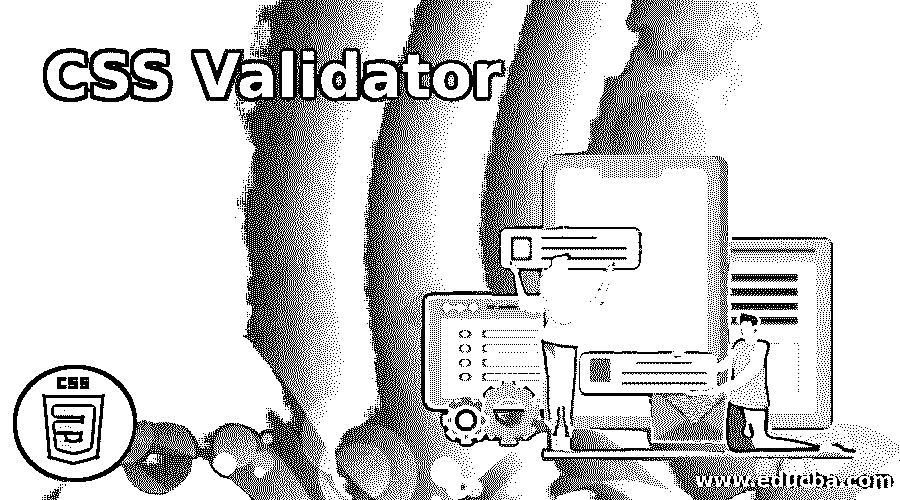
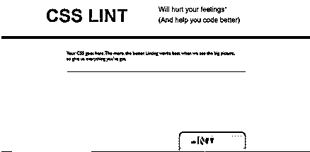
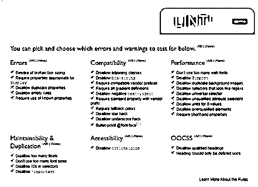
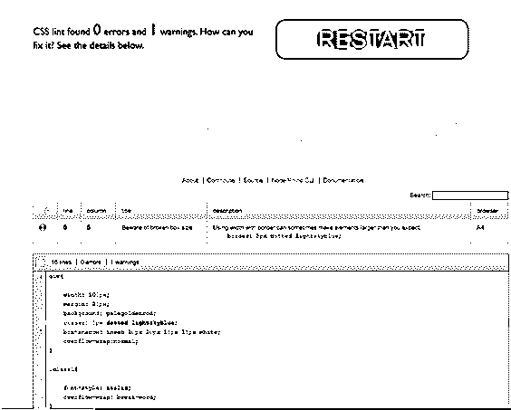
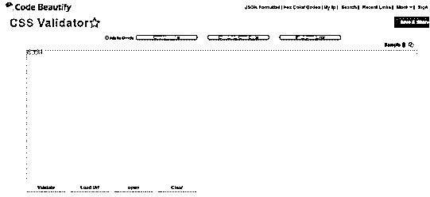
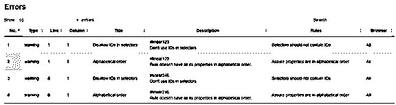

# CSS 验证器

> 原文：<https://www.educba.com/css-validator/>




## CSS 验证器简介

用任何编程语言编写的任何代码都必须始终遵循为其设置的一套规则和标准。所有的编程语言都提供了这样或那样的工具来验证代码是否遵循了最佳实践。CSS 中验证器的工作也类似。CSS 验证器确保 CSS 代码符合为该语言设置的标准。这些标准是 W3 集团为 HTML 和 CSS 制定的。此外，在 CSS 中，如果代码不正确，它很可能会对预期的行为产生负面影响。这就是 validator 发挥作用的地方，它会指出代码是否错误。

### CSS 验证器的使用

验证您的 CSS 代码，主要是确保正在编译的代码符合 W3 联盟最终确定的标准。CSS 在浏览器中有部分支持，即不是所有的浏览器总是支持所有的 CSS 特性和属性。CSS 验证器让你知道哪个浏览器支持哪个特性。验证 CSS 代码有两个主要优点。我们来详细讨论一下。

<small>网页开发、编程语言、软件测试&其他</small>

#### 1.跨平台代码

如前所述，CSS 有时会显示特定于浏览器的行为。例如，开发人员对他的首选页面进行编码和样式化，并在特定的浏览器上运行它，从而获得想要的结果。当最终用户通过其他浏览器浏览同一页面时，有些功能可能无法正常显示。这是因为特定的浏览器不支持该功能。此外，同一浏览器的不同版本在支持各种 CSS 和 HTML 功能方面也可能存在差异，这会导致部署的代码出现错误。CSS 验证器指出了这些，以便代码可以相应地建模。

#### 2.搜索引擎友好

当开发人员将他们的页面加载到 web 上时，每个搜索引擎都以自己的方式或机制解析代码中的特定关键字。现在，如果代码有某些 bug 或深不可测的东西，解析可以有不同的预测。搜索引擎将自行决定如何处理错误和缺陷。这将影响页面的可见性。为了避免这种情况，请确保 CSS 和 HTML 代码已经过验证。

网上有各种 CSS 验证器。有些是免费的，有些可能要收费。

### CSS 验证器是如何工作的？

让我们看看 CSS 验证的过程是如何工作的:

**1。**使用“https://jigsaw . w3 . org/CSS-validator/”验证 CSS。

*   在这个例子中，我们将看到 CSS 验证器的使用。我们将使用由[https://jigsaw.w3.org/css-validator/](https://jigsaw.w3.org/css-validator/)提供的在线验证。
*   进入该地址后，您将看到一个如下图所示的页面:


*   您可以给出需要验证的网站的 URI 或网址。
*   如果您愿意提供更详细的信息，请点击更多选项，并根据需要填写更详细的信息:


*   点击“检查”按钮，验证器将投射结果。例如，在尝试验证 Google 主页时，我们将得到类似如下的验证结果:


*   要查看更多详细信息，请按照上述步骤进行检查。

**2。**使用“http://csslint.net/”验证 CSS 代码

*   虽然上一个示例展示了如何验证已经部署的页面，但是本示例提供了一个在部署之前验证原始 CSS 代码的选项。
*   进入页面:[http://csslint.net/](http://csslint.net/)。它会有一个窗口来放置你的代码。




*   如果您想定制验证过程，并让代码在某些特定的标准下得到验证，请单击 LINT 旁边的向下图标！按钮。将提供一份清单来定制您的验证。




*   将代码放到窗口中，并定制您的验证(如果需要的话)之后，单击 LINT！.您将获得代码验证的结果。
*   在这个例子中，我们测试了这段 CSS 代码:

```
div
width: 100px;
margin: 20px;
background: palegoldenrod;
border: 5px dotted lightskyblue;
box-shadow: inset 10px 10px 15px 15px white;
overflow-wrap:normal;
}
.class1{
font-style: italic;
overflow-wrap: break-word;
}
```

*   上述 CSS 代码片段的验证结果如下:




*   不仅 CSS 代码将被验证，而且这指出了问题的确切位置，并且还可以得到如何修复错误和警告的建议。

**3。**使用“https://code 美化. org/cssvalidate”验证 CSS 代码。

*   这个 CSS 验证器允许 URL 和原始代码进行验证。
*   当你访问链接[https://codebeautify.org/cssvalidate](https://codebeautify.org/cssvalidate)时，你将有一个窗口放置代码和其他选项(验证 URL 等)。




*   对于此示例，我们将使用以下 CSS 代码片段并检查验证:

```
#linear123
{
height: 150px;
width: 100px;
background-image: linear-gradient(to bottom,  pink, green );
}
#linear246
{
height: 50px;
width: 300px;
background-image: linear-gradient(to right,  blue, purple );
}
```

*   在所需窗口中放置代码并单击 Validate 按钮后，我们将在向下滚动刷新的页面时获得结果条目。验证结果将如下所示:




*   因此，一旦验证的结果被预测出来，开发人员可以确保标准化他们的代码。

在上面的三个例子中，我们看到了 CSS 验证器是如何工作的。网上还有许多其他的选择，开发者可以通过它们来标准化他们的 CSS 代码。这些工具中的许多也验证 HTML 代码。在把任何东西放到万维网上之前，验证所有的东西总是一个好主意。如果在线验证程序不令人满意，还有许多离线工具可以达到同样的目的。但是基本的想法是总是选择真实的选项。这篇文章给出了一个关于如何检查 CSS 代码的基本概念。这是会导致高效代码的实践之一。

### 推荐文章

这是一个 CSS 验证器的指南。在这里，我们讨论了一个 CSS 验证器的简要概述，以及它如何工作的例子和用途。您也可以浏览我们推荐的其他文章，了解更多信息——

1.  [CSS 溢出](https://www.educba.com/css-overflow/)
2.  [CSS z 索引](https://www.educba.com/css-z-index/)
3.  [CSS 颜色图表](https://www.educba.com/css-color-chart/)
4.  CSS 中的[按钮](https://www.educba.com/button-in-css/)


