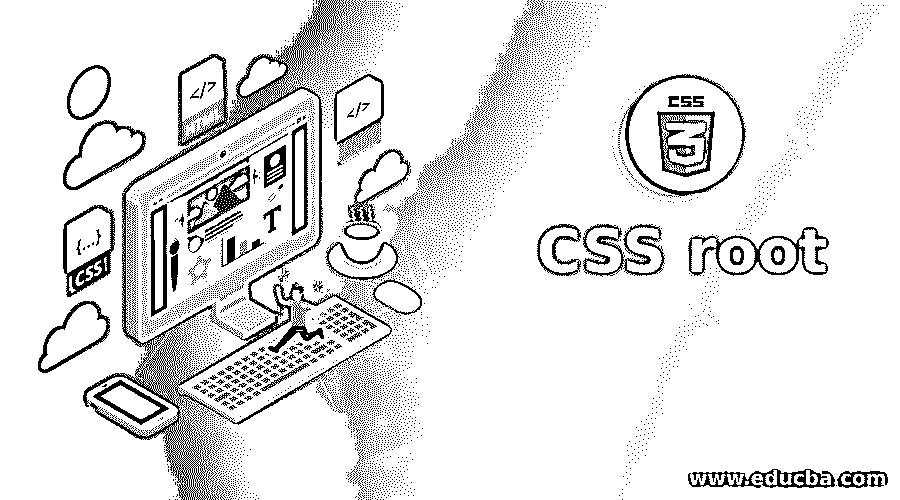
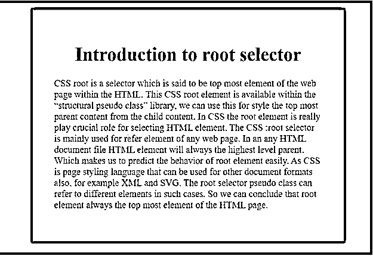
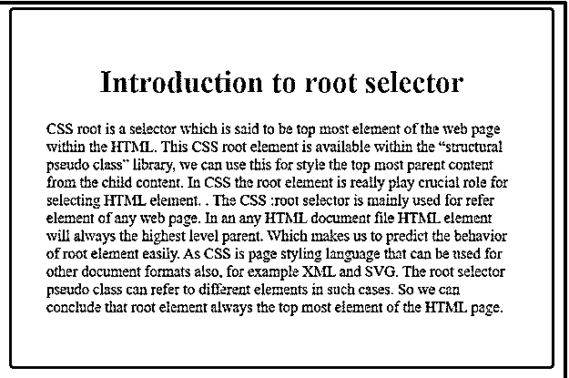
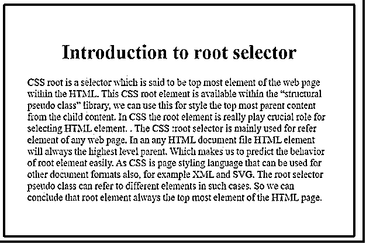
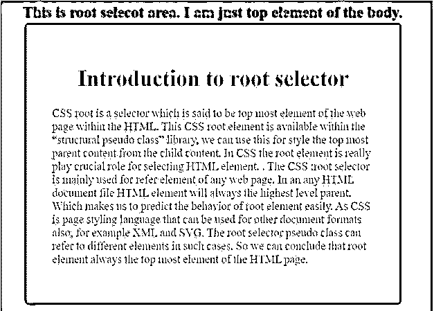

# CSS 根

> 原文：<https://www.educba.com/css-root/>




## CSS 根介绍

CSS root 是一个选择器，据说是 HTML 中网页的最顶层元素。这个元素在“结构化伪类”库中可用，我们可以用它来设计子内容中最顶层的父内容。在 CSS 中，根元素在选择 HTML 元素时起着至关重要的作用。选择器主要用于引用任何网页的元素。在中，任何 HTML 文档文件 HTML 元素都将始终是最高级别的父级。这使得我们很容易预测根元素的行为。CSS 是一种页面样式语言，也可以用于其他文档格式，例如 XML 和 SVG。在这种情况下，根选择器伪类可以引用不同的元素。所以我们可以得出结论，根元素总是 HTML 页面的最顶端元素。实时场景:当我们想要将整个页面设计成不同的背景颜色，并且在 div 标签的中间部分使用不同的颜色时，我们使用根选择器。

**Note:** If we apply any settings to either “body” tag or “root” tag then both will result in root is on top of the body tag.

### 句法

这个根选择器用于执行根级别的 CSS 样式，如背景颜色。

<small>网页开发、编程语言、软件测试&其他</small>

```
:root {
//CSS styles
}
```

### 实现 CSS 根的示例

以下是提到的一些例子:

#### 示例#1

**代码:**

```
<!DOCTYPE html>
<html>
<head>
<style>
:root {
background-color: purple;
padding: 100px;
}
body {
background-color: white;
padding: 50px;
font-size: 22px;
color: brown;
}
h1
{
color: green;
text-align: center;
}
</style>
</head>
<body>
<h1>Introduction to root selector</h1>
<p> CSS root is a selector which is said to be top most element of the web page within the HTML. This CSS root element is available within the “structural pseudo class” library, we can use this for style the top most parent content from the child content. In CSS the root element is really play crucial role for selecting HTML element.  The CSS :root selector is mainly used for refer <HTML> element of any web page. In an any HTML document file HTML element will always the highest level parent. Which makes us to predict the behavior of root element easily. As CSS is page styling language that can be used for other document formats also, for example XML and SVG. The root selector pseudo class can refer to different elements in such cases. So we can conclude that root element always the top most element of the HTML page.<p>
</body>
</html>
```

**输出:**




**解释:**如你所见，根选择器将样式应用于 HTML 的最顶层元素。body 元素在根选择器部分的正下方应用 CSS 样式。

#### 实施例 2

**代码:**

```
<!DOCTYPE html>
<html>
<head>
<!--CSS Styles-->
<style>
:root { /*root selector top most element styles*/
background-color: red;
transition: background-color .6s;
padding: 140px;
}
:root:hover {
background-color: blue;
}
body {/*body for just below of the root element styles*/
background-color: lightgreen;
padding: 50px;
font-size: 22px;
color: navy;
}
h1
{
color: green;
text-align: center;
}
</style>
</head>
<body>
<h1>Introduction to root selector</h1>
<p> CSS root is a selector which is said to be top most element of the web page within the HTML. This CSS root element is available within the “structural pseudo class” library, we can use this for style the top most parent content from the child content. In CSS the root element is really play crucial role for selecting HTML element. .  The CSS :root selector is mainly used for refer <HTML> element of any web page. In an any HTML document file HTML element will always the highest level parent. Which makes us to predict the behavior of root element easily. As CSS is page styling language that can be used for other document formats also, for example XML and SVG. The root selector pseudo class can refer to different elements in such cases. So we can conclude that root element always the top most element of the HTML page.<p>
</body>
</html>
```

**输出:**







**解释:**正如你在上面的根背景颜色中看到的，最初是红色，当我们将鼠标悬停在红色区域时，红色变为蓝色，持续 0.6 秒，反之亦然。body 元素在根选择器部分的正下方应用 CSS 样式。

#### 实施例 3

**代码:**

```
<!DOCTYPE html>
<html>
<head>
<!--CSS Styles-->
<style>
:root { /*root selector top most element styles*/
background-color: fuchsia;
padding: 140px;
}
:root::before {
content: "This is root selecot area. I am just top element of the body.";
color: blue;
font-weight: bold;
font-size: 30px;
/* ... */
}
body {/*body for just below of the root element styles*/
background-color: lightpink;
padding: 50px;
font-size: 22px;
color: red;
}
h1
{
color: green;
text-align: center;
}
</style>
</head>
<body>
<h1>Introduction to root selector</h1>
<p> CSS root is a selector which is said to be top most element of the web page within the HTML. This CSS root element is available within the “structural pseudo class” library, we can use this for style the top most parent content from the child content. In CSS the root element is really play crucial role for selecting HTML element. .  The CSS :root selector is mainly used for refer <HTML> element of any web page. In an any HTML document file HTML element will always the highest level parent. Which makes us to predict the behavior of root element easily. As CSS is page styling language that can be used for other document formats also, for example XML and SVG. The root selector pseudo class can refer to different elements in such cases. So we can conclude that root element always the top most element of the HTML page.<p>
</body>
</html>
```

**输出:**




**解释:**正如你所看到的，我们可以在根选择器和主体区域看到单独的文本。这可以得出结论，we root 是 HTML 中最顶层的元素。

### 结论

CSS 中的 Root 是一个选择器，用于选择 HTML 元素的最顶端区域。我们可以将用户需要的样式应用到这个根选择器区域。

### 推荐文章

这是一个 CSS 根的指南。这里我们讨论 CSS 根的介绍，它做什么，语法，代码输出的例子，以及解释。您也可以浏览我们的其他相关文章，了解更多信息——

1.  [CSS 溢出](https://www.educba.com/css-overflow/)
2.  [CSS 验证器](https://www.educba.com/css-validator/)
3.  [CSS 中的可见性](https://www.educba.com/visibility-in-css/)
4.  [CSS 颜色代码](https://www.educba.com/css-color-codes/)


