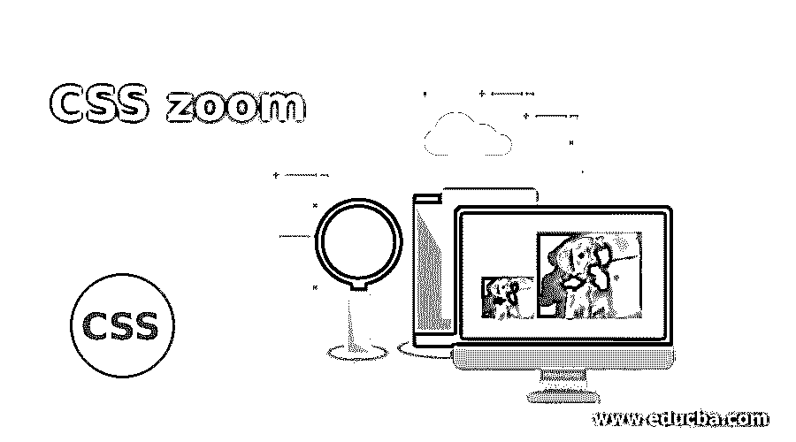
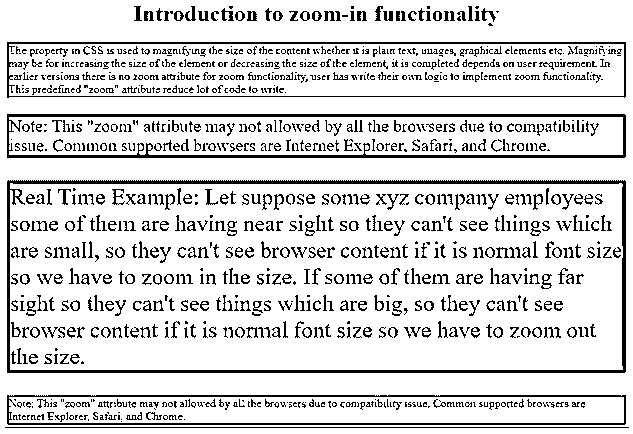
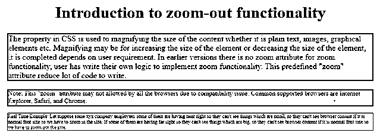
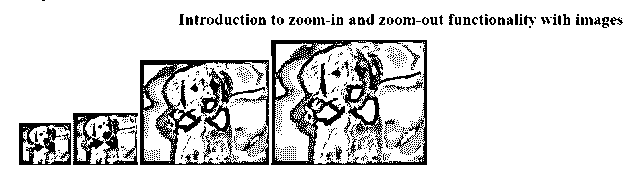

# CSS zoom

> 原文：<https://www.educba.com/css-zoom/>




## CSS 缩放简介

CSS 中的属性用于放大内容的大小，无论是纯文本、图像还是图形元素等。放大可能是为了增加元素的大小或减少元素的大小，这完全取决于用户的需求。在早期版本中，缩放功能没有缩放属性，用户已经编写了自己的逻辑来实现缩放功能。这个预定义的“缩放”属性减少了许多要编写的代码。在这个主题中，我们将学习 CSS 缩放。

**Note:** This “zoom” attribute may not be allowed by all the browsers due to compatibility issues. Common supported browsers are Internet Explorer, Safari, and Chrome.

**实时示例:**假设 xyz 公司的一些员工近视，所以他们看不到细小的东西，所以如果是正常字体大小，他们就看不到浏览器内容，所以我们必须放大字体大小。如果他们中的一些人有远视，所以他们看不到大的东西，所以他们看不到正常字体大小的浏览器内容，所以我们必须缩小尺寸。

<small>网页开发、编程语言、软件测试&其他</small>

### 缩放在 CSS 中是如何工作的？

CSS 缩放基于提供给缩放属性的属性值工作。如果我们正常传递缩放属性值，那么大小就变成 100%。如果我们将缩放属性值作为重置值传递，那么它将从用户自定义值(如 120%、70%、150%等)重置回原始大小。

**语法:**

```
element
{
zoom:normal/reset/120%,70%/custom % values;
}
```

**缩放属性接受的值:**

*   **normal:** 不改变元素的正常大小。这是默认值。
*   **复位:**复位到实际的 100%尺寸。
*   **自定义百分比值:**如果您想要明确提供自定义值，如 70%、80%、120%、150%等，则使用带有缩放属性的百分比。如果我们给百分比> 100，那么内容的大小增加，如果我们给百分比< 100，那么内容的大小减少。

### CSS 缩放示例

下面举几个例子

#### 示例 1–放大

**代码:**

```
<!DOCTYPE html>
<html>
<head>
<!--CSS Styles-->
<style>
.p1
{
zoom: normal; /*100% or normal both are same*/
border: solid 2px green;
color: brown;
}
.p2
{
zoom:150%;/*zoom in means increasing content size with 150%*/
border: solid 2px green;
color: brown;
}
.p3
{
zoom:200%;/*zoom in means increasing content size with 200%*/
border: solid 2px green;
color: brown;
}
.p4
{
zoom:reset;/*reset means gives you the normal size of the content*/
border: solid 2px green;
color: brown;
}
h1
{
color: blue;
text-align: center;
}
</style>
</head>
<body>
<h1>Introduction to zoom-in functionality</h1>
<p class="p1">The property in CSS is used to magnifying the size of the content whether it is plain text, images, graphical elements etc. Magnifying may be for increasing the size of the element or decreasing the size of the element, it is completed depends on user requirement. In earlier versions there is no zoom attribute for zoom functionality, user has write their own logic to implement zoom functionality. This predefined "zoom" attribute reduce lot of code to write.</p>
<p class="p2">Note: This "zoom" attribute may not allowed by all the browsers due to compatibility issue. Common supported browsers are Internet Explorer, Safari, and Chrome.</p>
<p class="p3">Real Time Example: Let suppose some xyz company employees some of them are having near sight so they can't see things which are small, so they can't see browser content if it is normal font size so we have to zoom in the size. If some of them are having far sight so they can't see things which are big, so they can't see browser content if it is normal font size so we have to zoom out the size.</p>
<p class="p4">Note: This "zoom" attribute may not allowed by all the browsers due to compatibility issue. Common supported browsers are Internet Explorer, Safari, and Chrome.</p>
</body>
</html>
```

**输出:**




#### 示例 2–缩小

**代码:**

```
<!DOCTYPE html>
<html>
<head>
<!--CSS Styles-->
<style>
.p1
{
zoom: normal; /*100% or normal both are same*/
border: solid 2px navy;
color: red;
}
.p2
{
zoom:80%;/*zoom out means decreasing content size with 80%*/
border: solid 2px navy;
color: red;
}
.p3
{
zoom:60%;/*zoom out means decresing content size with 60%*/
border: solid 2px navy;
color: red;
}
h1
{
color: green;
text-align: center;
}
</style>
</head>
<body>
<h1>Introduction to zoom-out functionality</h1>
<p class="p1">The property in CSS is used to magnifying the size of the content whether it is plain text, images, graphical elements etc. Magnifying may be for increasing the size of the element or decreasing the size of the element, it is completed depends on user requirement. In earlier versions there is no zoom attribute for zoom functionality, user has write their own logic to implement zoom functionality. This predefined "zoom" attribute reduce lot of code to write.</p>
<p class="p2">Note: This "zoom" attribute may not allowed by all the browsers due to compatibility issue. Common supported browsers are Internet Explorer, Safari, and Chrome.</p>
<p class="p3">Real Time Example: Let suppose some xyz company employees some of them are having near sight so they can't see things which are small, so they can't see browser content if it is normal font size so we have to zoom in the size. If some of them are having far sight so they can't see things which are big, so they can't see browser content if it is normal font size so we have to zoom out the size.</p>
</body>
</html>
```

**输出:**




#### 示例 3–放大和缩小图像

**代码:**

```
<!DOCTYPE html>
<html>
<head>
<!--CSS Styles-->
<style>
.img1
{
zoom: 40%; /*zoom out with 40%*/
border: solid 2px navy;
color: red;
}
.img2
{
zoom:50%;/*zoom out with 50%*/
border: solid 2px navy;
color: red;
}
.img3
{
zoom:100%;/*zoom in with 100%*/
border: solid 2px navy;
color: red;
}
.img4
{
zoom:120%;/*zoom in with 120%*/
border: solid 2px navy;
color: red;
}
h1
{
color: green;
text-align: center;
}
</style>
</head>
<body>
<h1>Introduction to zoom-in and zoom-out functionality with images</h1>


</body>
</html>
```

**输出:**




### 结论

放大 CSS 是用来放大页面内容的。CSS 缩放属性允许正常值、重置值和百分比值。大于 100%会增加元素大小，小于 100%会减少元素大小，如果等于 100%，则是元素的正常默认大小。

### 推荐文章

这是一个 CSS 缩放的指南。为了更好地理解，我们在这里用属性和编程例子来讨论缩放在 CSS 中是如何工作的。您也可以看看以下文章，了解更多信息–

1.  [CSS 溢出](https://www.educba.com/css-overflow/)
2.  [CSS 中的可见性](https://www.educba.com/visibility-in-css/)
3.  [CSS 边框颜色](https://www.educba.com/css-border-color/)
4.  [CSS 颜色透明](https://www.educba.com/css-color-transparent/)


