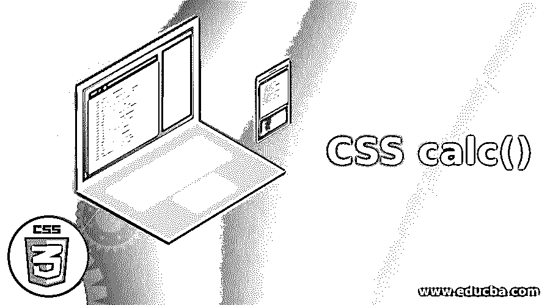
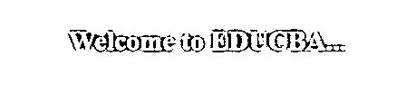
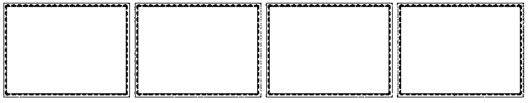
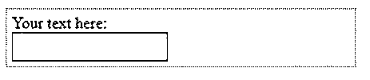
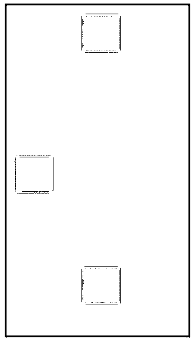
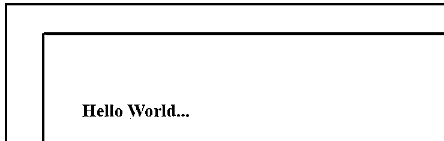
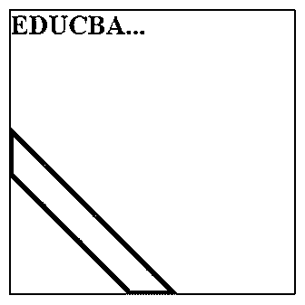
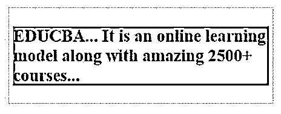

# CSS calc()

> 原文：<https://www.educba.com/css-calc/>




## CSS calc 介绍()

calc()函数包含一个应该用作属性值的计算。此功能使以设定的边距定位对象变得容易。calc()函数将特定的表达式作为其参数，表达式的输出用作值。calc()是一个原生的 CSS 方法，用于在 CSS 中正确地进行基本的数学运算，作为任何纵向值或几乎任何数字的替代。数学中有四个基本运算符:加(+)、减(-)、乘(*)和除(/)。calc()函数的另一个例子是帮助确保表单字段适合可用的空间，而不会超出容器的边缘，同时保持可接受的边距。

**语法:**

<small>网页开发、编程语言、软件测试&其他</small>

```
property_name: calc(expression)
```

该函数使用表达式作为单个参数，并使用运算符，如加法(+)、减法(-)、乘法(*)和除法(/)。

### CSS 中 calc()函数是如何工作的？

calc()函数比预处理器更好，它可以混合任何种类的单元。calc()函数通过简单的计算来指定 CSS 属性值。用户可以将像素乘以百分比。

为了使布局更加通用，它提供了两个关键功能，例如:

*   混合百分比和绝对值。
*   混合尺寸的单位。

### CSS calc()的示例

下面是 CSS calc()的例子:

#### 示例#1

**代码:**

```
<!DOCTYPE html>
<html>
<head>
<meta http-equiv="Content-Type" content="text/html; charset=windows-1252">
<title> CSS calc() Function Example </title>
<style>
.heading {
position: absolute;
left: 30px;
width: calc(50% - 20%);
height:calc(200px - 100px);
background-color: #5E9BC6;
padding-top:20px;
text-align: center;
}
h2 {
color:#F1DBED;
}
</style>
</head>
<body>
<br>
<div class="heading">
<h2> Welcome to EDUCBA... </h2>
</div>
</body>
</html>
```

**输出:**




calc()函数应用于高度和宽度属性，其中宽度将设置为 30%,高度将设置为 100 像素。我们指的是为内容定义样式的 heading 类。

#### 实施例 2

**代码:**

```
<!DOCTYPE html>
<html>
<head>
<meta http-equiv="Content-Type" content="text/html; charset=windows-1252">
<title> CSS calc() Function Example </title>
<style>
img {
width: 100%;
display: block;
}
.box {
float: left;
padding: 5px;
box-sizing: border-box;
width: calc(100% / 5);
}
@media (max-width: 900px) {
.box {
width: calc(100% / 4);
}
}
@media (max-width: 550px) {
.box {
width: calc(100% / 3);
}
}
@media (max-width: 400px) {
.box {
width: 100%;
}
}
</style>
</head>
<body>
<br>

<div class="box">

</div>
<div class="box">

</div>
<div class="box">

</div>
<div class="box">

</div>

</body>
</html>
```

**输出:**




该程序解释了如何在不同的屏幕分辨率下显示这些框。我们将最大宽度定为 900 像素、550 像素和 400 像素。当屏幕变得小于 900px、550px 和 400px 时，每个框都将具有示例中提供的指定宽度。

#### 实施例 3

**代码:**

```
<!DOCTYPE html>
<html>
<head>
<meta http-equiv="Content-Type" content="text/html; charset=windows-1252">
<title> CSS calc() Function Example </title>
<style>
.heading {
position: absolute;
left: 40px;
width: calc(300px - 50px);
border: 2px dotted red;
background-color: #5E9BC6;
padding: 3px;
text-align: center;
}
</style>
</head>
<body>
<br>
<div class="heading">
<h2> EDUCBA Education Center... </h2>
</div>
</body>
</html>
```

**输出:**


calc()函数应用于 width 属性，其中宽度将设置为 250px。heading 类用于定义内容显示的样式。

#### 实施例 4

**代码:**

```
<!DOCTYPE html>
<html>
<head>
<meta http-equiv="Content-Type" content="text/html; charset=windows-1252">
<title> CSS calc() Function Example </title>
<style>
.input_txt {
padding: 5px;
display: block;
width: calc(50% - 2em);
}
#box {
width: calc(200% / 8);
border: 1px dotted #5E9BC6;
padding: 5px;
}
</style>
</head>
<body>
<br>
<form>
<div id="box">
<label> Your text here: </label>
<input type="text" class="input_txt">
</div>
</form>
</body>
</html>
```

这一类别的热门课程

[CSS 培训(9 门课程，9+项目)](https://www.educba.com/software-development/courses/css-course/?btnz=edu-blg-inline-banner1)

[9 门在线课程| 9 个实践项目| 61 小时以上|可验证的结业证书|终身访问](https://www.educba.com/software-development/courses/css-course/?btnz=edu-blg-inline-banner1)

[4.5 (9，151 个评分)](https://www.educba.com/software-development/courses/css-course/?btnz=edu-blg-inline-banner1)

[课程价格](https://www.educba.com/software-development/courses/css-course/?btnz=edu-blg-inline-banner1)

[₹6999₹41999T3】](https://www.educba.com/software-development/courses/css-course/?btnz=edu-blg-inline-banner1)

[**查看课程**](https://www.educba.com/software-development/courses/css-course/?btnz=edu-blg-inline-banner1)

相关课程

[Bootstrap 培训(2 门课程，6+项目)](https://www.educba.com/software-development/courses/bootstrap-training-course/?btnz=edu-blg-inline-banner1) [jQuery 培训(8 门课程，5 个项目)](https://www.educba.com/software-development/courses/jquery-training-course/?btnz=edu-blg-inline-banner1)

**输出:**




这里，我们使用 HTML 表单的输入类型元素。calc()函数应用于 div 和 input 元素。输入类型宽度将减小到当前宽度的 2 倍。

#### 实施例 5

**代码:**

```
<!DOCTYPE html>
<html>
<head>
<meta http-equiv="Content-Type" content="text/html; charset=windows-1252">
<title> CSS calc() Function Example </title>
<style>
img {
display: block;
}
section {
width: 250px;
height: 150px;
position: relative;
background-color: #5E9BC6;
}
.box {
position: absolute;
}
.box-horizontal {
top: 15px;
left: calc(50% - 20px);
}
.box-vertical {
left: 15px;
top: calc(50% - 20px);
}
.box-middle {
left: calc(50% - 20px);
top: calc(50% - 20px);
}
</style>
</head>
<body>
<br>

<div class="box box-horizontal">

</div>


<div class="box box-vertical">

</div>


<div class="box box-middle">

</div>

</body>
</html>
```

**输出:**




输出显示了水平框、垂直框和中间框。在 calc()函数的帮助下，通过从 50%减少 20px，水平框将显示在左侧。相同的场景将应用于垂直和中间元素。

#### 实施例 6

**代码:**

```
<!DOCTYPE html>
<html>
<head>
<meta http-equiv="Content-Type" content="text/html; charset=windows-1252">
<title> CSS calc() Function Example </title>
<style>
*{
box-sizing: border-box;
}
html, body{
height: 100%;
padding: 50px;
background: #00174f;
}
body{
background: white url(https://pluspng.com/img-png/png-certificate-borders-free-8-certificate-templates-free-itinerary-template-sample-intended-for-red-certificate-border-png-28044-1516.png) calc(50% - 10px) calc(50% - 10px) no-repeat;
}
</style>
</head>
<body>
<br>
<h2> Hello World... </h2>
</body>
</html>
```

**输出:**




这里，我们为 HTML 主体页面使用背景图像。图像将被放置在左侧，10px 减少 50%，顶部 10px 减少 50%。

#### 实施例 7

**代码:**

```
<!DOCTYPE html>
<html>
<head>
<meta http-equiv="Content-Type" content="text/html; charset=windows-1252">
<title> CSS calc() Function Example </title>
<style>
.heading {
margin: 0 auto;
outline: solid 1px;
width: 250px; height: 250px;
background:
linear-gradient(to left bottom,
transparent calc(75% - 1em), #000 0, #000 calc(75% + 1em), transparent 0);
}
</style>
</head>
<body>
<br>
<div class="heading">
<h2> EDUCBA... </h2>
</div>
</body>
</html>
```

**输出:**




该程序在底部左侧为 HTML 页面创建一条带有渐变背景的线条。它使用 calc()函数为元素提供内部背景和元素的不透明度。

#### 实施例 8

**代码:**

```
<!DOCTYPE html>
<html>
<head>
<meta http-equiv="Content-Type" content="text/html; charset=windows-1252">
<title> CSS calc() Function Example </title>
<style>
.heading {
width: calc(200% / 8);
border: 1px dotted #5E9BC6;
padding: 5px;
}
.demo{
background:grey;
font-size: 15px;
}
</style>
</head>
<body>
<br>
<div class="heading">
<div class="demo">
<h2> EDUCBA... It is an online learning model along with amazing 2500+ courses... </h2>
</div>
</div>
</body>
</html>
```

**输出:**




div 元素是用标题类定义的。这个类将使用 1/8 的可用窗口宽度和指定的样式。

### 结论

在本文中，我们看到了一些有用的特性。calc()函数将作为一个值在所有有或没有特定单位的数字值工作的地方运行。似乎是时候使用我们的示例来玩一玩，并了解更多关于 CSS calc()函数的内容了。

### 推荐文章

这是 CSS calc()的指南。这里我们讨论了 calc()函数在 CSS 中是如何工作的？还有例子。您也可以看看以下文章，了解更多信息–

1.  [CSS 动画过渡](https://www.educba.com/css-animation-transition/)
2.  [CSS 过渡效果](https://www.educba.com/css-transition-effects/)
3.  [CSS 颜色图表](https://www.educba.com/css-color-chart/)
4.  [CSS 边框颜色](https://www.educba.com/css-border-color/)


