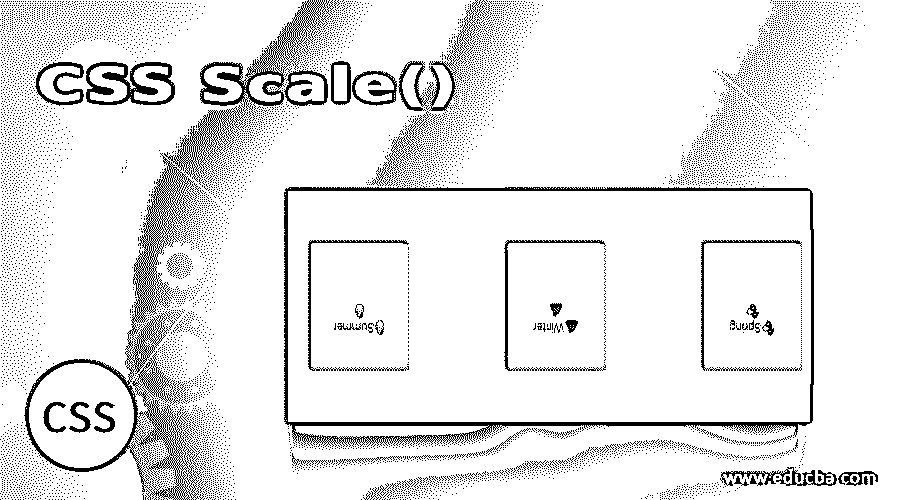
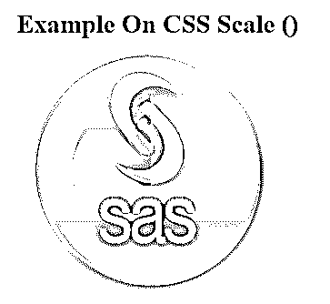
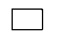
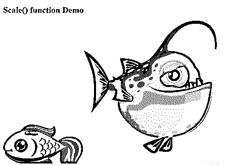

# CSS 标度()

> 原文：<https://www.educba.com/css-scale/>




## CSS 标尺介绍()

CSS scale()函数被定义为 CSS 转换属性，它允许在二维平面中调整元素的大小。它用于增加或减少元素的大小。当应用比例变换时，有必要指示浏览器调整数字的大小。因此，scale()会放大和缩小元素。缩放数是由平面中的一个向量定义的，我们可以借助 CSS 数据类型 transform-function 在任何不同的缩放比例下调整尺寸。

**语法:**

<small>网页开发、编程语言、软件测试&其他</small>

Scaling()函数使用两个或一个值来帮助指定要应用于所有方向的缩放。通用语法表示为:

```
scale( sx ) ; // with one argument on horizontal plane.
```

单个参数设置它的宽度或高度。这意味着它将值均匀地分配给 X 轴和 Y 轴。这里的值是无单位的，被认为是一个乘数概念。

另一种带有两个参数的语法是:

```
scale(sx,sy);
```

这里 sx–元素在水平方向上调整大小。
sy–垂直调整元素的大小。

**举例:**

这使它尺寸缩小了一半

```
.bb {
Transform:scale(0.6);
}
Next sample double the Y-Axis:
.bb {
```

所以，我们做的第一件事是为一个元素创建一个 HTML 页面，并使用 CSS3 应用特殊效果。这里需要注意的是，当对图像应用缩放时，请确保图像的原始尺寸应该大于对图像执行缩放时的尺寸。如果我们提供的值大于 1，则在指定方向上看起来很大的元素上向上进行缩放。如果指定的数字是 1，那么它保持不变。接下来，如果该值在零范围之间，则该元素被向下缩放。另一个要点是，这里允许负值，但它们不做任何缩放，而是向任何方向翻转。

### CSS 中的 scale()方法是如何工作的？

下面是 scale()函数及其说明:

| **scale()函数** | **描述** |
| Transform:scale(3);变换:缩放(0.5)； | Here the value 3 would transform the size to 3 times of its original image size.值 0.5 将大小转换为其原始图像大小的一半。 |
| transform:scale(0)； | 缩小到平面之外并且不可见。 |
| Transform: scale(3，1)； | 水平尺寸放大三倍，垂直尺寸保持不变 |

### 在 CSS 中实现 scale()函数的例子

下面的部分创建了一个简单的代码来描述 HTML 页面，CSS 被嵌入到页面头中。

#### 示例#1

**代码:**

```
<!DOCTYPE html>
<html lang="en">
<head>
<meta charset="utf-8">
<title>Example on CSS Scale() </title>
<style>
img {
-webkit-transform: scale (1.5);
-moz-transform: scale (1.5);
-ms-transform: scale (2);
transform: scale(1.5);
opacity: 0.7;
}
.new{
margin: 60px;
width:105px;
height:120px;
background: url("sas-img.png") no-repeat;
}
</style>
</head>
<body>
<h1> Example On CSS Scale() </h1>
<div class="new">
<imgsrc="sas-img.png" alt="Python">
</div>
</body>
</html>
```

**输出:**




**解释:**这里我们已经创建了一个类“new ”,并为图像分配了 CSS 属性。现在对图像进行了缩放。结果输出如下所示:

#### 实施例 2

**代码:**

```
<!DOCTYPE html>
<html>
<head>
<style type="text/css">
div.box {
width:150px;
height:90px;
background-color:#FFA07A;
margin-left:150px;
margin-top:150px;
position:relative;
}
div.boxenlarge {
transform: scale(1, 4);
-moz-transform: scale(1, 4);
-ms-transform: scale(1, 4);
-webkit-transform: scale(1, 4);
-o-transform: scale(1, 4);
}
</style>
</head>
<body>
<div class="box" onmouseover="this.className='box boxenlarge'" onmouseout="this.className='box'">
Scaling up top and bottom
</div>
</body>
</html>
```

**输出:**


**解释:**在上面的代码中，当用户通过滚动鼠标在元素上按下方框时，应用缩放。因此，当我们移动到元素上时，类名被附加的类名所掩盖。我们定义的维度对 CSS 的转换有很好的影响。接下来是变换部分，沿 X 轴应用比例 1，沿 Y 轴应用比例 4。元素的宽度增加 1，重量增加 4。

#### 实施例 3

**代码:**

```
<!DOCTYPE html>
<html>
<head>
<style type="text/css">
.scalehov {
width: 100px;
transition: all .4s ease-in-out;
}
.scalehov:hover {
transform: scale(1.5);
}
</style>
</head>
<body>

</body>
</html>
```

**输出:**




#### 实施例 4

这里 HTML 文档中的

元素被缩放并做了一些转换。

**代码:**

```
<!DOCTYPE html>
<html>
<head>
<meta charset="utf-8">
<title>scale() function Demo</title>
<style>
div {
display: inline-block;
overflow: hidden;
}
div img {
display: block;
transition: 2s;
}
div img:hover {
transform: scale(1.6);
}
</style>
</head>
<body>
<h1>Scale() function Demo </h1>
<div><imgsrc="scale_fish.png" alt=""></div>
<div><imgsrc="scale_fish1.png" alt=""></div>
<div><imgsrc="scale_fish2.png" alt=""></div>
</body>
</html>
```

**输出:**




**解释:**因此在上面的代码中，我创建了三个图像文件，当我们在图像上移动时，图片会逐渐增加它的大小。在这里，缩放是在所有维度上均匀完成的，因为我们指定了一个值“1.6”。

#### 实施例 5

使用两个 X 轴分别选择缩放值。这里分配了一个负值。

**代码:**

**Scale_1.html**

```
<html>
<div class="module">
<div class="object">🔥Summer🔥</div>
<div class="object">💩Winter💩</div>
<div class="object">💦Spring💦</div>
</div>
</html>
```

**。css**

```
.module{
font-family: Arial, Helvetica, sans-serif;
width: 90%;
height: 90%;
display: inline-flex;
justify-content: right;
align-items: center;
perspective: 30px;
}
.object {
width: 5em;
height: 5em;
padding: 2em;
margin: 1.5em;
text-align: center;
background-color: #FFF000;
border-top: 0.4em solid greenyellow;
box-shadow: 2px 2px 5px 0px royalblue;
}
.object {
transform: scale(-0.66, -0.6);
}
```

**输出:**

下面的结果显示了颠倒的元素，因为缩放值标记为负数。


### 结论

因此，这里提供的例子可以在所有浏览器中很好地工作，这些浏览器现在对所有 web 开发人员都很有用。scaling()函数在 CSS 转换的帮助下工作得很好，因为这个函数允许创建交互式页面。最后，这个 CSS3 scale 通过改变图像的属性在 HTML 文档中产生了惊人的不同效果。最近的研究是关于动画的过渡，我们可以执行缩放属性，但在网站上访问时很成问题。

### 推荐文章

这是 CSS Scale()的指南。在这里，我们讨论 CSS Scale()的一个简要概述和它的不同例子以及它的代码实现。您也可以浏览我们推荐的其他文章，了解更多信息——

1.  [CSS 在技术中的应用](https://www.educba.com/what-is-css/)
2.  [使用 CSS 命令的技巧和诀窍](https://www.educba.com/css-commands/)
3.  [CSS 的六大优势介绍](https://www.educba.com/advantages-of-css/)
4.  [CSS 页眉设计(示例)](https://www.educba.com/css-header-design/)


