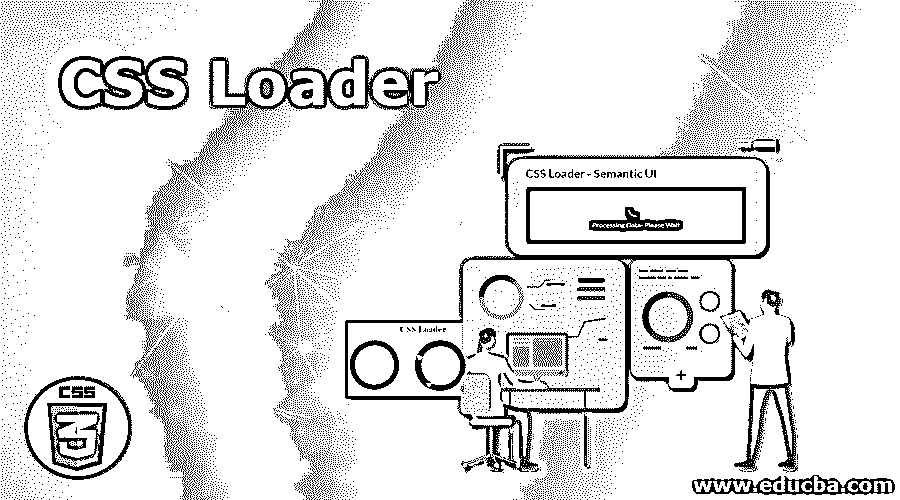
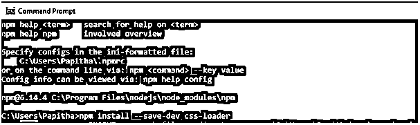
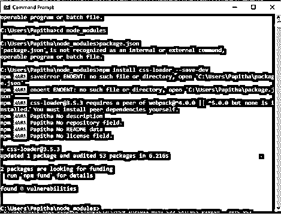
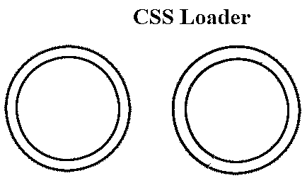
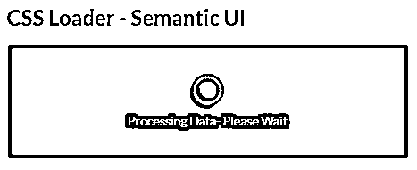

# CSS 加载程序

> 原文：<https://www.educba.com/css-loader/>




## CSS 加载器简介

CSS Loader 作为前端组件被定义为一个 npm 模块，它收集工作应用程序中引用的所有 CSS 文件，以帮助 webpack 并合并为一个字符串。这将特定资源的应用程序编译为 JavaScript 模块(CSS 到 JS 文件)。简单来说，它被认为是一个动画，触发网站说页面正在加载，并暂停一秒钟，负责从各自的 CSS 文件中获取样式。如果浏览器中没有添加 CSS 加载器，就可以认为相应的页面没有响应。Loader 有助于将我们需要的样式加载到应用程序的不同部分，并具有模块化和易于使用的额外优势。

**语法**

<small>网页开发、编程语言、软件测试&其他</small>

```
npm install –save-dev CSS-loader
```

其中 npm 是管理器包节点，我们可以在这里加载 CSS。它们只是一个模块创建器，可以用一行注释安装。Loader 是一个 Web Pack 特性，嵌入了@import 和 URL()，其中所有外部文件都是使用“require”组件加载的。

### CSS 加载器的工作

我们可以用一个 div 来制作它，它用一个白色的动画页面加载器来制作整个屏幕，并且没有设置任何显示属性。

在本文中，我已经安装了 node.js 来安装 npm。

为了构建一个 CSS 模块，所有的样式表都使用 React 组件。为此，我们需要将加载器加载到 Web 包中。使用 CSS 模块，很容易命名没有全局问题的类。要将这个 CSS 加载到本地组件中，需要导入。要使用 js 模块，请执行以下步骤

**1。入门**

它开始安装 css-loader。语法路径来了

```
npm install –save-dev css-loader
```

以下代码片段显示了文件的安装




下面的截图展示了从加载器中提取 CSS 的过程。

```
C:\Users\node_modules>npm install css-loader –save-dev
```




测试包(CSS)

```
C:\Users\Papitha\node_modules>npx webpack –mode=development
```

为了生产

```
C:\Users\Papitha\node_modules>npx webpack –mode=production
```

**2。定义一个 CSS 文件**

```
.dd
{ color :violet;
}
```

**3。web pack config-Plugin–解释所有 CSS 文件**

```
Import css from 'demo.css'
```

**4。javascript webpack**

```
module.exports = {
module: {
rules: [
{
test: /\.css$/i,
use: ['style-loader', 'css-loader'],
},
],
},
};
```

**5。字符串**

```
module.exports = {
module: {
rules: [
{
test: /\.css$/i,
loader: 'css-loader',
options: {
modules: 'global', // delaration of global variables
},
},
],
},
};
```

### CSS 加载程序的示例

下面举几个例子

#### 示例#1

html 文件显示了 CSS 文件如何通过调用相应的类来加载动画进程，从而启用一个样式。

**load.html**T2【代号:

```
<!DOCTYPE html>
<html>
<head>
<title>Demo on CSS Loader Process</title>
<style>
h1{
color:green;
}
div{
display: block;
position: absolute;
width: 12px;
height: 12px;
right: calc(60% - 1em);
border-radius: 1.1em;
transform-origin: 1em 1em;
animation: rotate;
animation-iteration-count:infinite;
animation-duration: 2s;
}
@keyframes rotate {
0% { transform: rotate(0deg); }
100% { transform: rotate(180deg); }
}
.aa {
animation-delay: 0.2s;
background-color: yellow;
}
.bb {
animation-delay: 0.3s;
background-color: pink;
}
.cc {
animation-delay: 0.4s;
background-color: red;
}
.dd {
animation-delay: 0.5s;
background-color: blue;
}
.ee {
animation-delay: 0.6s;
background-color: brown;
}
</style>
</head>
<body>
<center>
<h1>Demo on CSS Loader Process</h1>
<div class='aa'></div>
<div class='bb'></div>
<div class='cc'></div>
<div class='dd'></div>
<div class='ee'></div>
</center>
</body>
</html>
```

**输出:**

我们已经看到了一个简单的使用 CSS loader 的预加载序列动画，这使得一个简单的过渡。


#### 实施例 2

同样的例子–CSS 是用 spinning 加载的。甚至 CSS Spinner 也可以用在这个类中，只需简单的

就可以让一个简单的圆旋转起来。

**代码:**

```
<!DOCTYPE html>
<html>
<head>
<style>
h1{
text-align:center;
}
.load1 {
border: 19px solid #008080;
position:absolute;
border-radius: 49%;
border-top: 21px solid rose;
border-bottom: 21px solid rose;
width: 140px;
height: 140px;
animation: spin 3s linear infinite;
}
.load2 {
border: 20px solid #008080;
position:absolute;
left:45%;
border-radius: 49%;
border-top: 22px solid rose;
border-bottom: 22px solid green;
border-right: 22px solid red;
width: 140px;
height: 140px;
animation: spin 3s linear infinite;
}
.load3 {
border: 20px solid #FF6347;
position:absolute;
left:75%;
border-radius: 49%;
border-top: 21px solid rose;
border-bottom: 21px solid green;
border-right: 21px solid red;
border-left:21px solid blue;
width: 150px;
height: 150px;
animation: spin 3s linear infinite;
}
@keyframes spin {
0% { transform: rotate(0deg); }
100% { transform: rotate(360deg); }
}
</style>
</head>
<body>
<h1>CSS Loader</h1>
<div class="load"></div>
<div class="load1"></div>
<div class="load2"></div>
</body>
</html>
```

我们在这里所做的是，我们已经创建了一个简单的位置类型。而圆的圆是通过指定宽度和高度，几乎加上半径值给出的。接下来为边框分配不同的颜色。现在，我们实现动画关键帧来进行旋转。

**输出:**




#### 实施例 3

**代码:**

```
<!DOCTYPE html>
<html>
<head>
<title>CSS Loader - Semantic UI</title>
<link href=
"https://cdnjs.cloudflare.com/ajax/libs/semantic-ui/2.4.1/semantic.min.css"
rel="stylesheet" />
</head>
<body>
<div class="ui container">
<h2>CSS Loader - Semantic UI</h2>
<div style="height: 130px; width: 450px;"
class="ui segment">
<div class="ui active dimmer">
<div class="ui indeterminate text loader">
Processing Data- Please Wait</div>
</div>
<p></p>
</div>
</div>
<script src=
"https://cdnjs.cloudflare.com/ajax/libs/semantic-ui/2.4.1/semantic.min.js">
</script>
</body>
</html>
```

**输出:**

**

** 

#### 实施例 4

四种不同的颜色用于装载

**代码:**

```
<!DOCTYPE html>
<html>
<head>
<title>example on loader</title>
<style>
h1{
color:purple;
}
.loadd {
display: block;
position: absolute;
width: 95px;
height: 15px;
right: calc(55% - 2em);
transform-origin: 3px 13px;
animation: rotate;
animation-iteration-count: infinite;
animation-duration: 3.1s;
}
@keyframes rotate {
from {
transform: rotateY(45deg);
}
to {
transform: rotateY(360deg);
}
}
.a1 {
animation-delay: 0.2s;
background-color: #C71585;
}
.a2 {
animation-delay: 0.3s;
background-color: #20B2AA;
}
.a3 {
animation-delay: 0.4s;
background-color: #DC143;
}
.a4 {
animation-delay: 0.4s;
background-color: #0000FF ;
}
.a5 {
animation-delay: 0.5s;
background-color: #808000;
}
</style>
</head>
<body>
<center>
<h2>EDUCBA</h2>
<h4>CSS Loader vertical</h4>
<div class='loader'>
<div class='loadd a1'></div>
<div class='loadd a2'></div>
<div class='loadd a3'></div>
<div class='loadd a4'></div>
<div class='loadd a5'></div>
</div>
</center>
</body>
</html>
```

**输出:**


### 结论

正如我们所知，CSS 有助于设计风格，我们可以在特定的网页上添加动画或任何其他电影。因此，在 web 页面上强调 Loader 可以让用户等待几秒钟，直到加载完整个页面。这个加载器在页面加载时通过这个简单的动画增强了更好的用户体验，并为相应的项目提供了所需的结构。

### 推荐文章

这是一个 CSS 加载器的指南。在这里，我们讨论 CSS Loader 与安装 node.js 的工作方式，以安装 npm，并提供示例以及代码和输出。您也可以阅读以下文章，了解更多信息——

1.  [CSS 计数器](https://www.educba.com/css-counter/)
2.  [CSS 溢出](https://www.educba.com/css-overflow/)
3.  [CSS 中的可见性](https://www.educba.com/visibility-in-css/)
4.  [文本装饰 CSS](https://www.educba.com/text-decoration-css/)


