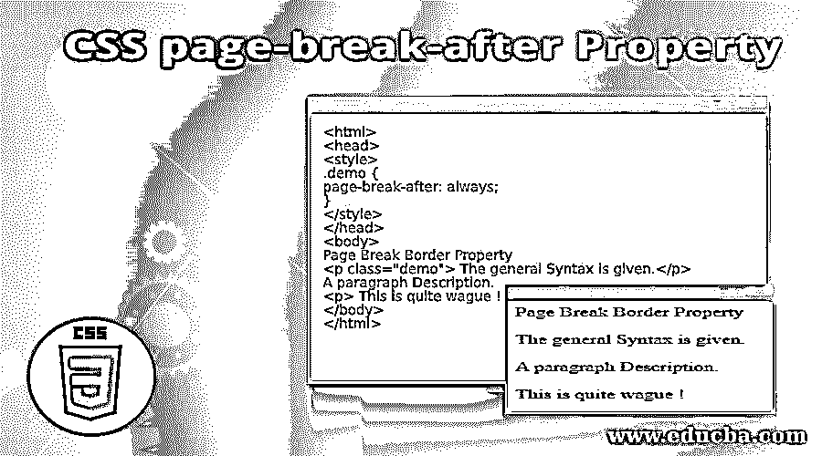
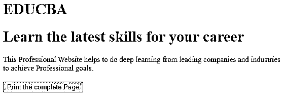
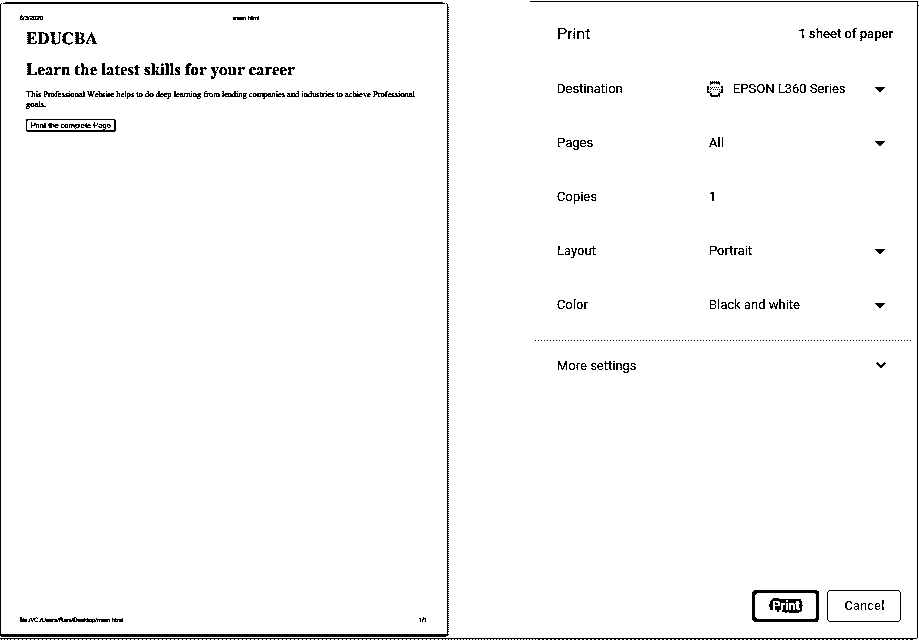
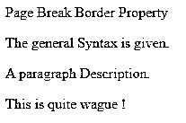
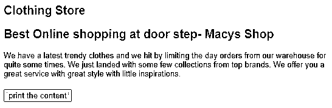
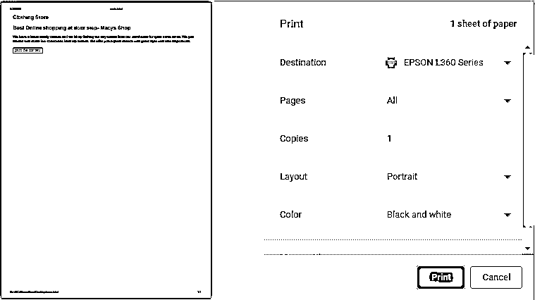
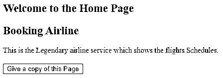
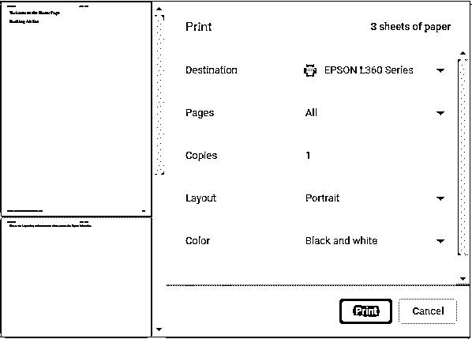
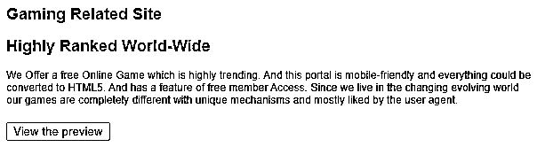
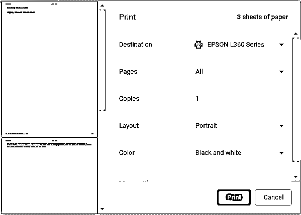

# CSS 分页后属性

> 原文：<https://www.educba.com/css-page-break-after-property/>




## CSS 分页后属性的定义

CSS 分页符定义为 CSS 属性，帮助在元素框后添加分页符，并且仅在打印时可见。该属性决定了相应的内容应该停留在哪个页面，同时确保某些内容恰好是打印预览中显示的最后一个块。并且该属性不能应用于 position (absolute)、empty

或

元素。如果使用了样式表，则有必要通过添加@media print { }来换行。

**语法:**

<small>网页开发、编程语言、软件测试&其他</small>

一般语法如下所示:

```
<style>
page-break-after: auto|always|avoid|left|right|initial|inherit;
</style>
```

这种样式给出了一个提示，即段落一结束，就应该从下一页开始打印。我们将在页面上应用上述规则，断行可能应用在某些元素之后，而不是每个段落之后。

### CSS 中分页后属性是如何工作的？

它们的可能值如下所示:

*   **自动:**默认为初始值，自动执行。该值既不强制也不禁止在必要时在元素后中断。
*   **always** :该值总是强制在指定元素后插入分页符。
*   **避免:**顾名思义这个值避免了元素后的 broken 属性。
*   **right:** 这个强制给出一个分页符，因为下一页被指定从右边的页面开始。
*   **left:** 这个强制给出一个分页符，因为下一页被指定从左边的页面开始。如果指定的页面是左边的，我们希望内容显示在左边的页面，那么有必要打破现有的页面。
*   **initial:** 它将属性设置为默认值。
*   **inherit:** 从父元素继承属性。

### CSS 分页符示例

现在，我们将通过研究 CSS 中的例子来讨论分页后属性。下面是带有值的分页符属性的示例。

#### 示例# 1–执行默认值自动

**代码:**

```
<html>
<head>
<style type = "text/css">
div{
font-size: 15px;
page-break-after: auto;
}
</style>
</head>
<body>
<div>
<h1>EDUCBA</h1>
<h1>Learn the latest skills for your career</h1>
</div>
<div>
This Professional Website helps to do deep learning from leading companies and industries to achieve Professional goals.
</div>
<br>
<button onclick = "select()">Print the complete Page</button>
<script>
function select() {
window.print();
}
</script>
</body>
</html>
```

所以，上面的代码执行起来就像当你按下按钮时，它指向打印页面。属性值为“auto ”,它强制元素按钮执行操作。

尝试将该值更改为“always ”,您可以在输出中看到差异，就像

元素在打印预览中不起作用一样。

**输出:**







#### 实施例 2

值“始终”的 HTML 代码。在这种情况下，CSS 属性设置为“always”。

下面的标签放在 HTML 页面中，并使用浏览器打印出来，我们可以看到三页。

**代码:**

```
<html>
<head>
<style>
.demo {
page-break-after: always;
}
</style>
</head>
<body>
Page Break Border Property
<p class="demo"> The general Syntax is given.</p>
A paragraph Description.
<p> This is quite wague ! </p>
</body>
</html>
```

**输出:**




#### 实施例 3

使用避免分页符。在需要的时候避免分页。

**代码:**

```
<html>
<head>
<style type = "text/css">
h2{ color:magenta}
div{
font-size: 13px;
font-family: Helvetica;
page-break-after: avoid;
}
</style>
</head>
<body>
<div>
<h2>Clothing Store</h2>
<h2>Best Online shopping at door step- Macys Shop</h2>
</div>
<div>
We have a latest trendy clothes and we hit by limiting the day orders from our warehouse for quite some times. We just landed with some few collections from top brands. We offer you a great service with great style with little inspirations.
</div>
<br>
<button onclick = "shop()">print the content</button>
<script>
function shop() {
window.print();
}
</script>
</body>
</html>
```

**输出:**




下一个代码片段显示，在当前页面中没有分页符，页面结束。




#### 示例# 4–使用继承属性

**代码:**

```
<!DOCTYPE html>
<html>
<head>
<title>Page Break after- Inherit</title>
<style>
p {
page-break-after:always;
}
div{
page-break-after:default;
}
#ctt{
page-break-after:left;
}
#fil{
page-break-after:inherit;
}
</style>
</head>
<body>
<h1> Article On Sweden</h1>
<p>
Sweden is a multicultural country, means most of the people are from another country. Stockholm is the capital of Sweden and Swedish is their official language while some speak English. Coming to the national Government it's a parliamentary democracy which are sectored into two groups: Left and green party
</p>
<div>
<p id="fil">
Coming to the national Government it’s a parliamentary democracy which are sectored into two groups: Left and green party. It is considered to be an innovative nations and so called digitally connected economy
</div>
<p id="ctt">
They live a relaxed luxurious Life. They follow the equality and fairness of words. In point of environment, they have high esteem nature with high fi technology involved in wind power, biofuels and solar power.
</p>
</body>
</html>
```

**输出:**


#### 示例 5–使用左边的值

此处指定的分页符显示内容并从左页开始。浏览器会分成两页来显示更改。

**代码:**

```
<html>
<head>
<style type = "text/css">
div{
font-size: 15px;
page-break-after: left;
}
</style>
</head>
<body>
<div>
<h2>Welcome to the Home Page</h2>
<h2>Booking Airline </h2>
</div>
<div>
This is the Legendary airline service which shows the flights Schedules.
</div>
<br>
<button onclick = "aab()">Give a copy of this Page</button>
<script>
function aab() {
window.print();
}
</script>
</body>
</html>
```

**输出:**







#### 示例 6–使用正确的值

**代码:**

```
<html>
<head>
<style type = "text/css">
h2{ color:purple}
div{
font-size: 12px;
font-family: Arial;
page-break-after: right;
}
</style>
</head>
<body>
<div>
<h2>Gaming Related Site</h2>
<h2>Highly Ranked World-Wide</h2>
</div>
<div>
We Offer a free Online Game which is highly trending. And this portal is mobile-friendly and everything could be converted to HTML5\. And has a feature of free member Access. Since we live in the changing evolving world our games are completely different with unique mechanisms and mostly liked by the user agent.
</div>
<br>
<button onclick = "game()">View the preview</button>
<script>
function game() {
window.print();
}
</script>
</body>
</html>
```

**输出:**




当您按下预览按钮时，下一页显示如下，当您滚动滚动条时，我们可以在下一页看到分页符后的内容。




### 推荐文章

这是一个 CSS 分页指南。在这里，我们还将讨论 css 中分页后属性的定义和工作原理。以及不同的示例及其代码实现。您也可以看看以下文章，了解更多信息–

1.  [CSS 根](https://www.educba.com/css-root/)
2.  [媒体查询 CSS](https://www.educba.com/media-query-css/)
3.  [CSS 文本笔划](https://www.educba.com/css-text-stroke/)
4.  [CSS 字母间距](https://www.educba.com/css-letter-spacing/)


