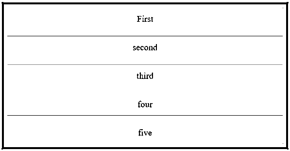
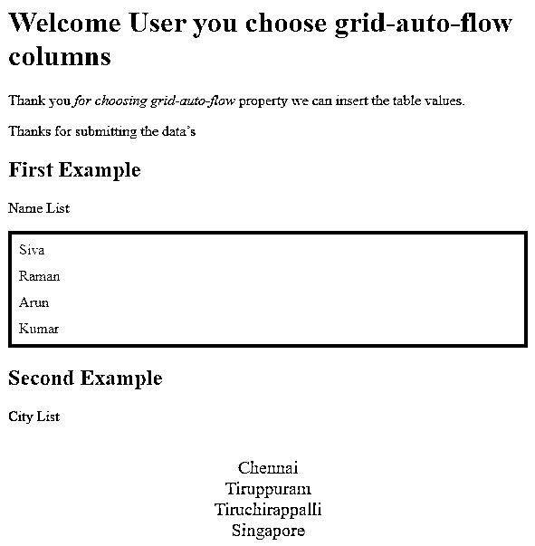
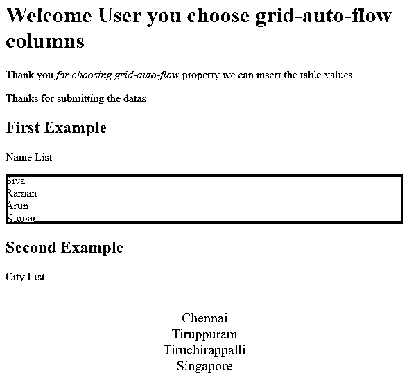

# CSS 行

> 原文：<https://www.educba.com/css-row/>


## CSS 行介绍

在 CSS 中 row 是属性之一，也称为速记属性。它用于具有网格指定行的网页从开始到结束位置，用于指定网格数据项的大小和位置。它可以在网格行内通过额外贡献来声明，表格中的行称为网格行行。它可能与 html span 类协调，即使它支持自动放置网格，因此指定行内行是网页的开始和结束。

### 语法和参数

我们知道 CSS 代码是与 HTML 页面结合在一起编写的，或者我们必须用. cssextension 将它保存为一个单独的文件。如果我们在 HTML 网页中使用 CSS 代码，它有一个单独的标记，称为

<small>网页开发、编程语言、软件测试&其他</small>

**语法:**

```
<html>
<head>
<style>
#grid{
display:grid;
grid-row:auto //we can declare any type of values in the grid-row property
---some css scripts based on the user requirements—
}
</style>
</head>
<body>
</body>
</html>
```

上面的代码是一个 CSS 模板，为 row 属性使用了网格功能。我们可以在 CSS 中启用这些属性，以使网格布局中的行和列在生产环境中更加安全。

### CSS 中的 Row 是如何工作的？

在 CSS 中，我们使用了行属性，在网页中启用行属性来创建表格行，借助行属性，它指定表格单元格的高度，并为其属性分配相同的宽度。出于数据安全的目的，我们通常使用网格布局来创建网页中的表格。如果网格项目位于指定的行中，则可以通过使用这些网格模板行以及所使用的隐式网格技术来显式调整大小。创建跟踪并保持它。这可以通过显式定位位于范围之外的行来实现，以便使用自动放置算法将数据插入到表格单元格中。假设 css 文件中已经启用了 grid-auto-rows 属性。

CSS 文件有许多默认属性，可用于表示层位置的自定义网页。其中，每个 CSS 属性都有自己的语法和属性，用于启用和禁用 CSS 页面的位置。因此，我们可以设置属性值，如“自动，一些数字作为值与一些扩展，如像素等。”.如果 CSS 文件中启用了网格行，则属性是跟踪每个表格单元格行和轨迹模式。网格项被放置在表格单元格中未显式调用或使用的行中，因为当文件中启用了属性 grid-auto-rows: auto 时，它遵循自动放置算法。如果我们使用其他类型的值，如 length、percentage、flex、max-content、min-content、minimax(min，max)和 auto，这些值将在 grid-auto-rows 属性中以不同的顺序使用。对于每种类型的值，它都有自己的属性。例如 we <length>value，它只返回非负的长度值，同样百分比也是非负值，但是它与网格容器周围的块大小有关。如果网格容器的表块大小是不定值，那么网格自动行的百分比值是自动。当伸缩值假定为非负维值时，用单位为指定了跟踪伸缩因子值，因此 grid-auto-rows 属性的每个伸缩值都是伸缩因子大小。然后我们计算了 CSS 属性的最小值和最大值。</length>

### 实现 CSS 行的示例

以下是 CSS 行的示例:

#### 示例#1

**代码:**

```
<!DOCTYPE html>
<html>
<head>
<title>
Welcome To My Domain
</title>
<style>
.first {
display: grid;
grid-template-areas: "siva";
grid-gap: 13px;
padding: 12px;
background-color: red;
grid-auto-rows: auto;
}
.second {
text-align: center;
font-size: 20px;
background-color: green;
padding: 14px 0;
}
</style>
</head>
<body>
<div class = "first">
<div class = "second">First</div>
<div class = "second">second</div>
<div class = "second">third</div>
<div class = "second">four</div>
<div class = "second">five</div>
</div>
</body>
</html>
```

**输出:**




#### 实施例 2

**代码:**

```
<!DOCTYPE html>
<html>
<head>
<style>
.first {
display: grid;
grid-template-rows: auto auto;
grid-gap: 11px;
background-color: green;
padding: 12px;
}
.second {
background-color: rgba(254, 253, 252, 0.7);
text-align: center;
padding:20px 0;
font-size: 20px;
}
</style>
</head>
<body>
<h1>Welcome User you choose grid-auto-flow columns</h1>
<p>Thank you <em>for choosing grid-auto-flow</em> property we can insert the table values.</p>
<p>Thanks for submitting the data’s</p>
<h2>First Example</h2>
<p>Name List</p>
<div class="first" style="grid-auto-flow: row;">
<div class="siva">Siva</div>
<div class="raman">Raman</div>
<div class="arun">Arun</div>
<div class="kumar">Kumar</div>
</div>
<h2>Second Example</h2>
<p>City List</p>
<div class="second" style="grid-auto-flow: row;">
<div class="chennai">Chennai</div>
<div class=" tiruppuram ">Tiruppuram</div>
<div class=" tiruchirappalli "> Tiruchirappalli </div>
<div class="singapore">Singapore</div>
</div>
</body>
</html>
```

**输出:**




#### 实施例 3

**代码:**

```
<!DOCTYPE html>
<html>
<head>
<style>
.first {
display: grid;
grid-auto-rows: 10px;
grid-auto-rows: 2cm;
grid-auto-rows: 5vmax;
background-color: green;
grid-auto-rows: inherit;
grid-auto-rows: initial;
grid-auto-rows: unset;
}
.second {
grid-auto-rows: 10px;
grid-auto-rows: 2cm;
grid-auto-rows: 5vmax;
grid-auto-rows: min-content max-content auto;
grid-auto-rows: 10px 15px 39px;
grid-auto-rows: 11% 33.2%;
grid-auto-rows: 0.3fr 4fr 2fr;
grid-auto-rows: minmax(10px, auto) minmax(max-content, 3fr) minmax(23%, 8vmax);
grid-auto-rows: 10px minmax(10px, auto) 11% 0.3fr fit-content(40px);
text-align: center;
padding:23px 0;
font-size: 20px;
}
</style>
</head>
<body>
<h1>Welcome User you choose grid-auto-flow columns</h1>
<p>Thank you <em>for choosing grid-auto-flow</em> property we can insert the table values.</p>
<p>Thanks for submitting the datas</p>
<h2>First Example</h2>
<p>Name List</p>
<div class="first" style="grid-auto-flow: row;">
<div class="siva">Siva</div>
<div class="raman">Raman</div>
<div class="arun">Arun</div>
<div class="kumar">Kumar</div>
</div>
<h2>Second Example</h2>
<p>City List</p>
<div class="second" style="grid-auto-flow: row;">
<div class="chennai">Chennai</div>
<div class=" tiruppuram ">Tiruppuram</div>
<div class=" tiruchirappalli "> Tiruchirappalli </div>
<div class="singapore">Singapore</div>
</div>
</body>
</html>
```

**输出:**




### 结论

CSS 有许多默认属性，可以启用这些属性，并根据用户需求为各种目的分配值，我们已经为这些属性设置了值。在 web 应用程序中，表格单元格有一组行和列，每个都有一些默认值，如自动使用 CSS 文件中的其他格式值。

### 推荐文章

这是一个 CSS 行的指南。在这里，我们讨论一个 CSS 行及其不同的例子，以及它的代码实现的简要概述。您也可以浏览我们推荐的其他文章，了解更多信息——

1.  [CSS 在技术中的应用](https://www.educba.com/what-is-css/)
2.  [使用 CSS 命令的技巧和诀窍](https://www.educba.com/css-commands/)
3.  [CSS 的六大优势介绍](https://www.educba.com/advantages-of-css/)
4.  [CSS 页眉设计(示例)](https://www.educba.com/css-header-design/)


