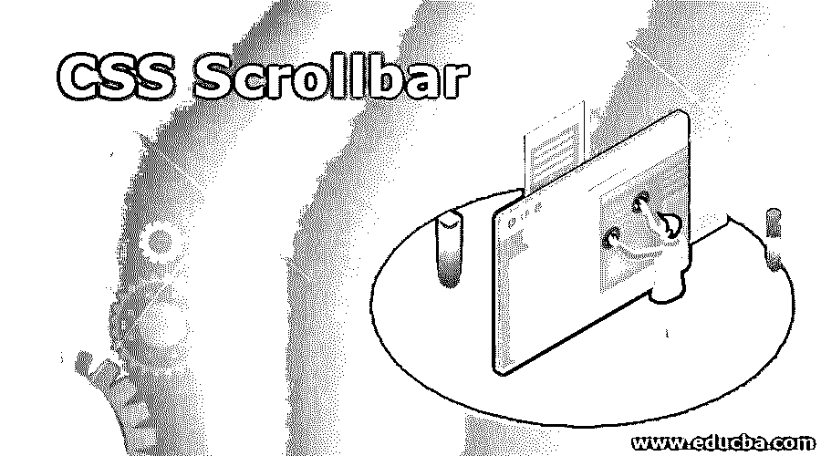
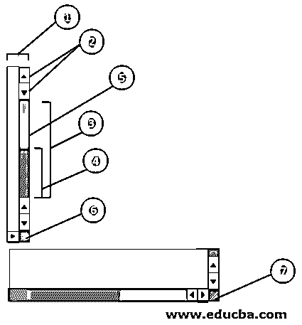
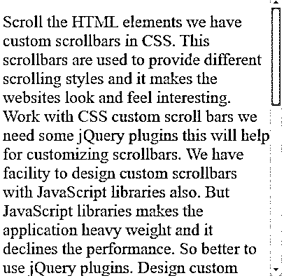
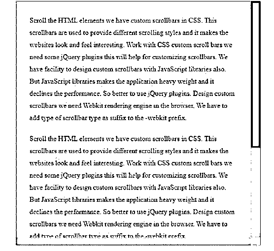

# CSS Scrollbar

> 原文：<https://www.educba.com/css-scrollbar/>




## CSS 滚动条介绍

滚动 HTML 元素，我们在 CSS 中有自定义滚动条。这些滚动条是用来提供不同的滚动风格，它使网站看起来和感觉有趣。使用 CSS 自定义滚动条我们需要一些 jQuery 插件，这将有助于自定义滚动条。我们也可以用 JavaScript 库设计自定义滚动条。但是 JavaScript 库使应用程序变得很重，降低了性能。所以最好使用 jQuery 插件。设计自定义滚动条，我们需要在浏览器中的 Webkit 渲染引擎。我们必须添加滚动条类型作为-webkit 前缀的后缀。

**Note:** Custom jQuery plugins are automatically given by browsers like Internet Explorer, Firefox, Chrome, etc.

CSS 中的滚动条与-webkit 前缀一起使用。将所需的滚动条样式作为后缀添加到-webkit 选择器中。

<small>网页开发、编程语言、软件测试&其他</small>

### CSS 滚动条的类型

下面是如下类型:

1.  滚动条
2.  滚动条按钮
3.  滚动条轨道
4.  滚动条轨道块
5.  滚动条-缩略图
6.  滚动条-角
7.  scrollbar-resizer

#### 1) ::-webkit-scrollbar

它给出正常的滚动条。

**语法:**

```
::-webkit-scrollbar
{
/* 1\. CSS Styles*/
}
```

#### 2)::-WebKit-滚动条-按钮

它给出了滚动条上的按钮，如向上箭头和向下箭头按钮。

**语法:**

```
::-webkit-scrollbar-button    </strong
{
/* 2\. CSS Styles*/
}
```

#### 3)::-网络工具包-滚动条-跟踪

它给出了类似进度条的滚动条。

**语法:**

```
::-webkit-scrollbar-track
{
/* 3\. CSS Styles*/
}
```

#### 4)::-WebKit-滚动条-跟踪件

它给出了滚动条一样的进度条，但它没有被处理覆盖。

**语法:**

```
::-webkit-scrollbar-track-piece
{
/* 4\. CSS Styles*/
}
```

#### 5)::-WebKit-滚动条-缩略图

它给出了可拖动的滚动条句柄。

**语法:**

```
::-webkit-scrollbar-thumb
{
/* 5\. CSS Styles*/
}
```

#### 6)::-网络工具包-滚动条-角落

它在水平滚动条和垂直滚动条相遇的可滚动元素的底部给出效果。

**语法:**

```
::-webkit-scrollbar-corner
{
/* 6\. CSS Styles*/
}
```

#### 7) ::-webkit-resizer

它对出现在某些元素底部滚动条角上方的可拖动大小调整产生影响。

**语法:**

```
::-webkit-resizer
{
/* 7\. CSS Styles */
}
```

**图像中的所有滚动条:**




### 实现 CSS 滚动条的例子

下面是一些例子:

#### 示例#1

具有 scroll 属性的滚动条。

**代码:**

```
<!DOCTYPE html>
<html>
<head>
<meta name="viewport" content="width=device-width, initial-scale=1">
<style>
.scroller {
width: 400px;
height: 400px;
overflow-y: scroll; /*when overflows scroll bar adds in vertical direction*/
}
p
{
color: brown;
font-size: 24px;
}
</style>
</head>
<body>
<div class="scroller">
<p>Scroll the HTML elements we have custom scrollbars in CSS. This scrollbars are used to provide different scrolling styles and it makes the websites look and feel interesting. Work with CSS custom scroll bars we need some jQuery plugins this will help for customizing scrollbars. We have facility to design custom scrollbars with JavaScript libraries also. But JavaScript libraries makes the application heavy weight and it declines the performance. So better to use jQuery plugins. Design custom scrollbars we need Webkit rendering engine in the browser. We have to add type of scrollbar type as suffix to the -webkit prefix.</p>
<p>Scroll the HTML elements we have custom scrollbars in CSS. This scrollbars are used to provide different scrolling styles and it makes the websites look and feel interesting. Work with CSS custom scroll bars we need some jQuery plugins this will help for customizing scrollbars. We have facility to design custom scrollbars with JavaScript libraries also. But JavaScript libraries makes the application heavy weight and it declines the performance. So better to use jQuery plugins. Design custom scrollbars we need Webkit rendering engine in the browser. We have to add type of scrollbar type as suffix to the -webkit prefix.</p>
</div>
</body>
</html>
```

**输出:**




#### 实施例 2

带有 scrollbar、scrollbar-track 和 scrollbar-thumb 的 Webkit 前缀示例:

**代码:**

```
<!DOCTYPE html>
<html>
<head>
<meta name="viewport" content="width=device-width, initial-scale=1">
<style>
html {
background: lightgreen;
height: 100%;
overflow: hidden;
}
body {
height: 100%;
background: lightblue;
max-width: 500px;
max-height: 500px;
overflow: scroll;
width: 80%;
margin: 0 auto;
padding: 30px;
font: 100%/1.8 serif;
border: 1px solid rgba(0,0,0,0.4);
}
p {
margin: 0 0 20px;
}
body::-webkit-scrollbar {
width: 22px;/*Gives you width to the scrollbar*/
}
body::-webkit-scrollbar-track {
-webkit-box-shadow: inset 0 0 6px rgba(0,0,0,0.4);/*Gives styles to the scrollbar*/
}
body::-webkit-scrollbar-thumb {
background-color: red;/*Gives background color to the scrollbar*/
outline: 1px solid blue;
}
</style>
</head>
<body>
<div class="scroller">
<p>Scroll the HTML elements we have custom scrollbars in CSS. This scrollbars are used to provide different scrolling styles and it makes the websites look and feel interesting. Work with CSS custom scroll bars we need some jQuery plugins this will help for customizing scrollbars. We have facility to design custom scrollbars with JavaScript libraries also. But JavaScript libraries makes the application heavy weight and it declines the performance. So better to use jQuery plugins. Design custom scrollbars we need Webkit rendering engine in the browser. We have to add type of scrollbar type as suffix to the -webkit prefix.</p>
<p>Scroll the HTML elements we have custom scrollbars in CSS. This scrollbars are used to provide different scrolling styles and it makes the websites look and feel interesting. Work with CSS custom scroll bars we need some jQuery plugins this will help for customizing scrollbars. We have facility to design custom scrollbars with JavaScript libraries also. But JavaScript libraries makes the application heavy weight and it declines the performance. So better to use jQuery plugins. Design custom scrollbars we need Webkit rendering engine in the browser. We have to add type of scrollbar type as suffix to the -webkit prefix.</p>
<p>Scroll the HTML elements we have custom scrollbars in CSS. This scrollbars are used to provide different scrolling styles and it makes the websites look and feel interesting. Work with CSS custom scroll bars we need some jQuery plugins this will help for customizing scrollbars. We have facility to design custom scrollbars with JavaScript libraries also. But JavaScript libraries makes the application heavy weight and it declines the performance. So better to use jQuery plugins. Design custom scrollbars we need Webkit rendering engine in the browser. We have to add type of scrollbar type as suffix to the -webkit prefix.</p>
</div>
</body>
</html>
```

**输出:**




#### 实施例 3

不同的滚动条。

**代码:**

```
<!DOCTYPE html>
<html>
<head>
<meta name="viewport" content="width=device-width, initial-scale=1">
<style>
.scrollbar
{
margin-left: 30px;
float: left;
margin-bottom: 25px;
height: 350px;
background: #F5F5F5;
overflow-y: scroll;
width: 60px;
}
.addScrollStyle
{
min-height: 450px;
}
#wrapper
{
text-align: center;
width: 500px;
margin: auto;
}
/*scroll bar style 1*/
#scrollbar-1::-webkit-scrollbar-track
{
border-radius: 12px;
background-color: lightgray;
-webkit-box-shadow: inset 0 0 6px rgba(0,0,0,0.3);
}
#scrollbar-1::-webkit-scrollbar
{
width: 12px;
background-color: #F5F5F5;
}
#scrollbar-1::-webkit-scrollbar-thumb
{
border-radius: 12px;
background-color: red;
-webkit-box-shadow: inset 0 0 6px rgba(0,0,0,.3);
}
/*scroll bar style 2*/
#scrollbar-2::-webkit-scrollbar-track
{
-webkit-box-shadow: inset 0 0 6px rgba(0,0,0,0.3);
border-radius: 12px;
background-color: lightgray;
}
#scrollbar-2::-webkit-scrollbar
{
width: 12px;
background-color: #F5F5F5;
}
#scrollbar-2::-webkit-scrollbar-thumb
{
border-radius: 12px;
background-color: blue;
-webkit-box-shadow: inset 0 0 6px rgba(0,0,0,.3);
}
/*scroll bar style 3*/
#scrollbar-3::-webkit-scrollbar-track
{
-webkit-box-shadow: inset 0 0 6px rgba(0,0,0,0.3);
background-color: lightgray;
}
#scrollbar-3::-webkit-scrollbar
{
width: 6px;
background-color: #F5F5F5;
}</strong
#scrollbar-3::-webkit-scrollbar-thumb
{
background-color: purple;
}
/*scroll bar style 4*/
#scrollbar-4::-webkit-scrollbar-track
{
-webkit-box-shadow: inset 0 0 6px rgba(0,0,0,0.3);
background-color: lightgray;
}
#scrollbar-4::-webkit-scrollbar
{
width: 10px;
background-color: #F5F5F5;
}
#scrollbar-4::-webkit-scrollbar-thumb
{
background-color: green;
border: 2px solid pink;
}
/*scroll bar style 5*/
#scrollbar-5::-webkit-scrollbar-track
{
-webkit-box-shadow: inset 0 0 6px rgba(0,0,0,0.3);
background-color: lightgray;
}
#scrollbar-5::-webkit-scrollbar
{
width: 10px;
background-color: #F5F5F5;
}
#scrollbar-5::-webkit-scrollbar-thumb
{
background-color: #0ae;
background-image: -webkit-gradient(linear, 0 0, 0 100%,
color-stop(.5, rgba(255, 255, 255, .2)),
color-stop(.5, transparent), to(transparent));
}
/*scroll bar style 6*/
#scrollbar-6::-webkit-scrollbar-track
{
-webkit-box-shadow: inset 0 0 6px rgba(0,0,0,0.3);
background-color: lightgray;
}
#scrollbar-6::-webkit-scrollbar
{
width: 10px;
background-color: #F5F5F5;
}
#scrollbar-6::-webkit-scrollbar-thumb
{
background-color: fuchsia;
background-image: -webkit-linear-gradient(45deg,
rgba(255, 255, 255, .2) 25%,
transparent 25%,
transparent 50%,
rgba(255, 255, 255, .2) 50%,
rgba(255, 255, 255, .2) 75%,
transparent 75%,
transparent)
}
/*scroll bar style 7*/
#scrollbar-7::-webkit-scrollbar-track
{
-webkit-box-shadow: inset 0 0 6px rgba(0,0,0,0.3);
background-color: lightgray;
border-radius: 12px;
}
#scrollbar-7::-webkit-scrollbar
{
width: 10px;
background-color: #F5F5F5;
}
#scrollbar-7::-webkit-scrollbar-thumb
{
border-radius: 10px;
background-image: -webkit-gradient(linear,
left bottom,
left top,
color-stop(0.44, rgb(122,153,217)),
color-stop(0.72, rgb(73,125,189)),
color-stop(0.86, rgb(28,58,148)));
}
/*scroll bar style 8*/
#scrollbar-8::-webkit-scrollbar-track
{
border: 1px solid blue;
background-color: lightgray;
}
#scrollbar-8::-webkit-scrollbar
{
width: 10px;
background-color: #F5F5F5;
}
#scrollbar-8::-webkit-scrollbar-thumb
{
background-color: purple;
}
/*scroll bar style 9*/
#scrollbar-9::-webkit-scrollbar-track
{
-webkit-box-shadow: inset 0 0 6px rgba(0,0,0,0.3);
background-color: lightgray;
}
#scrollbar-9::-webkit-scrollbar
{
width: 10px;
background-color: #F5F5F5;
}
#scrollbar-9::-webkit-scrollbar-thumb
{
background-color: maroon;
background-image: -webkit-linear-gradient(90deg,                                                         rgba(255, 255, 255, .2) 25%,
transparent 25%,
transparent 50%,
rgba(255, 255, 255, .2) 50%,
rgba(255, 255, 255, .2) 75%,
transparent 75%,
transparent)
}
</style>
</head>
<body>
<div id="wrapper">
<div class="scrollbar" id="scrollbar-1">
<div class="addScrollStyle"></div>
</div>
<div class="scrollbar" id="scrollbar-2">
<div class="addScrollStyle"></div>
</div>
<div class="scrollbar" id="scrollbar-3">
<div class="addScrollStyle"></div>
</div>
<div class="scrollbar" id="scrollbar-4">
<div class="addScrollStyle"></div>
</div>
<div class="scrollbar" id="scrollbar-5">
<div class="addScrollStyle"></div>
</div>
<div class="scrollbar" id="scrollbar-6">
<div class="addScrollStyle"></div>
</div>
<div class="scrollbar" id="scrollbar-7">
<div class="addScrollStyle"></div>
</div>
<div class="scrollbar" id="scrollbar-8">
<div class="addScrollStyle"></div>
</div>
<div class="scrollbar" id="scrollbar-9">
<div class="addScrollStyle"></div>
</div>
</div>
</body>
</html>
```

**输出:**

**T2】**


 **


### 结论

CSS 中的滚动条以 webkit 为前缀，以 scrollbar type 为后缀，会产生不同类型的滚动条。我们也可以通过使用带有 scroll value 的 overflow-y 和 overflow-x 分别在垂直和水平方向上取一个滚动条。

### 推荐文章

这是一个 CSS 滚动条的指南。在这里，我们讨论一个 CSS 滚动条的简要概述，它的不同的例子，以及它的代码实现。您也可以浏览我们推荐的其他文章，了解更多信息——

1.  [CSS 字母间距](https://www.educba.com/css-letter-spacing/)
2.  [CSS 招数](https://www.educba.com/css-tricks/)
3.  [CSS 线条高度](https://www.educba.com/css-line-height/)
4.  [CSS 变换](https://www.educba.com/css-transform/)


**